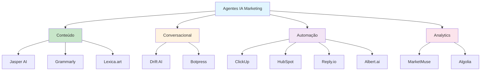

# [11 Melhores Agentes IA Marketing - ClickUp](/blog/11-melhores-agentes-ia-marketing---clickup)

> [!compass] **[MyMess](/blog/moc---projeto-mymess)** » [Estudos](/blog/dashboard---estudos-mymess) » Engenharia de Contexto

---

> [!info]+ Detalhes do Artigo
> **Ler:** [Os 11 melhores agentes de IA para marketing](https://clickup.com/pt-BR/blog/481028/agentes-de-ia-para-marketing)
> **Fonte:** [ClickUp](/blog/clickup) (Blog Oficial)
> **Autores:** Preethi Anchan (Senior Content Editor)
> **Publicado:** 27 de Junho de 2025

> [!abstract]+ Materiais Complementares
>
> **Ferramentas Mencionadas**
> - [ClickUp](https://clickup.com) - Plataforma de gerenciamento de projetos com IA integrada
> - [HubSpot AI](https://hubspot.com) - CRM com automação inteligente
> - [Jasper AI](https://jasper.ai) - Geração de conteúdo com IA
> - [Drift AI](https://drift.com) - Chatbots e marketing conversacional
> - [MarketMuse](https://marketmuse.com) - Estratégia e otimização de conteúdo SEO
> - [Grammarly](https://grammarly.com) - Redação e edição com IA
> - [Botpress](https://botpress.com) - Desenvolvimento de chatbots (código aberto)
> - [Reply.io](https://reply.io) - Automação de vendas e outreach
> - [Algolia](https://algolia.com) - Pesquisa e descoberta em sites
> - [Lexica.art](https://lexica.art) - Geração de imagens com IA
> - [Albert.ai](https://albert.ai) - Automação de campanhas publicitárias

> [!tip]- Léxico
>
> **Tecnologia e IA**
> - **Pontuação Preditiva de Leads**: Uso de IA para classificar leads por probabilidade de conversão
> - **Automação de Sequências**: Disparo automático de e-mails e ações baseado em comportamento do usuário
> - **Otimização Autônoma**: Capacidade da IA de ajustar campanhas sem intervenção manual
>
> **Ferramentas e Recursos**
> - **Agentes de IA para Marketing**: Sistemas autônomos que executam tarefas de marketing (análise, automação, personalização) com mínima intervenção humana
>
> **Técnicas e Estratégias**
> - **Marketing Conversacional**: Estratégia de engajamento em tempo real via chatbots e mensagens personalizadas
> [!question]- Pontos para Aprofundar (Sugestão da IA)
>
> - **Como integrar múltiplos agentes de IA em um fluxo de trabalho unificado?**
>     - Explorar plataformas como ClickUp que centralizam operações
> - **Qual o ROI real de cada ferramenta para diferentes tamanhos de empresa?**
>     - Comparar custos vs. benefícios para startups, PMEs e enterprises
> - **Como avaliar a qualidade do conteúdo gerado por IA vs. humano?**
>     - Desenvolver métricas de qualidade e engajamento
> - **Quais integrações são essenciais entre essas ferramentas?**
>     - Mapear conexões CRM + Conteúdo + Automação + Analytics

> [!robot]- Sugestões Complementares
>
> - **Leituras Recomendadas:**
>     - Documentação oficial de cada ferramenta listada
>     - Comparativos de preços atualizados no G2 e Capterra
> - **Ferramentas Úteis:**
>     - **Zapier/Make** - Para integrar as ferramentas entre si
>     - **Google Analytics 4** - Para medir impacto das automações
> - **Exercícios Práticos:**
>     - Testar versões gratuitas de 3 ferramentas da lista
>     - Criar um fluxo de trabalho piloto combinando 2 agentes

---

## Resumo

O artigo apresenta uma curadoria de **11 agentes de IA para marketing**, prometendo "melhorar resultados em 10x sem trabalhar 10x mais". A proposta central é que a combinação de automação, análise preditiva e personalização pode transformar operações de marketing.

**Categorias cobertas:**
- Gerenciamento de projetos (ClickUp)
- CRM e relacionamento (HubSpot)
- Geração de conteúdo (Jasper, Grammarly)
- Chatbots e conversacional (Drift, Botpress)
- SEO e estratégia (MarketMuse)
- Vendas e outreach (Reply.io)
- Busca e descoberta (Algolia)
- Visual e criativo (Lexica.art)
- Publicidade digital (Albert.ai)

---

## Principais Conceitos

### Os 11 Agentes de IA

A tabela abaixo resume as informações principais.

| # | Ferramenta | Foco Principal | Preço Base |
|:--|:-----------|:---------------|:-----------|
| 1 | **ClickUp** | Gerenciamento de projetos + IA | Gratuito |
| 2 | **HubSpot AI** | CRM + Automação | Gratuito / $20/mês |
| 3 | **Jasper AI** | Geração de conteúdo | $49/mês |
| 4 | **Drift AI** | Chatbots conversacionais | Personalizado |
| 5 | **MarketMuse** | SEO + Estratégia de conteúdo | Gratuito / $99/mês |
| 6 | **Grammarly** | Redação e edição | Gratuito / $30/mês |
| 7 | **Botpress** | Chatbots (código aberto) | Gratuito / $89/mês |
| 8 | **Reply.io** | Automação de vendas | $59/usuário/mês |
| 9 | **Algolia** | Busca em sites | Personalizado |
| 10 | **Lexica.art** | Geração de imagens | $10/mês |
| 11 | **Albert.ai** | Campanhas publicitárias | Personalizado |

---

## Detalhamento

### Destaques por Categoria

#### Gerenciamento e Produtividade
**ClickUp** se destaca como hub central com ClickUp Brain (IA conversacional), Agentes Autopilot e integrações nativas com HubSpot, Figma e Slack. Avaliação: G2 4,7/5.

#### Geração de Conteúdo
**Jasper AI** lidera em volume e velocidade de produção de conteúdo. **Grammarly** complementa com correção e ajuste de tom. Ambos têm avaliações acima de 4,7/5.

#### Marketing Conversacional
**Drift AI** oferece chatbots 24/7 com classificação de leads. **Botpress** é alternativa código aberto para quem quer personalização técnica.

#### SEO e Estratégia
**MarketMuse** oferece modelagem preditiva de desempenho e análise de lacunas de conteúdo - ideal para estratégia de longo prazo.

#### Publicidade Digital
**Albert.ai** gerencia autonomamente campanhas em Google, Facebook e YouTube com otimização em tempo real.

### Critérios de Avaliação Recomendados

1. **Recursos**: Análise, otimização, personalização dinâmica
2. **Escalabilidade**: Adaptação ao crescimento
3. **Integrações**: CRM, redes sociais, e-mail
4. **Automação**: Leads, testes A/B, sequenciamento
5. **Monitoramento**: ROI, engajamento, conversões em tempo real

---

## Mapa de Conceitos

O diagrama abaixo ilustra o fluxo do processo, mostrando as etapas e suas conexões.

---

## Insights & Aprendizados

**O que funcionou bem:**
- Categorização clara por tipo de uso (conteúdo, conversacional, automação)
- Inclusão de preços e avaliações G2/Capterra para comparação objetiva
- Foco em integração entre ferramentas como diferencial

**O que posso adaptar para o MyMess:**
- **ClickUp como hub**: Modelo de plataforma unificada que integra múltiplos agentes
- **Jasper + Grammarly**: Combinação geração + refinamento de conteúdo
- **Botpress**: Chatbots para onboarding e suporte no SaaS
- **MarketMuse**: Estratégia de conteúdo para SEO do produto

**Ideias para aplicar:**
- Mapear quais dessas ferramentas podem ser integradas ao MyMess via APIs
- Criar fluxo piloto: Lead capture (Drift/Botpress) → Nurturing (HubSpot) → Conteúdo (Jasper)
- Avaliar Albert.ai para campanhas de lançamento

---

## Recursos Adicionais

- [G2 - Comparativo de Ferramentas de Marketing AI](https://www.g2.com/categories/ai-marketing)
- [Capterra - AI Marketing Tools](https://www.capterra.com/ai-marketing-software/)
- [ClickUp Brain Documentation](https://clickup.com/features/ai)

---

## Propriedades da nota

> [!note]- Propriedades Gerais do Obsidian
>
>> **Identificação**
>
> | Campo      | Valor                    |
> |:-----------|:-------------------------|
> | **Título** | `INPUT[text:titulo]`     |
>
>> **Conexões**
>
> | Campo           | Valor                                                                 |
> |:----------------|:----------------------------------------------------------------------|
> | **Pai**         | `INPUT[suggester(optionQuery("")):pai]`                               |
> | **Coleção**     | `INPUT[inlineSelect(option(financeiro, Financeiro), option(growth, Growth), option(ia, IA), option(lideranca, Liderança), option(marketing, Marketing), option(negocios, Negócios), option(produtividade, Produtividade), option(pkm, PKM), option(saas, SaaS), option(tecnologia, Tecnologia), option(vendas, Vendas)):colecao]` |
> | **Área**        | `INPUT[suggester(optionQuery("Esforços/Áreas")):area]`                         |
> | **Projeto**     | `INPUT[suggester(optionQuery("#projeto")):projeto]`                   |
> | **Autor**       | `INPUT[suggester(optionQuery("Atlas/Pessoas")):pessoa]`                      |
> | **Relacionado** | `INPUT[inlineListSuggester(optionQuery(""), useLinks(true)):relacionado]` |
>
>> **Classificação**
>
> | Campo      | Valor                                                                 |
> |:-----------|:----------------------------------------------------------------------|
> | **Tipo**   | `INPUT[inlineSelect(option(atomica, Atômica), option(aula, Aula), option(artigo, Artigo), option(checklist, Checklist), option(curso, Curso), option(dashboard, Dashboard), option(framework, Framework), option(livro, Livro), option(moc, MOC), option(newsletter, Newsletter), option(pessoa, Pessoa), option(prompt, Prompt), option(template, Template Obsidian), option(tutorial, Tutorial), option(video_youtube, Vídeo Youtube)):tipo_nota]` |
> | **Tags**   | `INPUT[inlineList:tags]`                                              |
> | **Status** | `INPUT[inlineSelect(option(nao_iniciado, ⬜ Não Iniciado), option(em_andamento, 🔄 Em Andamento), option(concluido, ✅ Concluído), option(pausado, ⏸️ Pausado), option(cancelado, ❌ Cancelado)):status]` |
>
>> **Temporal**
>
> | Campo          | Valor                      |
> |:---------------|:---------------------------|
> | **Criado**     | `INPUT[date:data_criado]`       |
> | **Atualizado** | `INPUT[date:data_atualizado]`   |
>
>> **Visual**
>
> | Campo         | Valor                                                            |
> |:--------------|:-----------------------------------------------------------------|
> | **Visual da Nota** | `INPUT[inlineSelect(option(normal, Normal), option(wide-page, Wide Page), option(dashboard, Dashboard)):cssclasses]` |
> | **Modo Leitura** | `INPUT[toggle(onValue(preview), offValue(source)):obsidianUIMode]` |
> | **Imagem Destaque**    | `INPUT[text:imagem_destaque]`                                             |
>
>> **Compartilhar link**
>
> | Campo          | Valor                                               |
> |:---------------|:----------------------------------------------------|
> | **Share Link** | `INPUT[text(placeholder(https://...)):share_link]`  |
> | **Share Upd.** | `INPUT[text:share_updated]`                         |

> [!note]- Propriedades SaaS
>
> | Campo             | Valor                                                              |
> |:------------------|:-------------------------------------------------------------------|
> | **Mostrar Bloco** | `INPUT[toggle(onValue(true), offValue(false)):mostrar_bloco_saas]` |
> | **Status SaaS**   | `INPUT[toggle(onValue(true), offValue(false)):status_saas]`        |

> [!note]- Propriedades do Artigo
>
> | Campo            | Valor                          |
> |:-----------------|:-------------------------------|
> | **URL**          | `INPUT[text(placeholder(https://...)):url_artigo]`  |
> | **Fonte**        | `INPUT[text:fonte]`  |
> | **Autor**        | `INPUT[text:autor]`  |
> | **Data Publicação** | `INPUT[date:data_publicacao]`  |
> | **Tipo Conteúdo** | `INPUT[inlineSelect(option(educacional, Educacional), option(curadoria, Curadoria), option(historia, História Pessoal), option(listicle, Lista), option(contrarian, Opinião Contrária), option(tutorial, Tutorial), option(entrevista, Entrevista), option(analise, Análise), option(estudo_de_caso, Estudo de Caso), option(lancamento, Lançamento), option(opiniao, Opinião), option(outro, Outro)):tipo_conteudo]`  |

