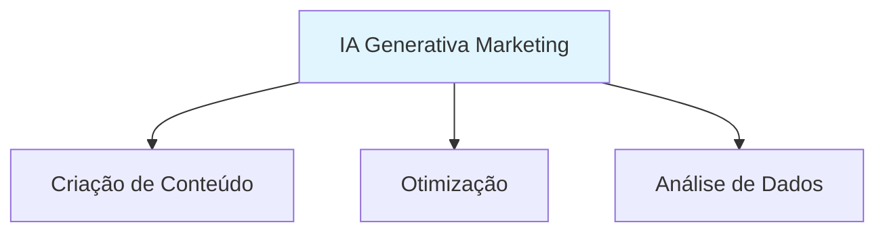

# [17 Ferramentas IA Generativa Marketing - Singular](/blog/17-ferramentas-ia-generativa-marketing---singular)

> [!compass] **[MyMess](/blog/moc---projeto-mymess)** » [Estudos](/blog/dashboard---estudos-mymess) » Engenharia de Contexto

---

> [!info]+ Detalhes do Artigo
> **Ler:** [17 generative AI tools for marketing & app growth in 2025](https://www.singular.net/blog/generative-ai-tools-for-marketing/)
> **Fonte:** [Singular](/blog/singular)
> **Autores:** Equipe Singular
> **Publicado:** 2025
>
> > [!warning] URL com problemas de acesso
> > O conteúdo requer JavaScript para carregar. Acessar manualmente pelo navegador.

> [!abstract]+ Materiais Complementares
>
> **Artigos Relacionados**
> - A preencher após leitura
>
> **Documentação Oficial**
> - A preencher após leitura
>
> **Ferramentas Mencionadas**
> - A preencher após leitura

> [!tip]- Léxico
>
> **Ferramentas e Recursos**
> - **Quais ferramentas de IA generativa oferecem melhor ROI para marketing?**
> - Avaliar custo vs benefício de cada ferramenta
> - **Como integrar múltiplas ferramentas de IA no workflow de marketing?**
>
> **Conceitos Fundamentais**
> - **IA Generativa**: Definição a preencher
> - **Marketing Digital**: Definição a preencher
>
> **Técnicas e Estratégias**
> - Explorar estratégias de integração
> [!robot]- Sugestões Complementares
>
> - **Leituras Recomendadas:**
>     - A preencher
> - **Ferramentas Úteis:**
>     - A preencher
> - **Exercícios Práticos:**
>     - Testar 3 ferramentas da lista

---

## Resumo

Síntese do artigo - a preencher após leitura

---

## Principais Conceitos

### Ferramentas Listadas

A preencher com as 17 ferramentas

---

## Detalhamento

### Categorias de Ferramentas

A preencher

### Casos de Uso

A preencher

---

## Mapa de Conceitos

O diagrama abaixo ilustra o fluxo do processo, mostrando as etapas e suas conexões.

---

## Insights & Aprendizados

**O que funcionou bem:**
- A preencher

**O que posso adaptar:**
- A preencher

**Ideias para aplicar:**
- A preencher

---

## Recursos Adicionais

- A preencher

---

## Propriedades da nota

> [!note]- Propriedades Gerais do Obsidian
>
>> **Identificação**
>
> | Campo      | Valor                    |
> |:-----------|:-------------------------|
> | **Título** | `INPUT[text:titulo]`     |
>
>> **Conexões**
>
> | Campo           | Valor                                                                 |
> |:----------------|:----------------------------------------------------------------------|
> | **Pai**         | `INPUT[suggester(optionQuery("")):pai]`                               |
> | **Coleção**     | `INPUT[inlineSelect(option(financeiro, Financeiro), option(growth, Growth), option(ia, IA), option(lideranca, Liderança), option(marketing, Marketing), option(negocios, Negócios), option(produtividade, Produtividade), option(pkm, PKM), option(saas, SaaS), option(tecnologia, Tecnologia), option(vendas, Vendas)):colecao]` |
> | **Área**        | `INPUT[suggester(optionQuery("Esforços/Áreas")):area]`                         |
> | **Projeto**     | `INPUT[suggester(optionQuery("#projeto")):projeto]`                   |
> | **Autor**       | `INPUT[suggester(optionQuery("Atlas/Pessoas")):pessoa]`                      |
> | **Relacionado** | `INPUT[inlineListSuggester(optionQuery(""), useLinks(true)):relacionado]` |
>
>> **Classificação**
>
> | Campo      | Valor                                                                 |
> |:-----------|:----------------------------------------------------------------------|
> | **Tipo**   | `INPUT[inlineSelect(option(atomica, Atômica), option(aula, Aula), option(artigo, Artigo), option(checklist, Checklist), option(curso, Curso), option(dashboard, Dashboard), option(framework, Framework), option(livro, Livro), option(moc, MOC), option(newsletter, Newsletter), option(pessoa, Pessoa), option(prompt, Prompt), option(template, Template Obsidian), option(tutorial, Tutorial), option(video_youtube, Vídeo Youtube)):tipo_nota]` |
> | **Tags**   | `INPUT[inlineList:tags]`                                              |
> | **Status** | `INPUT[inlineSelect(option(nao_iniciado, ⬜ Não Iniciado), option(em_andamento, 🔄 Em Andamento), option(concluido, ✅ Concluído), option(pausado, ⏸️ Pausado), option(cancelado, ❌ Cancelado)):status]` |
>
>> **Temporal**
>
> | Campo          | Valor                      |
> |:---------------|:---------------------------|
> | **Criado**     | `INPUT[date:data_criado]`       |
> | **Atualizado** | `INPUT[date:data_atualizado]`   |
>
>> **Visual**
>
> | Campo         | Valor                                                            |
> |:--------------|:-----------------------------------------------------------------|
> | **Visual da Nota** | `INPUT[inlineSelect(option(normal, Normal), option(wide-page, Wide Page), option(dashboard, Dashboard)):cssclasses]` |
> | **Modo Leitura** | `INPUT[toggle(onValue(preview), offValue(source)):obsidianUIMode]` |
> | **Imagem Destaque**    | `INPUT[text:imagem_destaque]`                                             |
>
>> **Compartilhar link**
>
> | Campo          | Valor                                               |
> |:---------------|:----------------------------------------------------|
> | **Share Link** | `INPUT[text(placeholder(https://...)):share_link]`  |
> | **Share Upd.** | `INPUT[text:share_updated]`                         |

> [!note]- Propriedades SaaS
>
> | Campo             | Valor                                                              |
> |:------------------|:-------------------------------------------------------------------|
> | **Mostrar Bloco** | `INPUT[toggle(onValue(true), offValue(false)):mostrar_bloco_saas]` |
> | **Status SaaS**   | `INPUT[toggle(onValue(true), offValue(false)):status_saas]`        |

> [!note]- Propriedades do Artigo
>
> | Campo            | Valor                          |
> |:-----------------|:-------------------------------|
> | **URL**          | `INPUT[text(placeholder(https://...)):url_artigo]`  |
> | **Fonte**        | `INPUT[text:fonte]`  |
> | **Autor**        | `INPUT[text:autor]`  |
> | **Data Publicação** | `INPUT[date:data_publicacao]`  |
> | **Tipo Conteúdo** | `INPUT[inlineSelect(option(educacional, Educacional), option(curadoria, Curadoria), option(historia, História Pessoal), option(listicle, Lista), option(contrarian, Opinião Contrária), option(tutorial, Tutorial), option(entrevista, Entrevista), option(analise, Análise), option(estudo_de_caso, Estudo de Caso), option(lancamento, Lançamento), option(opiniao, Opinião), option(outro, Outro)):tipo_conteudo]`  |

