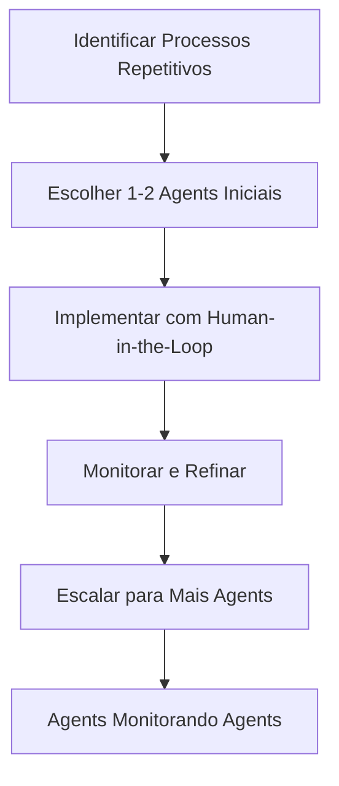

> [!info]+ Detalhes do Artigo
> **Objetivo:** Como a SaaStr reduziu de 20+ funcionários para 3 humanos + 20 AI agents, mantendo a mesma receita (8 figuras) com 3x mais output
>
> **Fonte:** SaaStr Blog
> **Autor:** `VIEW[{pessoa}]`
> **Link:** `VIEW[{url}][link]`
> **Publicado:** `VIEW[{data_criado}]`
> **Tipo:** Case Study / Análise

> [!abstract]+ Materiais Complementares
>
> **Videos YouTube - SaaStr**
> - [Pare de aprender sobre IA. Comece a praticar IA. Os mais de 20 agentes que comandam a SaaStr](https://youtu.be/5lsNEb2WlAg?si=8XN71b7bnttTHAFi)
> - [Os 10+ melhores agentes de IA da SaaStr: SDR de IA, BDR de IA, RevOps de IA e muito mais](https://youtu.be/D1NbIiaoWdI?si=L-WMdSyeQ26T26Cn)
> - [SaaStr AI Live: 6 meses depois, o que realmente funciona (e o que não funciona) com a IA no comando do GTM](https://www.youtube.com/live/7fUSYLB3NiI?si=89UuMTMf8EzWartx)
> - [SaaStr AI Live: Um guia prático para as novas ferramentas de IA da SaaStr com Jason Lemkin](https://www.youtube.com/live/ZHgJKXiiyvQ?si=iDDUOGED6pHG9Rx8)
>
> **Artigos Relacionados SaaStr**
> - [Stop Learning AI. Start Doing AI. The 20+ Agents Running SaaStr](https://www.saastr.com/stop-learning-ai-start-doing-ai-the-20-agents-running-saastr/)
> - [SaaStr's AI Agent Playbook](https://www.saastr.com/saastrs-ai-agent-playbook-how-we-deployed-20-agents-to-scale-8-figure-revenue-with-single-digit-headcount/)
> - [Our 20+ AI Agents and Their Moats](https://www.saastr.com/our-20-ai-agents-and-their-moats-real-but-weak/)
> - [SaaStr AI Agents Directory](https://saastr.ai/agents)
>
> **Ferramentas Mencionadas**
> - [Clay](https://clay.com) - Data enrichment para GTM
> - [11x](https://11x.ai) - AI SDRs (Julian & Alice)
> - [Artisan](https://artisan.co) - AI SDRs em escala
> - [Dust](https://dust.tt) - No-code AI agents
> - [Agentforce](https://salesforce.com) - Salesforce AI

> [!tip]- Léxico
>
> **Tecnologia e IA**
> - [AI-Native Organization](/blog/ai-native-organization): Empresa construída com IA no core
> - [Human-in-the-Loop](/blog/human-in-the-loop): Humano supervisiona/valida output da IA
> - [AI Backfill](/blog/ai-backfill): Usar IA para preencher vagas ao invés de contratar
>
> **Ferramentas e Recursos**
> - [AI Agents](/blog/ai-agents): Software autônomo que executa tarefas específicas
> [!robot]- Sugestões da IA
>
> - **Leituras Recomendadas:**
>     - The AI Agent Revolution (Qualified.com)
> - **Ferramentas para Começar:**
>     - Clay para enriquecimento de dados
>     - 11x para SDR automatizado

---

## Resumo Executivo

A SaaStr, reduziu seu time de **20+ funcionários para apenas 3 humanos + 20 AI agents**. O resultado: mesma receita, 3x mais output, menos drama interpessoal e unit economics 3-5x melhores. A transição levou 6 meses e exige humanos experientes supervisionando os agents.

---

## Números-Chave

A tabela abaixo resume as informações principais.

| Métrica | Antes | Depois |
|:--------|:------|:-------|
| **Headcount** | 20+ humanos | 3 humanos |
| **AI Agents** | 0 | 20+ |
| **Receita** | 8 figuras | 8 figuras (mesma) |
| **Output** | 1x | 3x |
| **Custo IA/ano** | $0 | ~$50K |
| **Unit Economics** | Base | 3-5x melhor |

---

## Os 20+ AI Agents da SaaStr

### Sales & GTM

A tabela a seguir detalha os campos e seus valores.

| Agent/Ferramenta | Função |
|:-----------------|:-------|
| **Clay** | Data enrichment para equipes GTM |
| **11x (Julian & Alice)** | AI SDRs - engajam, qualificam e agendam reuniões |
| **Artisan** | AI SDRs em escala (20M+ emails enviados) |
| **Agentforce** | Follow-up com 1000+ leads automaticamente |

### Content & Video

Os dados abaixo mostram a estrutura e configurações.

| Agent | Função |
|:------|:-------|
| **Video Summarizer** | Resume todo conteúdo de vídeo automaticamente |
| **Video Clips/Shorts** | Cria todos os clips e shorts |
| **Promo Video Builder** | Cria vídeos promocionais curtos |

### Sales Operations

A tabela abaixo resume as informações principais.

| Agent | Função |
|:------|:-------|
| **RevOps Automation** | Transcreve calls, atualiza Salesforce, identifica próximos passos |
| **AI Sales Agents** | Gravam calls, preenchem CRM, geram scorecards, enviam follow-ups |

### Ferramentas Internas

A tabela a seguir detalha os campos e seus valores.

| Agent | Função |
|:------|:-------|
| **Sponsorship Deck Generator** | Gera decks de 20 páginas customizados em minutos |
| **SaaStr AI Assistant** | 24/7 treinado em 20M+ palavras de conteúdo SaaStr |
| **Pitch Deck Analyzer** | Análise de pitch deck com scoring |
| **VC Matching System** | Conecta founders com investidores certos |
| **Dust** | Plataforma no-code para criar agents customizados |

---

## Benefícios Observados

### 1. Unit Economics 3-5x Melhores
- Mesma receita com 1/7 do headcount
- Mesmo considerando $50K/ano em ferramentas IA
- Margem dramaticamente melhor

### 2. Velocidade de Execução
- SaaStr.ai: conceito → 500K usuários em **45 dias**
- Produtos em semanas ao invés de quarters
- Captura mais oportunidades de mercado

### 3. Consistência de Execução
- AI agents não têm dias ruins
- Não ficam doentes
- Não têm drama interpessoal
- Qualidade baseline remarkably consistente
- Retenção de sponsors subiu (valor mais consistente)

---

## Advertências Importantes

> [!warning] Avisos Críticos
>
> **1. Experiência é Obrigatória**
> Os 3 humanos têm décadas de experiência em B2B SaaS. Sabem como "bom" parece e identificam problemas antes de virarem crises. Não funciona com juniores.
>
> **2. AI Agents Precisam de Manutenção**
> Não é "configurar e esquecer". É mais como jardinagem - monitoramento, updates e refinamento constantes.
>
> **3. Humanos Trabalham MAIS**
> Não é situação de 4 horas por semana. É "você está fazendo o trabalho de 7 pessoas".
>
> **4. Dependência de Plataformas**
> Dependência de Claude, OpenAI e outras plataformas. Se preços mudarem ou capabilities regredirem, tem problema.

---

## Framework de Implementação

O diagrama abaixo ilustra o fluxo do processo, mostrando as etapas e suas conexões.

---

## Insights & Aprendizados

**O que funcionou bem:**
- Começar com processos claros e repetitivos
- Humanos experientes supervisionando
- Agents em camadas (agents monitorando agents)

**O que posso adaptar:**
- Implementar 1 agent para tarefas repetitivas primeiro
- Usar Clay para enriquecimento de dados
- Criar agents de conteúdo (resumos, clips)

**Ideias para aplicar:**
- AI SDR para outbound inicial
- Agent para resumir calls e atualizar CRM
- Agent para gerar relatórios automaticamente

---

## Próximos Passos

- [ ] Mapear processos repetitivos no meu negócio
- [ ] Testar Clay para enriquecimento de dados
- [ ] Implementar 1 agent para task específica
- [ ] Monitorar resultados por 30 dias
- [ ] Escalar se funcionar

---
## Propriedades da nota

> [!note]- 📋 Propriedades Gerais do Obsidian
>
>> **📝 Identificação**
>
> | Campo      | Valor                    |
> |:-----------|:-------------------------|
> | **Título** | `INPUT[text:titulo]`     |
>
>> **🔗 Conexões**
>
> | Campo           | Valor                                                                 |
> |:----------------|:----------------------------------------------------------------------|
> | **Pai**         | `INPUT[suggester(optionQuery("")):pai]`                               |
> | **Coleção**     | `INPUT[inlineSelect(option(financeiro, Financeiro), option(growth, Growth), option(ia, IA), option(lideranca, Liderança), option(marketing, Marketing), option(negocios, Negócios), option(produtividade, Produtividade), option(pkm, PKM), option(saas, SaaS), option(tecnologia, Tecnologia), option(vendas, Vendas)):colecao]` |
> | **Área**        | `INPUT[suggester(optionQuery("Esforços/Áreas")):area]`                         |
> | **Projeto**     | `INPUT[suggester(optionQuery("#projeto")):projeto]`                   |
> | **Autor**       | `INPUT[suggester(optionQuery("Atlas/Pessoas")):pessoa]`                      |
> | **Relacionado** | `INPUT[inlineListSuggester(optionQuery(""), useLinks(true)):relacionado]` |
>
>> **📊 Classificação**
>
> | Campo      | Valor                                                                 |
> |:-----------|:----------------------------------------------------------------------|
> | **Tipo**   | `INPUT[inlineSelect(option(atomica, Atômica), option(aula, Aula), option(artigo, Artigo), option(checklist, Checklist), option(curso, Curso), option(dashboard, Dashboard), option(framework, Framework), option(livro, Livro), option(moc, MOC), option(newsletter, Newsletter), option(pessoa, Pessoa), option(prompt, Prompt), option(template, Template Obsidian), option(tutorial, Tutorial), option(video_youtube, Vídeo Youtube)):tipo_nota]` |
> | **Tags**   | `INPUT[inlineList:tags]`                                              |
> | **Status** | `INPUT[inlineSelect(option(nao_iniciado, ⬜ Não Iniciado), option(em_andamento, 🔄 Em Andamento), option(concluido, ✅ Concluído), option(pausado, ⏸️ Pausado), option(cancelado, ❌ Cancelado)):status]` |
>
>> **📅 Temporal**
>
> | Campo          | Valor                      |
> |:---------------|:---------------------------|
> | **Criado**     | `INPUT[date:data_criado]`       |
> | **Atualizado** | `INPUT[date:data_atualizado]`   |
>
>> **🎨 Visual**
>
> | Campo         | Valor                                                            |
> |:--------------|:-----------------------------------------------------------------|
> | **Visual da Nota** | `INPUT[inlineSelect(option(normal, Normal), option(wide-page, Wide Page), option(dashboard, Dashboard)):cssclasses]` |
> | **Modo Leitura** | `INPUT[toggle(onValue(preview), offValue(source)):obsidianUIMode]` |
> | **Imagem Destaque**    | `INPUT[text:imagem_destaque]`                                             |
>
>> **🌐 Compartilhar  link**
>
> | Campo          | Valor                                               |
> |:---------------|:----------------------------------------------------|
> | **Share Link** | `INPUT[text(placeholder(https://...)):share_link]`  |
> | **Share Upd.** | `INPUT[text:share_updated]`                         |

> [!note]- 🚀 Propriedades SaaS
>
> | Campo             | Valor                                                              |
> |:------------------|:-------------------------------------------------------------------|
> | **Mostrar Bloco** | `INPUT[toggle(onValue(true), offValue(false)):mostrar_bloco_saas]` |
> | **Status SaaS**   | `INPUT[toggle(onValue(true), offValue(false)):status_saas]`        |

> [!note]- 📰 Propriedades do Artigo
>
> | Campo            | Valor                          |
> |:-----------------|:-------------------------------|
> | **URL**          | `INPUT[text(placeholder(https://...)):url]`  |
> | **Tipo Conteúdo** | `INPUT[inlineSelect(option(educacional, Educacional), option(curadoria, Curadoria), option(historia, História Pessoal), option(listicle, Lista), option(contrarian, Opinião Contrária), option(tutorial, Tutorial), option(entrevista, Entrevista), option(analise, Análise), option(estudo_de_caso, Estudo de Caso), option(lancamento, Lançamento), option(opiniao, Opinião), option(outro, Outro)):tipo_conteudo]`  |

