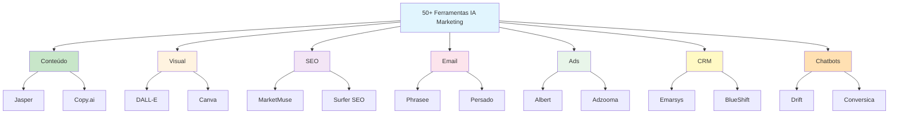

# [50 Ferramentas IA Generativa Marketing - eKyte](/blog/50-ferramentas-ia-generativa-marketing---ekyte)

> [!compass] **[MyMess](/blog/moc---projeto-mymess)** » [Estudos](/blog/dashboard---estudos-mymess) » Engenharia de Contexto

---

> [!info]+ Detalhes do Artigo
> **Ler:** [50 ferramentas com IA Generativa para marketing digital](https://www.ekyte.com/guide/pt-br/blog/50-ferramentas-com-ia-generativa-para-marketing-digital/)
> **Fonte:** [eKyte](/blog/ekyte) (Blog Oficial)
> **Autores:** Alan Koerbel (CEO da eKyte)
> **Publicado:** 1 de Agosto de 2024 | Atualizado: 10 de Novembro de 2025

> [!abstract]+ Materiais Complementares
>
> **Ferramentas Destaque por Categoria**
> - [Jasper](https://jasper.ai) - Conteúdo de marketing personalizado
> - [Copy.ai](https://copy.ai) - Textos para blogs e redes sociais
> - [DALL-E](https://openai.com/dall-e) - Geração de imagens
> - [MarketMuse](https://marketmuse.com) - SEO e otimização de conteúdo
> - [Phrasee](https://phrasee.co) - Otimização de email marketing
> - [Albert](https://albert.ai) - Gestão de campanhas publicitárias
> - [Drift](https://drift.com) - Chatbots e qualificação de leads
> - [eKyte](https://ekyte.com) - Plataforma completa de marketing com IA

> [!tip]- Léxico
>
> **Tecnologia e IA**
> - **Personalização Omnichannel**: Adaptação de mensagens e experiências em todos os pontos de contato com o cliente
> - **Automação de PPC**: Gestão automatizada de campanhas pay-per-click com otimização por IA
>
> **Elementos Visuais**
> - **IA Generativa para Marketing**: Tecnologias que criam conteúdo (texto, imagem, vídeo) automaticamente para campanhas
>
> **Técnicas e Estratégias**
> - **Marketing Cross-Channel**: Estratégias integradas entre múltiplos canais de comunicação
> [!question]- Pontos para Aprofundar (Sugestão da IA)
>
> - **Como criar uma stack de ferramentas sem sobreposição de funcionalidades?**
>     - Mapear categorias e escolher 1-2 ferramentas por área
> - **Qual o custo total de uma stack completa de IA para marketing?**
>     - Somar custos de assinatura das principais categorias
> - **Como integrar essas ferramentas entre si?**
>     - Avaliar APIs e conectores (Zapier, Make, integrações nativas)
> - **Quais ferramentas são essenciais vs nice-to-have?**
>     - Priorizar por impacto no ROI

> [!robot]- Sugestões Complementares
>
> - **Leituras Recomendadas:**
>     - Comparativo de preços das ferramentas no G2/Capterra
>     - Case studies de cada ferramenta em seus sites
> - **Ferramentas Úteis:**
>     - **Zapier/Make** - Para conectar as ferramentas entre si
>     - **eKyte** - Como plataforma unificadora
> - **Exercícios Práticos:**
>     - Testar 1 ferramenta de cada categoria principal
>     - Criar workflow: Pesquisa → Conteúdo → Design → Publicação

---

## Resumo

Lista abrangente de **51 ferramentas de IA Generativa** organizadas em **11 categorias** para marketing digital. O artigo serve como guia de referência para profissionais que querem "elevar produtividade e ROI das campanhas" através de automação e personalização.

**Foco central:** IA generativa integrada ao fluxo de trabalho de marketing.

---

## Principais Conceitos

### Ferramentas por Categoria

#### 1. Geração de Conteúdo Textual (7)
A tabela abaixo resume as informações principais.

| Ferramenta | Funcionalidade |
|:-----------|:---------------|
| **Copy.ai** | Textos para blogs, anúncios, redes sociais |
| **Jasper** | Personalização de conteúdo de marketing |
| **Writesonic** | Textos persuasivos para blogs e landing pages |
| **ContentBot** | Conteúdo longo e curto |
| **Articoolo** | Criação automática de artigos |
| **Headlime** | Headlines e cópias de marketing |
| **CopySmith** | E-commerce e descrições de produtos |

#### 2. Criação Visual e Design (5)
A tabela a seguir detalha os campos e seus valores.

| Ferramenta | Funcionalidade |
|:-----------|:---------------|
| **DALL-E** | Imagens a partir de texto |
| **Canva** | Design gráfico com IA |
| **Designs.ai** | Logotipos, vídeos, banners |
| **Lumen5** | Artigos em vídeos |
| **Pictory** | Texto em vídeo |

#### 3. SEO e Otimização (6)
Os dados abaixo mostram a estrutura e configurações.

| Ferramenta | Funcionalidade |
|:-----------|:---------------|
| **MarketMuse** | Tópicos relevantes e melhorias |
| **INK Editor** | Editor com SEO |
| **Surfer SEO** | Otimização para buscadores |
| **Frase** | Pesquisa e textos SEO |
| **Atomic Reach** | Ajuste de tom e estilo |
| **Acrolinx** | Consistência de voz da marca |

#### 4. Email Marketing (5)
A tabela abaixo resume as informações principais.

| Ferramenta | Funcionalidade |
|:-----------|:---------------|
| **Phrasee** | Linhas de assunto e CTAs |
| **Persado** | Mensagens com ressonância emocional |
| **Automizy** | Otimização de campanhas |
| **Seventh Sense** | Envio baseado em comportamento |
| **Siftrock** | Automação de respostas |

#### 5. Análise e Inteligência (4)
A tabela a seguir detalha os campos e seus valores.

| Ferramenta | Funcionalidade |
|:-----------|:---------------|
| **Cortex** | Conteúdo e horários de publicação |
| **Crimson Hexagon** | Análise de sentimentos |
| **Pattern89** | Dados de anúncios sociais |
| **PathFactory** | Interação com conteúdo |

#### 6. Publicidade e Anúncios (5)
Os dados abaixo mostram a estrutura e configurações.

| Ferramenta | Funcionalidade |
|:-----------|:---------------|
| **Adzooma** | Google, Facebook, Microsoft |
| **Smartly.io** | Automação de anúncios |
| **Albert** | Gestão de campanhas |
| **Optmyzr** | Automação de PPC |
| **Unbounce** | Landing pages com IA |

#### 7. Personalização e CRM (6)
A tabela abaixo resume as informações principais.

| Ferramenta | Funcionalidade |
|:-----------|:---------------|
| **Zest.ai** | Curadoria de conteúdo |
| **Boomtrain** | Personalização omnichannel |
| **Emarsys** | Múltiplos canais |
| **Amplero** | Personalização em escala |
| **BlueShift** | Marketing cross-channel |
| **Zaius** | Automação multicanal |

#### 8. Chatbots e Atendimento (5)
A tabela a seguir detalha os campos e seus valores.

| Ferramenta | Funcionalidade |
|:-----------|:---------------|
| **Drift** | Qualificação de leads |
| **Conversica** | Assistente de vendas |
| **Aivo** | Atendimento ao cliente |
| **Conversocial** | Gerenciamento social |
| **IA do Teams** | Atas de reuniões |

#### 9. Geração de Leads (2)
Os dados abaixo mostram a estrutura e configurações.

| Ferramenta | Funcionalidade |
|:-----------|:---------------|
| **LeadCrunch** | Leads B2B de alta qualidade |
| **Cognitivescale** | Personalização de experiência |

#### 10. Otimização de Conversão (2)
A tabela abaixo resume as informações principais.

| Ferramenta | Funcionalidade |
|:-----------|:---------------|
| **VWO** | Testes A/B |
| **HubSpot AI** | Suite integrada |

#### 11. Gestão de Marketing (3)
A tabela a seguir detalha os campos e seus valores.

| Ferramenta | Funcionalidade |
|:-----------|:---------------|
| **eKyte** | Plataforma completa |
| **ChatGPT** | Conteúdo interativo |

---

## Mapa de Conceitos

O diagrama abaixo ilustra o fluxo do processo, mostrando as etapas e suas conexões.

---

## Insights & Aprendizados

**O que funcionou bem:**
- Organização por categoria facilita navegação e escolha
- 11 categorias cobrem praticamente todo o funil de marketing
- Lista abrangente serve como referência de benchmark

**O que posso adaptar para o MyMess:**
- **Modelo de categorização**: Organizar ferramentas/funcionalidades por área
- **Ferramentas de destaque por categoria**:
  - Conteúdo: Jasper ou Copy.ai
  - Visual: DALL-E + Canva
  - SEO: MarketMuse ou Surfer SEO
  - Chatbots: Drift
- **Plataforma unificada**: Conceito do eKyte de integrar tudo

**Ideias para aplicar:**
- Criar stack mínima viável: 1 ferramenta por categoria core (Conteúdo + Visual + Email + Chatbot)
- Avaliar eKyte como possível solução all-in-one
- Usar lista como checklist de funcionalidades que o MyMess deve oferecer

---

## Recursos Adicionais

- [eKyte - Plataforma de Marketing com IA](https://ekyte.com)
- [G2 - Categoria AI Marketing Tools](https://www.g2.com/categories/ai-marketing)
- [Capterra - Marketing Automation Software](https://www.capterra.com/marketing-automation-software/)

---

## Propriedades da nota

> [!note]- Propriedades Gerais do Obsidian
>
>> **Identificação**
>
> | Campo      | Valor                    |
> |:-----------|:-------------------------|
> | **Título** | `INPUT[text:titulo]`     |
>
>> **Conexões**
>
> | Campo           | Valor                                                                 |
> |:----------------|:----------------------------------------------------------------------|
> | **Pai**         | `INPUT[suggester(optionQuery("")):pai]`                               |
> | **Coleção**     | `INPUT[inlineSelect(option(financeiro, Financeiro), option(growth, Growth), option(ia, IA), option(lideranca, Liderança), option(marketing, Marketing), option(negocios, Negócios), option(produtividade, Produtividade), option(pkm, PKM), option(saas, SaaS), option(tecnologia, Tecnologia), option(vendas, Vendas)):colecao]` |
> | **Área**        | `INPUT[suggester(optionQuery("Esforços/Áreas")):area]`                         |
> | **Projeto**     | `INPUT[suggester(optionQuery("#projeto")):projeto]`                   |
> | **Autor**       | `INPUT[suggester(optionQuery("Atlas/Pessoas")):pessoa]`                      |
> | **Relacionado** | `INPUT[inlineListSuggester(optionQuery(""), useLinks(true)):relacionado]` |
>
>> **Classificação**
>
> | Campo      | Valor                                                                 |
> |:-----------|:----------------------------------------------------------------------|
> | **Tipo**   | `INPUT[inlineSelect(option(atomica, Atômica), option(aula, Aula), option(artigo, Artigo), option(checklist, Checklist), option(curso, Curso), option(dashboard, Dashboard), option(framework, Framework), option(livro, Livro), option(moc, MOC), option(newsletter, Newsletter), option(pessoa, Pessoa), option(prompt, Prompt), option(template, Template Obsidian), option(tutorial, Tutorial), option(video_youtube, Vídeo Youtube)):tipo_nota]` |
> | **Tags**   | `INPUT[inlineList:tags]`                                              |
> | **Status** | `INPUT[inlineSelect(option(nao_iniciado, ⬜ Não Iniciado), option(em_andamento, 🔄 Em Andamento), option(concluido, ✅ Concluído), option(pausado, ⏸️ Pausado), option(cancelado, ❌ Cancelado)):status]` |
>
>> **Temporal**
>
> | Campo          | Valor                      |
> |:---------------|:---------------------------|
> | **Criado**     | `INPUT[date:data_criado]`       |
> | **Atualizado** | `INPUT[date:data_atualizado]`   |
>
>> **Visual**
>
> | Campo         | Valor                                                            |
> |:--------------|:-----------------------------------------------------------------|
> | **Visual da Nota** | `INPUT[inlineSelect(option(normal, Normal), option(wide-page, Wide Page), option(dashboard, Dashboard)):cssclasses]` |
> | **Modo Leitura** | `INPUT[toggle(onValue(preview), offValue(source)):obsidianUIMode]` |
> | **Imagem Destaque**    | `INPUT[text:imagem_destaque]`                                             |
>
>> **Compartilhar link**
>
> | Campo          | Valor                                               |
> |:---------------|:----------------------------------------------------|
> | **Share Link** | `INPUT[text(placeholder(https://...)):share_link]`  |
> | **Share Upd.** | `INPUT[text:share_updated]`                         |

> [!note]- Propriedades SaaS
>
> | Campo             | Valor                                                              |
> |:------------------|:-------------------------------------------------------------------|
> | **Mostrar Bloco** | `INPUT[toggle(onValue(true), offValue(false)):mostrar_bloco_saas]` |
> | **Status SaaS**   | `INPUT[toggle(onValue(true), offValue(false)):status_saas]`        |

> [!note]- Propriedades do Artigo
>
> | Campo            | Valor                          |
> |:-----------------|:-------------------------------|
> | **URL**          | `INPUT[text(placeholder(https://...)):url_artigo]`  |
> | **Fonte**        | `INPUT[text:fonte]`  |
> | **Autor**        | `INPUT[text:autor]`  |
> | **Data Publicação** | `INPUT[date:data_publicacao]`  |
> | **Tipo Conteúdo** | `INPUT[inlineSelect(option(educacional, Educacional), option(curadoria, Curadoria), option(historia, História Pessoal), option(listicle, Lista), option(contrarian, Opinião Contrária), option(tutorial, Tutorial), option(entrevista, Entrevista), option(analise, Análise), option(estudo_de_caso, Estudo de Caso), option(lancamento, Lançamento), option(opiniao, Opinião), option(outro, Outro)):tipo_conteudo]`  |

