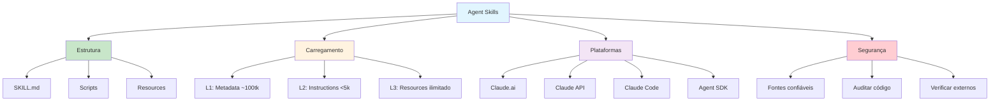

# [Agent Skills - Overview](/blog/agent-skills---overview)

> [!compass] **[IA](/blog/moc---inteligncia-artificial)** » [Claude](/blog/claude) » Agent Skills

---

> [!info]+ Detalhes do Artigo
> **Ler:** [Agent Skills Overview](https://platform.claude.com/docs/en/agents-and-tools/agent-skills/overview)
> **Fonte:** [Anthropic](/blog/anthropic) (Documentação Oficial da Plataforma)
> **Tipo:** Documentação Técnica

> [!abstract]+ Materiais Complementares
>
> **Documentação Relacionada**
> - [Quickstart Tutorial](https://platform.claude.com/docs/en/agents-and-tools/agent-skills/quickstart)
> - [Best Practices](https://platform.claude.com/docs/en/agents-and-tools/agent-skills/best-practices)
> - [Skills Guide - API](https://platform.claude.com/docs/en/build-with-claude/skills-guide)
>
> **Repositórios**
> - [Skills Cookbook](https://github.com/anthropics/claude-cookbooks/tree/main/skills)

> [!tip]- Léxico
>
> - **Pre-built Skills**: Skills fornecidas pela Anthropic (pptx, xlsx, docx, pdf)
> - **Custom Skills**: Skills criadas pelo usuário
> - **YAML Frontmatter**: Metadados no início do SKILL.md
> - **Code Execution Tool**: Ambiente VM onde skills executam

> [!question]- Pontos para Aprofundar
>
> - **Quais são as limitações de runtime?**
>     - API: sem acesso à rede, sem instalação de pacotes
>     - Claude.ai: acesso à rede variável por configuração
> - **Como funciona o compartilhamento?**
>     - Claude.ai: individual | API: workspace-wide

---

## Resumo

Esta é a documentação técnica oficial de Agent Skills. Detalha a arquitetura completa, os três níveis de carregamento progressivo, estrutura de arquivos, disponibilidade por plataforma, considerações de segurança e limitações. É a referência definitiva para implementação de skills.

**Definição central:**
- **Skills** = Capacidades modulares filesystem-based que Claude acessa automaticamente
- **Diferença de prompts** = Skills carregam on-demand e eliminam repetição entre conversas

---

## Principais Conceitos

### Conceito 1: Três Tipos de Conteúdo, Três Níveis

Skills contêm três tipos de conteúdo carregados em momentos diferentes:

| Nível | Tipo | Quando | Tokens | Exemplo |
|:------|:-----|:-------|:-------|:--------|
| **Level 1** | Metadata | Sempre | ~100/skill | name, description |
| **Level 2** | Instructions | Quando triggered | <5k | Corpo do SKILL.md |
| **Level 3** | Resources/Code | Conforme necessário | Ilimitado | Scripts, templates |

### Conceito 2: Estrutura Obrigatória

Todo SKILL.md requer frontmatter YAML com campos obrigatórios:

```yaml
---
name: your-skill-name
description: Brief description and when to use it
---

# Your Skill Name

## Instructions
[Clear, step-by-step guidance]

## Examples
[Concrete examples]
```

**Requisitos dos campos:**

`name`:
- Máximo 64 caracteres
- Apenas lowercase, números e hífens
- Sem tags XML ou palavras reservadas (anthropic, claude)

`description`:
- Não pode ser vazio
- Máximo 1024 caracteres
- Sem tags XML

### Conceito 3: Disponibilidade por Plataforma

| Plataforma | Pre-built | Custom | Compartilhamento | Network |
|:-----------|:----------|:-------|:-----------------|:--------|
| **Claude.ai** | Sim | Sim (zip) | Individual | Variável |
| **Claude API** | Sim | Sim (/v1/skills) | Workspace | Sem acesso |
| **Claude Code** | Não | Sim (filesystem) | Projeto | Full |
| **Agent SDK** | Não | Sim (.claude/skills/) | Via config | Full |

---

## Detalhamento

### Seção 1: Como Claude Acessa Skills

Claude opera em VM com acesso ao filesystem. O fluxo:

1. **Startup**: System prompt inclui metadados de todas skills
2. **Match**: Requisição do usuário corresponde à description
3. **Read**: Claude executa `bash: read skill-folder/SKILL.md`
4. **Execute**: Segue instruções, acessa recursos adicionais

**Vantagens da arquitetura:**
- **On-demand file access**: Carrega apenas arquivos necessários
- **Efficient script execution**: Código não entra no contexto, apenas output
- **Sem limite prático**: Conteúdo bundled não consome tokens até ser acessado

### Seção 2: Skills Pre-built Disponíveis

A Anthropic fornece skills prontas:

- **PowerPoint (pptx)**: Criar apresentações, editar slides, analisar conteúdo
- **Excel (xlsx)**: Criar planilhas, analisar dados, gerar relatórios com gráficos
- **Word (docx)**: Criar documentos, editar conteúdo, formatar texto
- **PDF (pdf)**: Gerar documentos PDF formatados

### Seção 3: Limitações e Constraints

> [!warning] Custom Skills NÃO sincronizam entre plataformas

**Runtime por plataforma:**

**Claude.ai:**
- Network access variável por configuração de usuário/admin

**Claude API:**
- Sem acesso à rede
- Sem instalação de pacotes em runtime
- Apenas dependências pré-configuradas

**Claude Code:**
- Full network access
- Instalação global de pacotes desencorajada

---

## Técnicas e Métodos

### Técnica 1: Usar via API

**Conceito:** Integração programática com skills.

**Headers beta necessários:**
```
code-execution-2025-08-25
skills-2025-10-02
files-api-2025-04-14
```

**Implementação:**
1. Upload skill via POST `/v1/skills`
2. Inclua `skill_id` no parâmetro `container`
3. Habilite code execution tool

### Técnica 2: Estrutura de Diretório Avançada

**Conceito:** Organizar recursos para carregamento progressivo.

```
my-skill/
├── SKILL.md           # Obrigatório - instruções principais
├── ADVANCED.md        # Opcional - casos avançados
├── REFERENCE.md       # Opcional - documentação detalhada
├── schemas/
│   └── database.sql   # Recursos de referência
└── scripts/
    ├── validate.py    # Executável via bash
    └── transform.py   # Executável via bash
```

---

## Mapa de Conceitos

O diagrama ilustra a arquitetura completa de Agent Skills, desde a estrutura de arquivos até a execução em diferentes plataformas.



---

## Insights & Aprendizados

**O que funcionou bem:**
- **Progressive disclosure**: Arquitetura eficiente para contexto
- **Filesystem-based**: Skills como diretórios são intuitivos

**O que posso adaptar:**
- **Scripts para operações determinísticas**: Código não consome contexto
- **Arquivos de referência**: Schemas e docs extensivos sem penalidade

**Limitações a considerar:**
- Skills não sincronizam entre plataformas
- API não tem acesso à rede
- Claude.ai não tem gerenciamento centralizado de custom skills

---

## Recursos Adicionais

**Documentação:**
- [Quickstart](https://platform.claude.com/docs/en/agents-and-tools/agent-skills/quickstart)
- [Best Practices](https://platform.claude.com/docs/en/agents-and-tools/agent-skills/best-practices)
- [API Guide](https://platform.claude.com/docs/en/build-with-claude/skills-guide)

**Por plataforma:**
- [Skills in Claude Code](https://code.claude.com/docs/en/skills)
- [Skills in Agent SDK](https://platform.claude.com/docs/en/agent-sdk/skills)

**Exemplos:**
- [Skills Cookbook](https://github.com/anthropics/claude-cookbooks/tree/main/skills)

