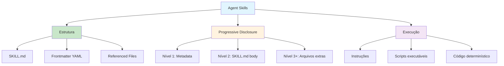

# [Agent Skills Real World - Anthropic](/blog/agent-skills-real-world---anthropic)

> [!info]+ Detalhes do Artigo
> **Ler:** [Equipping agents for the real world with Agent Skills](https://www.anthropic.com/engineering/equipping-agents-for-the-real-world-with-agent-skills)
> **Fonte:** [Anthropic](/blog/anthropic) Engineering Blog
> **Autores:** Barry Zhang, Keith Lazuka, Mahesh Murag
> **Publicado:** 16 de Outubro de 2025
> **Update:** Skills publicado como open standard (18 de Dezembro de 2025)

> [!abstract]+ Materiais Complementares
>
> **Documentação Oficial**
> - [Skills Docs](https://docs.anthropic.com) - Documentação oficial
> - [Skills Cookbook](https://github.com/anthropics/anthropic-cookbook) - Exemplos práticos
>
> **Plataformas com Suporte**
> - Claude.ai
> - Claude Code
> - Claude Agent SDK
> - Claude Developer Platform
>
> **Conceitos Relacionados**
> - [Progressive Disclosure](/blog/progressive-disclosure)
> - [Model Context Protocol](/blog/model-context-protocol)

> [!tip]- Léxico
>
> **Agent Skills**
> - **Skill**: Diretório contendo um arquivo `SKILL.md` com instruções, scripts e recursos organizados
> - **SKILL.md**: Arquivo principal com frontmatter YAML (name, description) e instruções
> - **Progressive Disclosure**: Carregamento progressivo de contexto - metadata → SKILL.md → arquivos adicionais
>
> **Componentes**
> - **Frontmatter YAML**: Metadados obrigatórios (name, description) carregados no system prompt
> - **Referenced Files**: Arquivos adicionais referenciados do SKILL.md para contexto específico
> - **Executable Scripts**: Código que Claude pode executar como ferramentas

---

## Resumo

**Agent Skills** são pastas organizadas de instruções, scripts e recursos que agentes podem descobrir e carregar dinamicamente para performar melhor em tarefas específicas. Skills estendem as capacidades do Claude empacotando sua expertise em recursos componíveis, transformando agentes de propósito geral em agentes especializados.

> Construir uma skill para um agente é como montar um guia de onboarding para um novo contratado.

---

## A Anatomia de uma Skill

### Estrutura Básica

Uma skill é um diretório contendo um arquivo `SKILL.md` que deve começar com frontmatter YAML:

```yaml
---
name: PDF Manipulation
description: Tools for reading, editing, and filling out PDF forms
---
```


### Frontmatter Obrigatório

O metadata é o **primeiro nível de progressive disclosure** - fornece informação suficiente para Claude saber quando cada skill deve ser usada sem carregar tudo no contexto.


### Arquivos Adicionais

Quando skills crescem em complexidade, podem bundlar arquivos adicionais referenciados do SKILL.md:


---

## Progressive Disclosure

O princípio core de design que torna Agent Skills flexível e escalável. Como um manual bem organizado:

1. **Nível 1**: Table of contents (metadata no system prompt)
2. **Nível 2**: Capítulos específicos (corpo do SKILL.md)
3. **Nível 3+**: Apêndice detalhado (arquivos referenciados)


> Agentes com filesystem e ferramentas de execução de código não precisam ler a skill inteira na context window. Isso significa que a quantidade de contexto que pode ser bundlada em uma skill é **efetivamente ilimitada**.

---

## Skills e a Context Window

Como a context window muda quando uma skill é triggered:


**Sequência de operações:**

1. Context window inicial tem system prompt + metadata das skills instaladas + mensagem do usuário
2. Claude triggera a skill PDF invocando Bash para ler `pdf/SKILL.md`
3. Claude escolhe ler o arquivo `forms.md` bundlado com a skill
4. Claude procede com a tarefa do usuário com instruções relevantes carregadas

---

## Skills e Execução de Código

Skills podem incluir código para Claude executar como ferramentas:


**Benefícios:**
- Operações como sorting são mais eficientes via código do que geração de tokens
- Código é **determinístico** - workflow consistente e repetível
- Claude pode rodar scripts sem carregar código ou dados no contexto

---

## Melhores Práticas

### Desenvolvendo e Avaliando Skills

| Prática | Descrição |
|:--------|:----------|
| **Start with evaluation** | Identificar gaps nas capacidades rodando tarefas representativas |
| **Structure for scale** | Dividir SKILL.md quando ficar grande; separar contextos mutuamente exclusivos |
| **Think from Claude's perspective** | Monitorar como Claude usa a skill; atenção especial a name e description |
| **Iterate with Claude** | Pedir a Claude para capturar abordagens bem-sucedidas e erros comuns |

### Considerações de Segurança

- Instalar skills apenas de **fontes confiáveis**
- Auditar conteúdo antes de usar skills de fontes menos confiáveis
- Atenção a dependências de código e recursos bundlados
- Cuidado com instruções que conectam a fontes externas não confiáveis

---

## O Futuro de Skills

**Suporte atual:**
- Claude.ai
- Claude Code
- Claude Agent SDK
- Claude Developer Platform

**Roadmap:**
- Features para ciclo completo: criar, editar, descobrir, compartilhar e usar Skills
- Skills como complemento a servidores [MCP](/blog/model-context-protocol)
- Agentes que podem **criar, editar e avaliar Skills por conta própria**

---

## Mapa de Conceitos



---

## Insights & Aprendizados

**O que funcionou bem:**
- Conceito simples: skill = pasta com SKILL.md
- Progressive disclosure resolve problema de contexto ilimitado
- Analogia com onboarding de novo funcionário é poderosa
- Combina instruções + código executável

**Relação com [Framework Conteúdo Mestre](/blog/framework-contedo-mestre):**
- Skills são a implementação técnica do que faço com DNAs
- Progressive disclosure = carregar contexto conforme necessidade
- SKILL.md = instruções operacionais (como skill do conteudo-mestre)
- Referenced files = léxico, workflow, examples

**Ideias para aplicar:**
- Estruturar melhor minhas skills seguindo o padrão Anthropic
- Usar progressive disclosure para skills complexas
- Bundlar scripts Python para operações determinísticas

---

## Recursos Adicionais

- [Anthropic - Agent Skills](https://www.anthropic.com/engineering/equipping-agents-for-the-real-world-with-agent-skills)
- [Skills Docs](https://docs.anthropic.com)
- [Skills Cookbook](https://github.com/anthropics/anthropic-cookbook)
- [Open Standard Announcement](https://www.anthropic.com/news/agent-skills-open-standard) (Dec 2025)

---

## Propriedades da nota

> [!note]- Propriedades Gerais do Obsidian
>
>> **Identificação**
>
> | Campo      | Valor                    |
> |:-----------|:-------------------------|
> | **Título** | `INPUT[text:titulo]`     |
>
>> **Conexões**
>
> | Campo           | Valor                                                                 |
> |:----------------|:----------------------------------------------------------------------|
> | **Pai**         | `INPUT[suggester(optionQuery("")):pai]`                               |
> | **Coleção**     | `INPUT[inlineSelect(option(financeiro, Financeiro), option(growth, Growth), option(ia, IA), option(lideranca, Liderança), option(marketing, Marketing), option(negocios, Negócios), option(produtividade, Produtividade), option(pkm, PKM), option(saas, SaaS), option(tecnologia, Tecnologia), option(vendas, Vendas)):colecao]` |
> | **Área**        | `INPUT[suggester(optionQuery("Esforços/Áreas")):area]`                         |
> | **Projeto**     | `INPUT[suggester(optionQuery("#projeto")):projeto]`                   |
> | **Autor**       | `INPUT[suggester(optionQuery("Atlas/Pessoas")):pessoa]`                      |
> | **Relacionado** | `INPUT[inlineListSuggester(optionQuery(""), useLinks(true)):relacionado]` |
>
>> **Classificação**
>
> | Campo      | Valor                                                                 |
> |:-----------|:----------------------------------------------------------------------|
> | **Tipo**   | `INPUT[inlineSelect(option(atomica, Atômica), option(aula, Aula), option(artigo, Artigo), option(checklist, Checklist), option(curso, Curso), option(dashboard, Dashboard), option(framework, Framework), option(livro, Livro), option(moc, MOC), option(newsletter, Newsletter), option(pessoa, Pessoa), option(prompt, Prompt), option(template, Template Obsidian), option(tutorial, Tutorial), option(video_youtube, Vídeo Youtube)):tipo_nota]` |
> | **Tags**   | `INPUT[inlineList:tags]`                                              |
> | **Status** | `INPUT[inlineSelect(option(nao_iniciado, Não Iniciado), option(em_andamento, Em Andamento), option(concluido, Concluído), option(pausado, Pausado), option(cancelado, Cancelado)):status]` |
>
>> **Temporal**
>
> | Campo          | Valor                      |
> |:---------------|:---------------------------|
> | **Criado**     | `INPUT[date:data_criado]`       |
> | **Atualizado** | `INPUT[date:data_atualizado]`   |

> [!note]- Propriedades SaaS
>
> | Campo             | Valor                                                              |
> |:------------------|:-------------------------------------------------------------------|
> | **Mostrar Bloco** | `INPUT[toggle(onValue(true), offValue(false)):mostrar_bloco_saas]` |
> | **Status SaaS**   | `INPUT[toggle(onValue(true), offValue(false)):status_saas]`        |

> [!note]- Propriedades do Artigo
>
> | Campo            | Valor                          |
> |:-----------------|:-------------------------------|
> | **URL**          | `INPUT[text(placeholder(https://...)):url_artigo]`  |
> | **Fonte**        | `INPUT[text:fonte]`  |
> | **Autor**        | `INPUT[text:autor]`  |
> | **Data Publicação** | `INPUT[date:data_publicacao]`  |
> | **Tipo Conteúdo** | `INPUT[inlineSelect(option(educacional, Educacional), option(curadoria, Curadoria), option(historia, História Pessoal), option(listicle, Lista), option(contrarian, Opinião Contrária), option(tutorial, Tutorial), option(entrevista, Entrevista), option(analise, Análise), option(estudo_de_caso, Estudo de Caso), option(lancamento, Lançamento), option(opiniao, Opinião), option(outro, Outro)):tipo_conteudo]`  |

