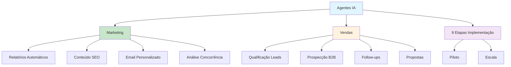

# [Agentes IA Marketing e Vendas - Escola Koru](/blog/agentes-ia-marketing-e-vendas---escola-koru)

> [!compass] **[MyMess](/blog/moc---projeto-mymess)** » [Estudos](/blog/dashboard---estudos-mymess) » Engenharia de Contexto

---

> [!info]+ Detalhes do Artigo
> **Ler:** [Agentes de IA em Marketing e Vendas: por onde começar](https://escolakoru.com.br/blog/post/agentes-inteligencia-artificial-marketing-vendas)
> **Fonte:** [Escola Koru](/blog/escola-koru) (Blog Educacional)
> **Autores:** Maíra Flores
> **Publicado:** 15 de Agosto de 2025 | Atualizado: 1 de Setembro de 2025

> [!abstract]+ Materiais Complementares
>
> **Ferramentas Mencionadas**
> - **Automação de Marketing:** HubSpot, RD Station, ActiveCampaign
> - **Análise de Dados:** Power BI, Tableau
> - **Prospecção B2B:** Apollo.io, ZoomInfo, Clay
> - **Criação de Conteúdo:** Jasper, Writer, ChatGPT, Canva Magic Studio

> [!tip]- Léxico
>
> **Tecnologia e IA**
> - **Projeto-Piloto**: Implementação inicial com escopo delimitado para testar e validar antes de escalar
> - **Qualificação Automática de Leads**: Uso de IA para classificar e priorizar leads por probabilidade de conversão
>
> **Ferramentas e Recursos**
> - **Agente de IA**: Sistema capaz de "receber um objetivo, executar uma sequência de ações e aprender com o resultado" - funciona como colaborador virtual especializado e escalável
>
> **Conteúdo e Criação**
> - **Follow-ups Inteligentes**: Acompanhamentos automatizados baseados em comportamento e contexto do prospect
> [!question]- Pontos para Aprofundar (Sugestão da IA)
>
> - **Por que apenas 4,5% das empresas brasileiras usam agentes de IA de forma avançada?**
>     - Investigar barreiras de adoção e como superá-las
> - **Como medir ROI de agentes de IA em marketing e vendas?**
>     - Definir métricas antes/depois da implementação
> - **Qual a diferença prática entre chatbots tradicionais e agentes de IA?**
>     - Comparar capacidades de aprendizado e autonomia
> - **Como treinar equipes para trabalhar com agentes de IA?**
>     - Desenvolver programa de capacitação

> [!robot]- Sugestões Complementares
>
> - **Leituras Recomendadas:**
>     - Documentação de cada ferramenta mencionada
>     - Cases de implementação de agentes em empresas brasileiras
> - **Ferramentas Úteis:**
>     - **n8n/Zapier** - Para criar workflows de automação
>     - **Apollo.io** - Para prospecção B2B com IA
> - **Exercícios Práticos:**
>     - Mapear 3 processos repetitivos que podem ser automatizados
>     - Criar projeto-piloto com 1 agente em área específica
>     - Definir métricas de sucesso antes de implementar

---

## Resumo

Guia prático para implementação de **agentes de IA em marketing e vendas**, com roteiro de **9 etapas** para começar. O artigo diferencia agentes de chatbots tradicionais e oferece aplicações práticas para cada área.

**Dado impactante:** Apenas **4,5% das empresas brasileiras** utilizam agentes de IA de forma avançada e integrada.

---

## Principais Conceitos

### Definição de Agente de IA

> "Um agente de IA é capaz de receber um objetivo, executar uma sequência de ações e aprender com o resultado."

**Diferença de chatbots tradicionais:**
- Maior flexibilidade e inteligência
- Funcionam como colaboradores virtuais especializados
- São escaláveis

### Roteiro de Implementação (9 Etapas)

A tabela abaixo resume as informações principais.

| # | Etapa | Descrição |
|:--|:------|:----------|
| 1 | **Compreender o conceito** | Entender potencial dos agentes |
| 2 | **Mapear processos** | Identificar dores internas |
| 3 | **Definir objetivos** | Métricas mensuráveis |
| 4 | **Selecionar áreas-piloto** | 1-3 frentes de alto impacto |
| 5 | **Escolher tecnologia** | Foco em integração |
| 6 | **Treinar o time** | Workshops e guias |
| 7 | **Executar piloto** | Escopo delimitado |
| 8 | **Medir e ajustar** | Baseado em dados |
| 9 | **Criar cultura** | Uso estratégico contínuo |

---

## Detalhamento

### Aplicações em Marketing

A tabela a seguir detalha os campos e seus valores.

| Aplicação | Benefício |
|:----------|:----------|
| **Automação de relatórios** | De 3 horas para 20 minutos |
| **Geração de conteúdo SEO** | Otimização automática |
| **Personalização de emails** | Segmentação inteligente |
| **Análise de concorrência** | Brainstorm de pautas |
| **Testes A/B** | Assistidos por IA |

### Aplicações em Vendas

Os dados abaixo mostram a estrutura e configurações.

| Aplicação | Benefício |
|:----------|:----------|
| **Qualificação de leads** | Priorização automática |
| **Prospecção enriquecida** | Dados de Apollo/ZoomInfo/Clay |
| **Follow-ups inteligentes** | Agendamento automático |
| **Consolidação de infos** | Sobre prospects |
| **Preparação de propostas** | Personalizadas |

### Casos de Uso Práticos

- **Relatórios semanais**: De 3 horas → 20 minutos
- **Monitoramento de tendências**: Sugestão automática de pautas
- **Qualificação de leads**: Priorização por probabilidade de conversão
- **Pesquisas NPS**: Alertas para clientes em risco de churn

---

## Mapa de Conceitos

O diagrama abaixo ilustra o fluxo do processo, mostrando as etapas e suas conexões.

---

## Insights & Aprendizados

**O que funcionou bem:**
- Roteiro claro de 9 etapas para implementação
- Diferenciação entre agentes e chatbots tradicionais
- Casos de uso concretos com métricas (3h → 20min)
- Foco em projeto-piloto antes de escalar

**O que posso adaptar para o MyMess:**
- **Roteiro de 9 etapas**: Base para onboarding de clientes
- **Áreas-piloto**: Começar com 1-3 frentes de alto impacto
- **Métricas antes/depois**: Demonstrar ROI claramente
- **Ferramentas de prospecção**: Apollo.io, ZoomInfo, Clay para enriquecer dados

**Ideias para aplicar:**
- Criar wizard de implementação baseado nas 9 etapas
- Oferecer templates de relatórios automatizados
- Desenvolver integração com Apollo.io/ZoomInfo para enriquecimento de leads
- Criar dashboard de métricas antes/depois para clientes

---

## Recursos Adicionais

- [Escola Koru - Cursos de IA](https://escolakoru.com.br)
- [HubSpot - Automação de Marketing](https://hubspot.com)
- [Apollo.io - Prospecção B2B](https://apollo.io)
- [Clay - Enriquecimento de Dados](https://clay.com)

---

## Propriedades da nota

> [!note]- Propriedades Gerais do Obsidian
>
>> **Identificação**
>
> | Campo      | Valor                    |
> |:-----------|:-------------------------|
> | **Título** | `INPUT[text:titulo]`     |
>
>> **Conexões**
>
> | Campo           | Valor                                                                 |
> |:----------------|:----------------------------------------------------------------------|
> | **Pai**         | `INPUT[suggester(optionQuery("")):pai]`                               |
> | **Coleção**     | `INPUT[inlineSelect(option(financeiro, Financeiro), option(growth, Growth), option(ia, IA), option(lideranca, Liderança), option(marketing, Marketing), option(negocios, Negócios), option(produtividade, Produtividade), option(pkm, PKM), option(saas, SaaS), option(tecnologia, Tecnologia), option(vendas, Vendas)):colecao]` |
> | **Área**        | `INPUT[suggester(optionQuery("Esforços/Áreas")):area]`                         |
> | **Projeto**     | `INPUT[suggester(optionQuery("#projeto")):projeto]`                   |
> | **Autor**       | `INPUT[suggester(optionQuery("Atlas/Pessoas")):pessoa]`                      |
> | **Relacionado** | `INPUT[inlineListSuggester(optionQuery(""), useLinks(true)):relacionado]` |
>
>> **Classificação**
>
> | Campo      | Valor                                                                 |
> |:-----------|:----------------------------------------------------------------------|
> | **Tipo**   | `INPUT[inlineSelect(option(atomica, Atômica), option(aula, Aula), option(artigo, Artigo), option(checklist, Checklist), option(curso, Curso), option(dashboard, Dashboard), option(framework, Framework), option(livro, Livro), option(moc, MOC), option(newsletter, Newsletter), option(pessoa, Pessoa), option(prompt, Prompt), option(template, Template Obsidian), option(tutorial, Tutorial), option(video_youtube, Vídeo Youtube)):tipo_nota]` |
> | **Tags**   | `INPUT[inlineList:tags]`                                              |
> | **Status** | `INPUT[inlineSelect(option(nao_iniciado, ⬜ Não Iniciado), option(em_andamento, 🔄 Em Andamento), option(concluido, ✅ Concluído), option(pausado, ⏸️ Pausado), option(cancelado, ❌ Cancelado)):status]` |
>
>> **Temporal**
>
> | Campo          | Valor                      |
> |:---------------|:---------------------------|
> | **Criado**     | `INPUT[date:data_criado]`       |
> | **Atualizado** | `INPUT[date:data_atualizado]`   |
>
>> **Visual**
>
> | Campo         | Valor                                                            |
> |:--------------|:-----------------------------------------------------------------|
> | **Visual da Nota** | `INPUT[inlineSelect(option(normal, Normal), option(wide-page, Wide Page), option(dashboard, Dashboard)):cssclasses]` |
> | **Modo Leitura** | `INPUT[toggle(onValue(preview), offValue(source)):obsidianUIMode]` |
> | **Imagem Destaque**    | `INPUT[text:imagem_destaque]`                                             |
>
>> **Compartilhar link**
>
> | Campo          | Valor                                               |
> |:---------------|:----------------------------------------------------|
> | **Share Link** | `INPUT[text(placeholder(https://...)):share_link]`  |
> | **Share Upd.** | `INPUT[text:share_updated]`                         |

> [!note]- Propriedades SaaS
>
> | Campo             | Valor                                                              |
> |:------------------|:-------------------------------------------------------------------|
> | **Mostrar Bloco** | `INPUT[toggle(onValue(true), offValue(false)):mostrar_bloco_saas]` |
> | **Status SaaS**   | `INPUT[toggle(onValue(true), offValue(false)):status_saas]`        |

> [!note]- Propriedades do Artigo
>
> | Campo            | Valor                          |
> |:-----------------|:-------------------------------|
> | **URL**          | `INPUT[text(placeholder(https://...)):url_artigo]`  |
> | **Fonte**        | `INPUT[text:fonte]`  |
> | **Autor**        | `INPUT[text:autor]`  |
> | **Data Publicação** | `INPUT[date:data_publicacao]`  |
> | **Tipo Conteúdo** | `INPUT[inlineSelect(option(educacional, Educacional), option(curadoria, Curadoria), option(historia, História Pessoal), option(listicle, Lista), option(contrarian, Opinião Contrária), option(tutorial, Tutorial), option(entrevista, Entrevista), option(analise, Análise), option(estudo_de_caso, Estudo de Caso), option(lancamento, Lançamento), option(opiniao, Opinião), option(outro, Outro)):tipo_conteudo]`  |

