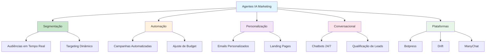

# [Agentes IA para Marketing Digital - Botpress](/blog/agentes-ia-para-marketing-digital---botpress)

> [!compass] **[MyMess](/blog/moc---projeto-mymess)** » [Estudos](/blog/dashboard---estudos-mymess) » Engenharia de Contexto

---

> [!info]+ Detalhes do Artigo
> **Ler:** [Guia Completo de Agentes de IA para Marketing Digital](https://botpress.com/pt/blog/ai-agent-for-digital-marketing)
> **Fonte:** [Botpress](/blog/botpress)
> **Autores:** Diane Clark-Lamey (Researcher & Content Writer in AI)
> **Publicado:** 22 de Janeiro de 2025

> [!abstract]+ Materiais Complementares
>
> **Plataformas de Agentes de Marketing**
> - [Botpress](https://botpress.com) - NLU avançado, multilíngue, omnichannel, integração CRM
> - [Drift](https://drift.com) - Chat em tempo real, qualificação de leads, agendamento
> - [Intercom](https://intercom.com) - Mensagens proativas, chat integrado, analytics
> - [Ada](https://ada.cx) - No-code, multilíngue, personalização comportamental
> - [Tars](https://hellotars.com) - Landing pages conversacionais, otimização PPC
> - [ManyChat](https://manychat.com) - Automação social media, drag-and-drop
>
> **Artigos Relacionados**
> - Documentação Botpress para desenvolvedores
> - Guias de integração com CRMs

> [!tip]- Léxico
>
> **Tecnologia e IA**
> - **Marketing Conversacional**: Engajamento em tempo real via chatbots, respostas instantâneas, guiando prospects pelo funil
> - **Segmentação de Audiência**: Identificação de nichos em tempo real para entrega de anúncios direcionados
> - **Personalização Dinâmica**: Criação de emails, landing pages e recomendações customizadas baseadas em necessidades individuais
>
> **Técnicas e Estratégias**
> - **Agentes de IA para Marketing**: Sistemas inteligentes que analisam dados e otimizam estratégias de marketing, entendendo comportamento do cliente e entregando experiências personalizadas com mínimo esforço manual
>
> **Conteúdo e Criação**
> - **Adaptação em Tempo Real**: Monitoramento de performance com ajuste instantâneo de conteúdo, targeting ou alocação de budget
> [!question]- Pontos para Aprofundar (Sugestão da IA)
>
> - **Como construir agentes de IA para marketing com Botpress?**
>     - Explorar plataforma e capacidades de NLU
> - **Qual a diferença prática entre Botpress e outras plataformas (Drift, Intercom)?**
>     - Comparar flexibilidade, preço e integrações
> - **Como medir ROI de agentes conversacionais em marketing?**
>     - Definir métricas de qualificação de leads e conversão
> - **Quais integrações são essenciais para agentes de marketing?**
>     - Mapear CRM + Analytics + Automação

> [!robot]- Sugestões Complementares
>
> - **Leituras Recomendadas:**
>     - Documentação oficial do Botpress
>     - Comparativos de chatbots no G2/Capterra
> - **Ferramentas Úteis:**
>     - **Botpress** - Para criação de agentes flexíveis
>     - **ManyChat** - Para automação em redes sociais
> - **Exercícios Práticos:**
>     - Criar protótipo de agente no Botpress
>     - Implementar qualificação de leads automatizada
>     - Testar integração com CRM

---

## Resumo

Guia completo sobre **agentes de IA para marketing digital**, comparando a transição de "mapas de papel manuais" para "GPS com roteamento em tempo real". O artigo cobre definições, casos de uso, plataformas e implementação prática.

**Metáfora central:** Agentes de IA são como GPS - aprendem, adaptam e otimizam em tempo real, substituindo o trabalho manual repetitivo.

---

## Principais Conceitos

### Definição de Agentes de IA para Marketing

> "AI agents in digital marketing use intelligence to analyze data and optimize marketing strategies while helping businesses understand customer behavior and deliver personalized experiences with minimal manual effort."

### Comparativo de Plataformas

A tabela abaixo resume as informações principais.

| Plataforma | Foco Principal | Melhor Para |
|:-----------|:---------------|:------------|
| **Botpress** | NLU avançado, multilíngue | Soluções flexíveis e desenvolvedores |
| **Drift** | Chat em tempo real, leads | Engajamento focado em vendas |
| **Intercom** | Mensagens proativas | Onboarding e suporte ao cliente |
| **Ada** | No-code, multilíngue | Suporte global ao cliente |
| **Tars** | Landing pages conversacionais | Campanhas de geração de leads |
| **ManyChat** | Automação social | Facebook, Instagram, WhatsApp |

---

## Detalhamento

### Casos de Uso em Marketing

A tabela a seguir detalha os campos e seus valores.

| Caso de Uso | Descrição |
|:------------|:----------|
| **Segmentação de Audiência** | Identifica nichos em tempo real e entrega anúncios direcionados |
| **Execução de Campanhas** | Automatiza emails, ads e posts com ajuste dinâmico de budget |
| **Adaptação em Tempo Real** | Monitora performance e ajusta conteúdo/targeting instantaneamente |
| **Personalização Dinâmica** | Cria emails, landing pages e recomendações customizadas |
| **Marketing Conversacional** | Suporte 24/7, responde perguntas, guia prospects pelo funil |

### Exemplos Práticos por Indústria

**SaaS:**
- Segmenta usuários por intenção (startups vs enterprise)
- Entrega mensagens diferenciadas
- Automatiza sequências de email por engajamento
- Identifica formatos preferidos (vídeo para freelancers)

**E-commerce:**
- Identifica compradores focados em sustentabilidade
- Entrega anúncios de produtos relevantes
- Envia emails destacando itens eco-friendly

**Imobiliário:**
- Analisa preferências de compradores
- Cria campanhas de email segmentadas
- Qualifica leads conversacionalmente

### Benefícios e ROI

- Targeting preciso reduz desperdício de ad spend
- Automação diminui workload manual significativamente
- Experiências personalizadas aumentam engajamento e conversões
- Otimização em tempo real maximiza efetividade
- Soluções escaláveis reduzem custos operacionais

---

## Mapa de Conceitos

O diagrama abaixo ilustra o fluxo do processo, mostrando as etapas e suas conexões.

---

## Insights & Aprendizados

**O que funcionou bem:**
- Metáfora GPS vs mapa de papel para explicar valor
- Comparativo claro de plataformas com casos de uso
- Exemplos práticos por indústria (SaaS, e-commerce, imobiliário)

**O que posso adaptar para o MyMess:**
- **Botpress como referência**: Plataforma open-source para agentes
- **Casos de uso segmentados**: Criar templates por indústria
- **Personalização dinâmica**: Core feature para agentes de marketing
- **ManyChat para social**: Integração com redes sociais

**Ideias para aplicar:**
- Criar agente de qualificação de leads no MyMess usando padrões do Botpress
- Implementar segmentação de audiência automatizada
- Desenvolver templates de marketing conversacional por indústria
- Avaliar integrações com CRMs (HubSpot, Salesforce)

---

## Recursos Adicionais

- [Botpress - Plataforma de Agentes](https://botpress.com)
- [Drift - Marketing Conversacional](https://drift.com)
- [ManyChat - Automação Social](https://manychat.com)
- [G2 - Comparativo de Chatbots](https://www.g2.com/categories/chatbots)

---

## Propriedades da nota

> [!note]- Propriedades Gerais do Obsidian
>
>> **Identificação**
>
> | Campo      | Valor                    |
> |:-----------|:-------------------------|
> | **Título** | `INPUT[text:titulo]`     |
>
>> **Conexões**
>
> | Campo           | Valor                                                                 |
> |:----------------|:----------------------------------------------------------------------|
> | **Pai**         | `INPUT[suggester(optionQuery("")):pai]`                               |
> | **Coleção**     | `INPUT[inlineSelect(option(financeiro, Financeiro), option(growth, Growth), option(ia, IA), option(lideranca, Liderança), option(marketing, Marketing), option(negocios, Negócios), option(produtividade, Produtividade), option(pkm, PKM), option(saas, SaaS), option(tecnologia, Tecnologia), option(vendas, Vendas)):colecao]` |
> | **Área**        | `INPUT[suggester(optionQuery("Esforços/Áreas")):area]`                         |
> | **Projeto**     | `INPUT[suggester(optionQuery("#projeto")):projeto]`                   |
> | **Autor**       | `INPUT[suggester(optionQuery("Atlas/Pessoas")):pessoa]`                      |
> | **Relacionado** | `INPUT[inlineListSuggester(optionQuery(""), useLinks(true)):relacionado]` |
>
>> **Classificação**
>
> | Campo      | Valor                                                                 |
> |:-----------|:----------------------------------------------------------------------|
> | **Tipo**   | `INPUT[inlineSelect(option(atomica, Atômica), option(aula, Aula), option(artigo, Artigo), option(checklist, Checklist), option(curso, Curso), option(dashboard, Dashboard), option(framework, Framework), option(livro, Livro), option(moc, MOC), option(newsletter, Newsletter), option(pessoa, Pessoa), option(prompt, Prompt), option(template, Template Obsidian), option(tutorial, Tutorial), option(video_youtube, Vídeo Youtube)):tipo_nota]` |
> | **Tags**   | `INPUT[inlineList:tags]`                                              |
> | **Status** | `INPUT[inlineSelect(option(nao_iniciado, ⬜ Não Iniciado), option(em_andamento, 🔄 Em Andamento), option(concluido, ✅ Concluído), option(pausado, ⏸️ Pausado), option(cancelado, ❌ Cancelado)):status]` |
>
>> **Temporal**
>
> | Campo          | Valor                      |
> |:---------------|:---------------------------|
> | **Criado**     | `INPUT[date:data_criado]`       |
> | **Atualizado** | `INPUT[date:data_atualizado]`   |
>
>> **Visual**
>
> | Campo         | Valor                                                            |
> |:--------------|:-----------------------------------------------------------------|
> | **Visual da Nota** | `INPUT[inlineSelect(option(normal, Normal), option(wide-page, Wide Page), option(dashboard, Dashboard)):cssclasses]` |
> | **Modo Leitura** | `INPUT[toggle(onValue(preview), offValue(source)):obsidianUIMode]` |
> | **Imagem Destaque**    | `INPUT[text:imagem_destaque]`                                             |
>
>> **Compartilhar link**
>
> | Campo          | Valor                                               |
> |:---------------|:----------------------------------------------------|
> | **Share Link** | `INPUT[text(placeholder(https://...)):share_link]`  |
> | **Share Upd.** | `INPUT[text:share_updated]`                         |

> [!note]- Propriedades SaaS
>
> | Campo             | Valor                                                              |
> |:------------------|:-------------------------------------------------------------------|
> | **Mostrar Bloco** | `INPUT[toggle(onValue(true), offValue(false)):mostrar_bloco_saas]` |
> | **Status SaaS**   | `INPUT[toggle(onValue(true), offValue(false)):status_saas]`        |

> [!note]- Propriedades do Artigo
>
> | Campo            | Valor                          |
> |:-----------------|:-------------------------------|
> | **URL**          | `INPUT[text(placeholder(https://...)):url_artigo]`  |
> | **Fonte**        | `INPUT[text:fonte]`  |
> | **Autor**        | `INPUT[text:autor]`  |
> | **Data Publicação** | `INPUT[date:data_publicacao]`  |
> | **Tipo Conteúdo** | `INPUT[inlineSelect(option(educacional, Educacional), option(curadoria, Curadoria), option(historia, História Pessoal), option(listicle, Lista), option(contrarian, Opinião Contrária), option(tutorial, Tutorial), option(entrevista, Entrevista), option(analise, Análise), option(estudo_de_caso, Estudo de Caso), option(lancamento, Lançamento), option(opiniao, Opinião), option(outro, Outro)):tipo_conteudo]`  |

