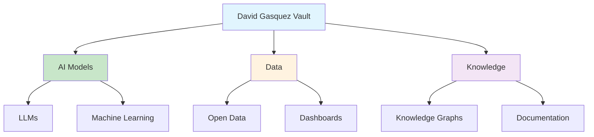

# [Artificial Intelligence Models - David Gasquez](/blog/artificial-intelligence-models---david-gasquez)

> [!compass] **[MyMess](/blog/moc---projeto-mymess)** » [Estudos](/blog/dashboard---estudos-mymess) » Engenharia de Contexto

---

> [!info]+ Detalhes do Artigo
> **Ler:** [Artificial Intelligence Models](https://publish.obsidian.md/davidgasquez/Artificial+Intelligence+Models)
> **Fonte:** [Obsidian Publish](/blog/obsidian-publish)
> **Autores:** David Gasquez
> **Publicado:** -
>
> > [!warning] Página requer JavaScript
> > O conteúdo é carregado dinamicamente e não pode ser extraído automaticamente. Acessar manualmente pelo navegador.

> [!abstract]+ Materiais Complementares
>
> **Páginas Relacionadas no Vault do Autor**
> - [Large Language Models](https://publish.obsidian.md/davidgasquez/Large+Language+Models) - Página sobre LLMs
> - [Machine Learning](https://publish.obsidian.md/davidgasquez/Data/Machine+Learning) - Seção de ML
> - [Knowledge Graphs](https://publish.obsidian.md/davidgasquez/Knowledge%20Graphs) - Grafos de conhecimento
> - [Company Knowledge Management](https://publish.obsidian.md/davidgasquez/Company+Knowledge+Management) - Gestão do conhecimento
> - [Open Data](https://publish.obsidian.md/davidgasquez/Open+Data) - Dados abertos
>
> **Documentação Oficial**
> - [Obsidian Publish](https://obsidian.md/publish) - Plataforma de publicação

> [!tip]- Léxico
>
> **Tecnologia e IA**
> - **Obsidian Publish**: Serviço que permite publicar notas do Obsidian como site estático na web
> - **Knowledge Base Pública**: Vault Obsidian compartilhado publicamente para aprendizado coletivo
>
> **Conceitos Fundamentais**
> - **Digital Garden**: Conceito de base de conhecimento pública que cresce organicamente
> [!question]- Pontos para Aprofundar (Sugestão da IA)
>
> - **Como o autor organiza conhecimento sobre modelos de IA?**
>     - Estudar estrutura de pastas e links
> - **Quais categorias de modelos são cobertas?**
>     - LLMs, Vision, Audio, Multimodal
> - **Como manter uma knowledge base pública atualizada?**
>     - Workflow de curadoria contínua

> [!robot]- Sugestões Complementares
>
> - **Leituras Recomendadas:**
>     - Explorar outras páginas do vault do David Gasquez
>     - Estudar estrutura de organização
> - **Ferramentas Úteis:**
>     - **Obsidian Publish** para publicar conhecimento
> - **Exercícios Práticos:**
>     - Criar MOC similar para modelos de IA no MyMess
>     - Mapear estrutura de organização do autor

---

## Resumo

Base de conhecimento sobre **modelos de IA** mantida no Obsidian Publish por David Gasquez. O vault é um exemplo de **digital garden** público focado em tecnologia, dados e IA.

**Valor:** Referência de como organizar conhecimento sobre IA de forma pública e navegável.

---

## Principais Conceitos

### Estrutura do Vault (Inferida)

A tabela abaixo resume as informações principais.

| Seção | URL |
|:------|:----|
| **Large Language Models** | `/Large+Language+Models` |
| **Machine Learning** | `/Data/Machine+Learning` |
| **Knowledge Graphs** | `/Knowledge%20Graphs` |
| **Company Knowledge Management** | `/Company+Knowledge+Management` |
| **Open Data** | `/Open+Data` |

### Padrões de Organização

- Uso de Obsidian Publish para compartilhar conhecimento
- Organização por tópicos técnicos
- Links internos conectando conceitos relacionados
- Digital garden com crescimento orgânico

---

## Mapa de Conceitos

O diagrama abaixo ilustra o fluxo do processo, mostrando as etapas e suas conexões.

---

## Insights & Aprendizados

**O que funcionou bem:**
- Obsidian Publish como plataforma de digital garden
- Organização por áreas temáticas (AI, Data, Knowledge)
- Links internos criando rede de conhecimento navegável

**O que posso adaptar para o MyMess:**
- **Estrutura de MOCs**: Criar mapas de conteúdo por área
- **Obsidian Publish**: Considerar para documentação pública
- **Organização por domínio**: Separar AI, Data, Knowledge Management

**Ideias para aplicar:**
- Estudar vault completo quando possível acessar
- Criar estrutura similar para documentação do MyMess
- Publicar knowledge base sobre agentes de IA

---

## Recursos Adicionais

- [David Gasquez - Obsidian Publish](https://publish.obsidian.md/davidgasquez/)
- [Obsidian Publish - Documentação](https://help.obsidian.md/Obsidian+Publish/Introduction+to+Obsidian+Publish)
- [Digital Gardens](https://maggieappleton.com/garden-history)

---

## Propriedades da nota

> [!note]- Propriedades Gerais do Obsidian
>
>> **Identificação**
>
> | Campo      | Valor                    |
> |:-----------|:-------------------------|
> | **Título** | `INPUT[text:titulo]`     |
>
>> **Conexões**
>
> | Campo           | Valor                                                                 |
> |:----------------|:----------------------------------------------------------------------|
> | **Pai**         | `INPUT[suggester(optionQuery("")):pai]`                               |
> | **Coleção**     | `INPUT[inlineSelect(option(financeiro, Financeiro), option(growth, Growth), option(ia, IA), option(lideranca, Liderança), option(marketing, Marketing), option(negocios, Negócios), option(produtividade, Produtividade), option(pkm, PKM), option(saas, SaaS), option(tecnologia, Tecnologia), option(vendas, Vendas)):colecao]` |
> | **Área**        | `INPUT[suggester(optionQuery("Esforços/Áreas")):area]`                         |
> | **Projeto**     | `INPUT[suggester(optionQuery("#projeto")):projeto]`                   |
> | **Autor**       | `INPUT[suggester(optionQuery("Atlas/Pessoas")):pessoa]`                      |
> | **Relacionado** | `INPUT[inlineListSuggester(optionQuery(""), useLinks(true)):relacionado]` |
>
>> **Classificação**
>
> | Campo      | Valor                                                                 |
> |:-----------|:----------------------------------------------------------------------|
> | **Tipo**   | `INPUT[inlineSelect(option(atomica, Atômica), option(aula, Aula), option(artigo, Artigo), option(checklist, Checklist), option(curso, Curso), option(dashboard, Dashboard), option(framework, Framework), option(livro, Livro), option(moc, MOC), option(newsletter, Newsletter), option(pessoa, Pessoa), option(prompt, Prompt), option(template, Template Obsidian), option(tutorial, Tutorial), option(video_youtube, Vídeo Youtube)):tipo_nota]` |
> | **Tags**   | `INPUT[inlineList:tags]`                                              |
> | **Status** | `INPUT[inlineSelect(option(nao_iniciado, ⬜ Não Iniciado), option(em_andamento, 🔄 Em Andamento), option(concluido, ✅ Concluído), option(pausado, ⏸️ Pausado), option(cancelado, ❌ Cancelado)):status]` |
>
>> **Temporal**
>
> | Campo          | Valor                      |
> |:---------------|:---------------------------|
> | **Criado**     | `INPUT[date:data_criado]`       |
> | **Atualizado** | `INPUT[date:data_atualizado]`   |
>
>> **Visual**
>
> | Campo         | Valor                                                            |
> |:--------------|:-----------------------------------------------------------------|
> | **Visual da Nota** | `INPUT[inlineSelect(option(normal, Normal), option(wide-page, Wide Page), option(dashboard, Dashboard)):cssclasses]` |
> | **Modo Leitura** | `INPUT[toggle(onValue(preview), offValue(source)):obsidianUIMode]` |
> | **Imagem Destaque**    | `INPUT[text:imagem_destaque]`                                             |
>
>> **Compartilhar link**
>
> | Campo          | Valor                                               |
> |:---------------|:----------------------------------------------------|
> | **Share Link** | `INPUT[text(placeholder(https://...)):share_link]`  |
> | **Share Upd.** | `INPUT[text:share_updated]`                         |

> [!note]- Propriedades SaaS
>
> | Campo             | Valor                                                              |
> |:------------------|:-------------------------------------------------------------------|
> | **Mostrar Bloco** | `INPUT[toggle(onValue(true), offValue(false)):mostrar_bloco_saas]` |
> | **Status SaaS**   | `INPUT[toggle(onValue(true), offValue(false)):status_saas]`        |

> [!note]- Propriedades do Artigo
>
> | Campo            | Valor                          |
> |:-----------------|:-------------------------------|
> | **URL**          | `INPUT[text(placeholder(https://...)):url_artigo]`  |
> | **Fonte**        | `INPUT[text:fonte]`  |
> | **Autor**        | `INPUT[text:autor]`  |
> | **Data Publicação** | `INPUT[date:data_publicacao]`  |
> | **Tipo Conteúdo** | `INPUT[inlineSelect(option(educacional, Educacional), option(curadoria, Curadoria), option(historia, História Pessoal), option(listicle, Lista), option(contrarian, Opinião Contrária), option(tutorial, Tutorial), option(entrevista, Entrevista), option(analise, Análise), option(estudo_de_caso, Estudo de Caso), option(lancamento, Lançamento), option(opiniao, Opinião), option(outro, Outro)):tipo_conteudo]`  |

