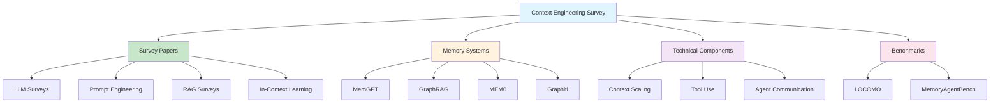

# [Awesome Context Engineering - Meirtz](/blog/awesome-context-engineering---meirtz)

> [!compass] **[MyMess](/blog/moc---projeto-mymess)** » [Estudos](/blog/dashboard---estudos-mymess) » Engenharia de Contexto

---

> [!info]+ Detalhes do Artigo
> **Ler:** [Awesome-Context-Engineering](https://github.com/Meirtz/Awesome-Context-Engineering)
> **Fonte:** [GitHub](/blog/github)
> **Autores:** Meirtz
> **Publicado:** 2 de Julho de 2025 | Paper: 17 de Julho de 2025
> **Stars:** 2.7k | **Forks:** 180 | **Licença:** MIT

> [!abstract]+ Materiais Complementares
>
> **Survey Papers Principais**
> - [A Survey of Large Language Models](https://arxiv.org/abs/) - Zhao et al., 2023
> - [The Prompt Report](https://arxiv.org/) - Schulhoff et al., 2025
> - [A Survey on In-context Learning](https://arxiv.org/) - Dong et al., 2024
> - [RAG Survey](https://arxiv.org/) - Gao et al., 2024
>
> **Sistemas de Memória**
> - [MemGPT](https://github.com/cpacker/MemGPT) - Memória para LLMs
> - [MemoryBank](https://github.com/) - Banco de memória
> - [MEM0](https://github.com/) - Sistema de memória
> - [GraphRAG](https://github.com/microsoft/graphrag) - Microsoft
> - [Graphiti](https://github.com/zep-ai/graphiti) - Zep
>
> **Benchmarks**
> - HotpotQA
> - LOCOMO (Long-Context Memory)
> - MemoryAgentBench
>
> **Comunidade**
> - [Discord Server](https://discord.gg/)
> - WeChat Group

> [!tip]- Léxico
>
> **Técnicas e Estratégias**
> - **RAG (Retrieval-Augmented Generation)**: Técnica de enriquecer contexto com informações recuperadas de bases de conhecimento
> - **Context Scaling**: Técnicas para escalar janela de contexto eficientemente
>
> **Ferramentas e Recursos**
> - **Context Engineering**: "The complete information payload provided to a LLM at inference time" - evolução de prompting estático para sistemas context-aware dinâmicos
>
> **Tecnologia e IA**
> - **Memory Systems**: Mecanismos de memória para agentes LLM incluindo memória episódica, de trabalho e baseada em grafos
>
> **Conteúdo e Criação**
> - **In-Context Learning**: Capacidade de LLMs aprenderem de exemplos fornecidos no contexto
> [!question]- Pontos para Aprofundar (Sugestão da IA)
>
> - **Como implementar sistemas de memória eficientes para agentes?**
>     - Estudar MemGPT, MEM0, GraphRAG
> - **Quais benchmarks usar para avaliar qualidade de contexto?**
>     - Explorar LOCOMO e MemoryAgentBench
> - **Como combinar RAG com memória de longo prazo?**
>     - Analisar arquiteturas híbridas
> - **Qual a diferença entre memory-augmented e context-augmented?**
>     - Comparar abordagens técnicas

> [!robot]- Sugestões Complementares
>
> - **Leituras Recomendadas:**
>     - Survey paper principal (arXiv 2507.13334)
>     - Documentação de cada sistema de memória
> - **Ferramentas Úteis:**
>     - **MemGPT** para experimentos com memória
>     - **GraphRAG** para RAG baseado em grafos
> - **Exercícios Práticos:**
>     - Implementar sistema de memória básico
>     - Testar benchmarks de contexto
>     - Contribuir com recursos para a lista

---

## Resumo

Repositório abrangente de **survey sobre Context Engineering** - a evolução de prompting estático para sistemas de IA context-aware dinâmicos. Define contexto como "o payload completo de informação fornecido ao LLM no momento da inferência", não apenas prompts do usuário.

**Métricas:** 2.7k stars, 180 forks, licença MIT

---

## Principais Conceitos

### Definição Central

> "Context Engineering is the evolution from static prompting to dynamic, context-aware AI systems. Context is defined as the complete information payload provided to a LLM at inference time."

### Categorias de Recursos

A tabela abaixo resume as informações principais.

| Categoria | Descrição |
|:----------|:----------|
| **Survey Papers** | Papers acadêmicos sobre LLMs, prompts, RAG |
| **Memory Systems** | MemGPT, MemoryBank, MEM0, GraphRAG |
| **Technical Components** | Context scaling, structured data, tool use |
| **Evaluation & Benchmarks** | LOCOMO, MemoryAgentBench |
| **Applications** | Research systems, production agents |

---

## Detalhamento

### Sistemas de Memória

A tabela a seguir detalha os campos e seus valores.

| Sistema | Foco |
|:--------|:-----|
| **MemGPT** | Memória persistente para LLMs |
| **MemoryBank** | Banco de memória estruturado |
| **MEM0** | Sistema de memória modular |
| **GraphRAG** | RAG baseado em grafos (Microsoft) |
| **Graphiti** | Grafos de conhecimento (Zep) |

### Survey Papers Principais

Os dados abaixo mostram a estrutura e configurações.

| Paper | Autores | Ano |
|:------|:--------|:----|
| A Survey of Large Language Models | Zhao et al. | 2023 |
| The Prompt Report | Schulhoff et al. | 2025 |
| A Survey on In-context Learning | Dong et al. | 2024 |
| RAG Survey | Gao et al. | 2024 |

### Benchmarks de Avaliação

- **HotpotQA**: Perguntas multi-hop
- **LOCOMO**: Avaliação de memória de longo contexto
- **MemoryAgentBench**: Benchmark para agentes com memória

---

## Mapa de Conceitos

O diagrama abaixo ilustra o fluxo do processo, mostrando as etapas e suas conexões.

---

## Insights & Aprendizados

**O que funcionou bem:**
- Organização acadêmica rigorosa com surveys e papers
- Foco em sistemas de memória como componente central
- Benchmarks para avaliação objetiva
- Comunidade ativa (Discord, WeChat)

**O que posso adaptar para o MyMess:**
- **Sistemas de memória**: Implementar MemGPT ou MEM0 para agentes
- **GraphRAG**: Usar para enriquecer contexto com grafos
- **Benchmarks**: Avaliar qualidade dos agentes com LOCOMO
- **Survey como referência**: Base acadêmica para decisões técnicas

**Ideias para aplicar:**
- Estudar MemGPT para memória persistente de agentes
- Implementar GraphRAG para RAG baseado em grafos
- Usar benchmarks para avaliar qualidade de contexto
- Contribuir recursos relevantes para a comunidade

---

## Recursos Adicionais

- [GitHub - Awesome Context Engineering](https://github.com/Meirtz/Awesome-Context-Engineering)
- [arXiv Paper - Survey](https://arxiv.org/abs/2507.13334)
- [MemGPT](https://github.com/cpacker/MemGPT)
- [GraphRAG - Microsoft](https://github.com/microsoft/graphrag)
- [Graphiti - Zep](https://github.com/zep-ai/graphiti)

---

## Propriedades da nota

> [!note]- Propriedades Gerais do Obsidian
>
>> **Identificação**
>
> | Campo      | Valor                    |
> |:-----------|:-------------------------|
> | **Título** | `INPUT[text:titulo]`     |
>
>> **Conexões**
>
> | Campo           | Valor                                                                 |
> |:----------------|:----------------------------------------------------------------------|
> | **Pai**         | `INPUT[suggester(optionQuery("")):pai]`                               |
> | **Coleção**     | `INPUT[inlineSelect(option(financeiro, Financeiro), option(growth, Growth), option(ia, IA), option(lideranca, Liderança), option(marketing, Marketing), option(negocios, Negócios), option(produtividade, Produtividade), option(pkm, PKM), option(saas, SaaS), option(tecnologia, Tecnologia), option(vendas, Vendas)):colecao]` |
> | **Área**        | `INPUT[suggester(optionQuery("Esforços/Áreas")):area]`                         |
> | **Projeto**     | `INPUT[suggester(optionQuery("#projeto")):projeto]`                   |
> | **Autor**       | `INPUT[suggester(optionQuery("Atlas/Pessoas")):pessoa]`                      |
> | **Relacionado** | `INPUT[inlineListSuggester(optionQuery(""), useLinks(true)):relacionado]` |
>
>> **Classificação**
>
> | Campo      | Valor                                                                 |
> |:-----------|:----------------------------------------------------------------------|
> | **Tipo**   | `INPUT[inlineSelect(option(atomica, Atômica), option(aula, Aula), option(artigo, Artigo), option(checklist, Checklist), option(curso, Curso), option(dashboard, Dashboard), option(framework, Framework), option(livro, Livro), option(moc, MOC), option(newsletter, Newsletter), option(pessoa, Pessoa), option(prompt, Prompt), option(template, Template Obsidian), option(tutorial, Tutorial), option(video_youtube, Vídeo Youtube)):tipo_nota]` |
> | **Tags**   | `INPUT[inlineList:tags]`                                              |
> | **Status** | `INPUT[inlineSelect(option(nao_iniciado, ⬜ Não Iniciado), option(em_andamento, 🔄 Em Andamento), option(concluido, ✅ Concluído), option(pausado, ⏸️ Pausado), option(cancelado, ❌ Cancelado)):status]` |
>
>> **Temporal**
>
> | Campo          | Valor                      |
> |:---------------|:---------------------------|
> | **Criado**     | `INPUT[date:data_criado]`       |
> | **Atualizado** | `INPUT[date:data_atualizado]`   |
>
>> **Visual**
>
> | Campo         | Valor                                                            |
> |:--------------|:-----------------------------------------------------------------|
> | **Visual da Nota** | `INPUT[inlineSelect(option(normal, Normal), option(wide-page, Wide Page), option(dashboard, Dashboard)):cssclasses]` |
> | **Modo Leitura** | `INPUT[toggle(onValue(preview), offValue(source)):obsidianUIMode]` |
> | **Imagem Destaque**    | `INPUT[text:imagem_destaque]`                                             |
>
>> **Compartilhar link**
>
> | Campo          | Valor                                               |
> |:---------------|:----------------------------------------------------|
> | **Share Link** | `INPUT[text(placeholder(https://...)):share_link]`  |
> | **Share Upd.** | `INPUT[text:share_updated]`                         |

> [!note]- Propriedades SaaS
>
> | Campo             | Valor                                                              |
> |:------------------|:-------------------------------------------------------------------|
> | **Mostrar Bloco** | `INPUT[toggle(onValue(true), offValue(false)):mostrar_bloco_saas]` |
> | **Status SaaS**   | `INPUT[toggle(onValue(true), offValue(false)):status_saas]`        |

> [!note]- Propriedades do Artigo
>
> | Campo            | Valor                          |
> |:-----------------|:-------------------------------|
> | **URL**          | `INPUT[text(placeholder(https://...)):url_artigo]`  |
> | **Fonte**        | `INPUT[text:fonte]`  |
> | **Autor**        | `INPUT[text:autor]`  |
> | **Data Publicação** | `INPUT[date:data_publicacao]`  |
> | **Tipo Conteúdo** | `INPUT[inlineSelect(option(educacional, Educacional), option(curadoria, Curadoria), option(historia, História Pessoal), option(listicle, Lista), option(contrarian, Opinião Contrária), option(tutorial, Tutorial), option(entrevista, Entrevista), option(analise, Análise), option(estudo_de_caso, Estudo de Caso), option(lancamento, Lançamento), option(opiniao, Opinião), option(outro, Outro)):tipo_conteudo]`  |

