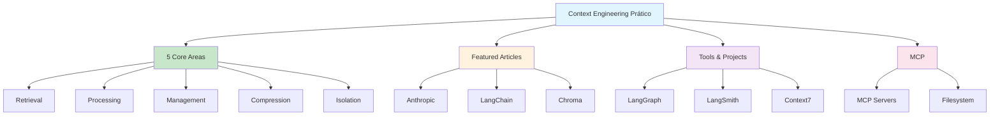

# [Awesome Context Engineering - yzfly](/blog/awesome-context-engineering---yzfly)

> [!compass] **[MyMess](/blog/moc---projeto-mymess)** » [Estudos](/blog/dashboard---estudos-mymess) » Engenharia de Contexto

---

> [!info]+ Detalhes do Artigo
> **Ler:** [awesome-context-engineering](https://github.com/yzfly/awesome-context-engineering)
> **Fonte:** [GitHub](/blog/github)
> **Autores:** yzfly (Yun Zhong Jiang Shu)
> **Publicado:** 28 de Julho de 2025
> **Stars:** 76 | **Forks:** 6 | **Licença:** CC0-1.0

> [!abstract]+ Materiais Complementares
>
> **Artigos em Destaque**
> - [Context Rot Research](https://research.trychroma.com/context-rot) - Chroma
> - [Context Engineering for AI Agents](https://manus.im/blog/Context-Engineering-for-AI-Agents-Lessons-from-Building-Manus) - Manus
> - [Claude Code Best Practices](https://www.anthropic.com/engineering/claude-code-best-practices) - Anthropic
> - [Effective Context Engineering](https://www.anthropic.com/engineering/effective-context-engineering-for-ai-agents) - Anthropic
> - [Context Engineering for Agents](https://blog.langchain.com/context-engineering-for-agents/) - LangChain
> - [How Contexts Fail](https://www.dbreunig.com/2025/06/22/how-contexts-fail-and-how-to-fix-them.html) - dbreunig
>
> **Research Papers**
> - [Survey arXiv](https://arxiv.org/abs/2507.13334)
> - [Reflexion](https://arxiv.org/abs/2303.11366)
> - [Generative Agents](https://ar5iv.labs.arxiv.org/html/2304.03442)
> - [BigTool](https://arxiv.org/abs/2505.03275)
>
> **Ferramentas e Projetos**
> - [LangGraph](https://langchain-ai.github.io/langgraph/)
> - [LangSmith](https://docs.smith.langchain.com/)
> - [LangMem](https://langchain-ai.github.io/langmem/)
> - [Context7 MCP Server](https://github.com/upstash/context7)
> - [Model Context Protocol](https://modelcontextprotocol.io/introduction)

> [!tip]- Léxico
>
> **Conteúdo e Criação**
> - **KV-Cache Optimization**: Otimização de cache key-value para contexto eficiente
> - **External Memory**: Memória externa para armazenar contexto além da janela
> - **Model Context Protocol (MCP)**: Protocolo para servidores de contexto
>
> **Tecnologia e IA**
> - **Context Engineering**: "The art and science of filling the context window with just the right information at each step of an agent's trajectory"
> - **5 Core Areas**: Context retrieval, processing, management, compression, isolation
>
> **Ferramentas e Recursos**
> - **Append-Only Context**: Padrão de adicionar sem modificar contexto existente
> [!question]- Pontos para Aprofundar (Sugestão da IA)
>
> - **Como implementar as 5 áreas core de context engineering?**
>     - Retrieval, processing, management, compression, isolation
> - **Qual a diferença entre esta lista e a do Meirtz?**
>     - Comparar foco prático vs acadêmico
> - **Como usar Model Context Protocol em produção?**
>     - Estudar implementações e servidores MCP
> - **Quais são os key principles mais importantes?**
>     - KV-Cache, append-only, external memory

> [!robot]- Sugestões Complementares
>
> - **Leituras Recomendadas:**
>     - Artigos em destaque da Anthropic e LangChain
>     - Documentação do Model Context Protocol
> - **Ferramentas Úteis:**
>     - **LangGraph** para workflows de agentes
>     - **Context7** como MCP server
>     - **Claude Code** como referência de implementação
> - **Exercícios Práticos:**
>     - Implementar MCP server básico
>     - Testar Context7 com Upstash
>     - Criar matriz comparativa das duas awesome lists

---

## Resumo

Coleção curada focada em **implementação prática** de Context Engineering. Define o campo como "a arte e ciência de preencher a janela de contexto com exatamente a informação certa em cada passo da trajetória de um agente".

**Diferencial:** Mais orientado a praticantes, com foco em ferramentas de produção (Claude Code, Cursor) e Model Context Protocol.

---

## Principais Conceitos

### Definição Central

> "Context Engineering is the art and science of filling the context window with just the right information at each step of an agent's trajectory."

### 5 Áreas Core

A tabela abaixo resume as informações principais.

| Área | Descrição |
|:-----|:----------|
| **Context Retrieval** | Buscar informação relevante |
| **Context Processing** | Processar e estruturar dados |
| **Context Management** | Gerenciar entre interações |
| **Context Compression** | Reduzir tokens mantendo informação |
| **Context Isolation** | Isolar espaços de contexto |

### Key Principles (Andrej Karpathy)

1. **KV-Cache Optimization**: Otimizar cache para reutilização
2. **Append-Only Context**: Nunca modificar, apenas adicionar
3. **External Memory**: Usar memória externa para persistência

---

## Detalhamento

### Artigos em Destaque

A tabela a seguir detalha os campos e seus valores.

| Artigo | Fonte | Foco |
|:-------|:------|:-----|
| Context Rot Research | Chroma | Degradação de contexto |
| Claude Code Best Practices | Anthropic | Implementação prática |
| Effective Context Engineering | Anthropic | Agentes de IA |
| Context Engineering for Agents | LangChain | Frameworks |
| How Contexts Fail | dbreunig | Diagnóstico de falhas |

### Ferramentas de Produção

Os dados abaixo mostram a estrutura e configurações.

| Ferramenta | Tipo | Uso |
|:-----------|:-----|:----|
| **LangGraph** | Framework | Workflows de agentes |
| **LangSmith** | Observability | Debugging de LLMs |
| **LangMem** | Memory | Memória para agentes |
| **Context7** | MCP Server | Servidor de contexto |
| **Claude Code** | IDE Agent | Referência de implementação |

### Model Context Protocol (MCP)

- Protocolo aberto para servidores de contexto
- Permite integração padronizada de ferramentas
- Suportado por Claude e outros assistentes
- [Documentação oficial](https://modelcontextprotocol.io/introduction)

---

## Comparativo: Meirtz vs yzfly

A tabela abaixo resume as informações principais.

| Aspecto | Meirtz | yzfly |
|:--------|:-------|:------|
| **Stars** | 2.7k | 76 |
| **Foco** | Acadêmico/Survey | Prático/Implementação |
| **Papers** | Extensivo | Selecionado |
| **Ferramentas** | Memory Systems | Production Tools |
| **MCP** | Não mencionado | Seção dedicada |
| **Traduções** | Não | Chinês disponível |
| **Expert Insights** | Limitado | Andrej Karpathy |

---

## Mapa de Conceitos

O diagrama abaixo ilustra o fluxo do processo, mostrando as etapas e suas conexões.

---

## Insights & Aprendizados

**O que funcionou bem:**
- Foco em implementação prática vs teoria
- Seção dedicada a MCP (Model Context Protocol)
- Expert insights de Andrej Karpathy
- Ferramentas de produção (Claude Code, Cursor)
- Traduções em chinês para recursos principais

**O que posso adaptar para o MyMess:**
- **5 Core Areas**: Framework para organizar features de contexto
- **MCP Integration**: Implementar servidores MCP para agentes
- **LangGraph/LangMem**: Usar para workflows e memória
- **Key Principles**: KV-Cache, append-only, external memory

**Ideias para aplicar:**
- Implementar as 5 áreas core no MyMess
- Criar MCP server para integração com Claude
- Usar Context7 como referência de implementação
- Estudar Claude Code como modelo de agente de IA

---

## Recursos Adicionais

- [GitHub - awesome-context-engineering](https://github.com/yzfly/awesome-context-engineering)
- [Model Context Protocol](https://modelcontextprotocol.io/introduction)
- [Context7 MCP Server](https://github.com/upstash/context7)
- [LangGraph](https://langchain-ai.github.io/langgraph/)
- [Claude Code](https://www.anthropic.com/claude-code)
- [HumanLayer](https://github.com/humanlayer/humanlayer)

---

## Propriedades da nota

> [!note]- Propriedades Gerais do Obsidian
>
>> **Identificação**
>
> | Campo      | Valor                    |
> |:-----------|:-------------------------|
> | **Título** | `INPUT[text:titulo]`     |
>
>> **Conexões**
>
> | Campo           | Valor                                                                 |
> |:----------------|:----------------------------------------------------------------------|
> | **Pai**         | `INPUT[suggester(optionQuery("")):pai]`                               |
> | **Coleção**     | `INPUT[inlineSelect(option(financeiro, Financeiro), option(growth, Growth), option(ia, IA), option(lideranca, Liderança), option(marketing, Marketing), option(negocios, Negócios), option(produtividade, Produtividade), option(pkm, PKM), option(saas, SaaS), option(tecnologia, Tecnologia), option(vendas, Vendas)):colecao]` |
> | **Área**        | `INPUT[suggester(optionQuery("Esforços/Áreas")):area]`                         |
> | **Projeto**     | `INPUT[suggester(optionQuery("#projeto")):projeto]`                   |
> | **Autor**       | `INPUT[suggester(optionQuery("Atlas/Pessoas")):pessoa]`                      |
> | **Relacionado** | `INPUT[inlineListSuggester(optionQuery(""), useLinks(true)):relacionado]` |
>
>> **Classificação**
>
> | Campo      | Valor                                                                 |
> |:-----------|:----------------------------------------------------------------------|
> | **Tipo**   | `INPUT[inlineSelect(option(atomica, Atômica), option(aula, Aula), option(artigo, Artigo), option(checklist, Checklist), option(curso, Curso), option(dashboard, Dashboard), option(framework, Framework), option(livro, Livro), option(moc, MOC), option(newsletter, Newsletter), option(pessoa, Pessoa), option(prompt, Prompt), option(template, Template Obsidian), option(tutorial, Tutorial), option(video_youtube, Vídeo Youtube)):tipo_nota]` |
> | **Tags**   | `INPUT[inlineList:tags]`                                              |
> | **Status** | `INPUT[inlineSelect(option(nao_iniciado, ⬜ Não Iniciado), option(em_andamento, 🔄 Em Andamento), option(concluido, ✅ Concluído), option(pausado, ⏸️ Pausado), option(cancelado, ❌ Cancelado)):status]` |
>
>> **Temporal**
>
> | Campo          | Valor                      |
> |:---------------|:---------------------------|
> | **Criado**     | `INPUT[date:data_criado]`       |
> | **Atualizado** | `INPUT[date:data_atualizado]`   |
>
>> **Visual**
>
> | Campo         | Valor                                                            |
> |:--------------|:-----------------------------------------------------------------|
> | **Visual da Nota** | `INPUT[inlineSelect(option(normal, Normal), option(wide-page, Wide Page), option(dashboard, Dashboard)):cssclasses]` |
> | **Modo Leitura** | `INPUT[toggle(onValue(preview), offValue(source)):obsidianUIMode]` |
> | **Imagem Destaque**    | `INPUT[text:imagem_destaque]`                                             |
>
>> **Compartilhar link**
>
> | Campo          | Valor                                               |
> |:---------------|:----------------------------------------------------|
> | **Share Link** | `INPUT[text(placeholder(https://...)):share_link]`  |
> | **Share Upd.** | `INPUT[text:share_updated]`                         |

> [!note]- Propriedades SaaS
>
> | Campo             | Valor                                                              |
> |:------------------|:-------------------------------------------------------------------|
> | **Mostrar Bloco** | `INPUT[toggle(onValue(true), offValue(false)):mostrar_bloco_saas]` |
> | **Status SaaS**   | `INPUT[toggle(onValue(true), offValue(false)):status_saas]`        |

> [!note]- Propriedades do Artigo
>
> | Campo            | Valor                          |
> |:-----------------|:-------------------------------|
> | **URL**          | `INPUT[text(placeholder(https://...)):url_artigo]`  |
> | **Fonte**        | `INPUT[text:fonte]`  |
> | **Autor**        | `INPUT[text:autor]`  |
> | **Data Publicação** | `INPUT[date:data_publicacao]`  |
> | **Tipo Conteúdo** | `INPUT[inlineSelect(option(educacional, Educacional), option(curadoria, Curadoria), option(historia, História Pessoal), option(listicle, Lista), option(contrarian, Opinião Contrária), option(tutorial, Tutorial), option(entrevista, Entrevista), option(analise, Análise), option(estudo_de_caso, Estudo de Caso), option(lancamento, Lançamento), option(opiniao, Opinião), option(outro, Outro)):tipo_conteudo]`  |

