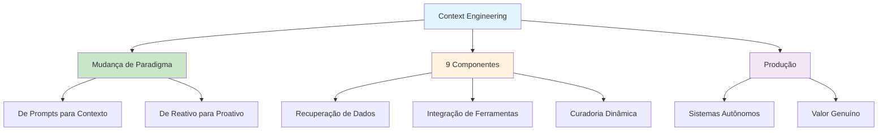

# [Beyond the Prompt Real AI Revolution - Policy Center](/blog/beyond-the-prompt-real-ai-revolution---policy-center)

> [!compass] **[MyMess](/blog/moc---projeto-mymess)** » [Estudos](/blog/dashboard---estudos-mymess) » Engenharia de Contexto

---

> [!info]+ Detalhes do Artigo
> **Ler:** [Beyond the Prompt: Why Context Engineering is the Real AI Revolution](https://www.policycenter.ma/publications/beyond-prompt-why-context-engineering-real-ai-revolution)
> **Fonte:** [Policy Center](/blog/policy-center) (Policy Center for the New South)
> **Autores:** Imad Hajjaji
> **Publicado:** 27 de Novembro de 2025

> [!abstract]+ Materiais Complementares
>
> **Artigos Relacionados**
> - [Effective Context Engineering for AI Agents](https://www.anthropic.com/engineering/effective-context-engineering-for-ai-agents) - Anthropic
> - [Context Engineering Guide](https://www.promptingguide.ai/guides/context-engineering-guide) - Prompting Guide
>
> **Documentação Oficial**
> - [Claude Documentation](https://docs.anthropic.com) - Anthropic
>
> **Citações do Artigo**
> - Philipp Schmid - Definição de Context Engineering

> [!tip]- Léxico
>
> **Ferramentas e Recursos**
> - **Context Engineering**: "A disciplina de projetar e construir sistemas dinâmicos que fornecem a informação e ferramentas certas, no formato certo, no momento certo, para dar ao LLM tudo que precisa para completar uma tarefa" (Philipp Schmid)
> - **Mudança de Paradigma**: De interações casuais com IA para sistemas prontos para produção
> - **9 Componentes Críticos**: Recuperação de dados, integração de ferramentas, curadoria dinâmica de informação
>
> **Tecnologia e IA**
> - **Prompt Engineering**: Foco em criar perguntas efetivas dentro de restrições existentes
> [!question]- Pontos para Aprofundar (Sugestão da IA)
>
> - **Quais são os 9 componentes críticos do context engineering?**
>     - Investigar cada componente em detalhe
> - **Como medir o sucesso da transição de prompt para context engineering?**
>     - Desenvolver métricas de avaliação
> - **Quais são as implicações para políticas públicas de IA?**
>     - Explorar regulamentação e governança

> [!robot]- Sugestões Complementares
>
> - **Leituras Recomendadas:**
>     - Artigo da Anthropic sobre Context Engineering
>     - Survey papers sobre LLMs e contexto
> - **Ferramentas Úteis:**
>     - **Claude Projects** para gestão de contexto
>     - **LangChain** para implementação
> - **Exercícios Práticos:**
>     - Comparar prompt tradicional vs context engineering em caso real
>     - Mapear os 9 componentes em um projeto existente

---

## Resumo

Artigo argumentando que **Context Engineering é a verdadeira revolução da IA**, não prompt engineering. A distinção fundamental: prompt engineering foca em criar perguntas efetivas, enquanto context engineering **constrói sistematicamente o ambiente de informação ótimo antes da pergunta**.

**Citação central:**
> "The revolution is not in the prompts we write, but in the contexts we engineer."

---

## Principais Conceitos

### Definição de Context Engineering (Philipp Schmid)

> "The discipline of designing and building dynamic systems that provides the right information and tools, in the right format, at the right time, to give a LLM everything it needs to accomplish a task."

### Prompt Engineering vs Context Engineering

A tabela abaixo resume as informações principais.

| Prompt Engineering | Context Engineering |
|:-------------------|:--------------------|
| Foco em instruções pontuais | Foco em estrutura de contexto |
| Abordagem reativa | Abordagem sistêmica |
| Opera dentro de restrições | Determina o que preenche a janela |
| Interações casuais | Sistemas de produção |

### Por que é a "Real Revolução"

1. **Determina o conteúdo**: Decide o que preenche a janela de contexto
2. **Resolução autônoma**: Sistemas resolvem problemas ao invés de fazer perguntas
3. **Arquitetura de informação**: Produção depende de arquitetura sofisticada, não apenas capacidades do modelo

---

## Detalhamento

### Os 9 Componentes Críticos

O artigo menciona que context engineering engloba **9 componentes críticos**:
- Recuperação de dados
- Integração de ferramentas
- Curadoria dinâmica de informação
- (outros 6 não detalhados no resumo)

### Exemplo Prático: Atendimento ao Cliente

A tabela a seguir detalha os campos e seus valores.

| IA Básica | IA com Context Engineering |
|:----------|:---------------------------|
| Pergunta "quando?" | Agenda reunião proativamente |
| Busca clarificação | Usa acesso ao calendário |
| Responde reativamente | Acessa dados da equipe e conhecimento organizacional |

### Implicação Central

Context engineering é **essencial - não opcional** para organizações implementando IA que entrega valor genuíno.

---

## Mapa de Conceitos

O diagrama abaixo ilustra o fluxo do processo, mostrando as etapas e suas conexões.

---

## Insights & Aprendizados

**O que funcionou bem:**
- Definição clara e citável de Philipp Schmid
- Comparação direta entre prompt e context engineering
- Exemplo prático de atendimento ao cliente
- Perspectiva de políticas públicas (fonte: Policy Center)

**O que posso adaptar para o MyMess:**
- **Framework dos 9 componentes**: Usar como checklist para agentes
- **Exemplo de atendimento**: Modelo para casos de uso do produto
- **Citação central**: "The revolution is not in the prompts we write, but in the contexts we engineer"

**Ideias para aplicar:**
- Mapear os 9 componentes nos agentes do MyMess
- Criar comparativo antes/depois (prompt vs context) para demonstrar valor
- Desenvolver métricas de "maturidade em context engineering"

---

## Recursos Adicionais

- [Policy Center - Artigo Original](https://www.policycenter.ma/publications/beyond-prompt-why-context-engineering-real-ai-revolution)
- [Anthropic - Effective Context Engineering](https://www.anthropic.com/engineering/effective-context-engineering-for-ai-agents)
- [Prompting Guide - Context Engineering](https://www.promptingguide.ai/guides/context-engineering-guide)

---

## Propriedades da nota

> [!note]- Propriedades Gerais do Obsidian
>
>> **Identificação**
>
> | Campo      | Valor                    |
> |:-----------|:-------------------------|
> | **Título** | `INPUT[text:titulo]`     |
>
>> **Conexões**
>
> | Campo           | Valor                                                                 |
> |:----------------|:----------------------------------------------------------------------|
> | **Pai**         | `INPUT[suggester(optionQuery("")):pai]`                               |
> | **Coleção**     | `INPUT[inlineSelect(option(financeiro, Financeiro), option(growth, Growth), option(ia, IA), option(lideranca, Liderança), option(marketing, Marketing), option(negocios, Negócios), option(produtividade, Produtividade), option(pkm, PKM), option(saas, SaaS), option(tecnologia, Tecnologia), option(vendas, Vendas)):colecao]` |
> | **Área**        | `INPUT[suggester(optionQuery("Esforços/Áreas")):area]`                         |
> | **Projeto**     | `INPUT[suggester(optionQuery("#projeto")):projeto]`                   |
> | **Autor**       | `INPUT[suggester(optionQuery("Atlas/Pessoas")):pessoa]`                      |
> | **Relacionado** | `INPUT[inlineListSuggester(optionQuery(""), useLinks(true)):relacionado]` |
>
>> **Classificação**
>
> | Campo      | Valor                                                                 |
> |:-----------|:----------------------------------------------------------------------|
> | **Tipo**   | `INPUT[inlineSelect(option(atomica, Atômica), option(aula, Aula), option(artigo, Artigo), option(checklist, Checklist), option(curso, Curso), option(dashboard, Dashboard), option(framework, Framework), option(livro, Livro), option(moc, MOC), option(newsletter, Newsletter), option(pessoa, Pessoa), option(prompt, Prompt), option(template, Template Obsidian), option(tutorial, Tutorial), option(video_youtube, Vídeo Youtube)):tipo_nota]` |
> | **Tags**   | `INPUT[inlineList:tags]`                                              |
> | **Status** | `INPUT[inlineSelect(option(nao_iniciado, ⬜ Não Iniciado), option(em_andamento, 🔄 Em Andamento), option(concluido, ✅ Concluído), option(pausado, ⏸️ Pausado), option(cancelado, ❌ Cancelado)):status]` |
>
>> **Temporal**
>
> | Campo          | Valor                      |
> |:---------------|:---------------------------|
> | **Criado**     | `INPUT[date:data_criado]`       |
> | **Atualizado** | `INPUT[date:data_atualizado]`   |
>
>> **Visual**
>
> | Campo         | Valor                                                            |
> |:--------------|:-----------------------------------------------------------------|
> | **Visual da Nota** | `INPUT[inlineSelect(option(normal, Normal), option(wide-page, Wide Page), option(dashboard, Dashboard)):cssclasses]` |
> | **Modo Leitura** | `INPUT[toggle(onValue(preview), offValue(source)):obsidianUIMode]` |
> | **Imagem Destaque**    | `INPUT[text:imagem_destaque]`                                             |
>
>> **Compartilhar link**
>
> | Campo          | Valor                                               |
> |:---------------|:----------------------------------------------------|
> | **Share Link** | `INPUT[text(placeholder(https://...)):share_link]`  |
> | **Share Upd.** | `INPUT[text:share_updated]`                         |

> [!note]- Propriedades SaaS
>
> | Campo             | Valor                                                              |
> |:------------------|:-------------------------------------------------------------------|
> | **Mostrar Bloco** | `INPUT[toggle(onValue(true), offValue(false)):mostrar_bloco_saas]` |
> | **Status SaaS**   | `INPUT[toggle(onValue(true), offValue(false)):status_saas]`        |

> [!note]- Propriedades do Artigo
>
> | Campo            | Valor                          |
> |:-----------------|:-------------------------------|
> | **URL**          | `INPUT[text(placeholder(https://...)):url_artigo]`  |
> | **Fonte**        | `INPUT[text:fonte]`  |
> | **Autor**        | `INPUT[text:autor]`  |
> | **Data Publicação** | `INPUT[date:data_publicacao]`  |
> | **Tipo Conteúdo** | `INPUT[inlineSelect(option(educacional, Educacional), option(curadoria, Curadoria), option(historia, História Pessoal), option(listicle, Lista), option(contrarian, Opinião Contrária), option(tutorial, Tutorial), option(entrevista, Entrevista), option(analise, Análise), option(estudo_de_caso, Estudo de Caso), option(lancamento, Lançamento), option(opiniao, Opinião), option(outro, Outro)):tipo_conteudo]`  |

