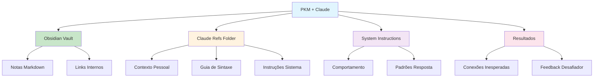

# [Building PKM with Obsidian and Claude - Paul Kruchoski](/blog/building-pkm-with-obsidian-and-claude---paul-kruchoski)

> [!compass] **[MyMess](/blog/moc---projeto-mymess)** » [Estudos](/blog/dashboard---estudos-mymess) » PKM

---

> [!info]+ Detalhes do Artigo
> **Ler:** [Building a PKM with Obsidian and Claude: A Practical Guide](https://www.linkedin.com/pulse/building-pkm-obsidian-claude-practical-guide-paul-kruchoski-havue)
> **Fonte:** [LinkedIn](/blog/linkedin)
> **Autores:** Paul Kruchoski
> **Publicado:** 23 de Setembro de 2025

> [!abstract]+ Materiais Complementares
>
> **Ferramentas Necessárias**
> - [Obsidian](https://obsidian.md) - Ferramenta PKM local
> - [Claude Desktop](https://claude.ai/download) - App desktop com MCP
>
> **Documentação Oficial**
> - [Obsidian Documentation](https://help.obsidian.md) - Guia completo
> - [Claude Filesystem MCP](https://modelcontextprotocol.io) - Model Context Protocol
>
> **Plugins Recomendados**
> - Templater - Automatização de templates
> - Dataview - Consultas dinâmicas

> [!tip]- Léxico
>
> **Tecnologia e IA**
> - **System Instructions**: Instruções centrais que definem comportamento de Claude
> - **Filesystem Extension**: Conector MCP que dá acesso à pasta do Obsidian
>
> **Ferramentas e Recursos**
> - **PKM (Personal Knowledge Management)**: Sistema para gestão de conhecimento pessoal usando notas interconectadas
>
> **Conteúdo e Criação**
> - **Claude Refs Folder**: Pasta dedicada com materiais de referência que ensinam Claude sobre o contexto do usuário
>
> **Conceitos Fundamentais**
> - **Notas Atômicas**: Princípio de uma ideia por nota
> [!question]- Pontos para Aprofundar (Sugestão da IA)
>
> - **Como estruturar o arquivo de contexto pessoal ideal?**
>     - Background, objetivos, restrições, preferências
> - **Qual a frequência ideal de atualização do contexto?**
>     - Autor recomenda mensalmente
> - **Como evitar over-engineering do sistema?**
>     - Começar simples e iterar

> [!robot]- Sugestões Complementares
>
> - **Leituras Recomendadas:**
>     - "How to Take Smart Notes" de Sönke Ahrens
>     - "Building a Second Brain" de Tiago Forte
> - **Ferramentas Úteis:**
>     - **Claude Desktop** com Filesystem ativado
>     - **Templater Plugin** para automação
> - **Exercícios Práticos:**
>     - Criar os 3 arquivos críticos na Claude Refs
>     - Testar com tarefa real, não trivial

---

## Resumo

Guia prático sobre como integrar **Obsidian + Claude** para criar um sistema PKM potencializado por IA. O sistema usa 3 camadas: Obsidian para armazenamento local, Claude Refs Folder para contexto, e System Instructions para comportamento.

**Resultado:** Transformação em pensamento crítico através de feedback desafiador e conexões inesperadas entre ideias.

---

## Principais Conceitos

### Arquitetura de 3 Camadas

A tabela abaixo resume as informações principais.

| Camada | Função |
|:-------|:-------|
| **Obsidian** | Armazena conhecimento em markdown local com links internos |
| **Claude Refs Folder** | Materiais de referência que ensinam Claude sobre você |
| **System Instructions** | Define comportamento e princípios do Claude |

### Setup Passo a Passo

1. Baixar Obsidian e criar vault
2. Instalar Claude Desktop
3. Ativar extensão Filesystem em Settings → Connectors
4. Conceder acesso à pasta do Obsidian
5. Criar arquivo de contexto pessoal
6. Adicionar instruções de sistema ao projeto Claude

---

## Detalhamento

### Os 3 Arquivos Críticos (Claude Refs)

A tabela a seguir detalha os campos e seus valores.

| Arquivo | Conteúdo |
|:--------|:---------|
| **Contexto Pessoal** | Background, objetivos, restrições, preferências de trabalho |
| **Guia de Sintaxe Obsidian** | Wikilinks, callouts, frontmatter, convenções |
| **System Instructions** | Princípios comportamentais e padrões de resposta |

### Melhores Práticas

1. **Atualização mensal** do arquivo de contexto pessoal
2. **Notas atômicas** - uma ideia por nota
3. **Ser explícito** sobre como quer ser desafiado intelectualmente
4. **Documentar padrões** de trabalho e preferências
5. **Testar com trabalho real**, não tarefas triviais

### Resultados Obtidos

- Redução de tempo explicando contexto
- Detecção de lacunas em raciocínio
- Conexões inesperadas entre ideias
- Feedback desafiador e perspectivas alternativas

---

## Mapa de Conceitos

O diagrama abaixo ilustra o fluxo do processo, mostrando as etapas e suas conexões.

---

## Insights & Aprendizados

**O que funcionou bem:**
- Arquitetura de 3 camadas clara e replicável
- Uso do Filesystem MCP para acesso local
- Foco em atualização regular do contexto (mensal)
- Ênfase em testar com trabalho real

**O que posso adaptar para o MyMess:**
- **Claude Refs Folder**: Criar pasta de contexto padronizada para usuários
- **3 Arquivos Críticos**: Template para onboarding de clientes
- **Atualização mensal**: Lembrete automático para refresh de contexto
- **Notas atômicas**: Padrão de estruturação de conhecimento

**Ideias para aplicar:**
- Criar template de "Claude Refs" para usuários do MyMess
- Desenvolver guia de sintaxe padrão para integração
- Implementar sistema de atualização periódica de contexto
- Documentar workflow de integração Obsidian + Claude

---

## Recursos Adicionais

- [LinkedIn - Artigo Original](https://www.linkedin.com/pulse/building-pkm-obsidian-claude-practical-guide-paul-kruchoski-havue)
- [Obsidian](https://obsidian.md)
- [Claude Desktop](https://claude.ai/download)
- [Model Context Protocol](https://modelcontextprotocol.io)
- [Obsidian Help](https://help.obsidian.md)

---

## Propriedades da nota

> [!note]- Propriedades Gerais do Obsidian
>
>> **Identificação**
>
> | Campo      | Valor                    |
> |:-----------|:-------------------------|
> | **Título** | `INPUT[text:titulo]`     |
>
>> **Conexões**
>
> | Campo           | Valor                                                                 |
> |:----------------|:----------------------------------------------------------------------|
> | **Pai**         | `INPUT[suggester(optionQuery("")):pai]`                               |
> | **Coleção**     | `INPUT[inlineSelect(option(financeiro, Financeiro), option(growth, Growth), option(ia, IA), option(lideranca, Liderança), option(marketing, Marketing), option(negocios, Negócios), option(produtividade, Produtividade), option(pkm, PKM), option(saas, SaaS), option(tecnologia, Tecnologia), option(vendas, Vendas)):colecao]` |
> | **Área**        | `INPUT[suggester(optionQuery("Esforços/Áreas")):area]`                         |
> | **Projeto**     | `INPUT[suggester(optionQuery("#projeto")):projeto]`                   |
> | **Autor**       | `INPUT[suggester(optionQuery("Atlas/Pessoas")):pessoa]`                      |
> | **Relacionado** | `INPUT[inlineListSuggester(optionQuery(""), useLinks(true)):relacionado]` |
>
>> **Classificação**
>
> | Campo      | Valor                                                                 |
> |:-----------|:----------------------------------------------------------------------|
> | **Tipo**   | `INPUT[inlineSelect(option(atomica, Atômica), option(aula, Aula), option(artigo, Artigo), option(checklist, Checklist), option(curso, Curso), option(dashboard, Dashboard), option(framework, Framework), option(livro, Livro), option(moc, MOC), option(newsletter, Newsletter), option(pessoa, Pessoa), option(prompt, Prompt), option(template, Template Obsidian), option(tutorial, Tutorial), option(video_youtube, Vídeo Youtube)):tipo_nota]` |
> | **Tags**   | `INPUT[inlineList:tags]`                                              |
> | **Status** | `INPUT[inlineSelect(option(nao_iniciado, ⬜ Não Iniciado), option(em_andamento, 🔄 Em Andamento), option(concluido, ✅ Concluído), option(pausado, ⏸️ Pausado), option(cancelado, ❌ Cancelado)):status]` |
>
>> **Temporal**
>
> | Campo          | Valor                      |
> |:---------------|:---------------------------|
> | **Criado**     | `INPUT[date:data_criado]`       |
> | **Atualizado** | `INPUT[date:data_atualizado]`   |
>
>> **Visual**
>
> | Campo         | Valor                                                            |
> |:--------------|:-----------------------------------------------------------------|
> | **Visual da Nota** | `INPUT[inlineSelect(option(normal, Normal), option(wide-page, Wide Page), option(dashboard, Dashboard)):cssclasses]` |
> | **Modo Leitura** | `INPUT[toggle(onValue(preview), offValue(source)):obsidianUIMode]` |
> | **Imagem Destaque**    | `INPUT[text:imagem_destaque]`                                             |
>
>> **Compartilhar link**
>
> | Campo          | Valor                                               |
> |:---------------|:----------------------------------------------------|
> | **Share Link** | `INPUT[text(placeholder(https://...)):share_link]`  |
> | **Share Upd.** | `INPUT[text:share_updated]`                         |

> [!note]- Propriedades SaaS
>
> | Campo             | Valor                                                              |
> |:------------------|:-------------------------------------------------------------------|
> | **Mostrar Bloco** | `INPUT[toggle(onValue(true), offValue(false)):mostrar_bloco_saas]` |
> | **Status SaaS**   | `INPUT[toggle(onValue(true), offValue(false)):status_saas]`        |

> [!note]- Propriedades do Artigo
>
> | Campo            | Valor                          |
> |:-----------------|:-------------------------------|
> | **URL**          | `INPUT[text(placeholder(https://...)):url_artigo]`  |
> | **Fonte**        | `INPUT[text:fonte]`  |
> | **Autor**        | `INPUT[text:autor]`  |
> | **Data Publicação** | `INPUT[date:data_publicacao]`  |
> | **Tipo Conteúdo** | `INPUT[inlineSelect(option(educacional, Educacional), option(curadoria, Curadoria), option(historia, História Pessoal), option(listicle, Lista), option(contrarian, Opinião Contrária), option(tutorial, Tutorial), option(entrevista, Entrevista), option(analise, Análise), option(estudo_de_caso, Estudo de Caso), option(lancamento, Lançamento), option(opiniao, Opinião), option(outro, Outro)):tipo_conteudo]`  |

