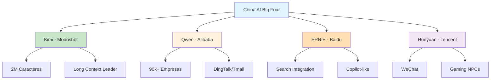

# [China AI Big Four Context Windows - LinkedIn](/blog/china-ai-big-four-context-windows---linkedin)

> [!compass] **[MyMess](/blog/moc---projeto-mymess)** » [Estudos](/blog/dashboard---estudos-mymess) » Engenharia de Contexto

---

> [!info]+ Detalhes do Artigo
> **Ler:** [China AI Big Four Context Windows](https://www.linkedin.com/posts/polen-chheang-66296636_chinaaibigfour-enterpriseai-tiktokai-activity-7394211603203862529-CDwo)
> **Fonte:** [LinkedIn](/blog/linkedin)
> **Autores:** Polen Chheang
> **Publicado:** 12 de Novembro de 2025

> [!abstract]+ Materiais Complementares
>
> **Os 4 Grandes da IA Chinesa**
> - [Kimi](https://kimi.ai) - Moonshot AI (contextos ultra-longos)
> - [Qwen](https://qwen.aliyun.com) - Alibaba Cloud (ecossistema aberto)
> - [ERNIE](https://yiyan.baidu.com) - Baidu (integração busca)
> - [Hunyuan](https://hunyuan.tencent.com) - Tencent (WeChat/produtividade)
>
> **Comparação com Modelos Ocidentais**
> - GPT-4 Turbo (OpenAI)
> - LLaMA (Meta)
> - Mistral

> [!tip]- Léxico
>
> **Conteúdo e Criação**
> - **Context Window**: Janela de contexto em tokens que um modelo pode processar simultaneamente
> - **Kimi**: Modelo da Moonshot AI com até 2 milhões de caracteres chineses de contexto
>
> **Ferramentas e Recursos**
> - **Qwen**: Modelo da Alibaba integrado ao ecossistema DingTalk/Tmall/Taobao
>
> **Tecnologia e IA**
> - **ERNIE**: Modelo da Baidu com integração nativa ao buscador
>
> **Outros Conceitos**
> - **Hunyuan**: Modelo da Tencent para WeChat e automação corporativa
> [!question]- Pontos para Aprofundar (Sugestão da IA)
>
> - **Como Kimi consegue processar 2 milhões de caracteres?**
>     - Investigar arquitetura e técnicas de otimização
> - **Qual a diferença de performance entre modelos chineses e ocidentais?**
>     - Comparar benchmarks e casos de uso
> - **Como acessar esses modelos fora da China?**
>     - Verificar disponibilidade de APIs

> [!robot]- Sugestões Complementares
>
> - **Leituras Recomendadas:**
>     - Papers técnicos sobre long-context models
>     - Comparativos de benchmarks China vs Ocidente
> - **Ferramentas Úteis:**
>     - **Kimi Chat** para experimentar contextos longos
>     - **Qwen API** via Alibaba Cloud
> - **Exercícios Práticos:**
>     - Testar Kimi com documento longo completo
>     - Comparar performance com Claude/GPT em mesma tarefa

---

## Resumo

Análise dos **4 principais modelos de IA chineses** (Kimi, Qwen, ERNIE, Hunyuan) e suas janelas de contexto excepcionalmente grandes. **Kimi da Moonshot AI** se destaca com capacidade de até **2 milhões de caracteres chineses**, significativamente maior que GPT-4.

**Ponto central:** Janelas de contexto maiores permitem abordagens completamente novas para context engineering.

---

## Principais Conceitos

### Os 4 Grandes da IA Chinesa

A tabela abaixo resume as informações principais.

| Modelo | Empresa | Foco Principal | Destaque |
|:-------|:--------|:---------------|:---------|
| **Kimi** | Moonshot AI | Contextos ultra-longos | 2M caracteres chineses |
| **Qwen** | Alibaba Cloud | Ecossistema empresarial | 90k+ empresas usando |
| **ERNIE** | Baidu | Integração com busca | Similar ao Copilot |
| **Hunyuan** | Tencent | WeChat/Produtividade | NPCs em jogos |

### Comparação com Modelos Ocidentais

A tabela a seguir detalha os campos e seus valores.

| Aspecto | Modelos Chineses | Modelos Ocidentais |
|:--------|:-----------------|:-------------------|
| **Context Window** | Kimi: 2M caracteres | GPT-4: ~128k tokens |
| **Abertura** | Qwen: Rival LLaMA/Mistral | Meta/Mistral: Open source |
| **Integração** | ERNIE: Busca nativa | Copilot: Microsoft 365 |

---

## Detalhamento

### Kimi (Moonshot AI)

- **Context Window**: Até 2 milhões de caracteres chineses
- **Comparação**: Compete tecnicamente com GPT-4 Turbo em long context
- **Aplicações**: Documentos legais, relatórios, papers acadêmicos

### Qwen (Alibaba Cloud)

- **Ecossistema**: DingTalk, Tmall, Taobao, Alipay
- **Adoção**: 90.000+ empresas
- **Comparação**: Rivaliza com LLaMA e Mistral em abertura

### ERNIE (Baidu)

- **Integração**: Mecanismo de busca, mapas, alto-falantes inteligentes
- **Modelo**: Similar ao Copilot da Microsoft
- **Foco**: Mercado chinês enterprise

### Hunyuan (Tencent)

- **Aplicações**: Atendimento ao cliente, educação, NPCs em jogos
- **Integração**: WeChat e automação corporativa
- **Foco**: Produtividade e entretenimento

---

## Mapa de Conceitos

O diagrama abaixo ilustra o fluxo do processo, mostrando as etapas e suas conexões.

---

## Insights & Aprendizados

**O que funcionou bem:**
- Comparação clara entre 4 modelos com foco em cada um
- Dados concretos sobre Kimi (2M caracteres)
- Contexto de mercado (90k empresas usando Qwen)

**O que posso adaptar para o MyMess:**
- **Kimi para documentos longos**: Testar para processamento de documentação extensa
- **Qwen API**: Avaliar como alternativa para casos de uso específicos
- **Janelas maiores = novas estratégias**: Repensar context engineering para modelos com mais capacidade

**Ideias para aplicar:**
- Experimentar Kimi para análise de documentos completos sem fragmentação
- Comparar performance de agentes MyMess com modelos chineses vs ocidentais
- Desenvolver estratégias específicas para janelas de contexto muito grandes

---

## Recursos Adicionais

- [Kimi Chat](https://kimi.moonshot.cn) - Interface Moonshot AI
- [Qwen - Alibaba Cloud](https://www.alibabacloud.com/product/qwen)
- [ERNIE Bot - Baidu](https://yiyan.baidu.com)
- [Hunyuan - Tencent](https://hunyuan.tencent.com)

---

## Propriedades da nota

> [!note]- Propriedades Gerais do Obsidian
>
>> **Identificação**
>
> | Campo      | Valor                    |
> |:-----------|:-------------------------|
> | **Título** | `INPUT[text:titulo]`     |
>
>> **Conexões**
>
> | Campo           | Valor                                                                 |
> |:----------------|:----------------------------------------------------------------------|
> | **Pai**         | `INPUT[suggester(optionQuery("")):pai]`                               |
> | **Coleção**     | `INPUT[inlineSelect(option(financeiro, Financeiro), option(growth, Growth), option(ia, IA), option(lideranca, Liderança), option(marketing, Marketing), option(negocios, Negócios), option(produtividade, Produtividade), option(pkm, PKM), option(saas, SaaS), option(tecnologia, Tecnologia), option(vendas, Vendas)):colecao]` |
> | **Área**        | `INPUT[suggester(optionQuery("Esforços/Áreas")):area]`                         |
> | **Projeto**     | `INPUT[suggester(optionQuery("#projeto")):projeto]`                   |
> | **Autor**       | `INPUT[suggester(optionQuery("Atlas/Pessoas")):pessoa]`                      |
> | **Relacionado** | `INPUT[inlineListSuggester(optionQuery(""), useLinks(true)):relacionado]` |
>
>> **Classificação**
>
> | Campo      | Valor                                                                 |
> |:-----------|:----------------------------------------------------------------------|
> | **Tipo**   | `INPUT[inlineSelect(option(atomica, Atômica), option(aula, Aula), option(artigo, Artigo), option(checklist, Checklist), option(curso, Curso), option(dashboard, Dashboard), option(framework, Framework), option(livro, Livro), option(moc, MOC), option(newsletter, Newsletter), option(pessoa, Pessoa), option(prompt, Prompt), option(template, Template Obsidian), option(tutorial, Tutorial), option(video_youtube, Vídeo Youtube)):tipo_nota]` |
> | **Tags**   | `INPUT[inlineList:tags]`                                              |
> | **Status** | `INPUT[inlineSelect(option(nao_iniciado, ⬜ Não Iniciado), option(em_andamento, 🔄 Em Andamento), option(concluido, ✅ Concluído), option(pausado, ⏸️ Pausado), option(cancelado, ❌ Cancelado)):status]` |
>
>> **Temporal**
>
> | Campo          | Valor                      |
> |:---------------|:---------------------------|
> | **Criado**     | `INPUT[date:data_criado]`       |
> | **Atualizado** | `INPUT[date:data_atualizado]`   |
>
>> **Visual**
>
> | Campo         | Valor                                                            |
> |:--------------|:-----------------------------------------------------------------|
> | **Visual da Nota** | `INPUT[inlineSelect(option(normal, Normal), option(wide-page, Wide Page), option(dashboard, Dashboard)):cssclasses]` |
> | **Modo Leitura** | `INPUT[toggle(onValue(preview), offValue(source)):obsidianUIMode]` |
> | **Imagem Destaque**    | `INPUT[text:imagem_destaque]`                                             |
>
>> **Compartilhar link**
>
> | Campo          | Valor                                               |
> |:---------------|:----------------------------------------------------|
> | **Share Link** | `INPUT[text(placeholder(https://...)):share_link]`  |
> | **Share Upd.** | `INPUT[text:share_updated]`                         |

> [!note]- Propriedades SaaS
>
> | Campo             | Valor                                                              |
> |:------------------|:-------------------------------------------------------------------|
> | **Mostrar Bloco** | `INPUT[toggle(onValue(true), offValue(false)):mostrar_bloco_saas]` |
> | **Status SaaS**   | `INPUT[toggle(onValue(true), offValue(false)):status_saas]`        |

> [!note]- Propriedades do Artigo
>
> | Campo            | Valor                          |
> |:-----------------|:-------------------------------|
> | **URL**          | `INPUT[text(placeholder(https://...)):url_artigo]`  |
> | **Fonte**        | `INPUT[text:fonte]`  |
> | **Autor**        | `INPUT[text:autor]`  |
> | **Data Publicação** | `INPUT[date:data_publicacao]`  |
> | **Tipo Conteúdo** | `INPUT[inlineSelect(option(educacional, Educacional), option(curadoria, Curadoria), option(historia, História Pessoal), option(listicle, Lista), option(contrarian, Opinião Contrária), option(tutorial, Tutorial), option(entrevista, Entrevista), option(analise, Análise), option(estudo_de_caso, Estudo de Caso), option(lancamento, Lançamento), option(opiniao, Opinião), option(outro, Outro)):tipo_conteudo]`  |

