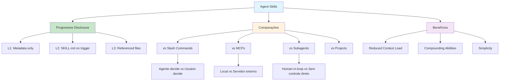

# [Claude Agent Skills - Kenny Liao](/blog/claude-agent-skills---kenny-liao)

> [!compass] **[IA](/blog/moc---inteligncia-artificial)** » [Claude](/blog/claude) » Agent Skills

---

> [!info]+ Detalhes do Artigo
> **Ler:** [Claude Agent Skills](https://share.note.sx/8k50udm8#ME3MD6walWogaQZxAVIdsAMaYPFQvw694zbFb622c0Y)
> **Fonte:** Note.sx (Nota pessoal compartilhada)
> **Autor:** [Kenny Liao](/blog/kenny-liao)
> **Tipo:** Análise comparativa e tutorial prático

> [!abstract]+ Materiais Complementares
>
> **Artigos Relacionados**
> - [Equipping Agents for the Real World with Agent Skills](/blog/equipping-agents-for-the-real-world-with-agent-skills) - Blog de engenharia Anthropic
> - [Introducing Agent Skills](/blog/introducing-agent-skills) - Anúncio oficial
> - [Agent Skills - Overview](/blog/agent-skills---overview) - Documentação técnica
>
> **Repositórios**
> - [Anthropic Skills Repo](https://github.com/anthropics/claude-cookbooks/tree/main/skills) - Skills oficiais
> - [Awesome Claude Skills](https://github.com/anthropics/awesome-claude-skills) - Skills da comunidade
> - [Skills Cookbook](https://github.com/anthropics/claude-cookbooks/tree/main/skills) - Exemplos de código

> [!tip]- Léxico
>
> - **Progressive Disclosure**: Padrão de design onde apenas metadados são carregados inicialmente, contexto adicional é lido conforme necessário
> - **SKILL.md**: Arquivo obrigatório com instruções da skill e frontmatter YAML
> - **skill-creator**: Skill built-in do Claude para criar novas skills interativamente
> - **Subagents**: Agentes secundários invocados via Task tool para tarefas específicas

> [!question]- Pontos para Aprofundar
>
> - **Quando usar Skills vs MCPs?**
>     - Skills: contexto local, simples de implementar, progressive disclosure
>     - MCPs: acesso externo, APIs, infraestrutura compartilhada
> - **Como skills podem alavancar outras skills?**
>     - Compounding abilities - ex: financial-modeling usa excel skill

> [!robot]- Sugestões Complementares
>
> - **Exercícios Práticos:**
>     - **Criar thumbnail skill:** Seguir exemplo do Kenny para Nanobanana
>     - **Migrar slash command:** Converter um slash command existente em skill
> - **Ferramentas Úteis:**
>     - **skill-creator** - Skill built-in para gerar novas skills
>     - **Nanobanana** - Modelo de geração de imagens para thumbnails

---

## Resumo

Kenny Liao apresenta uma análise profunda e comparativa de Agent Skills, explicando como se diferenciam de Projects, Slash Commands, MCPs e Subagents. O insight central é o padrão de **progressive disclosure** - apenas metadados são carregados no system prompt, o resto é lido dinamicamente. Inclui exemplo prático real de uma skill de geração de thumbnails para YouTube usando Nanobanana.

**Definição central:**
- **Agent Skills** = Pastas com instruções e contexto que agentes descobrem e carregam dinamicamente
- **Diferencial** = Progressive disclosure + simplicidade de implementação + compounding abilities

---

## Principais Conceitos

### Conceito 1: Anatomia de uma Skill

> Skills são apenas uma pasta com um arquivo de instrução SKILL.md e contexto adicional opcional.

Estrutura mínima e expandida:

```
my-skill/
├── SKILL.md              # Obrigatório
├── scripts/
│   └── validate.py       # Scripts executáveis
├── additional_context.md # Contexto adicional
└── data.csv              # Dados de referência
```

O SKILL.md requer frontmatter YAML mínimo:

```yaml
---
name: Your Skill Name
description: Brief description of what this Skill does and when to use it
---

# Your Skill Name

## Instructions
Provide clear, step-by-step guidance for Claude.

If you want to do X, then you *MUST* also read:
`/path/to/additional_context.md`

## Examples
Show concrete examples of using this Skill.
```

### Conceito 2: Progressive Disclosure

O padrão de design core do valor de Agent Skills:

| Fase | O que carrega | Quando |
|:-----|:--------------|:-------|
| **Inicial** | Apenas name + description | System prompt startup |
| **Ativação** | SKILL.md completo | Quando Claude decide usar |
| **Expansão** | Arquivos referenciados | Conforme apontados no SKILL.md |

**Benefícios:**
- Token efficient - mínimo contexto inicial
- Quality context - apenas tokens necessários carregados
- Potencialmente infinito - Claude pode continuar lendo arquivos encadeados

### Conceito 3: Skills vs Alternativas

Kenny compara Skills com outras abordagens:

| Aspecto | Skills | Slash Commands | MCPs | Subagents |
|:--------|:-------|:---------------|:-----|:----------|
| **Quem decide usar** | Agente | Usuário | Agente | Agente (via Task) |
| **Contexto** | Progressive | Fixo | Schema completo | Separado |
| **Execução** | Local, mesmo processo | Local | Externa, servidor | Processo separado |
| **Complexidade** | Baixa (apenas .md) | Baixa | Alta (infraestrutura) | Média |
| **Human-in-the-loop** | Sim | Sim | Sim | Não direto |

---

## Detalhamento

### Seção 1: Skills vs Slash Commands

**Similaridade:** Ambos são prompts pré-definidos otimizados para um objetivo.

**Diferença chave:**
- Slash commands: **usuário** decide quando usar e fornece input args
- Skills: **agente** decide quando usar E quais input args

> [!example] Caso Prático - Thumbnail
> Kenny tinha um slash command para criar thumbnails com Nanobanana. Precisava manualmente reunir contexto (título, descrição, imagens de referência).
>
> Com skill, o agente pessoal entende o projeto YouTube, vê qual é o próximo vídeo, usa MCPs para analisar analytics, e forma seu próprio contexto. Remove Kenny do processo.

### Seção 2: Skills vs MCPs

**Similaridades:**
- Tools, prompts e contexto empacotados juntos
- MCPs podem fazer tudo que skills fazem

**Diferenças críticas:**

| Skills | MCPs |
|:-------|:-----|
| Self-contained, rodam localmente | Rodam externamente em servidor |
| Apenas markdown + scripts | Requer infraestrutura MCP |
| Progressive disclosure | Schema completo no system prompt |
| Simples de implementar/manter/debugar | Mais complexo |

> [!warning] Quando usar MCPs ainda
> - Você não pode colocar o Github MCP inteiro numa skill
> - Remote MCP servers têm benefício de um único maintainer
> - Integrações complexas com APIs externas

### Seção 3: Skills vs Subagents

**Subagents são como tools** - Claude invoca via Task tool com prompt de input.

**Limitações de subagents:**
- Não são o agente principal - você não interage diretamente
- Sem steering direto - não há human-in-the-loop
- Contexto separado - precisa passar contexto relevante explicitamente

> [!quote] Regra de Ouro do Kenny
> "Se posso resolver com um agente, prefiro isso. Só uso subagents ou multi-agents onde absolutamente faz sentido, como em deep research."

---

## Técnicas e Métodos

### Técnica 1: Estrutura de Skill para YouTube Thumbnails

**Conceito:** Exemplo real de skill de produção do Kenny.

**Estrutura:**

```
youtube-thumbnail/
├── SKILL.md
├── Design Requirements.md
├── Prompting Guidelines.md
├── Thumbnail Templates.md
└── (referências a diretórios locais)
```

**SKILL.md highlights:**

```yaml
---
name: youtube-thumbnail
description: "Skill for creating and editing Youtube thumbnails optimized for conversion."
---
```

**Seções obrigatórias no SKILL.md:**
1. File Structure - lista todos os arquivos e paths relevantes
2. REQUIRED READING - documentos mandatórios antes de agir
3. Design Requirements - regras para high CTR thumbnails
4. Prompting Guidelines - best practices para Nanobanana

> [!tip] Quick Win
> Use linguagem forte como "🚨 REQUIRED READING 🚨" e "ABSOLUTELY CRITICAL" para garantir que Claude leia contexto importante.

### Técnica 2: Otimizar Skills com Feedback

**Conceito:** Iterar skills como qualquer código "vibe-coded".

**Implementação:**
1. Skill falha em uso real
2. Diga ao agente: "uso da skill falhou porque X"
3. Mostre o failure mode se possível
4. Peça para revisar a skill completa e identificar ponto de falha
5. Solicite sugestões de melhoria

### Técnica 3: Compounding Abilities

**Conceito:** Skills podem alavancar outras skills.

**Exemplo:**
- `financial-modeling` skill usa a skill `excel` de nível mais baixo
- Contexto mínimo porque ambas usam progressive disclosure
- Capacidades compostas sem sobrecarga de contexto

---

## Mapa de Conceitos

O diagrama ilustra a comparação entre Skills e alternativas, mostrando o diferencial de progressive disclosure e os benefícios resultantes.



---

## Insights & Aprendizados

**O que funcionou bem (casos documentados):**
- **Thumbnail skill do Kenny**: Removeu ele do processo de criação de thumbnails
- **Progressive disclosure**: Permite muitas mais skills sem penalidade de tokens
- **Compounding**: financial-modeling + excel skill funcionam juntas

**O que posso adaptar:**
- **Migrar slash commands para skills**: Converter workflows fixos em skills autônomas
- **Linguagem enfática**: Usar "REQUIRED READING" e "ABSOLUTELY CRITICAL"
- **Estrutura File Structure**: Listar todos os arquivos relevantes no início do SKILL.md

**Ideias para aplicar:**
- **Skill de notas Obsidian**: Criar skill que gera notas seguindo meus templates
- **Skill de code review**: Empacotar meus critérios de qualidade
- **Iterar com feedback**: Usar falhas para melhorar skills progressivamente

---

## Recursos Adicionais

**Documentação Oficial:**
- [Skills News Announcement](https://claude.com/blog/skills) - Anúncio geral
- [Skills Engineering Blog Post](https://www.anthropic.com/engineering/equipping-agents-for-the-real-world-with-agent-skills) - Deep dive técnico
- [Developer Docs - Agent Skills](https://platform.claude.com/docs/en/agents-and-tools/agent-skills/overview) - Documentação geral
- [Claude Code - Agent Skills](https://code.claude.com/docs/en/skills) - Uso com Claude Code

**Repositórios:**
- [Anthropic Skills Repo](https://github.com/anthropics/claude-cookbooks/tree/main/skills) - Skills default do Claude
- [Github Skills Cookbook](https://github.com/anthropics/claude-cookbooks/tree/main/skills) - Exemplos de código
- [Awesome Claude Skills](https://github.com/anthropics/awesome-claude-skills) - Skills da comunidade

**FAQ e Análises:**
- [Anthropic Support - What are skills?](https://support.claude.com/en/articles/12512176-what-are-skills)
- [Anthropic Support - Using Skills in Claude](https://support.claude.com/en/articles/12512180-using-skills-in-claude)
- [Simon Willison - Claude Skills](https://simonwillison.net) - Análise e opinião

---

## Propriedades da nota

> [!note]- Propriedades Gerais do Obsidian
>
>> **Identificação**
>
> | Campo      | Valor                    |
> |:-----------|:-------------------------|
> | **Título** | `INPUT[text:titulo]`     |
>
>> **Conexões**
>
> | Campo           | Valor                                                                 |
> |:----------------|:----------------------------------------------------------------------|
> | **Pai**         | `INPUT[suggester(optionQuery("")):pai]`                               |
> | **Coleção**     | `INPUT[inlineSelect(option(financeiro, Financeiro), option(growth, Growth), option(ia, IA), option(lideranca, Liderança), option(marketing, Marketing), option(negocios, Negócios), option(produtividade, Produtividade), option(pkm, PKM), option(saas, SaaS), option(tecnologia, Tecnologia), option(vendas, Vendas)):colecao]` |
> | **Área**        | `INPUT[suggester(optionQuery("Esforços/Áreas")):area]`                         |
> | **Projeto**     | `INPUT[suggester(optionQuery("#projeto")):projeto]`                   |
> | **Autor**       | `INPUT[suggester(optionQuery("Atlas/Pessoas")):pessoa]`                      |
> | **Relacionado** | `INPUT[inlineListSuggester(optionQuery(""), useLinks(true)):relacionado]` |
>
>> **Classificação**
>
> | Campo      | Valor                                                                 |
> |:-----------|:----------------------------------------------------------------------|
> | **Tipo**   | `INPUT[inlineSelect(option(atomica, Atômica), option(aula, Aula), option(artigo, Artigo), option(checklist, Checklist), option(curso, Curso), option(dashboard, Dashboard), option(framework, Framework), option(livro, Livro), option(moc, MOC), option(newsletter, Newsletter), option(pessoa, Pessoa), option(prompt, Prompt), option(template, Template Obsidian), option(tutorial, Tutorial), option(video_youtube, Vídeo Youtube)):tipo_nota]` |
> | **Tags**   | `INPUT[inlineList:tags]`                                              |
> | **Status** | `INPUT[inlineSelect(option(nao_iniciado, ⬜ Não Iniciado), option(em_andamento, 🔄 Em Andamento), option(concluido, ✅ Concluído), option(pausado, ⏸️ Pausado), option(cancelado, ❌ Cancelado)):status]` |

> [!note]- Propriedades do Artigo
>
> | Campo            | Valor                          |
> |:-----------------|:-------------------------------|
> | **URL**          | `INPUT[text(placeholder(https://...)):url_artigo]`  |
> | **Fonte**        | `INPUT[text:fonte]`  |
> | **Autor**        | `INPUT[text:autor]`  |
> | **Data Publicação** | `INPUT[date:data_publicacao]`  |

