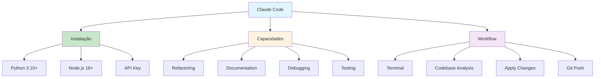

# [Claude Code Tutorial - Datacamp](/blog/claude-code-tutorial---datacamp)

> [!compass] **[MyMess](/blog/moc---projeto-mymess)** » [Estudos](/blog/dashboard---estudos-mymess) » Engenharia de Contexto

---

> [!info]+ Detalhes do Artigo
> **Ler:** [Claude Code: A Guide With Practical Examples](https://www.datacamp.com/tutorial/claude-code)
> **Fonte:** [Datacamp](/blog/datacamp) (Tutorial)
> **Autores:** Datacamp Team
> **Publicado:** 28 de Fevereiro de 2025

> [!abstract]+ Materiais Complementares
>
> **Tutoriais Relacionados Datacamp**
> - [Claude Opus 4 with Claude Code](https://www.datacamp.com/tutorial/claude-opus-4-claude-code) - Demo project completo
> - [Claude Agent SDK Tutorial](https://www.datacamp.com/tutorial/how-to-use-claude-agent-sdk) - SDK para criar agentes
> - [Claude Skills Tutorial](https://www.datacamp.com/tutorial/claude-skills) - Módulos customizados
> - [Model Context Protocol Tutorial](https://www.datacamp.com/tutorial/mcp-model-context-protocol) - Guia MCP
>
> **Documentação Oficial Anthropic**
> - [Claude Code Best Practices](https://www.anthropic.com/engineering/claude-code-best-practices) - Dicas oficiais
> - [Code with Claude 2025](https://www.anthropic.com/events/code-with-claude-2025) - Evento Anthropic
>
> **Requisitos**
> - Python 3.10+
> - Node.js 18+
> - NPM package

> [!tip]- Léxico
>
> **Ferramentas e Recursos**
> - **Claude Code**: Ferramenta CLI (Command Line Interface) para agentic coding que opera direto no terminal
>
> **Tecnologia e IA**
> - **Agentic Coding**: Paradigma onde IA entende o codebase inteiro e executa tarefas de desenvolvimento autonomamente
>
> **Técnicas e Estratégias**
> - **Terminal-First**: Abordagem que prioriza interface de linha de comando sobre GUIs
>
> **Outros Conceitos**
> - **Codebase Understanding**: Capacidade de compreender toda a estrutura do projeto
> [!question]- Pontos para Aprofundar (Sugestão da IA)
>
> - **Como o Claude Code entende o codebase inteiro?**
>     - Investigar mecanismo de indexação e contexto
> - **Qual a diferença entre Claude Code e GitHub Copilot?**
>     - Comparar abordagens: terminal vs IDE integrado
> - **Como configurar Claude Code em projetos grandes?**
>     - Explorar configurações de contexto e limites

> [!robot]- Sugestões Complementares
>
> - **Leituras Recomendadas:**
>     - Anthropic Engineering Blog sobre Claude Code
>     - Comparativos de ferramentas agentic coding
> - **Ferramentas Úteis:**
>     - **WSL** (Windows Subsystem for Linux) para Windows
>     - **Claude Agent SDK** para estender funcionalidades
> - **Exercícios Práticos:**
>     - Refatorar arquivo de projeto open source
>     - Adicionar documentação a código existente
>     - Criar projeto ML end-to-end com Claude Code

---

## Resumo

Tutorial prático sobre **Claude Code**, a ferramenta CLI da Anthropic para **agentic coding**. O tutorial demonstra como usar Claude Code para refatorar, documentar e debugar código diretamente no terminal, com exemplos práticos usando o repositório supabase-py.

**Ponto central:** Claude Code entende o **codebase inteiro**, simplificando workflows de desenvolvimento.

---

## Principais Conceitos

### O que é Claude Code

> Claude Code é uma ferramenta de coding agentic que opera diretamente no terminal, auxiliando desenvolvedores em refatoração, documentação e debugging de código de forma eficiente.

A tabela abaixo resume as informações principais.

| Aspecto | Descrição |
|:--------|:----------|
| **Tipo** | CLI (Command Line Interface) |
| **Modelo** | Claude Opus 4 / Sonnet 4.5 |
| **Acesso** | Via API Anthropic |
| **Diferencial** | Entende codebase completo |

### Capacidades Principais

A tabela a seguir detalha os campos e seus valores.

| Capacidade | Descrição |
|:-----------|:----------|
| **Refactoring** | Melhora legibilidade e manutenibilidade |
| **Documentation** | Adiciona comentários e docstrings |
| **Debugging** | Identifica e corrige problemas |
| **Testing** | Gera testes para código |
| **Git Integration** | Push direto para GitHub |

---

## Detalhamento

### Requisitos de Instalação

Os dados abaixo mostram a estrutura e configurações.

| Requisito | Versão |
|:----------|:-------|
| **Python** | 3.10+ |
| **Node.js** | 18+ |
| **NPM** | Último |
| **API Key** | Anthropic |

### Setup no Windows

1. Instalar WSL (Windows Subsystem for Linux)
2. Configurar ambiente Python e Node.js
3. Instalar Claude Code via NPM
4. Configurar API key da Anthropic

### Workflow Típico

1. **Navegar** para diretório do projeto
2. **Iniciar** Claude Code no terminal
3. **Solicitar** tarefa (refactoring, docs, debug)
4. **Revisar** mudanças propostas
5. **Aprovar** e aplicar alterações
6. **Push** para repositório (opcional)

### Exemplo Prático do Tutorial

O tutorial demonstra refatoração do repositório **supabase-py**:
- Melhoria de legibilidade do código
- Adição de documentação e comentários inline
- Melhor compreensão do codebase existente

---

## Mapa de Conceitos

O diagrama abaixo ilustra o fluxo do processo, mostrando as etapas e suas conexões.

---

## Insights & Aprendizados

**O que funcionou bem:**
- Abordagem terminal-first para desenvolvedores
- Compreensão do codebase inteiro como diferencial
- Integração direta com Git para workflow completo
- Exemplos práticos com repositório real (supabase-py)

**O que posso adaptar para o MyMess:**
- **CLI para agentes**: Desenvolver interface de terminal para agentes MyMess
- **Codebase understanding**: Aplicar conceito para análise de projetos de clientes
- **Workflow integrado**: Refactoring → Docs → Testing → Git

**Ideias para aplicar:**
- Testar Claude Code em projetos MyMess
- Comparar com GitHub Copilot para escolher ferramenta padrão
- Criar guia de setup para equipe

---

## Recursos Adicionais

- [Claude Code - Datacamp Tutorial](https://www.datacamp.com/tutorial/claude-code)
- [Claude Opus 4 Tutorial](https://www.datacamp.com/tutorial/claude-opus-4-claude-code)
- [Claude Agent SDK](https://www.datacamp.com/tutorial/how-to-use-claude-agent-sdk)
- [Anthropic Best Practices](https://www.anthropic.com/engineering/claude-code-best-practices)
- [Model Context Protocol](https://www.datacamp.com/tutorial/mcp-model-context-protocol)

---

## Propriedades da nota

> [!note]- Propriedades Gerais do Obsidian
>
>> **Identificação**
>
> | Campo      | Valor                    |
> |:-----------|:-------------------------|
> | **Título** | `INPUT[text:titulo]`     |
>
>> **Conexões**
>
> | Campo           | Valor                                                                 |
> |:----------------|:----------------------------------------------------------------------|
> | **Pai**         | `INPUT[suggester(optionQuery("")):pai]`                               |
> | **Coleção**     | `INPUT[inlineSelect(option(financeiro, Financeiro), option(growth, Growth), option(ia, IA), option(lideranca, Liderança), option(marketing, Marketing), option(negocios, Negócios), option(produtividade, Produtividade), option(pkm, PKM), option(saas, SaaS), option(tecnologia, Tecnologia), option(vendas, Vendas)):colecao]` |
> | **Área**        | `INPUT[suggester(optionQuery("Esforços/Áreas")):area]`                         |
> | **Projeto**     | `INPUT[suggester(optionQuery("#projeto")):projeto]`                   |
> | **Autor**       | `INPUT[suggester(optionQuery("Atlas/Pessoas")):pessoa]`                      |
> | **Relacionado** | `INPUT[inlineListSuggester(optionQuery(""), useLinks(true)):relacionado]` |
>
>> **Classificação**
>
> | Campo      | Valor                                                                 |
> |:-----------|:----------------------------------------------------------------------|
> | **Tipo**   | `INPUT[inlineSelect(option(atomica, Atômica), option(aula, Aula), option(artigo, Artigo), option(checklist, Checklist), option(curso, Curso), option(dashboard, Dashboard), option(framework, Framework), option(livro, Livro), option(moc, MOC), option(newsletter, Newsletter), option(pessoa, Pessoa), option(prompt, Prompt), option(template, Template Obsidian), option(tutorial, Tutorial), option(video_youtube, Vídeo Youtube)):tipo_nota]` |
> | **Tags**   | `INPUT[inlineList:tags]`                                              |
> | **Status** | `INPUT[inlineSelect(option(nao_iniciado, ⬜ Não Iniciado), option(em_andamento, 🔄 Em Andamento), option(concluido, ✅ Concluído), option(pausado, ⏸️ Pausado), option(cancelado, ❌ Cancelado)):status]` |
>
>> **Temporal**
>
> | Campo          | Valor                      |
> |:---------------|:---------------------------|
> | **Criado**     | `INPUT[date:data_criado]`       |
> | **Atualizado** | `INPUT[date:data_atualizado]`   |
>
>> **Visual**
>
> | Campo         | Valor                                                            |
> |:--------------|:-----------------------------------------------------------------|
> | **Visual da Nota** | `INPUT[inlineSelect(option(normal, Normal), option(wide-page, Wide Page), option(dashboard, Dashboard)):cssclasses]` |
> | **Modo Leitura** | `INPUT[toggle(onValue(preview), offValue(source)):obsidianUIMode]` |
> | **Imagem Destaque**    | `INPUT[text:imagem_destaque]`                                             |
>
>> **Compartilhar link**
>
> | Campo          | Valor                                               |
> |:---------------|:----------------------------------------------------|
> | **Share Link** | `INPUT[text(placeholder(https://...)):share_link]`  |
> | **Share Upd.** | `INPUT[text:share_updated]`                         |

> [!note]- Propriedades SaaS
>
> | Campo             | Valor                                                              |
> |:------------------|:-------------------------------------------------------------------|
> | **Mostrar Bloco** | `INPUT[toggle(onValue(true), offValue(false)):mostrar_bloco_saas]` |
> | **Status SaaS**   | `INPUT[toggle(onValue(true), offValue(false)):status_saas]`        |

> [!note]- Propriedades do Artigo
>
> | Campo            | Valor                          |
> |:-----------------|:-------------------------------|
> | **URL**          | `INPUT[text(placeholder(https://...)):url_artigo]`  |
> | **Fonte**        | `INPUT[text:fonte]`  |
> | **Autor**        | `INPUT[text:autor]`  |
> | **Data Publicação** | `INPUT[date:data_publicacao]`  |
> | **Tipo Conteúdo** | `INPUT[inlineSelect(option(educacional, Educacional), option(curadoria, Curadoria), option(historia, História Pessoal), option(listicle, Lista), option(contrarian, Opinião Contrária), option(tutorial, Tutorial), option(entrevista, Entrevista), option(analise, Análise), option(estudo_de_caso, Estudo de Caso), option(lancamento, Lançamento), option(opiniao, Opinião), option(outro, Outro)):tipo_conteudo]`  |

