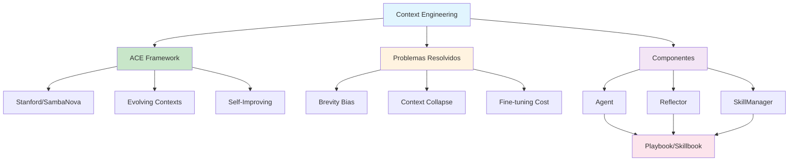

# [Complete Guide Context Engineering Framework - Towards AI](/blog/complete-guide-context-engineering-framework---towards-ai)

> [!compass] **[MyMess](/blog/moc---projeto-mymess)** » [Estudos](/blog/dashboard---estudos-mymess) » Engenharia de Contexto

---

> [!info]+ Detalhes do Artigo
> **Ler:** [The Complete Guide to Context Engineering Framework for Large Language Models](https://pub.towardsai.net/the-complete-guide-to-context-engineering-framework-for-large-language-models-38df7b6a1ec5)
> **Fonte:** [Towards AI](/blog/towards-ai) (Guia Completo)
> **Autores:** Towards AI Team
> **Publicado:** 15 de Outubro de 2025

> [!abstract]+ Materiais Complementares
>
> **Pesquisa Acadêmica - ACE Framework**
> - [arXiv:2510.04618](https://arxiv.org/abs/2510.04618) - Paper original Stanford/SambaNova/UC Berkeley
> - [HuggingFace Papers](https://huggingface.co/papers/2510.04618) - Paper page
>
> **Artigos Relacionados**
> - [Agentic Context Engineering - DEV Community](https://dev.to/kayba/agentic-context-engineering-a-complete-guide-to-stanfords-self-learning-agent-framework-2p02) - Guia completo
> - [Sundeep Teki - ACE Guide 2025](https://www.sundeepteki.org/blog/agentic-context-engineering) - Para AI Leaders
> - [MarkTechPost - ACE Overview](https://www.marktechpost.com/2025/10/10/agentic-context-engineering-ace-self-improving-llms-via-evolving-contexts-not-fine-tuning/) - Self-improving LLMs
>
> **Implementação Open Source**
> - [GitHub - kayba-ai/agentic-context-engine](https://github.com/kayba-ai/agentic-context-engine) - Implementação do framework ACE

> [!tip]- Léxico
>
> **Tecnologia e IA**
> - **Brevity Bias**: Tendência de descartar insights de domínio em favor de resumos concisos
> - **Delta Updates**: Atualizações incrementais que preservam histórico útil
>
> **Conceitos Fundamentais**
> - **ACE (Agentic Context Engineering)**: Framework de Stanford para LLMs que evoluem contextos ao invés de atualizar pesos
>
> **Conteúdo e Criação**
> - **Context Collapse**: Erosão de detalhes quando contexto é reescrito iterativamente
>
> **Técnicas e Estratégias**
> - **Skillbook/Playbook**: Contexto evolutivo que acumula, refina e organiza estratégias
> [!question]- Pontos para Aprofundar (Sugestão da IA)
>
> - **Como ACE previne "context collapse"?**
>     - Investigar mecanismos de grow-and-refine e delta updates
> - **Qual a diferença entre ACE e fine-tuning tradicional?**
>     - ACE adapta contextos, não pesos do modelo
> - **Como implementar os 3 roles (Agent, Reflector, SkillManager)?**
>     - Estudar arquitetura modular do framework

> [!robot]- Sugestões Complementares
>
> - **Leituras Recomendadas:**
>     - Paper original arXiv:2510.04618
>     - Anthropic Effective Context Engineering
> - **Ferramentas Úteis:**
>     - **GitHub kayba-ai/agentic-context-engine** - Implementação open source
>     - **DeepSeek-V3.1** - Modelo usado nos benchmarks
> - **Exercícios Práticos:**
>     - Implementar Agent + Reflector + SkillManager básico
>     - Testar com benchmark AppWorld

---

## Resumo

Guia completo sobre **Context Engineering Framework** para LLMs, com foco especial no **ACE (Agentic Context Engineering)** desenvolvido por Stanford/SambaNova/UC Berkeley. O framework trata contextos como **playbooks evolutivos** que acumulam e refinam estratégias através de processo modular.

**Resultado central:** ACE melhora +10.6% em agentes e +8.6% em finanças, reduzindo latência em ~82-92%.

---

## Principais Conceitos

### O que é Context Engineering

> Context engineering refere-se ao conjunto de estratégias para curar e manter o conjunto ótimo de tokens (informação) durante inferência do LLM, incluindo todas as outras informações que podem chegar lá além dos prompts.

**Escopo do Context Engineering:**
- Documentos recuperados (RAG)
- Estado do sistema
- Outputs anteriores
- Definições de ferramentas
- Memória
- Resultados de APIs externas

### ACE Framework (Stanford)

A tabela abaixo resume as informações principais.

| Componente | Função |
|:-----------|:-------|
| **Agent** | Cria plano usando skills aprendidas e executa tarefa |
| **Reflector** | Analisa o que funcionou e o que não funcionou |
| **SkillManager** | Atualiza o skillbook com novas skills baseado em reflexão |

### Problemas que ACE Resolve

A tabela a seguir detalha os campos e seus valores.

| Problema | Descrição | Solução ACE |
|:---------|:----------|:------------|
| **Brevity Bias** | Descarta insights por resumos concisos | Delta updates incrementais |
| **Context Collapse** | Erosão de detalhes em reescritas | Grow-and-refine |
| **Weight Updates** | Fine-tuning caro e lento | Evolução de contexto |

---

## Detalhamento

### Arquitetura ACE

```
Agent → Executa tarefa com skills do playbook
  ↓
Reflector → Analisa execução (sucesso/falha)
  ↓
SkillManager → Atualiza playbook com novas skills
  ↓
(loop)
```

### Resultados de Benchmark

Os dados abaixo mostram a estrutura e configurações.

| Benchmark | Resultado ACE | Comparação |
|:----------|:--------------|:-----------|
| **AppWorld** | 59.4% | vs IBM CUGA 60.3% (GPT-4.1) |
| **Agentes** | +10.6% | vs baselines fortes |
| **Finanças** | +8.6% | domínio específico |

### Ganhos de Eficiência

A tabela abaixo resume as informações principais.

| Métrica | Redução |
|:--------|:--------|
| **Adaptation Latency** | ~82-92% |
| **Rollouts/Token Cost** | ~75-84% |

### Quando Usar ACE

ACE é mais benéfico em cenários que demandam:
- **Conhecimento de domínio detalhado**
- **Uso complexo de ferramentas**
- **Estratégias específicas de ambiente**

Que vão além do que já está embutido nos pesos do modelo ou instruções simples de sistema.

---

## Mapa de Conceitos

O diagrama abaixo ilustra o fluxo do processo, mostrando as etapas e suas conexões.



---

## Insights & Aprendizados

**O que funcionou bem:**
- Framework modular com 3 roles claros
- Abordagem de "evolving contexts" vs fine-tuning
- Resultados competitivos com modelos menores (DeepSeek vs GPT-4.1)
- Redução significativa de custos (75-84%)

**O que posso adaptar para o MyMess:**
- **Arquitetura Agent/Reflector/SkillManager**: Base para agentes MyMess
- **Playbook evolutivo**: Contexto que aprende e melhora com uso
- **Delta updates**: Preservar histórico ao invés de reescrever tudo
- **Grow-and-refine**: Prevenir perda de informação

**Ideias para aplicar:**
- Implementar SkillManager para agentes MyMess
- Criar sistema de "playbooks" por cliente/domínio
- Desenvolver mecanismo de reflexão pós-execução
- Testar implementação kayba-ai/agentic-context-engine

---

## Recursos Adicionais

- [Paper Original - arXiv:2510.04618](https://arxiv.org/abs/2510.04618)
- [GitHub - Agentic Context Engine](https://github.com/kayba-ai/agentic-context-engine)
- [DEV Community - Complete Guide](https://dev.to/kayba/agentic-context-engineering-a-complete-guide-to-stanfords-self-learning-agent-framework-2p02)
- [MarkTechPost - ACE Overview](https://www.marktechpost.com/2025/10/10/agentic-context-engineering-ace-self-improving-llms-via-evolving-contexts-not-fine-tuning/)
- [Anthropic - Effective Context Engineering](https://www.anthropic.com/engineering/effective-context-engineering-for-ai-agents)
- [CodeConductor - Context Engineering Guide](https://codeconductor.ai/blog/context-engineering/)

---

## Propriedades da nota

> [!note]- Propriedades Gerais do Obsidian
>
>> **Identificação**
>
> | Campo      | Valor                    |
> |:-----------|:-------------------------|
> | **Título** | `INPUT[text:titulo]`     |
>
>> **Conexões**
>
> | Campo           | Valor                                                                 |
> |:----------------|:----------------------------------------------------------------------|
> | **Pai**         | `INPUT[suggester(optionQuery("")):pai]`                               |
> | **Coleção**     | `INPUT[inlineSelect(option(financeiro, Financeiro), option(growth, Growth), option(ia, IA), option(lideranca, Liderança), option(marketing, Marketing), option(negocios, Negócios), option(produtividade, Produtividade), option(pkm, PKM), option(saas, SaaS), option(tecnologia, Tecnologia), option(vendas, Vendas)):colecao]` |
> | **Área**        | `INPUT[suggester(optionQuery("Esforços/Áreas")):area]`                         |
> | **Projeto**     | `INPUT[suggester(optionQuery("#projeto")):projeto]`                   |
> | **Autor**       | `INPUT[suggester(optionQuery("Atlas/Pessoas")):pessoa]`                      |
> | **Relacionado** | `INPUT[inlineListSuggester(optionQuery(""), useLinks(true)):relacionado]` |
>
>> **Classificação**
>
> | Campo      | Valor                                                                 |
> |:-----------|:----------------------------------------------------------------------|
> | **Tipo**   | `INPUT[inlineSelect(option(atomica, Atômica), option(aula, Aula), option(artigo, Artigo), option(checklist, Checklist), option(curso, Curso), option(dashboard, Dashboard), option(framework, Framework), option(livro, Livro), option(moc, MOC), option(newsletter, Newsletter), option(pessoa, Pessoa), option(prompt, Prompt), option(template, Template Obsidian), option(tutorial, Tutorial), option(video_youtube, Vídeo Youtube)):tipo_nota]` |
> | **Tags**   | `INPUT[inlineList:tags]`                                              |
> | **Status** | `INPUT[inlineSelect(option(nao_iniciado, ⬜ Não Iniciado), option(em_andamento, 🔄 Em Andamento), option(concluido, ✅ Concluído), option(pausado, ⏸️ Pausado), option(cancelado, ❌ Cancelado)):status]` |
>
>> **Temporal**
>
> | Campo          | Valor                      |
> |:---------------|:---------------------------|
> | **Criado**     | `INPUT[date:data_criado]`       |
> | **Atualizado** | `INPUT[date:data_atualizado]`   |
>
>> **Visual**
>
> | Campo         | Valor                                                            |
> |:--------------|:-----------------------------------------------------------------|
> | **Visual da Nota** | `INPUT[inlineSelect(option(normal, Normal), option(wide-page, Wide Page), option(dashboard, Dashboard)):cssclasses]` |
> | **Modo Leitura** | `INPUT[toggle(onValue(preview), offValue(source)):obsidianUIMode]` |
> | **Imagem Destaque**    | `INPUT[text:imagem_destaque]`                                             |
>
>> **Compartilhar link**
>
> | Campo          | Valor                                               |
> |:---------------|:----------------------------------------------------|
> | **Share Link** | `INPUT[text(placeholder(https://...)):share_link]`  |
> | **Share Upd.** | `INPUT[text:share_updated]`                         |

> [!note]- Propriedades SaaS
>
> | Campo             | Valor                                                              |
> |:------------------|:-------------------------------------------------------------------|
> | **Mostrar Bloco** | `INPUT[toggle(onValue(true), offValue(false)):mostrar_bloco_saas]` |
> | **Status SaaS**   | `INPUT[toggle(onValue(true), offValue(false)):status_saas]`        |

> [!note]- Propriedades do Artigo
>
> | Campo            | Valor                          |
> |:-----------------|:-------------------------------|
> | **URL**          | `INPUT[text(placeholder(https://...)):url_artigo]`  |
> | **Fonte**        | `INPUT[text:fonte]`  |
> | **Autor**        | `INPUT[text:autor]`  |
> | **Data Publicação** | `INPUT[date:data_publicacao]`  |
> | **Tipo Conteúdo** | `INPUT[inlineSelect(option(educacional, Educacional), option(curadoria, Curadoria), option(historia, História Pessoal), option(listicle, Lista), option(contrarian, Opinião Contrária), option(tutorial, Tutorial), option(entrevista, Entrevista), option(analise, Análise), option(estudo_de_caso, Estudo de Caso), option(lancamento, Lançamento), option(opiniao, Opinião), option(outro, Outro)):tipo_conteudo]`  |

