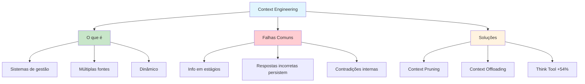

# [Context Engineering - Datacamp](/blog/context-engineering---datacamp)

> [!compass] **[MyMess](/blog/moc---projeto-mymess)** » [Estudos](/blog/dashboard---estudos-mymess) » Engenharia de Contexto

---

> [!info]+ Detalhes do Artigo
> **Ler:** [Context Engineering: A Guide With Examples](https://www.datacamp.com/blog/context-engineering)
> **Fonte:** [Datacamp](/blog/datacamp) (Blog)
> **Autores:** Datacamp Team
> **Publicado:** 15 de Junho de 2025

> [!abstract]+ Materiais Complementares
>
> **Tutoriais Relacionados Datacamp**
> - [Model Context Protocol Tutorial](https://www.datacamp.com/tutorial/mcp-model-context-protocol) - Guia MCP com projeto demo
> - [Claude Code Tutorial](https://www.datacamp.com/tutorial/claude-code) - Agentic coding
>
> **Ferramentas Mencionadas**
> - [Anthropic Think Tool](https://docs.anthropic.com) - Ferramenta de "scratchpad" para contexto
>
> **Conceitos Relacionados**
> - Context Pruning
> - Context Offloading

> [!tip]- Léxico
>
> **Ferramentas e Recursos**
> - **Context Engineering**: Construir sistemas que gerenciam fluxo de informação ao longo do tempo, não apenas prompts individuais
> - **Context Window**: Janela que comporta histórico de conversa, dados do usuário, documentos externos e ferramentas
>
> **Tecnologia e IA**
> - **Context Pruning**: Remoção de informações desatualizadas ou conflitantes conforme novos dados chegam
>
> **Conteúdo e Criação**
> - **Context Offloading**: Dar ao modelo espaço separado para processar informação sem poluir contexto principal
> [!question]- Pontos para Aprofundar (Sugestão da IA)
>
> - **Como implementar context pruning na prática?**
>     - Investigar critérios para remover informação obsoleta
> - **Qual o impacto do "think tool" da Anthropic?**
>     - 54% de melhoria em benchmarks de agentes especializados
> - **Como balancear contexto suficiente vs excesso de informação?**
>     - Estudar técnicas de priorização

> [!robot]- Sugestões Complementares
>
> - **Leituras Recomendadas:**
>     - Anthropic Engineering Blog sobre Think Tool
>     - LangChain documentation sobre context management
> - **Ferramentas Úteis:**
>     - **Anthropic Think Tool** - Scratchpad para processamento
>     - **LangChain Memory** - Gestão de contexto
> - **Exercícios Práticos:**
>     - Implementar context pruning em chatbot
>     - Testar impacto de context offloading em agente

---

## Resumo

Guia abrangente do Datacamp sobre **Context Engineering**, explicando o que é, como funciona, quais são as **falhas comuns de contexto** e como mitigá-las. O artigo posiciona context engineering como a próxima fase do desenvolvimento de IA.

**Definição central:** Context engineering foca em criar **sistemas que gerenciam fluxo de informação ao longo do tempo**, não apenas prompts individuais.

---

## Principais Conceitos

### Context Engineering vs Prompt Engineering

A tabela abaixo resume as informações principais.

| Prompt Engineering | Context Engineering |
|:-------------------|:--------------------|
| Instruções para tarefa única | Sistemas que gerenciam informação |
| "Escreva um email profissional" | Bot de atendimento com histórico, dados da conta, múltiplas interações |
| Estático | Dinâmico ao longo do tempo |
| Foco no prompt | Foco no ambiente de informação |

### O Que o Sistema Faz

O sistema de context engineering:
- Coleta detalhes relevantes de múltiplas fontes
- Organiza dentro da janela de contexto do modelo
- Junta histórico de conversa, dados do usuário, documentos externos e ferramentas
- Formata para o modelo trabalhar efetivamente

---

## Detalhamento

### Falhas Comuns de Contexto

**Problema:** Quando informação chega em estágios, o contexto montado contém tentativas iniciais (incorretas) do modelo de responder antes de ter toda a informação. Essas respostas incorretas ficam no contexto e afetam respostas finais.

### Soluções

A tabela a seguir detalha os campos e seus valores.

| Técnica | Descrição | Benefício |
|:--------|:----------|:----------|
| **Context Pruning** | Remover informação desatualizada ou conflitante | Evita contradições |
| **Context Offloading** | Espaço separado para processar (scratchpad) | 54% melhoria em benchmarks |

### Anthropic Think Tool

O "think tool" da Anthropic dá aos modelos um **workspace separado** para processar informação sem poluir o contexto principal. Esta abordagem de scratchpad:
- Previne contradições internas de afetar raciocínio
- Melhora 54% em benchmarks de agentes especializados

---

## Mapa de Conceitos

O diagrama abaixo ilustra o fluxo do processo, mostrando as etapas e suas conexões.

---

## Insights & Aprendizados

**O que funcionou bem:**
- Distinção clara entre prompt engineering e context engineering
- Explicação prática de falhas de contexto e soluções
- Dados concretos (54% melhoria com think tool)
- Exemplos comparativos (email vs bot de atendimento)

**O que posso adaptar para o MyMess:**
- **Context Pruning**: Implementar em agentes que mantêm histórico
- **Context Offloading**: Usar scratchpad para raciocínio complexo
- **Gestão de contexto**: Criar sistema para múltiplas fontes de informação

**Ideias para aplicar:**
- Implementar mecanismo de pruning automático para agentes MyMess
- Testar impacto de scratchpad em qualidade de respostas
- Criar dashboard de health do contexto

---

## Recursos Adicionais

- [Datacamp - Context Engineering Guide](https://www.datacamp.com/blog/context-engineering)
- [Datacamp - Model Context Protocol](https://www.datacamp.com/tutorial/mcp-model-context-protocol)
- [Anthropic Documentation](https://docs.anthropic.com)

---

## Propriedades da nota

> [!note]- Propriedades Gerais do Obsidian
>
>> **Identificação**
>
> | Campo      | Valor                    |
> |:-----------|:-------------------------|
> | **Título** | `INPUT[text:titulo]`     |
>
>> **Conexões**
>
> | Campo           | Valor                                                                 |
> |:----------------|:----------------------------------------------------------------------|
> | **Pai**         | `INPUT[suggester(optionQuery("")):pai]`                               |
> | **Coleção**     | `INPUT[inlineSelect(option(financeiro, Financeiro), option(growth, Growth), option(ia, IA), option(lideranca, Liderança), option(marketing, Marketing), option(negocios, Negócios), option(produtividade, Produtividade), option(pkm, PKM), option(saas, SaaS), option(tecnologia, Tecnologia), option(vendas, Vendas)):colecao]` |
> | **Área**        | `INPUT[suggester(optionQuery("Esforços/Áreas")):area]`                         |
> | **Projeto**     | `INPUT[suggester(optionQuery("#projeto")):projeto]`                   |
> | **Autor**       | `INPUT[suggester(optionQuery("Atlas/Pessoas")):pessoa]`                      |
> | **Relacionado** | `INPUT[inlineListSuggester(optionQuery(""), useLinks(true)):relacionado]` |
>
>> **Classificação**
>
> | Campo      | Valor                                                                 |
> |:-----------|:----------------------------------------------------------------------|
> | **Tipo**   | `INPUT[inlineSelect(option(atomica, Atômica), option(aula, Aula), option(artigo, Artigo), option(checklist, Checklist), option(curso, Curso), option(dashboard, Dashboard), option(framework, Framework), option(livro, Livro), option(moc, MOC), option(newsletter, Newsletter), option(pessoa, Pessoa), option(prompt, Prompt), option(template, Template Obsidian), option(tutorial, Tutorial), option(video_youtube, Vídeo Youtube)):tipo_nota]` |
> | **Tags**   | `INPUT[inlineList:tags]`                                              |
> | **Status** | `INPUT[inlineSelect(option(nao_iniciado, ⬜ Não Iniciado), option(em_andamento, 🔄 Em Andamento), option(concluido, ✅ Concluído), option(pausado, ⏸️ Pausado), option(cancelado, ❌ Cancelado)):status]` |
>
>> **Temporal**
>
> | Campo          | Valor                      |
> |:---------------|:---------------------------|
> | **Criado**     | `INPUT[date:data_criado]`       |
> | **Atualizado** | `INPUT[date:data_atualizado]`   |
>
>> **Visual**
>
> | Campo         | Valor                                                            |
> |:--------------|:-----------------------------------------------------------------|
> | **Visual da Nota** | `INPUT[inlineSelect(option(normal, Normal), option(wide-page, Wide Page), option(dashboard, Dashboard)):cssclasses]` |
> | **Modo Leitura** | `INPUT[toggle(onValue(preview), offValue(source)):obsidianUIMode]` |
> | **Imagem Destaque**    | `INPUT[text:imagem_destaque]`                                             |
>
>> **Compartilhar link**
>
> | Campo          | Valor                                               |
> |:---------------|:----------------------------------------------------|
> | **Share Link** | `INPUT[text(placeholder(https://...)):share_link]`  |
> | **Share Upd.** | `INPUT[text:share_updated]`                         |

> [!note]- Propriedades SaaS
>
> | Campo             | Valor                                                              |
> |:------------------|:-------------------------------------------------------------------|
> | **Mostrar Bloco** | `INPUT[toggle(onValue(true), offValue(false)):mostrar_bloco_saas]` |
> | **Status SaaS**   | `INPUT[toggle(onValue(true), offValue(false)):status_saas]`        |

> [!note]- Propriedades do Artigo
>
> | Campo            | Valor                          |
> |:-----------------|:-------------------------------|
> | **URL**          | `INPUT[text(placeholder(https://...)):url_artigo]`  |
> | **Fonte**        | `INPUT[text:fonte]`  |
> | **Autor**        | `INPUT[text:autor]`  |
> | **Data Publicação** | `INPUT[date:data_publicacao]`  |
> | **Tipo Conteúdo** | `INPUT[inlineSelect(option(educacional, Educacional), option(curadoria, Curadoria), option(historia, História Pessoal), option(listicle, Lista), option(contrarian, Opinião Contrária), option(tutorial, Tutorial), option(entrevista, Entrevista), option(analise, Análise), option(estudo_de_caso, Estudo de Caso), option(lancamento, Lançamento), option(opiniao, Opinião), option(outro, Outro)):tipo_conteudo]`  |

