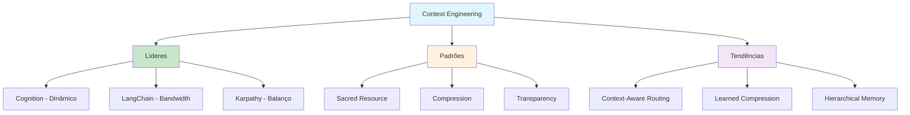

# [Context Engineering - RunDataRun](/blog/context-engineering---rundatarun)

> [!compass] **[MyMess](/blog/moc---projeto-mymess)** » [Estudos](/blog/dashboard---estudos-mymess) » Engenharia de Contexto

---

> [!info]+ Detalhes do Artigo
> **Ler:** [Context Engineering](https://rundatarun.io/p/context-engineering)
> **Fonte:** [RunDataRun](/blog/rundatarun) (Newsletter)
> **Autores:** Justin Johnson
> **Publicado:** 27 de Junho de 2025

> [!abstract]+ Materiais Complementares
>
> **Citações de Líderes da Indústria**
> - **Walden Yan** - Cognition (Devin AI)
> - **Lance Martin** - LangChain
> - **Andrej Karpathy** - ex-Tesla/OpenAI
>
> **Ferramentas Mencionadas**
> - [LangGraph](https://langchain.com/langgraph) - Visibilidade e debugging de agentes
>
> **Conceitos-Chave**
> - Context as OS RAM
> - Intelligent Compression
> - Context-Aware Routing

> [!tip]- Léxico
>
> **Ferramentas e Recursos**
> - **Context as OS RAM**: Tratar janela de contexto como sistema operacional gerenciando memória RAM
> - **Automatic Dynamic Systems**: Sistemas dinâmicos automáticos ao invés de arquiteturas multi-agente
>
> **Conteúdo e Criação**
> - **Communication Bandwidth**: Contexto como "largura de banda de comunicação" limitada
>
> **Tecnologia e IA**
> - **Intelligent Compression**: Modelos especializados para destilar históricos em decisões cruciais
> [!question]- Pontos para Aprofundar (Sugestão da IA)
>
> - **Por que Cognition prefere sistemas dinâmicos vs multi-agente?**
>     - Multi-agentes conflitam quando não têm contexto completo
> - **Como LangGraph habilita debugging de contexto?**
>     - Investigar visibilidade em decisões do agente
> - **Qual o balanço ideal de contexto segundo Karpathy?**
>     - Nem pouco demais, nem excesso irrelevante

> [!robot]- Sugestões Complementares
>
> - **Leituras Recomendadas:**
>     - Blog posts de Andrej Karpathy
>     - LangGraph documentation
> - **Ferramentas Úteis:**
>     - **LangGraph** - Visibilidade em agentes
>     - **Compression Models** - Destilação de histórico
> - **Exercícios Práticos:**
>     - Implementar compressão inteligente de contexto
>     - Criar sistema de routing context-aware

---

## Resumo

Newsletter da RunDataRun com **insights de líderes da indústria** sobre context engineering, incluindo citações de Cognition, LangChain e Andrej Karpathy. O artigo apresenta a metáfora central: tratar contexto como **sistema operacional gerenciando RAM**.

**Conclusão central:** Clareza do ambiente importa mais que prompts elaborados - o setup do sistema determina qualidade do output mais que sofisticação das instruções.

---

## Principais Conceitos

### Insights dos Líderes

A tabela abaixo resume as informações principais.

| Líder | Empresa | Insight |
|:------|:--------|:--------|
| **Walden Yan** | Cognition | Sistemas dinâmicos automáticos > multi-agente |
| **Lance Martin** | LangChain | Contexto = "largura de banda de comunicação" limitada |
| **Andrej Karpathy** | ex-Tesla/OpenAI | Balanço: nem pouco, nem excesso irrelevante |

### Padrões Práticos Emergentes

1. **Context as Sacred Resource**: Curadoria deliberada do que entra no modelo
2. **Intelligent Compression**: Modelos especializados para destilar históricos
3. **Debugging Transparency**: LangGraph permite ver exatamente o que influenciou cada decisão

---

## Detalhamento

### Cognition: Sistemas Dinâmicos vs Multi-Agente

Walden Yan da Cognition (criadores do Devin AI) argumenta:
- Mover de prompts estáticos para **sistemas dinâmicos automáticos**
- Multi-agentes **conflitam quando não têm contexto completo**
- Foco em sistemas que gerenciam contexto dinamicamente

### LangChain: Contexto como Bandwidth

Lance Martin da LangChain:
- Contexto funciona como **"largura de banda de comunicação"** limitada
- Requer **curadoria estratégica** do que entra no modelo
- Nem tudo deve ir para o contexto

### Karpathy: O Balanço

Andrej Karpathy:
- Balanço entre **contexto insuficiente** e **sobrecarga de informação**
- Nem pouco demais, nem dados irrelevantes em excesso
- Performance determinada por esse equilíbrio

### Tendências Emergentes

A tabela a seguir detalha os campos e seus valores.

| Tendência | Descrição |
|:----------|:----------|
| **Context-Aware Routing** | Roteamento que adapta informação dinamicamente |
| **Learned Compression** | Modelos que entendem importância específica do domínio |
| **Hierarchical Memory** | Sistemas de memória em diferentes escalas de tempo |

---

## Mapa de Conceitos

O diagrama abaixo ilustra o fluxo do processo, mostrando as etapas e suas conexões.

---

## Insights & Aprendizados

**O que funcionou bem:**
- Citações diretas de líderes reconhecidos (Karpathy, LangChain, Cognition)
- Padrões práticos emergentes bem definidos
- Tendências futuras claras
- Metáfora "contexto = RAM do OS" muito ilustrativa

**O que posso adaptar para o MyMess:**
- **Context as Sacred Resource**: Implementar curadoria deliberada de contexto
- **Intelligent Compression**: Desenvolver sistema de destilação de histórico
- **Debugging Transparency**: Criar visibilidade sobre o que influencia decisões

**Ideias para aplicar:**
- Implementar hierarchical memory para agentes de longa duração
- Criar sistema de compressão de contexto para conversas longas
- Desenvolver dashboard de "saúde do contexto"

---

## Recursos Adicionais

- [RunDataRun Newsletter](https://rundatarun.io/p/context-engineering)
- [LangGraph Documentation](https://langchain.com/langgraph)
- [Cognition (Devin AI)](https://cognition.ai)

---

## Propriedades da nota

> [!note]- Propriedades Gerais do Obsidian
>
>> **Identificação**
>
> | Campo | Valor |
> |:------|:------|
> | **Título** | `INPUT[text:titulo]` |
>
>> **Conexões**
>
> | Campo | Valor |
> |:------|:------|
> | **Pai** | `INPUT[suggester(optionQuery("")):pai]` |
> | **Coleção** | `INPUT[inlineSelect(option(financeiro, Financeiro), option(growth, Growth), option(ia, IA), option(lideranca, Liderança), option(marketing, Marketing), option(negocios, Negócios), option(produtividade, Produtividade), option(pkm, PKM), option(saas, SaaS), option(tecnologia, Tecnologia), option(vendas, Vendas)):colecao]` |
> | **Área** | `INPUT[suggester(optionQuery("Esforços/Áreas")):area]` |
> | **Projeto** | `INPUT[suggester(optionQuery("#projeto")):projeto]` |
> | **Autor** | `INPUT[suggester(optionQuery("Atlas/Pessoas")):pessoa]` |
> | **Relacionado** | `INPUT[inlineListSuggester(optionQuery(""), useLinks(true)):relacionado]` |
>
>> **Classificação**
>
> | Campo | Valor |
> |:------|:------|
> | **Tipo** | `INPUT[inlineSelect(option(atomica, Atômica), option(aula, Aula), option(artigo, Artigo), option(checklist, Checklist), option(curso, Curso), option(dashboard, Dashboard), option(framework, Framework), option(livro, Livro), option(moc, MOC), option(newsletter, Newsletter), option(pessoa, Pessoa), option(prompt, Prompt), option(template, Template Obsidian), option(tutorial, Tutorial), option(video_youtube, Vídeo Youtube)):tipo_nota]` |
> | **Tags** | `INPUT[inlineList:tags]` |
> | **Status** | `INPUT[inlineSelect(option(nao_iniciado, ⬜ Não Iniciado), option(em_andamento, 🔄 Em Andamento), option(concluido, ✅ Concluído), option(pausado, ⏸️ Pausado), option(cancelado, ❌ Cancelado)):status]` |
>
>> **Temporal**
>
> | Campo | Valor |
> |:------|:------|
> | **Criado** | `INPUT[date:data_criado]` |
> | **Atualizado** | `INPUT[date:data_atualizado]` |
>
>> **Visual**
>
> | Campo | Valor |
> |:------|:------|
> | **Visual da Nota** | `INPUT[inlineSelect(option(normal, Normal), option(wide-page, Wide Page), option(dashboard, Dashboard)):cssclasses]` |
> | **Modo Leitura** | `INPUT[toggle(onValue(preview), offValue(source)):obsidianUIMode]` |
> | **Imagem Destaque** | `INPUT[text:imagem_destaque]` |
>
>> **Compartilhar link**
>
> | Campo | Valor |
> |:------|:------|
> | **Share Link** | `INPUT[text(placeholder(https://...)):share_link]` |
> | **Share Upd.** | `INPUT[text:share_updated]` |

> [!note]- Propriedades SaaS
>
> | Campo | Valor |
> |:------|:------|
> | **Mostrar Bloco** | `INPUT[toggle(onValue(true), offValue(false)):mostrar_bloco_saas]` |
> | **Status SaaS** | `INPUT[toggle(onValue(true), offValue(false)):status_saas]` |

> [!note]- Propriedades do Artigo
>
> | Campo | Valor |
> |:------|:------|
> | **URL** | `INPUT[text(placeholder(https://...)):url_artigo]` |
> | **Fonte** | `INPUT[text:fonte]` |
> | **Autor** | `INPUT[text:autor]` |
> | **Data Publicação** | `INPUT[date:data_publicacao]` |
> | **Tipo Conteúdo** | `INPUT[inlineSelect(option(educacional, Educacional), option(curadoria, Curadoria), option(historia, História Pessoal), option(listicle, Lista), option(contrarian, Opinião Contrária), option(tutorial, Tutorial), option(entrevista, Entrevista), option(analise, Análise), option(estudo_de_caso, Estudo de Caso), option(lancamento, Lançamento), option(opiniao, Opinião), option(outro, Outro)):tipo_conteudo]`  |

