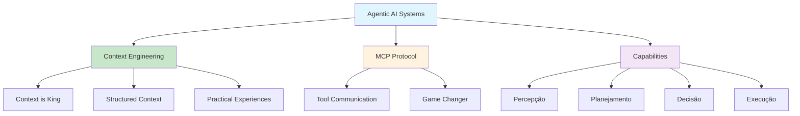

# [Context Engineering 1 - Agentic AI Systems - Vijay Kumar](/blog/context-engineering-1---agentic-ai-systems---vijay-kumar)

> [!compass] **[MyMess](/blog/moc---projeto-mymess)** » [Estudos](/blog/dashboard---estudos-mymess) » Engenharia de Contexto

---

> [!info]+ Detalhes do Artigo
> **Ler:** [Context Engineering 1/2: Getting the Best Out of Agentic AI Systems](https://abvijaykumar.medium.com/context-engineering-1-2-getting-the-best-out-of-agentic-ai-systems-90e4fe036faf)
> **Fonte:** [Medium](/blog/medium) (A B Vijay Kumar)
> **Autores:** A B Vijay Kumar (IBM Fellow, Master Inventor)
> **Publicado:** Outubro de 2025
> **Parte 1 de 2** - Ver também: [Context Engineering 2 - Product Requirements Prompts - Vijay Kumar](/blog/context-engineering-2---product-requirements-prompts---vijay-kumar)

> [!abstract]+ Materiais Complementares
>
> **Série Completa**
> - [Context Engineering 2 - Product Requirements Prompts - Vijay Kumar](/blog/context-engineering-2---product-requirements-prompts---vijay-kumar) - Parte 2: PRPs
> - [Vibe Coding - MCP Powers the Vibe](https://abvijaykumar.medium.com/vibe-coding-agentic-coding-mcp-powers-the-vibe-2-2-167bf65cad1d) - Artigo relacionado
>
> **Lista Curada**
> - [Agentic AI List](https://abvijaykumar.medium.com/list/d47e216b7be3) - Lista curada no Medium
>
> **Outros Trabalhos do Autor**
> - [Hands on Agentic RAG](https://abvijaykumar.medium.com/hands-on-agentic-rag-1-2-cdf375ad7e7a)
> - Livro sobre Agentic AI (em preparação)

> [!tip]- Léxico
>
> **Tecnologia e IA**
> - **Agentic AI**: IA que age independentemente para atingir objetivos definidos pelo usuário
>
> **Conteúdo e Criação**
> - **Context is King**: "Contexto é rei para fazer Agentic AI funcionar melhor e dar resultados mais confiáveis"
>
> **Ferramentas e Recursos**
> - **MCP (Model Context Protocol)**: Protocolo para ferramentas de IA se comunicarem entre si
>
> **Outros Conceitos**
> - **Multi-step Reasoning**: Raciocínio em múltiplas etapas com ações corretivas
> [!question]- Pontos para Aprofundar (Sugestão da IA)
>
> - **Como o autor estrutura contexto para agentes na prática?**
>     - Investigar experiências práticas descritas
> - **Qual o papel do MCP em melhorar agentes?**
>     - "MCP servers have changed the game"
> - **Como agentes tomam decisões autônomas?**
>     - Explorar ciclo percepção → planejamento → decisão → execução

> [!robot]- Sugestões Complementares
>
> - **Leituras Recomendadas:**
>     - Parte 2 da série sobre PRPs
>     - Artigo sobre Vibe Coding e MCP
> - **Ferramentas Úteis:**
>     - **MCP Servers** - Para comunicação entre ferramentas de IA
>     - **Agentic RAG** - Retrieval augmented generation com agentes
> - **Exercícios Práticos:**
>     - Implementar agente com MCP
>     - Construir contexto estruturado para tarefa complexa

---

## Resumo

Parte 1 de série sobre **context engineering para sistemas agenticos**, escrita por um **IBM Fellow e Master Inventor**. O autor compartilha experiências práticas construindo contextos para obter melhores resultados de aplicações de IA agentica.

**Citação central:** "Context is king to make Agentic AI work better and provide more reliable results."

---

## Principais Conceitos

### O que é Agentic AI

> "Ao invés de simplesmente gerar previsões ou respostas como um modelo de linguagem, uma IA agentica age independentemente para atingir objetivos definidos pelo usuário."

A tabela abaixo resume as informações principais.

| LLM Tradicional | Agentic AI |
|:----------------|:-----------|
| Gera respostas | Age independentemente |
| Single-shot | Multi-step reasoning |
| Passivo | Define objetivos e monitora progresso |
| Sem ações | Toma ações corretivas |

### Capacidades de Agentic AI

Combinando:
- **Percepção**: Entender ambiente e contexto
- **Planejamento**: Criar plano de ação
- **Tomada de decisão**: Escolher próximos passos
- **Execução**: Realizar ações no mundo

### MCP - Game Changer

> "MCP servers have changed the game" - Model Context Protocol permite que "ferramentas de IA e assistentes de desenvolvimento/agentes realmente conversem entre si."

---

## Detalhamento

### Por que Contexto é Rei

Agentes precisam de contexto rico e estruturado para:
- Entender objetivo completo
- Planejar sequência de ações
- Monitorar progresso
- Tomar ações corretivas quando necessário

### Diferencial do Autor

- **IBM Fellow** - Posição técnica mais alta na IBM
- **Master Inventor** - Múltiplas patentes
- Experiência prática construindo sistemas agenticos
- Escrevendo livro sobre Agentic AI

### Série Completa

1. **Parte 1**: Fundamentos de context engineering para agentes (este artigo)
2. **Parte 2**: Product Requirements Prompts (PRPs) na prática

---

## Mapa de Conceitos

O diagrama abaixo ilustra o fluxo do processo, mostrando as etapas e suas conexões.

---

## Insights & Aprendizados

**O que funcionou bem:**
- Autor com credenciais sólidas (IBM Fellow, Master Inventor)
- Experiências práticas reais com sistemas agenticos
- Citação "Context is King" muito citável
- Série de 2 partes cobre teoria e prática

**O que posso adaptar para o MyMess:**
- **Context is King**: Princípio central para design de agentes
- **MCP Integration**: Implementar protocolo para comunicação entre agentes
- **Multi-step Reasoning**: Permitir agentes planejarem e corrigirem

**Ideias para aplicar:**
- Estudar Parte 2 sobre PRPs para aplicar na prática
- Implementar MCP para integração de ferramentas
- Criar framework de contexto estruturado baseado nas experiências do autor

---

## Recursos Adicionais

- [Medium - A B Vijay Kumar](https://abvijaykumar.medium.com)
- [Context Engineering 2/2 - PRPs](https://abvijaykumar.medium.com/context-engineering-2-2-product-requirements-prompts-46e6ed0aa0d1)
- [Vibe Coding - MCP](https://abvijaykumar.medium.com/vibe-coding-agentic-coding-mcp-powers-the-vibe-2-2-167bf65cad1d)
- [Agentic AI Curated List](https://abvijaykumar.medium.com/list/d47e216b7be3)

---

## Propriedades da nota

> [!note]- Propriedades Gerais do Obsidian
>
>> **Identificação**
>
> | Campo | Valor |
> |:------|:------|
> | **Título** | `INPUT[text:titulo]` |
>
>> **Conexões**
>
> | Campo | Valor |
> |:------|:------|
> | **Pai** | `INPUT[suggester(optionQuery("")):pai]` |
> | **Coleção** | `INPUT[inlineSelect(option(financeiro, Financeiro), option(growth, Growth), option(ia, IA), option(lideranca, Liderança), option(marketing, Marketing), option(negocios, Negócios), option(produtividade, Produtividade), option(pkm, PKM), option(saas, SaaS), option(tecnologia, Tecnologia), option(vendas, Vendas)):colecao]` |
> | **Área** | `INPUT[suggester(optionQuery("Esforços/Áreas")):area]` |
> | **Projeto** | `INPUT[suggester(optionQuery("#projeto")):projeto]` |
> | **Autor** | `INPUT[suggester(optionQuery("Atlas/Pessoas")):pessoa]` |
> | **Relacionado** | `INPUT[inlineListSuggester(optionQuery(""), useLinks(true)):relacionado]` |
>
>> **Classificação**
>
> | Campo | Valor |
> |:------|:------|
> | **Tipo** | `INPUT[inlineSelect(option(atomica, Atômica), option(aula, Aula), option(artigo, Artigo), option(checklist, Checklist), option(curso, Curso), option(dashboard, Dashboard), option(framework, Framework), option(livro, Livro), option(moc, MOC), option(newsletter, Newsletter), option(pessoa, Pessoa), option(prompt, Prompt), option(template, Template Obsidian), option(tutorial, Tutorial), option(video_youtube, Vídeo Youtube)):tipo_nota]` |
> | **Tags** | `INPUT[inlineList:tags]` |
> | **Status** | `INPUT[inlineSelect(option(nao_iniciado, ⬜ Não Iniciado), option(em_andamento, 🔄 Em Andamento), option(concluido, ✅ Concluído), option(pausado, ⏸️ Pausado), option(cancelado, ❌ Cancelado)):status]` |
>
>> **Temporal**
>
> | Campo | Valor |
> |:------|:------|
> | **Criado** | `INPUT[date:data_criado]` |
> | **Atualizado** | `INPUT[date:data_atualizado]` |

> [!note]- Propriedades SaaS
>
> | Campo | Valor |
> |:------|:------|
> | **Mostrar Bloco** | `INPUT[toggle(onValue(true), offValue(false)):mostrar_bloco_saas]` |
> | **Status SaaS** | `INPUT[toggle(onValue(true), offValue(false)):status_saas]` |

> [!note]- Propriedades do Artigo
>
> | Campo | Valor |
> |:------|:------|
> | **URL** | `INPUT[text(placeholder(https://...)):url_artigo]` |
> | **Fonte** | `INPUT[text:fonte]` |
> | **Autor** | `INPUT[text:autor]` |
> | **Data Publicação** | `INPUT[date:data_publicacao]` |
> | **Tipo Conteúdo** | `INPUT[inlineSelect(option(educacional, Educacional), option(curadoria, Curadoria), option(historia, História Pessoal), option(listicle, Lista), option(contrarian, Opinião Contrária), option(tutorial, Tutorial), option(entrevista, Entrevista), option(analise, Análise), option(estudo_de_caso, Estudo de Caso), option(lancamento, Lançamento), option(opiniao, Opinião), option(outro, Outro)):tipo_conteudo]` |

