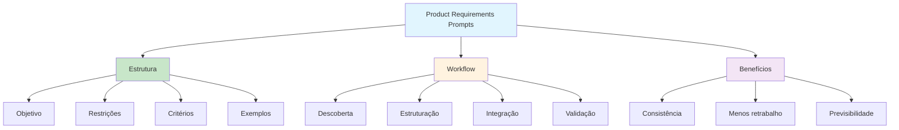

# [Context Engineering 2 - Product Requirements Prompts - Vijay Kumar](/blog/context-engineering-2---product-requirements-prompts---vijay-kumar)

> [!compass] **[MyMess](/blog/moc---projeto-mymess)** » [Estudos](/blog/dashboard---estudos-mymess) » Engenharia de Contexto

---

> [!info]+ Detalhes do Artigo
> **Ler:** [Context Engineering 2/2: Product Requirements Prompts](https://abvijaykumar.medium.com/context-engineering-2-2-product-requirements-prompts-46e6ed0aa0d1)
> **Fonte:** [Medium](/blog/medium) (A B Vijay Kumar)
> **Autores:** A B Vijay Kumar (IBM Fellow, Master Inventor)
> **Publicado:** 15 de Outubro de 2025
> **Parte 2 de 2** - Ver também: [Context Engineering 1 - Agentic AI Systems - Vijay Kumar](/blog/context-engineering-1---agentic-ai-systems---vijay-kumar)

> [!abstract]+ Materiais Complementares
>
> **Série Completa**
> - [Context Engineering 1 - Agentic AI Systems - Vijay Kumar](/blog/context-engineering-1---agentic-ai-systems---vijay-kumar) - Parte 1: Fundamentos
> - [Substack - Context Engineering PRPs](https://abvijaykumar.substack.com/p/context-engineering-23product-requirements) - Versão alternativa
>
> **Outros Trabalhos do Autor**
> - [Vibe Coding - MCP](https://abvijaykumar.medium.com/vibe-coding-agentic-coding-mcp-powers-the-vibe-2-2-167bf65cad1d)
> - [Hands on Agentic RAG](https://abvijaykumar.medium.com/hands-on-agentic-rag-1-2-cdf375ad7e7a)

> [!tip]- Léxico
>
> **Conteúdo e Criação**
> - **PRP (Product Requirements Prompt)**: Prompt estruturado que encapsula requisitos de produto como contexto
> - **Structured Context**: Contexto organizado e formatado para máxima efetividade
> - **Requirements as Context**: Usar documentos de requisitos como contexto para IA
>
> **Outros Conceitos**
> - **PRD Generation**: Geração assistida de documentos de requisitos de produto
> [!question]- Pontos para Aprofundar (Sugestão da IA)
>
> - **Como estruturar PRPs para diferentes tipos de projeto?**
>     - Investigar templates e padrões recomendados
> - **Qual o impacto de PRPs bem estruturados na qualidade do output?**
>     - Buscar métricas e comparações
> - **Como manter PRPs atualizados conforme projeto evolui?**
>     - Explorar workflows de manutenção

> [!robot]- Sugestões Complementares
>
> - **Leituras Recomendadas:**
>     - Parte 1 da série sobre fundamentos
>     - Artigo sobre Vibe Coding e MCP
> - **Ferramentas Úteis:**
>     - **PRP Templates** - Templates estruturados
>     - **PRD Generators** - Ferramentas de geração
> - **Exercícios Práticos:**
>     - Criar PRP para projeto existente
>     - Testar geração de código com PRP estruturado

---

## Resumo

Parte 2 de série sobre **context engineering**, focando em **Product Requirements Prompts (PRPs)** - uma abordagem prática para estruturar requisitos de produto como contexto para aplicações de IA agentica. O autor compartilha experiências práticas de como PRPs transformaram a qualidade dos outputs.

**Foco central:** Experiências práticas construindo contextos estruturados usando PRPs e como isso melhorou resultados de aplicações agenticas.

---

## Principais Conceitos

### O que são PRPs

**Product Requirements Prompts (PRPs)** são prompts estruturados que:
- Encapsulam requisitos de produto de forma organizada
- Servem como contexto rico para sistemas de IA
- Permitem outputs mais alinhados com objetivos do produto

| Requisitos Tradicionais | Com PRPs |
|:------------------------|:---------|
| Documentos estáticos | Contexto ativo |
| Separados da IA | Integrados ao workflow |
| Validação manual | Validação contínua |
| Interpretação ambígua | Estrutura clara |

### Workflow com PRPs

1. **Descoberta**: Levantar requisitos com stakeholders
2. **Estruturação**: Organizar em formato PRP
3. **Integração**: Usar como contexto para agentes
4. **Validação**: Verificar outputs contra requisitos
5. **Iteração**: Refinar PRP conforme feedback

---

## Detalhamento

### Por que PRPs Funcionam

Experiências práticas do autor mostraram que:
- Contexto estruturado gera outputs mais consistentes
- Requisitos explícitos reduzem ambiguidade
- Formato padronizado facilita manutenção
- Agentes "entendem" melhor o objetivo do projeto

### Elementos de um Bom PRP

Baseado nas experiências do autor:
- **Objetivo claro**: O que o produto deve fazer
- **Restrições**: Limitações técnicas e de negócio
- **Critérios de sucesso**: Como medir qualidade
- **Contexto de domínio**: Informação específica da área
- **Exemplos**: Casos de uso concretos

### Aplicação Prática

O autor demonstra como PRPs transformaram seu workflow:
- Antes: Iterações frequentes, outputs inconsistentes
- Depois: Resultados mais alinhados desde o início
- Benefício: Menos retrabalho, mais previsibilidade

---

## Mapa de Conceitos

O diagrama abaixo ilustra o fluxo do processo, mostrando as etapas e suas conexões.

---

## Insights & Aprendizados

**O que funcionou bem:**
- Experiências práticas reais do autor
- Conceito de PRP como bridge entre requisitos e IA
- Workflow claro de 5 etapas
- Foco em reduzir retrabalho e aumentar previsibilidade

**O que posso adaptar para o MyMess:**
- **Template de PRP**: Criar template padrão para projetos de clientes
- **Workflow de integração**: Incorporar PRPs no processo de onboarding
- **Validação contínua**: Verificar outputs contra requisitos

**Ideias para aplicar:**
- Desenvolver biblioteca de templates PRP por tipo de projeto
- Criar sistema de validação automática PRP → output
- Implementar workflow de manutenção de PRPs

---

## Recursos Adicionais

- [Medium - Context Engineering 2/2](https://abvijaykumar.medium.com/context-engineering-2-2-product-requirements-prompts-46e6ed0aa0d1)
- [Substack - Context Engineering PRPs](https://abvijaykumar.substack.com/p/context-engineering-23product-requirements)
- [Context Engineering 1/2](https://abvijaykumar.medium.com/context-engineering-1-2-getting-the-best-out-of-agentic-ai-systems-90e4fe036faf)
- [Medium - A B Vijay Kumar](https://abvijaykumar.medium.com)

---

## Propriedades da nota

> [!note]- Propriedades Gerais do Obsidian
>
>> **Identificação**
>
> | Campo | Valor |
> |:------|:------|
> | **Título** | `INPUT[text:titulo]` |
>
>> **Conexões**
>
> | Campo | Valor |
> |:------|:------|
> | **Pai** | `INPUT[suggester(optionQuery("")):pai]` |
> | **Coleção** | `INPUT[inlineSelect(option(financeiro, Financeiro), option(growth, Growth), option(ia, IA), option(lideranca, Liderança), option(marketing, Marketing), option(negocios, Negócios), option(produtividade, Produtividade), option(pkm, PKM), option(saas, SaaS), option(tecnologia, Tecnologia), option(vendas, Vendas)):colecao]` |
> | **Área** | `INPUT[suggester(optionQuery("Esforços/Áreas")):area]` |
> | **Projeto** | `INPUT[suggester(optionQuery("#projeto")):projeto]` |
> | **Autor** | `INPUT[suggester(optionQuery("Atlas/Pessoas")):pessoa]` |
> | **Relacionado** | `INPUT[inlineListSuggester(optionQuery(""), useLinks(true)):relacionado]` |
>
>> **Classificação**
>
> | Campo | Valor |
> |:------|:------|
> | **Tipo** | `INPUT[inlineSelect(option(atomica, Atômica), option(aula, Aula), option(artigo, Artigo), option(checklist, Checklist), option(curso, Curso), option(dashboard, Dashboard), option(framework, Framework), option(livro, Livro), option(moc, MOC), option(newsletter, Newsletter), option(pessoa, Pessoa), option(prompt, Prompt), option(template, Template Obsidian), option(tutorial, Tutorial), option(video_youtube, Vídeo Youtube)):tipo_nota]` |
> | **Tags** | `INPUT[inlineList:tags]` |
> | **Status** | `INPUT[inlineSelect(option(nao_iniciado, ⬜ Não Iniciado), option(em_andamento, 🔄 Em Andamento), option(concluido, ✅ Concluído), option(pausado, ⏸️ Pausado), option(cancelado, ❌ Cancelado)):status]` |
>
>> **Temporal**
>
> | Campo | Valor |
> |:------|:------|
> | **Criado** | `INPUT[date:data_criado]` |
> | **Atualizado** | `INPUT[date:data_atualizado]` |

> [!note]- Propriedades SaaS
>
> | Campo | Valor |
> |:------|:------|
> | **Mostrar Bloco** | `INPUT[toggle(onValue(true), offValue(false)):mostrar_bloco_saas]` |
> | **Status SaaS** | `INPUT[toggle(onValue(true), offValue(false)):status_saas]` |

> [!note]- Propriedades do Artigo
>
> | Campo | Valor |
> |:------|:------|
> | **URL** | `INPUT[text(placeholder(https://...)):url_artigo]` |
> | **Fonte** | `INPUT[text:fonte]` |
> | **Autor** | `INPUT[text:autor]` |
> | **Data Publicação** | `INPUT[date:data_publicacao]` |
> | **Tipo Conteúdo** | `INPUT[inlineSelect(option(educacional, Educacional), option(curadoria, Curadoria), option(historia, História Pessoal), option(listicle, Lista), option(contrarian, Opinião Contrária), option(tutorial, Tutorial), option(entrevista, Entrevista), option(analise, Análise), option(estudo_de_caso, Estudo de Caso), option(lancamento, Lançamento), option(opiniao, Opinião), option(outro, Outro)):tipo_conteudo]` |

