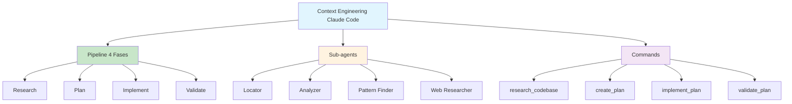

# [Context Engineering Claude Code - AddCommitPush](/blog/context-engineering-claude-code---addcommitpush)

> [!compass] **[MyMess](/blog/moc---projeto-mymess)** » [Estudos](/blog/dashboard---estudos-mymess) » Engenharia de Contexto

---

> [!info]+ Detalhes do Artigo
> **Ler:** [Advanced Context Engineering with Claude Code](https://addcommitpush.io/blog/context-engineering-claude-code)
> **Fonte:** [AddCommitPush](/blog/addcommitpush) (Blog)
> **Autores:** Emil Wåreus
> **Publicado:** 7 de Novembro de 2025
> **Leitura:** ~10 minutos

> [!abstract]+ Materiais Complementares
>
> **Framework Original**
> - "AI That Works" - Dex and Vaibhav (pioneiros desta abordagem)
>
> **Commands do Pipeline**
> - `/research_codebase` - Deploys agentes focados em paralelo
> - `/create_plan` - Desenvolve especificações com alternativas
> - `/implement_plan` - Executa fases com checkpoints
> - `/validate_plan` - Verifica qualidade e desvios
>
> **Agentes Especializados**
> - Locator, Analyzer, Pattern Finder, Web Search Researcher

> [!tip]- Léxico
>
> **Conteúdo e Criação**
> - **Sub-agents**: Agentes especializados com janelas de contexto isoladas
> - **Context Isolation**: Falhas de busca não poluem contexto principal
>
> **Tecnologia e IA**
> - **Context Engineering**: "Estruturação e compactação deliberada de informação para que agentes possam pensar claramente"
>
> **Outros Conceitos**
> - **Commands**: Workflows reprodutíveis para orquestração
> [!question]- Pontos para Aprofundar (Sugestão da IA)
>
> - **Por que agentes especializados funcionam melhor que um generalista?**
>     - Cada agente produz resumos limpos, evitando poluição de contexto
> - **Qual o tamanho ideal de feature para este workflow?**
>     - 1-3K linhas em Go/TypeScript ou 5-30 arquivos
> - **Como lidar com ~50% dos casos que precisam refinamento manual?**
>     - Revisar e editar findings antes de criar plano

> [!robot]- Sugestões Complementares
>
> - **Leituras Recomendadas:**
>     - "AI That Works" de Dex e Vaibhav
>     - Claude Code Best Practices da Anthropic
> - **Ferramentas Úteis:**
>     - **Claude Code CLI** - Para executar commands
>     - **Go/TypeScript projects** - Funcionam melhor que JS complexo
> - **Exercícios Práticos:**
>     - Implementar pipeline de 4 fases em projeto pessoal
>     - Criar agentes especializados para tarefas repetitivas

---

## Resumo

Guia avançado sobre **context engineering com Claude Code**, apresentando um pipeline de 4 fases e o uso de **sub-agents especializados** para compressão de contexto. O autor reporta completar **2-5 features por dia** após refinamento.

**Definição central:** Context engineering envolve "estruturação e compactação deliberada de informação para que agentes possam pensar claramente" - não apenas empilhar tudo em um único prompt.

---

## Principais Conceitos

### Pipeline de 4 Fases

A tabela abaixo resume as informações principais.

| Fase | Descrição | Output |
|:-----|:----------|:-------|
| **Research** | Agentes paralelos exploram codebase e fontes externas | Documento de pesquisa estruturado |
| **Plan** | Sintetiza findings em opções de design | Especificações com critérios de sucesso |
| **Implement** | Executa fases sequencialmente com adaptação | Código + checkpoints |
| **Validate** | Confirma qualidade via checks automatizados | Relatório de conformidade |

### 4 Commands de Orquestração

1. **`/research_codebase`** - Deploy de agentes focados em paralelo
2. **`/create_plan`** - Desenvolve specs com alternativas de design
3. **`/implement_plan`** - Executa fases atualizando checkpoints
4. **`/validate_plan`** - Verifica qualidade e identifica desvios

---

## Detalhamento

### Agentes Especializados (Context Compression)

Ao invés de um agente generalista, **profissionais especializados** com janelas de contexto isoladas:

| Agente | Função |
|:-------|:-------|
| **Locator** | Identifica localização de arquivos sem analisar conteúdo |
| **Analyzer** | Rastreia fluxo de dados com citações file:line |
| **Pattern Finder** | Encontra exemplos de implementação e padrões de teste |
| **Web Search Researcher** | Coleta recursos externos com citações |

**Benefício:** Cada agente produz **resumos limpos**, prevenindo que buscas falhas poluam o contexto principal.

### Configurações Recomendadas

A tabela a seguir detalha os campos e seus valores.

| Aspecto | Recomendação |
|:--------|:-------------|
| **Tamanho ideal** | 1-3K linhas Go/TypeScript ou 5-30 arquivos |
| **Qualidade do codebase** | Simples e bem estruturado funciona melhor |
| **Execução paralela** | Até 3 features simultâneas (1 complexa + 2 simples) |
| **Modo de pensamento** | "think deeply" > "ultrathink" (balanço melhor) |
| **Refinamento** | ~50% dos casos requerem edição manual |

### Workflow Prático

1. Rodar `/research_codebase` com requisitos detalhados
2. Revisar e refinar findings (~50% precisam edição manual)
3. Executar `/create_plan` com especificações de fase
4. Implementar e validar incrementalmente por fase
5. Commit após cada iteração bem-sucedida

---

## Mapa de Conceitos

O diagrama abaixo ilustra o fluxo do processo, mostrando as etapas e suas conexões.

---

## Insights & Aprendizados

**O que funcionou bem:**
- Pipeline estruturado de 4 fases com artifacts documentados
- Agentes especializados evitam poluição de contexto
- Resultado mensurável: 2-5 features por dia
- Transparência sobre ~50% precisarem refinamento manual

**O que posso adaptar para o MyMess:**
- **Pipeline de 4 fases**: Aplicar Research → Plan → Implement → Validate
- **Sub-agents especializados**: Criar agentes por função específica
- **Commands reprodutíveis**: Desenvolver workflows padronizados

**Ideias para aplicar:**
- Implementar 4 commands equivalentes para agentes MyMess
- Criar biblioteca de agentes especializados (Locator, Analyzer, etc.)
- Definir critérios de feature ideal (linhas de código, arquivos)

---

## Recursos Adicionais

- [AddCommitPush - Context Engineering Claude Code](https://addcommitpush.io/blog/context-engineering-claude-code)
- [Claude Code Documentation](https://docs.anthropic.com/claude-code)
- "AI That Works" - Dex and Vaibhav (framework original)

---

## Propriedades da nota

> [!note]- Propriedades Gerais do Obsidian
>
>> **Identificação**
>
> | Campo      | Valor                    |
> |:-----------|:-------------------------|
> | **Título** | `INPUT[text:titulo]`     |
>
>> **Conexões**
>
> | Campo           | Valor                                                                 |
> |:----------------|:----------------------------------------------------------------------|
> | **Pai**         | `INPUT[suggester(optionQuery("")):pai]`                               |
> | **Coleção**     | `INPUT[inlineSelect(option(financeiro, Financeiro), option(growth, Growth), option(ia, IA), option(lideranca, Liderança), option(marketing, Marketing), option(negocios, Negócios), option(produtividade, Produtividade), option(pkm, PKM), option(saas, SaaS), option(tecnologia, Tecnologia), option(vendas, Vendas)):colecao]` |
> | **Área**        | `INPUT[suggester(optionQuery("Esforços/Áreas")):area]`                         |
> | **Projeto**     | `INPUT[suggester(optionQuery("#projeto")):projeto]`                   |
> | **Autor**       | `INPUT[suggester(optionQuery("Atlas/Pessoas")):pessoa]`                      |
> | **Relacionado** | `INPUT[inlineListSuggester(optionQuery(""), useLinks(true)):relacionado]` |
>
>> **Classificação**
>
> | Campo      | Valor                                                                 |
> |:-----------|:----------------------------------------------------------------------|
> | **Tipo**   | `INPUT[inlineSelect(option(atomica, Atômica), option(aula, Aula), option(artigo, Artigo), option(checklist, Checklist), option(curso, Curso), option(dashboard, Dashboard), option(framework, Framework), option(livro, Livro), option(moc, MOC), option(newsletter, Newsletter), option(pessoa, Pessoa), option(prompt, Prompt), option(template, Template Obsidian), option(tutorial, Tutorial), option(video_youtube, Vídeo Youtube)):tipo_nota]` |
> | **Tags**   | `INPUT[inlineList:tags]`                                              |
> | **Status** | `INPUT[inlineSelect(option(nao_iniciado, ⬜ Não Iniciado), option(em_andamento, 🔄 Em Andamento), option(concluido, ✅ Concluído), option(pausado, ⏸️ Pausado), option(cancelado, ❌ Cancelado)):status]` |
>
>> **Temporal**
>
> | Campo          | Valor                      |
> |:---------------|:---------------------------|
> | **Criado**     | `INPUT[date:data_criado]`       |
> | **Atualizado** | `INPUT[date:data_atualizado]`   |

> [!note]- Propriedades SaaS
>
> | Campo             | Valor                                                              |
> |:------------------|:-------------------------------------------------------------------|
> | **Mostrar Bloco** | `INPUT[toggle(onValue(true), offValue(false)):mostrar_bloco_saas]` |
> | **Status SaaS**   | `INPUT[toggle(onValue(true), offValue(false)):status_saas]`        |

> [!note]- Propriedades do Artigo
>
> | Campo            | Valor                          |
> |:-----------------|:-------------------------------|
> | **URL**          | `INPUT[text(placeholder(https://...)):url_artigo]`  |
> | **Fonte**        | `INPUT[text:fonte]`  |
> | **Autor**        | `INPUT[text:autor]`  |
> | **Data Publicação** | `INPUT[date:data_publicacao]`  |
> | **Tipo Conteúdo** | `INPUT[inlineSelect(option(educacional, Educacional), option(curadoria, Curadoria), option(historia, História Pessoal), option(listicle, Lista), option(contrarian, Opinião Contrária), option(tutorial, Tutorial), option(entrevista, Entrevista), option(analise, Análise), option(estudo_de_caso, Estudo de Caso), option(lancamento, Lançamento), option(opiniao, Opinião), option(outro, Outro)):tipo_conteudo]`  |

