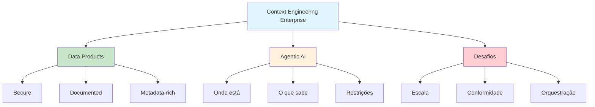

# [Context Engineering Enterprise SaaS 2025 - LinkedIn](/blog/context-engineering-enterprise-saas-2025---linkedin)

> [!compass] **[MyMess](/blog/moc---projeto-mymess)** » [Estudos](/blog/dashboard---estudos-mymess) » Engenharia de Contexto

---

> [!info]+ Detalhes do Artigo
> **Ler:** [Context Engineering in Enterprise SaaS](https://www.linkedin.com/posts/tayler-ramsay_context-engineering-in-enterprise-saas-activity-7366122678207803392-k5AK)
> **Fonte:** [LinkedIn](/blog/linkedin) / [InfoWorld](/blog/infoworld)
> **Autores:** Tayler Ramsay (LinkedIn), Saket Saurabh (CEO Nexla - InfoWorld)
> **Publicado:** 18 de Novembro de 2025

> [!abstract]+ Materiais Complementares
>
> **Artigos Relacionados**
> - [InfoWorld - Context Engineering Enterprise AI](https://www.infoworld.com/article/4084378/why-context-engineering-will-define-the-next-era-of-enterprise-ai.html)
> - [Google Developers - Multi-Agent Framework](https://developers.googleblog.com/architecting-efficient-context-aware-multi-agent-framework-for-production/)
>
> **Autores e Empresas**
> - **Saket Saurabh** - CEO e co-fundador Nexla
> - **Tayler Ramsay** - Creator Social Media Sync MCP Server
>
> **Conceitos Enterprise**
> - Data Products
> - Metadata embedding
> - Real-time data flows

> [!tip]- Léxico
>
> **Ferramentas e Recursos**
> - **Context Engineering para Enterprise**: "Prática de designing, integrating e orchestrating o information environment onde sistemas de IA operam"
> - **Agentic AI Systems**: Sistemas que precisam entender "onde estão, o que sabem e quais restrições se aplicam"
>
> **Outros Conceitos**
> - **Data Products**: Dados empacotados que são "secure, well-documented, e embedded com metadata"
> - **Dynamic Data Flows**: Fluxos em tempo real ao invés de tabelas estáticas
> [!question]- Pontos para Aprofundar (Sugestão da IA)
>
> - **Como empacotar dados como "data products" para IA?**
>     - Investigar metadata, documentação e segurança
> - **Qual a diferença de fluxos dinâmicos vs tabelas estáticas?**
>     - Explorar real-time vs batch processing
> - **Como manter conformidade ao expor dados para IA?**
>     - Estudar mascaramento e lineage

> [!robot]- Sugestões Complementares
>
> - **Leituras Recomendadas:**
>     - InfoWorld article completo sobre Enterprise AI
>     - Google Developers blog sobre multi-agent frameworks
> - **Ferramentas Úteis:**
>     - **Nexla** - Plataforma de data products
>     - **MCP Servers** - Para integração de contexto
> - **Exercícios Práticos:**
>     - Mapear fontes de dados enterprise para context engineering
>     - Criar data product documentado para IA

---

## Resumo

Análise sobre **context engineering para Enterprise SaaS**, compilando insights de Tayler Ramsay (LinkedIn) e Saket Saurabh (CEO Nexla). O artigo posiciona context engineering como prática essencial para sistemas de **IA agentic** em ambientes enterprise.

**Definição central:** Context engineering é "a prática de designing, integrating e orchestrating o information environment" onde sistemas de IA operam, indo além de prompt engineering.

---

## Principais Conceitos

### Aplicação em SaaS Enterprise

A tabela abaixo resume as informações principais.

| Aspecto | Abordagem |
|:--------|:----------|
| **Dados** | Empacotar como "data products" seguros e documentados |
| **Fluxos** | Dinâmicos em tempo real, não tabelas estáticas |
| **Fontes** | Múltiplas: transcripts, tickets, contratos, PDFs |
| **Metadata** | Embedded para contexto rico |

### O que Agentic AI Precisa

Sistemas de IA agentic necessitam compreensão profunda de:
- **Onde estão** - Contexto espacial e organizacional
- **O que sabem** - Conhecimento disponível
- **Quais restrições se aplicam** - Limites e governança

---

## Detalhamento

### Variedade de Fontes de Dados

Context engineering para enterprise deve integrar:
- Chat transcripts
- Support tickets
- Sensor feeds
- Vídeo
- Contratos
- PDFs

### Desafios Enterprise

A tabela a seguir detalha os campos e seus valores.

| Desafio | Descrição |
|:--------|:----------|
| **Escala** | Reliability e observability ao conectar múltiplos data products |
| **Orquestração** | Coordenar fluxos de diferentes fontes |
| **Conformidade** | Mascarar informações sensíveis mantendo lineage |

### Benefícios para Empresas

1. **Vantagem competitiva**: Através de "proprietary data, documents, workflows e domain knowledge"
2. **Democratização**: "Quase qualquer um" pode refinar contextos sem expertise técnica
3. **Autonomia de IA**: Permite "resumir relatórios, flagear anomalias, otimizar workflows"

---

## Mapa de Conceitos

O diagrama abaixo ilustra o fluxo do processo, mostrando as etapas e suas conexões.

---

## Insights & Aprendizados

**O que funcionou bem:**
- Posicionamento de dados como "products" para IA
- Foco em fluxos dinâmicos vs estáticos
- Atenção a conformidade e mascaramento
- Perspectiva de democratização (não técnicos podem refinar)

**O que posso adaptar para o MyMess:**
- **Data Products**: Estruturar dados de clientes como products documentados
- **Multi-source integration**: Suportar transcripts, tickets, documentos
- **Democratização**: Permitir refinamento sem expertise técnica

**Ideias para aplicar:**
- Criar framework de "data products" para clientes MyMess
- Implementar integração de múltiplas fontes de dados
- Desenvolver interface de refinamento de contexto para não-técnicos

---

## Recursos Adicionais

- [LinkedIn - Tayler Ramsay](https://www.linkedin.com/in/tayler-ramsay/)
- [InfoWorld - Enterprise AI Context Engineering](https://www.infoworld.com/article/4084378/why-context-engineering-will-define-the-next-era-of-enterprise-ai.html)
- [Google Developers - Multi-Agent Framework](https://developers.googleblog.com/architecting-efficient-context-aware-multi-agent-framework-for-production/)
- [Nexla - Data Products Platform](https://nexla.com)

---

## Propriedades da nota

> [!note]- Propriedades Gerais do Obsidian
>
>> **Identificação**
>
> | Campo | Valor |
> |:------|:------|
> | **Título** | `INPUT[text:titulo]` |
>
>> **Conexões**
>
> | Campo | Valor |
> |:------|:------|
> | **Pai** | `INPUT[suggester(optionQuery("")):pai]` |
> | **Coleção** | `INPUT[inlineSelect(option(financeiro, Financeiro), option(growth, Growth), option(ia, IA), option(lideranca, Liderança), option(marketing, Marketing), option(negocios, Negócios), option(produtividade, Produtividade), option(pkm, PKM), option(saas, SaaS), option(tecnologia, Tecnologia), option(vendas, Vendas)):colecao]` |
> | **Área** | `INPUT[suggester(optionQuery("Esforços/Áreas")):area]` |
> | **Projeto** | `INPUT[suggester(optionQuery("#projeto")):projeto]` |
> | **Autor** | `INPUT[suggester(optionQuery("Atlas/Pessoas")):pessoa]` |
> | **Relacionado** | `INPUT[inlineListSuggester(optionQuery(""), useLinks(true)):relacionado]` |
>
>> **Classificação**
>
> | Campo | Valor |
> |:------|:------|
> | **Tipo** | `INPUT[inlineSelect(option(atomica, Atômica), option(aula, Aula), option(artigo, Artigo), option(checklist, Checklist), option(curso, Curso), option(dashboard, Dashboard), option(framework, Framework), option(livro, Livro), option(moc, MOC), option(newsletter, Newsletter), option(pessoa, Pessoa), option(prompt, Prompt), option(template, Template Obsidian), option(tutorial, Tutorial), option(video_youtube, Vídeo Youtube)):tipo_nota]` |
> | **Tags** | `INPUT[inlineList:tags]` |
> | **Status** | `INPUT[inlineSelect(option(nao_iniciado, ⬜ Não Iniciado), option(em_andamento, 🔄 Em Andamento), option(concluido, ✅ Concluído), option(pausado, ⏸️ Pausado), option(cancelado, ❌ Cancelado)):status]` |
>
>> **Temporal**
>
> | Campo | Valor |
> |:------|:------|
> | **Criado** | `INPUT[date:data_criado]` |
> | **Atualizado** | `INPUT[date:data_atualizado]` |

> [!note]- Propriedades SaaS
>
> | Campo | Valor |
> |:------|:------|
> | **Mostrar Bloco** | `INPUT[toggle(onValue(true), offValue(false)):mostrar_bloco_saas]` |
> | **Status SaaS** | `INPUT[toggle(onValue(true), offValue(false)):status_saas]` |

> [!note]- Propriedades do Artigo
>
> | Campo | Valor |
> |:------|:------|
> | **URL** | `INPUT[text(placeholder(https://...)):url_artigo]` |
> | **Fonte** | `INPUT[text:fonte]` |
> | **Autor** | `INPUT[text:autor]` |
> | **Data Publicação** | `INPUT[date:data_publicacao]` |
> | **Tipo Conteúdo** | `INPUT[inlineSelect(option(educacional, Educacional), option(curadoria, Curadoria), option(historia, História Pessoal), option(listicle, Lista), option(contrarian, Opinião Contrária), option(tutorial, Tutorial), option(entrevista, Entrevista), option(analise, Análise), option(estudo_de_caso, Estudo de Caso), option(lancamento, Lançamento), option(opiniao, Opinião), option(outro, Outro)):tipo_conteudo]`  |

