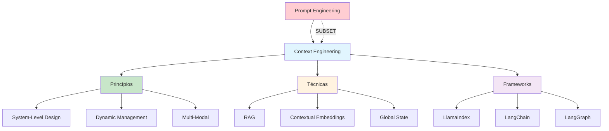

# [Context Engineering Evolution Beyond Prompt - Hugging Face](/blog/context-engineering-evolution-beyond-prompt---hugging-face)

> [!compass] **[MyMess](/blog/moc---projeto-mymess)** » [Estudos](/blog/dashboard---estudos-mymess) » Engenharia de Contexto

---

> [!info]+ Detalhes do Artigo
> **Ler:** [Context Engineering: The Evolution Beyond Prompt](https://huggingface.co/blog/Svngoku/context-engineering-the-evolution-beyond-prompt-en)
> **Fonte:** [Hugging Face](/blog/hugging-face) (Community Blog)
> **Autores:** NIONGOLO Chrys Fé-Marty (usuário: Svngoku)
> **Publicado:** 2 de Agosto de 2025

> [!abstract]+ Materiais Complementares
>
> **Frameworks Mencionados**
> - [LlamaIndex](https://llamaindex.ai) - Workflow e Global State management
> - [LangChain](https://langchain.com) - Agent orchestration
> - [LangGraph](https://langchain.com/langgraph) - Tool orchestration
>
> **Técnicas Avançadas**
> - Contextual Embeddings + BM25 + Reranking
> - Gemini Embedding (caso Box)
>
> **Métricas**
> - Redução de 49% em falhas de retrieval (top-20-chunks)

> [!tip]- Léxico
>
> **Ferramentas e Recursos**
> - **Prompt Engineering é SUBSET de Context Engineering**: Prompt é parte menor de um sistema maior
> - **System-Level Design**: Tratar IA como ecossistemas completos
>
> **Conteúdo e Criação**
> - **Dynamic Information Management**: Montar contexto dinamicamente através de interações
>
> **Elementos Visuais**
> - **Multi-Modal Context**: Estende além de texto para visual, áudio e outros
> [!question]- Pontos para Aprofundar (Sugestão da IA)
>
> - **Por que prompt engineering é apenas um subset?**
>     - Prompt é "for the moment", context é multi-turn com estado
> - **Como contextual embeddings reduzem 49% de falhas?**
>     - Investigar combinação com BM25 e reranking
> - **Qual o papel do Global State Management?**
>     - Funciona como "scratchpad" para continuidade

> [!robot]- Sugestões Complementares
>
> - **Leituras Recomendadas:**
>     - LlamaIndex documentation sobre Global State
>     - LangGraph para tool orchestration
> - **Ferramentas Úteis:**
>     - **LlamaIndex** - Context e State management
>     - **LangChain/LangGraph** - Orchestration
> - **Exercícios Práticos:**
>     - Implementar RAG com contextual embeddings
>     - Criar sistema com Global State management

---

## Resumo

Artigo do Hugging Face Blog explicando como **Context Engineering evolui além de Prompt Engineering**. O autor argumenta que prompt engineering é apenas um **SUBSET** de context engineering, e apresenta técnicas como RAG, Global State Management e Multi-Modal Context.

**Citação central:** "Context Engineering represents the new foundation for building intelligent, reliable, and enterprise-ready AI systems"

---

## Principais Conceitos

### Prompt vs Context Engineering

A tabela abaixo resume as informações principais.

| Aspecto | Prompt Engineering | Context Engineering |
|:--------|:-------------------|:--------------------|
| **Escopo** | Crafting prompts individuais | Design holístico de ecossistemas AI |
| **Tempo** | "For the moment" - isolado | Multi-turn com estado e memória |
| **Relação** | É um SUBSET | É o SUPERSET |
| **Foco** | Instruções claras | Arquitetura completa, fluxo e pensamento |

### Princípios Centrais

1. **System-Level Design**: Trata IA como ecossistemas completos
2. **Dynamic Information Management**: Monta contexto dinamicamente
3. **Multi-Modal Context Optimization**: Além de texto - visual, áudio, etc.

---

## Detalhamento

### Técnicas Principais

A tabela a seguir detalha os campos e seus valores.

| Técnica | Descrição | Benefício |
|:--------|:----------|:----------|
| **RAG** | Recupera informações de fontes externas | Reduz alucinações |
| **Contextual Embeddings** | Combina com BM25 + reranking | -49% falhas retrieval |
| **Global State Management** | "Scratchpad" para info global | Continuidade multi-turn |
| **Tool Integration** | Acesso dinâmico a ferramentas | Maior autonomia |

### Frameworks e Tecnologias

Os dados abaixo mostram a estrutura e configurações.

| Framework | Foco |
|:----------|:-----|
| **LlamaIndex + LlamaCloud** | Workflow e Global State management |
| **LangChain + LangGraph** | Agent orchestration e ferramentas |
| **Gemini Embedding** | Casos como Box com sucesso |

### Casos de Uso

1. **Enterprise AI Systems**: Escala entre departamentos e fontes
2. **AI Agents**: Multi-turn, adaptativo, memória de longo prazo
3. **Document Analysis**: Melhoria mensurável em F1 scores
4. **Code Development**: Indexação de codebase com semantic search

### Desafios

A tabela abaixo resume as informações principais.

| Desafio | Descrição |
|:--------|:----------|
| **Data Privacy** | Governança e práticas éticas |
| **Complexity** | Novas skills em arquitetura de informação |
| **Performance** | Overhead de manutenção de contexto |

---

## Mapa de Conceitos

O diagrama abaixo ilustra o fluxo do processo, mostrando as etapas e suas conexões.

---

## Insights & Aprendizados

**O que funcionou bem:**
- Clareza sobre prompt como subset de context engineering
- Métrica concreta: 49% redução em falhas de retrieval
- Cobertura de múltiplos frameworks (LlamaIndex, LangChain)
- Visão de enterprise readiness

**O que posso adaptar para o MyMess:**
- **Multi-Modal Context**: Suportar além de texto
- **Global State Management**: Implementar scratchpad para continuidade
- **Contextual Embeddings**: Combinar técnicas para melhor retrieval

**Ideias para aplicar:**
- Implementar Global State em agentes MyMess
- Testar contextual embeddings + BM25 + reranking
- Desenvolver suporte multi-modal (imagens, áudio)

---

## Recursos Adicionais

- [Hugging Face Blog - Context Engineering](https://huggingface.co/blog/Svngoku/context-engineering-the-evolution-beyond-prompt-en)
- [LlamaIndex](https://llamaindex.ai)
- [LangChain](https://langchain.com)
- [LangGraph](https://langchain.com/langgraph)

---

## Propriedades da nota

> [!note]- Propriedades Gerais do Obsidian
>
>> **Identificação**
>
> | Campo | Valor |
> |:------|:------|
> | **Título** | `INPUT[text:titulo]` |
>
>> **Conexões**
>
> | Campo | Valor |
> |:------|:------|
> | **Pai** | `INPUT[suggester(optionQuery("")):pai]` |
> | **Coleção** | `INPUT[inlineSelect(option(financeiro, Financeiro), option(growth, Growth), option(ia, IA), option(lideranca, Liderança), option(marketing, Marketing), option(negocios, Negócios), option(produtividade, Produtividade), option(pkm, PKM), option(saas, SaaS), option(tecnologia, Tecnologia), option(vendas, Vendas)):colecao]` |
> | **Área** | `INPUT[suggester(optionQuery("Esforços/Áreas")):area]` |
> | **Projeto** | `INPUT[suggester(optionQuery("#projeto")):projeto]` |
> | **Autor** | `INPUT[suggester(optionQuery("Atlas/Pessoas")):pessoa]` |
> | **Relacionado** | `INPUT[inlineListSuggester(optionQuery(""), useLinks(true)):relacionado]` |
>
>> **Classificação**
>
> | Campo | Valor |
> |:------|:------|
> | **Tipo** | `INPUT[inlineSelect(option(atomica, Atômica), option(aula, Aula), option(artigo, Artigo), option(checklist, Checklist), option(curso, Curso), option(dashboard, Dashboard), option(framework, Framework), option(livro, Livro), option(moc, MOC), option(newsletter, Newsletter), option(pessoa, Pessoa), option(prompt, Prompt), option(template, Template Obsidian), option(tutorial, Tutorial), option(video_youtube, Vídeo Youtube)):tipo_nota]` |
> | **Tags** | `INPUT[inlineList:tags]` |
> | **Status** | `INPUT[inlineSelect(option(nao_iniciado, ⬜ Não Iniciado), option(em_andamento, 🔄 Em Andamento), option(concluido, ✅ Concluído), option(pausado, ⏸️ Pausado), option(cancelado, ❌ Cancelado)):status]` |
>
>> **Temporal**
>
> | Campo | Valor |
> |:------|:------|
> | **Criado** | `INPUT[date:data_criado]` |
> | **Atualizado** | `INPUT[date:data_atualizado]` |

> [!note]- Propriedades SaaS
>
> | Campo | Valor |
> |:------|:------|
> | **Mostrar Bloco** | `INPUT[toggle(onValue(true), offValue(false)):mostrar_bloco_saas]` |
> | **Status SaaS** | `INPUT[toggle(onValue(true), offValue(false)):status_saas]` |

> [!note]- Propriedades do Artigo
>
> | Campo | Valor |
> |:------|:------|
> | **URL** | `INPUT[text(placeholder(https://...)):url_artigo]` |
> | **Fonte** | `INPUT[text:fonte]` |
> | **Autor** | `INPUT[text:autor]` |
> | **Data Publicação** | `INPUT[date:data_publicacao]` |
> | **Tipo Conteúdo** | `INPUT[inlineSelect(option(educacional, Educacional), option(curadoria, Curadoria), option(historia, História Pessoal), option(listicle, Lista), option(contrarian, Opinião Contrária), option(tutorial, Tutorial), option(entrevista, Entrevista), option(analise, Análise), option(estudo_de_caso, Estudo de Caso), option(lancamento, Lançamento), option(opiniao, Opinião), option(outro, Outro)):tipo_conteudo]`  |

