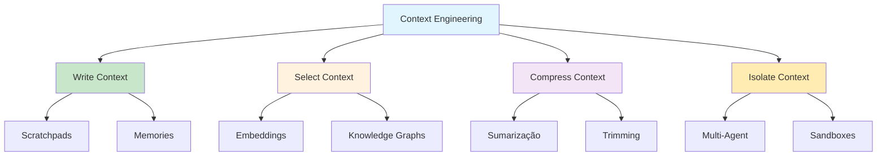

# [Context Engineering for Agents](/blog/context-engineering-for-agents)

> [!compass] **[IA](/blog/moc---ia)** » [Context Engineering](/blog/context-engineering) » Agentes

---

> [!info]+ Detalhes do Artigo
> **Ler:** [Context Engineering](https://blog.langchain.com/context-engineering-for-agents/)
> **Fonte:** [LangChain](/blog/langchain) (Blog Oficial)
> **Autores:** LangChain
> **Publicado:** 2 de julho de 2025

> [!abstract]+ Materiais Complementares
>
> **Artigos Relacionados**
> - [Efficient Context Management - JetBrains](https://blog.jetbrains.com/research/2025/12/efficient-context-management/) - Pesquisa complementar sobre estratégias de contexto
>
> **Ferramentas Mencionadas**
> - [LangGraph](https://langchain.com/langgraph) - Framework para construção de agentes
> - [LangSmith](https://langchain.com/langsmith) - Observabilidade e avaliação

> [!tip]- Léxico
>
> **Context Engineering**
> - [Context Window](/blog/context-window): Janela de contexto do LLM, comparada à RAM de um sistema operacional
> - [Scratchpad](/blog/scratchpad): Sistema de anotações que persiste informações durante uma tarefa
> - [Memory](/blog/memory): Informações que transcendem sessões individuais
>
> **Estratégias de Contexto**
> - [Write Context](/blog/write-context): Técnica de escrever/persistir informações relevantes
> - [Select Context](/blog/select-context): Recuperação seletiva via embeddings ou grafos
> - [Compress Context](/blog/compress-context): Sumarização e trimming de contexto
> - [Isolate Context](/blog/isolate-context): Divisão através de múltiplos agentes
>
> **Ferramentas e Tecnologias**
> - [LangGraph](/blog/langgraph): Framework para construção de agentes com gestão de estado
> - [LangSmith](/blog/langsmith): Plataforma de observabilidade para LLMs
> - [Claude Code](/blog/claude-code): Implementa auto-compact após 95% da janela

> [!question]- Pontos para Aprofundar
>
> - **Como implementar scratchpads eficientes em agentes custom?**
>     - Explorar patterns de LangGraph para persistência
> - **Qual o trade-off real entre multi-agent e custo de tokens?**
>     - Benchmarking com diferentes arquiteturas
> - **Como detectar context poisoning em produção?**
>     - Estratégias de validação e observabilidade

> [!robot]- Sugestões Complementares
>
> - **Leituras Recomendadas:**
>     - "Building LLM Applications" - LangChain docs
>     - Pesquisa JetBrains sobre context management
> - **Ferramentas Úteis:**
>     - **LangSmith** - monitoramento de contexto em produção
>     - **Claude Code** - exemplo de auto-compact implementation

---

## Resumo

Context engineering é a prática de preencher a janela de contexto com apenas as informações certas em cada etapa. O artigo usa a metáfora do LLM como sistema operacional, onde contexto funciona como RAM limitada. Apresenta quatro estratégias principais (Write, Select, Compress, Isolate) e documenta que a maioria das falhas de agentes hoje são falhas de contexto, não de modelo.

**Definição central:**
- **Context Engineering** = arte de gerenciar o que entra na janela de contexto do LLM
- **Problema abordado** = agentes falham por contexto mal gerenciado, não por limitações do modelo

---

## Principais Conceitos

### Conceito 1: As Quatro Estratégias de Context Engineering

| Estratégia | Descrição | Exemplo |
|:-----------|:----------|:--------|
| **Write** | Persistir informações fora da janela | Scratchpads, Memories |
| **Select** | Recuperar apenas o relevante | Embeddings, Knowledge Graphs |
| **Compress** | Reduzir tamanho mantendo essência | Sumarização, Trimming |
| **Isolate** | Dividir entre múltiplos agentes | Multi-agent systems |

### Conceito 2: Multi-Agent Superiority

> "Many agents with isolated contexts outperformed single-agent, because each subagent context window can be allocated to a more narrow sub-task."

Subagentes operam em paralelo com suas próprias janelas de contexto, explorando diferentes aspectos simultaneamente. Porém, o custo pode ser **15x maior** em tokens.

### Conceito 3: Context Failures (Drew Breunig)

Quatro modos de falha documentados:

1. **Context Poisoning:** Alucinações infiltradas no contexto
2. **Context Distraction:** Contexto excessivo sobrecarrega
3. **Context Confusion:** Contexto supérfluo influencia respostas
4. **Context Clash:** Partes conflitantes do contexto

---

## Detalhamento

### Seção 1: Write Context - Scratchpads e Memories

Scratchpads são sistemas de anotações que persistem informações fora da janela de contexto durante uma tarefa. Memories transcendem sessões, como implementado em ChatGPT e Cursor.

**Recomendações:**
- Implementar scratchpad para tarefas longas
- Usar memories para contexto persistente entre sessões
- Separar memória de curto e longo prazo

### Seção 2: Isolate Context - O Poder do Multi-Agent

> [!warning] Trade-off Crítico
> Multi-agent pode consumir até 15x mais tokens que single-agent. Avalie se a melhoria de performance justifica o custo.

**Princípios:**
- Cada subagente foca em subtarefa específica
- Contextos isolados evitam poluição cruzada
- Coordenação é o maior desafio

### Seção 3: A Nova Realidade

> [!quote] Insight Central
> "Most agent failures are not model failures anymore, they are context failures."

Cognition AI resumiu: context engineering é efetivamente o trabalho nº 1 de engenheiros construindo agentes de IA.

---

## Técnicas e Métodos

### Técnica 1: Auto-Compact (Claude Code Style)

**Conceito:** Comprimir automaticamente quando contexto atinge limiar

**Implementação:**
- Monitorar uso da janela de contexto
- Trigger em 95% de ocupação
- Sumarizar mensagens antigas mantendo ações recentes

> [!tip] Quick Win
> Implemente um contador de tokens e alerte antes de atingir o limite.

### Técnica 2: Selective Retrieval

**Conceito:** Buscar apenas informações relevantes via embeddings

**Exemplos:**
- RAG para documentação
- Knowledge graph para relações complexas

### Quando Usar Cada Técnica

| Técnica | Melhor para |
|:--------|:------------|
| **Scratchpad** | Tarefas longas com muitos passos |
| **Multi-agent** | Problemas decomponíveis em paralelo |
| **Compression** | Conversas extensas que excedem janela |
| **Selective** | Bases de conhecimento grandes |

---

## Mapa de Conceitos

Este diagrama mostra as conexões entre as quatro estratégias de context engineering e seus componentes principais.

---

## Como Aplicar

> **TL;DR:** Trate contexto como RAM escassa - escreva, selecione, comprima e isole estrategicamente.

### 🎯 Implementação Imediata
**Contexto:** Qualquer agente que executa mais de 10 turnos de conversa
**Faça agora:** Adicione monitoramento de tokens e implemente trimming de mensagens antigas após 70% da janela
**Sucesso =** Agente completa tarefas longas sem erro de contexto excedido

### 🔄 Outras Aplicações
- **RAG Systems:** Implemente selective retrieval → redução de tokens irrelevantes
- **Coding Agents:** Use multi-agent para análise/implementação/teste → melhor qualidade

### 🗑️ Ignorei
- Histórico do termo: irrelevante para aplicação
- Comparações de produtos: marketing

---

## Insights Pessoais

**O que aprendi:**
- Context failures são a nova fronteira de debugging de agentes
- Multi-agent não é sempre melhor - avaliar custo/benefício

**Como aplico no meu contexto:**
- Implementar métricas de contexto nos meus agentes
- Considerar arquitetura multi-agent para tarefas complexas

**Perguntas que surgiram:**
- Qual o threshold ideal para trigger de compression?
- Como medir "qualidade" do contexto além de tamanho?

---

## Ações / Próximos Passos

- [ ] Implementar contador de tokens em agentes existentes
- [ ] Testar arquitetura multi-agent vs single-agent em caso real
- [ ] Estudar implementação do auto-compact do Claude Code

---

## Recursos Adicionais

**Plataformas e Ferramentas:**
- [LangGraph](https://langchain.com/langgraph) - Framework para agentes
- [LangSmith](https://langchain.com/langsmith) - Observabilidade

**Artigos Complementares:**
- [JetBrains Research - Efficient Context Management](https://blog.jetbrains.com/research/2025/12/efficient-context-management/)

---

## Propriedades da nota

> [!note]- Propriedades Gerais do Obsidian
>
>> **Identificação**
>
> | Campo      | Valor                    |
> |:-----------|:-------------------------|
> | **Título** | `INPUT[text:titulo]`     |
>
>> **Conexões**
>
> | Campo           | Valor                                                                 |
> |:----------------|:----------------------------------------------------------------------|
> | **Pai**         | `INPUT[suggester(optionQuery("")):pai]`                               |
> | **Coleção**     | `INPUT[inlineSelect(option(financeiro, Financeiro), option(growth, Growth), option(ia, IA), option(lideranca, Liderança), option(marketing, Marketing), option(negocios, Negócios), option(produtividade, Produtividade), option(pkm, PKM), option(saas, SaaS), option(tecnologia, Tecnologia), option(vendas, Vendas)):colecao]` |
> | **Área**        | `INPUT[suggester(optionQuery("Esforços/Áreas")):area]`                         |
> | **Projeto**     | `INPUT[suggester(optionQuery("#projeto")):projeto]`                   |
> | **Autor**       | `INPUT[suggester(optionQuery("Atlas/Pessoas")):pessoa]`                      |
> | **Relacionado** | `INPUT[inlineListSuggester(optionQuery(""), useLinks(true)):relacionado]` |
>
>> **Classificação**
>
> | Campo      | Valor                                                                 |
> |:-----------|:----------------------------------------------------------------------|
> | **Tipo**   | `INPUT[inlineSelect(option(atomica, Atômica), option(aula, Aula), option(artigo, Artigo), option(checklist, Checklist), option(curso, Curso), option(dashboard, Dashboard), option(framework, Framework), option(livro, Livro), option(moc, MOC), option(newsletter, Newsletter), option(pessoa, Pessoa), option(prompt, Prompt), option(template, Template Obsidian), option(tutorial, Tutorial), option(video_youtube, Vídeo Youtube)):tipo_nota]` |
> | **Tags**   | `INPUT[inlineList:tags]`                                              |
> | **Status** | `INPUT[inlineSelect(option(nao_iniciado, ⬜ Não Iniciado), option(em_andamento, 🔄 Em Andamento), option(concluido, ✅ Concluído), option(pausado, ⏸️ Pausado), option(cancelado, ❌ Cancelado)):status]` |
>
>> **Temporal**
>
> | Campo          | Valor                      |
> |:---------------|:---------------------------|
> | **Criado**     | `INPUT[date:data_criado]`       |
> | **Atualizado** | `INPUT[date:data_atualizado]`   |

> [!note]- Propriedades do Artigo
>
> | Campo            | Valor                          |
> |:-----------------|:-------------------------------|
> | **URL**          | `INPUT[text(placeholder(https://...)):url_artigo]`  |
> | **Fonte**        | `INPUT[text:fonte]`  |
> | **Autor**        | `INPUT[text:autor]`  |
> | **Data Publicação** | `INPUT[date:data_publicacao]`  |

