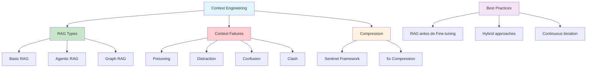

# [Context Engineering for Generative AI Systems - MentorCruise](/blog/context-engineering-for-generative-ai-systems---mentorcruise)

> [!compass] **[MyMess](/blog/moc---projeto-mymess)** » [Estudos](/blog/dashboard---estudos-mymess) » Engenharia de Contexto

---

> [!info]+ Detalhes do Artigo
> **Ler:** [Context Engineering for Generative AI Systems](https://mentorcruise.com/blog/context-engineering-for-generative-ai-systems/)
> **Fonte:** [MentorCruise](/blog/mentorcruise) (Blog)
> **Autores:** Sundeep Teki, PhD (ex-Amazon Alexa AI, Generative AI Coach)
> **Publicado:** 10 de Julho de 2025

> [!abstract]+ Materiais Complementares
>
> **Background do Autor**
> - Ex-pesquisador Amazon Alexa AI
> - Generative AI Coach no MentorCruise
> - PhD em IA
>
> **Framework Mencionado**
> - Sentinel Framework (2025) - Context Compression
>
> **Taxonomia**
> - Drew Breunig - 4 Context Failures

> [!tip]- Léxico
>
> **Conteúdo e Criação**
> - **Context-as-a-Compiler**: LLMs como compiladores onde contexto são libraries e type definitions
> - **Context is King**: Qualidade do contexto importa mais que capacidade do modelo
>
> **Conceitos Fundamentais**
> - **Sentinel Framework**: Proxy models com attention-probing para compressão até 5x
>
> **Tecnologia e IA**
> - **Context Failures**: Poisoning, Distraction, Confusion, Clash
> [!question]- Pontos para Aprofundar (Sugestão da IA)
>
> - **Como o Sentinel Framework atinge 5x de compressão?**
>     - Investigar attention-probing e proxy models
> - **Qual a diferença prática entre Agentic RAG e Graph RAG?**
>     - Comparar casos de uso e implementações
> - **Como detectar cada tipo de context failure?**
>     - Desenvolver diagnósticos por categoria

> [!robot]- Sugestões Complementares
>
> - **Leituras Recomendadas:**
>     - Sentinel Framework paper (2025)
>     - Drew Breunig sobre Context Failures
> - **Ferramentas Úteis:**
>     - **Vector databases** - Para RAG básico
>     - **Graph databases** - Para Graph RAG
> - **Exercícios Práticos:**
>     - Implementar cada tipo de RAG e comparar resultados
>     - Testar compressão de contexto com diferentes abordagens

---

## Resumo

Artigo técnico de **Sundeep Teki** (ex-Amazon Alexa AI) sobre **context engineering para sistemas de IA generativa**. Apresenta a evolução de prompt engineering para arquitetura de sistemas completos, introduz a analogia **"Context-as-a-Compiler"**, detalha 3 tipos de RAG, técnicas de compressão de contexto com resultado de **até 5x**, e uma taxonomia de 4 falhas de contexto.

**Princípio central:** "Context is King" - a qualidade do contexto fornecido frequentemente importa mais que a capacidade do próprio modelo.

---

## Principais Conceitos

### Paradigm Shift: Do Modelo para o Contexto

O campo evoluiu de focar na **escala do modelo** para **otimizar o ambiente de informação** ao redor dos modelos.

| Foco Anterior | Foco Atual |
|:--------------|:-----------|
| Escala do modelo | Qualidade do contexto |
| Mais parâmetros | Melhor informação |
| Modelo maior | Contexto mais rico |

### Context-as-a-Compiler

Uma analogia poderosa que posiciona:
- **LLMs** como compiladores traduzindo intenção humana em outputs executáveis
- **Contexto** como libraries, type definitions e variáveis de ambiente
- **Resultado**: Outputs confiáveis e determinísticos

### Os 4 Context Failures (Drew Breunig)

A tabela abaixo resume as informações principais.

| Failure | Descrição | Impacto |
|:--------|:----------|:--------|
| **Poisoning** | Erros repetidamente referenciados no contexto | Propagação de erros |
| **Distraction** | Contexto excessivamente longo | Modelo over-foca no contexto |
| **Confusion** | Informação supérflua | Degrada qualidade da resposta |
| **Clash** | Informação conflitante | Respostas contraditórias |

---

## Detalhamento

### 3 Tipos de RAG

#### 1. Basic RAG
Processo de 3 estágios usando embeddings e vector databases:
1. **Indexing**: Processar e indexar documentos
2. **Retrieval**: Recuperar chunks relevantes
3. **Augmentation/Generation**: Gerar resposta com contexto

#### 2. Agentic RAG
Sistemas autônomos com capacidades avançadas:
- **Planning**: Planejamento de ações
- **Tool Use**: Uso de ferramentas externas
- **Reflection**: Auto-reflexão e correção
- **Multi-agent Collaboration**: Colaboração entre agentes

#### 3. Graph RAG
Travessia estruturada de conhecimento:
- **Multi-hop reasoning**: Raciocínio em múltiplos saltos
- **Entity relationships**: Conexões entre entidades
- **Structured knowledge**: Conhecimento estruturado em grafo

### Context Compression: Sentinel Framework

> [!success] Resultado Mensurado
> **Até 5x de compressão de contexto** mantendo performance equivalente a sistemas não-comprimidos

**Como funciona:**
- Usa **lightweight proxy models** com **attention-probing**
- Identifica contexto relevante automaticamente
- Remove informação redundante preservando qualidade

### Estratégias de Mitigação

Para combater os 4 context failures:
- **RAG**: Grounding em conhecimento externo
- **Tool Loadout Curation**: Curadoria de ferramentas disponíveis
- **Context Quarantine**: Isolamento de contexto problemático
- **Pruning**: Poda de informação irrelevante
- **Summarization**: Sumarização de contexto longo
- **Offloading**: Transferência para armazenamento externo

---

## Mapa de Conceitos

O diagrama abaixo ilustra o fluxo do processo, mostrando as etapas e suas conexões.

---

## Insights & Aprendizados

**O que funcionou bem:**
- Analogia "Context-as-a-Compiler" muito útil para explicar o conceito
- Taxonomia clara de 4 failures facilita diagnóstico
- Métrica concreta: 5x de compressão com Sentinel Framework
- Progressão clara: Basic RAG → Agentic RAG → Graph RAG

**O que posso adaptar para o MyMess:**
- **Taxonomia de failures**: Implementar diagnóstico de cada tipo
- **Sentinel-like compression**: Investigar attention-probing
- **RAG progression**: Oferecer níveis de RAG conforme complexidade

**Ideias para aplicar:**
- Criar checklist de diagnóstico para os 4 context failures
- Implementar métricas de compressão de contexto
- Desenvolver biblioteca de técnicas de mitigação por tipo de failure

---

## Recursos Adicionais

- [MentorCruise - Context Engineering](https://mentorcruise.com/blog/context-engineering-for-generative-ai-systems/)
- Drew Breunig - Context Failures Taxonomy
- Sentinel Framework (2025) - Context Compression

---

## Propriedades da nota

> [!note]- Propriedades Gerais do Obsidian
>
>> **Identificação**
>
> | Campo | Valor |
> |:------|:------|
> | **Título** | `INPUT[text:titulo]` |
>
>> **Conexões**
>
> | Campo | Valor |
> |:------|:------|
> | **Pai** | `INPUT[suggester(optionQuery("")):pai]` |
> | **Coleção** | `INPUT[inlineSelect(option(financeiro, Financeiro), option(growth, Growth), option(ia, IA), option(lideranca, Liderança), option(marketing, Marketing), option(negocios, Negócios), option(produtividade, Produtividade), option(pkm, PKM), option(saas, SaaS), option(tecnologia, Tecnologia), option(vendas, Vendas)):colecao]` |
> | **Área** | `INPUT[suggester(optionQuery("Esforços/Áreas")):area]` |
> | **Projeto** | `INPUT[suggester(optionQuery("#projeto")):projeto]` |
> | **Autor** | `INPUT[suggester(optionQuery("Atlas/Pessoas")):pessoa]` |
> | **Relacionado** | `INPUT[inlineListSuggester(optionQuery(""), useLinks(true)):relacionado]` |
>
>> **Classificação**
>
> | Campo | Valor |
> |:------|:------|
> | **Tipo** | `INPUT[inlineSelect(option(atomica, Atômica), option(aula, Aula), option(artigo, Artigo), option(checklist, Checklist), option(curso, Curso), option(dashboard, Dashboard), option(framework, Framework), option(livro, Livro), option(moc, MOC), option(newsletter, Newsletter), option(pessoa, Pessoa), option(prompt, Prompt), option(template, Template Obsidian), option(tutorial, Tutorial), option(video_youtube, Vídeo Youtube)):tipo_nota]` |
> | **Tags** | `INPUT[inlineList:tags]` |
> | **Status** | `INPUT[inlineSelect(option(nao_iniciado, ⬜ Não Iniciado), option(em_andamento, 🔄 Em Andamento), option(concluido, ✅ Concluído), option(pausado, ⏸️ Pausado), option(cancelado, ❌ Cancelado)):status]` |
>
>> **Temporal**
>
> | Campo | Valor |
> |:------|:------|
> | **Criado** | `INPUT[date:data_criado]` |
> | **Atualizado** | `INPUT[date:data_atualizado]` |

> [!note]- Propriedades SaaS
>
> | Campo | Valor |
> |:------|:------|
> | **Mostrar Bloco** | `INPUT[toggle(onValue(true), offValue(false)):mostrar_bloco_saas]` |
> | **Status SaaS** | `INPUT[toggle(onValue(true), offValue(false)):status_saas]` |

> [!note]- Propriedades do Artigo
>
> | Campo | Valor |
> |:------|:------|
> | **URL** | `INPUT[text(placeholder(https://...)):url_artigo]` |
> | **Fonte** | `INPUT[text:fonte]` |
> | **Autor** | `INPUT[text:autor]` |
> | **Data Publicação** | `INPUT[date:data_publicacao]` |
> | **Tipo Conteúdo** | `INPUT[inlineSelect(option(educacional, Educacional), option(curadoria, Curadoria), option(historia, História Pessoal), option(listicle, Lista), option(contrarian, Opinião Contrária), option(tutorial, Tutorial), option(entrevista, Entrevista), option(analise, Análise), option(estudo_de_caso, Estudo de Caso), option(lancamento, Lançamento), option(opiniao, Opinião), option(outro, Outro)):tipo_conteudo]` |

