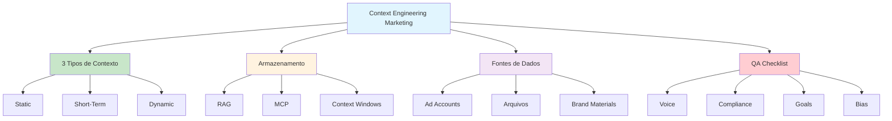

# [Context Engineering for Performance Marketers - Pixis AI](/blog/context-engineering-for-performance-marketers---pixis-ai)

> [!compass] **[MyMess](/blog/moc---projeto-mymess)** » [Estudos](/blog/dashboard---estudos-mymess) » Engenharia de Contexto

---

> [!info]+ Detalhes do Artigo
> **Ler:** [Context Engineering for Performance Marketers: A Practical Guide](https://pixis.ai/blog/context-engineering-for-performance-marketers-a-practical-guide/)
> **Fonte:** [Pixis AI](/blog/pixis-ai) (Guia Prático)
> **Autores:** Ben Crespin (Solution Engineer @ Pixis)
> **Publicado:** 28 de Agosto de 2025

> [!abstract]+ Materiais Complementares
>
> **Plataformas de Ads Mencionadas**
> - Google Ads
> - Meta Ads
> - TikTok Ads
>
> **Métodos de Armazenamento**
> - RAG (Retrieval-Augmented Generation)
> - MCP (Model Context Protocol)
> - Context Windows
>
> **Fontes de Dados**
> - Conexões de ad accounts
> - Arquivos e planilhas
> - Brand guidelines

> [!tip]- Léxico
>
> **Tecnologia e IA**
> - **Static Context**: Informação que raramente muda (brand guidelines, ICPs)
> - **Short-Term Context**: Informação específica por tarefa (uploads, prompts)
> - **MCP**: Model Context Protocol para conexões em tempo real
>
> **Métricas e Indicadores**
> - **Dynamic Context**: Dados em tempo real via APIs (ad accounts, métricas)
> [!question]- Pontos para Aprofundar (Sugestão da IA)
>
> - **Como estruturar Static Context para marketing?**
>     - Investigar templates de brand guidelines para IA
> - **Qual a melhor forma de integrar ad accounts via MCP?**
>     - Explorar conectores disponíveis
> - **Como automatizar QA de outputs de marketing?**
>     - Desenvolver checklist automatizado

> [!robot]- Sugestões Complementares
>
> - **Leituras Recomendadas:**
>     - Documentação MCP
>     - Best practices de cada ad platform
> - **Ferramentas Úteis:**
>     - **Pixis AI** - Plataforma de marketing com IA
>     - **Google Ads API** - Integração direta
>     - **Meta Marketing API** - Dados de campanhas
> - **Exercícios Práticos:**
>     - Criar template de Static Context para uma marca
>     - Configurar integração MCP com ad account

---

## Resumo

Guia prático de **Ben Crespin** (Pixis) sobre **context engineering aplicado a performance marketing**. Apresenta **3 tipos de contexto** (Static, Short-Term, Dynamic), métodos de armazenamento (RAG, MCP, Context Windows), fontes de dados relevantes para marketing, exemplos de prompts práticos e um **QA checklist** para validação de outputs.

**Insight central:** Context engineering complementa prompt engineering ao fornecer à IA a informação de negócio necessária, permitindo prompts mais simples e outputs de maior qualidade.

---

## Principais Conceitos

### Os 3 Tipos de Contexto

A tabela abaixo resume as informações principais.

| Tipo | Descrição | Exemplos |
|:-----|:----------|:---------|
| **Static** | Informação que raramente muda | Brand guidelines, UVPs, ICPs, lista de concorrentes, descrições de produto |
| **Short-Term** | Informação específica por tarefa | Prompts, arquivos uploaded, dados da sessão |
| **Dynamic** | Dados em tempo real via APIs | Métricas de ads, performance em tempo real, dados de campanhas |

### Métodos de Armazenamento de Contexto

A tabela a seguir detalha os campos e seus valores.

| Método | Uso | Atualização |
|:-------|:----|:------------|
| **Short-term memory** | Chat threads | Por sessão |
| **RAG** | Bases de conhecimento | Periódica |
| **MCP** | Conexões de sistema | Tempo real |
| **Context windows** | Informação ativa | Por interação |

---

## Detalhamento

### Fontes de Dados Mais Relevantes para Marketing

1. **Conexões de Ad Accounts**
   - Google Ads
   - Meta Ads
   - TikTok Ads

2. **Arquivos e Planilhas**
   - Excel
   - PowerPoint
   - Google Sheets

3. **Materiais de Marca**
   - Exemplos de criativos vencedores
   - Brand guidelines
   - Regras de compliance

4. **Restrições de Negócio**
   - Budget constraints
   - Audience exclusions
   - Limitações de plataforma

### Prompts Práticos para Marketing

Os dados abaixo mostram a estrutura e configurações.

| Caso de Uso | Prompt |
|:------------|:-------|
| **Budget Reallocation** | Recomendações de realocação de budget |
| **Creative Fatigue** | Identificação de fadiga de criativos |
| **Wasted Spend** | Auditoria de gasto desperdiçado |
| **Anomaly Analysis** | Análise e diagnóstico de anomalias |
| **Audience Expansion** | Sugestões de expansão de audiência |

### QA Checklist para Outputs

Validação essencial antes de usar outputs de IA:

- [ ] **Voice Alignment**: Tom alinhado com a marca
- [ ] **Platform Compliance**: Conformidade com regras da plataforma
- [ ] **Goal Alignment**: Alinhamento com objetivos da campanha
- [ ] **Bias Avoidance**: Evitar estereótipos e viés

---

## Mapa de Conceitos

O diagrama abaixo ilustra o fluxo do processo, mostrando as etapas e suas conexões.

---

## Insights & Aprendizados

**O que funcionou bem:**
- Framework claro de 3 tipos de contexto
- Exemplos práticos específicos para marketing
- QA checklist actionable
- Conexão clara entre context engineering e prompt engineering

**O que posso adaptar para o MyMess:**
- **Tipologia de contexto**: Aplicar Static/Short-Term/Dynamic em outros domínios
- **QA checklist**: Criar checklists específicos por tipo de cliente
- **MCP integrations**: Explorar conectores para diferentes plataformas

**Ideias para aplicar:**
- Criar templates de Static Context por vertical de cliente
- Implementar QA automatizado baseado no checklist
- Desenvolver conectores MCP para plataformas populares de marketing

---

## Recursos Adicionais

- [Pixis AI - Context Engineering for Performance Marketers](https://pixis.ai/blog/context-engineering-for-performance-marketers-a-practical-guide/)
- [Pixis AI Platform](https://pixis.ai)
- [MCP Documentation](https://modelcontextprotocol.io)

---

## Propriedades da nota

> [!note]- Propriedades Gerais do Obsidian
>
>> **Identificação**
>
> | Campo | Valor |
> |:------|:------|
> | **Título** | `INPUT[text:titulo]` |
>
>> **Conexões**
>
> | Campo | Valor |
> |:------|:------|
> | **Pai** | `INPUT[suggester(optionQuery("")):pai]` |
> | **Coleção** | `INPUT[inlineSelect(option(financeiro, Financeiro), option(growth, Growth), option(ia, IA), option(lideranca, Liderança), option(marketing, Marketing), option(negocios, Negócios), option(produtividade, Produtividade), option(pkm, PKM), option(saas, SaaS), option(tecnologia, Tecnologia), option(vendas, Vendas)):colecao]` |
> | **Área** | `INPUT[suggester(optionQuery("Esforços/Áreas")):area]` |
> | **Projeto** | `INPUT[suggester(optionQuery("#projeto")):projeto]` |
> | **Autor** | `INPUT[suggester(optionQuery("Atlas/Pessoas")):pessoa]` |
> | **Relacionado** | `INPUT[inlineListSuggester(optionQuery(""), useLinks(true)):relacionado]` |
>
>> **Classificação**
>
> | Campo | Valor |
> |:------|:------|
> | **Tipo** | `INPUT[inlineSelect(option(atomica, Atômica), option(aula, Aula), option(artigo, Artigo), option(checklist, Checklist), option(curso, Curso), option(dashboard, Dashboard), option(framework, Framework), option(livro, Livro), option(moc, MOC), option(newsletter, Newsletter), option(pessoa, Pessoa), option(prompt, Prompt), option(template, Template Obsidian), option(tutorial, Tutorial), option(video_youtube, Vídeo Youtube)):tipo_nota]` |
> | **Tags** | `INPUT[inlineList:tags]` |
> | **Status** | `INPUT[inlineSelect(option(nao_iniciado, ⬜ Não Iniciado), option(em_andamento, 🔄 Em Andamento), option(concluido, ✅ Concluído), option(pausado, ⏸️ Pausado), option(cancelado, ❌ Cancelado)):status]` |
>
>> **Temporal**
>
> | Campo | Valor |
> |:------|:------|
> | **Criado** | `INPUT[date:data_criado]` |
> | **Atualizado** | `INPUT[date:data_atualizado]` |

> [!note]- Propriedades SaaS
>
> | Campo | Valor |
> |:------|:------|
> | **Mostrar Bloco** | `INPUT[toggle(onValue(true), offValue(false)):mostrar_bloco_saas]` |
> | **Status SaaS** | `INPUT[toggle(onValue(true), offValue(false)):status_saas]` |

> [!note]- Propriedades do Artigo
>
> | Campo | Valor |
> |:------|:------|
> | **URL** | `INPUT[text(placeholder(https://...)):url_artigo]` |
> | **Fonte** | `INPUT[text:fonte]` |
> | **Autor** | `INPUT[text:autor]` |
> | **Data Publicação** | `INPUT[date:data_publicacao]` |
> | **Tipo Conteúdo** | `INPUT[inlineSelect(option(educacional, Educacional), option(curadoria, Curadoria), option(historia, História Pessoal), option(listicle, Lista), option(contrarian, Opinião Contrária), option(tutorial, Tutorial), option(entrevista, Entrevista), option(analise, Análise), option(estudo_de_caso, Estudo de Caso), option(lancamento, Lançamento), option(opiniao, Opinião), option(outro, Outro)):tipo_conteudo]` |

