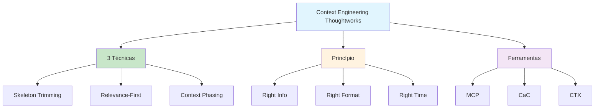

# [Context Engineering Give AI What It Needs - Thoughtworks](/blog/context-engineering-give-ai-what-it-needs---thoughtworks)

> [!compass] **[MyMess](/blog/moc---projeto-mymess)** » [Estudos](/blog/dashboard---estudos-mymess) » Engenharia de Contexto

---

> [!info]+ Detalhes do Artigo
> **Ler:** [Context engineering: How to give AI exactly what it needs](https://www.thoughtworks.com/en-br/insights/blog/generative-ai/context-engineering-give-ai-what-needs)
> **Fonte:** [Thoughtworks](/blog/thoughtworks) (Blog)
> **Autores:** Rohit Biswal
> **Publicado:** 28 de Agosto de 2025

> [!abstract]+ Materiais Complementares
>
> **Técnicas Principais**
> - Skeleton Trimming
> - Relevance-First File Selection
> - Context Phasing
>
> **Ferramentas Mencionadas**
> - MCP (Model Context Protocol)
> - Code-as-Context (CaC)
> - Context Engines (CTX)

> [!tip]- Léxico
>
> **Tecnologia e IA**
> - **Skeleton Trimming**: Manter estrutura essencial removendo implementação
> - **Context Phasing**: Entregar informação em estágios (setup → structure → detail)
>
> **Outros Conceitos**
> - **Relevance-First**: Categorizar inputs em must-haves, conditional extras, irrelevant
>
> **Ferramentas e Recursos**
> - **Token Budget**: Tratar tokens como recursos premium
> [!question]- Pontos para Aprofundar (Sugestão da IA)
>
> - **Como implementar Skeleton Trimming automaticamente?**
>     - Investigar ferramentas de parsing de código
> - **Qual o impacto de Context Phasing na latência?**
>     - Medir múltiplas chamadas vs uma grande
> - **Como definir critérios de relevância?**
>     - Desenvolver scoring system

> [!robot]- Sugestões Complementares
>
> - **Leituras Recomendadas:**
>     - Documentação MCP
>     - Context Engines (CTX) docs
> - **Ferramentas Úteis:**
>     - **MCP** - Model Context Protocol
>     - **Code-as-Context** - Para código
> - **Exercícios Práticos:**
>     - Aplicar Skeleton Trimming em projeto real
>     - Comparar respostas com e sem Context Phasing

---

## Resumo

Artigo da **Thoughtworks** por **Rohit Biswal** sobre como dar à IA **exatamente o que ela precisa**. Apresenta um insight contraintuitivo: **fornecer contexto excessivo frequentemente degrada performance**. Introduz 3 técnicas principais: **Skeleton Trimming**, **Relevance-First File Selection** e **Context Phasing**.

**Princípio central:** "The right information, in the right format, at the right time" - entregar a informação certa, no formato certo, no momento certo.

---

## Principais Conceitos

### Insight Contraintuitivo

> [!warning] Menos é Mais
> Fornecer **contexto excessivo** frequentemente **degrada** a performance da IA, em vez de melhorá-la.

A abordagem estratégica foca em entregar **apenas informação relevante**, tratando tokens como recursos premium.

### As 3 Técnicas Principais

A tabela abaixo resume as informações principais.

| Técnica | Descrição | Benefício |
|:--------|:----------|:----------|
| **Skeleton Trimming** | Manter estrutura (assinaturas, classes, anotações), remover implementação | Reduz tokens drasticamente |
| **Relevance-First** | Categorizar em must-haves, conditional extras, irrelevant | Foco no essencial |
| **Context Phasing** | Entregar em estágios: setup → structure → detail | Progressão natural |

---

## Detalhamento

### 1. Skeleton Trimming

Reter apenas a **estrutura essencial** do código:
- Assinaturas de métodos
- Declarações de classes
- Anotações
- Interfaces

**Remover:**
- Detalhes de implementação
- Corpo de funções
- Lógica de negócio detalhada

### 2. Relevance-First File Selection

Categorizar inputs em 3 níveis:

| Categoria | Descrição | Ação |
|:----------|:----------|:-----|
| **Must-haves** | Definem diretamente a tarefa | Sempre incluir |
| **Conditional extras** | Dependem da tarefa | Incluir se relevante |
| **Irrelevant** | Não contribuem | Excluir completamente |

### 3. Context Phasing

Entregar informação em **estágios progressivos**:

```
1. SETUP     → Objetivos de alto nível
2. STRUCTURE → Modelos e interfaces
3. DETAIL    → Especificações de implementação
```

> [!tip] Benefício
> Evita sobrecarregar o modelo com tudo de uma vez, permitindo processamento mais estruturado.

### Ferramentas do Ecossistema

A tabela a seguir detalha os campos e seus valores.

| Ferramenta | Função |
|:-----------|:-------|
| **MCP** | Model Context Protocol para integração |
| **Code-as-Context (CaC)** | Contexto otimizado para código |
| **Context Engines (CTX)** | Motores de gerenciamento de contexto |

---

## Mapa de Conceitos

O diagrama abaixo ilustra o fluxo do processo, mostrando as etapas e suas conexões.



---

## Insights & Aprendizados

**O que funcionou bem:**
- Insight contraintuitivo de que menos contexto = melhor
- 3 técnicas práticas e actionáveis
- Analogia de "token budget" como recurso premium
- Ferramentas específicas mencionadas

**O que posso adaptar para o MyMess:**
- **Skeleton Trimming**: Aplicar em análise de código para clientes
- **Relevance-First**: Framework de categorização de inputs
- **Context Phasing**: Estruturar entregas em estágios

**Ideias para aplicar:**
- Criar parser automático para Skeleton Trimming
- Implementar scoring de relevância
- Desenvolver pipeline de Context Phasing

---

## Recursos Adicionais

- [Thoughtworks - Context Engineering](https://www.thoughtworks.com/en-br/insights/blog/generative-ai/context-engineering-give-ai-what-needs)
- [Model Context Protocol](https://modelcontextprotocol.io)

---

## Propriedades da nota

> [!note]- Propriedades Gerais do Obsidian
>
>> **Identificação**
>
> | Campo | Valor |
> |:------|:------|
> | **Título** | `INPUT[text:titulo]` |
>
>> **Conexões**
>
> | Campo | Valor |
> |:------|:------|
> | **Pai** | `INPUT[suggester(optionQuery("")):pai]` |
> | **Coleção** | `INPUT[inlineSelect(option(financeiro, Financeiro), option(growth, Growth), option(ia, IA), option(lideranca, Liderança), option(marketing, Marketing), option(negocios, Negócios), option(produtividade, Produtividade), option(pkm, PKM), option(saas, SaaS), option(tecnologia, Tecnologia), option(vendas, Vendas)):colecao]` |
> | **Área** | `INPUT[suggester(optionQuery("Esforços/Áreas")):area]` |
> | **Projeto** | `INPUT[suggester(optionQuery("#projeto")):projeto]` |
> | **Autor** | `INPUT[suggester(optionQuery("Atlas/Pessoas")):pessoa]` |
> | **Relacionado** | `INPUT[inlineListSuggester(optionQuery(""), useLinks(true)):relacionado]` |
>
>> **Classificação**
>
> | Campo | Valor |
> |:------|:------|
> | **Tipo** | `INPUT[inlineSelect(option(atomica, Atômica), option(aula, Aula), option(artigo, Artigo), option(checklist, Checklist), option(curso, Curso), option(dashboard, Dashboard), option(framework, Framework), option(livro, Livro), option(moc, MOC), option(newsletter, Newsletter), option(pessoa, Pessoa), option(prompt, Prompt), option(template, Template Obsidian), option(tutorial, Tutorial), option(video_youtube, Vídeo Youtube)):tipo_nota]` |
> | **Tags** | `INPUT[inlineList:tags]` |
> | **Status** | `INPUT[inlineSelect(option(nao_iniciado, ⬜ Não Iniciado), option(em_andamento, 🔄 Em Andamento), option(concluido, ✅ Concluído), option(pausado, ⏸️ Pausado), option(cancelado, ❌ Cancelado)):status]` |
>
>> **Temporal**
>
> | Campo | Valor |
> |:------|:------|
> | **Criado** | `INPUT[date:data_criado]` |
> | **Atualizado** | `INPUT[date:data_atualizado]` |

> [!note]- Propriedades SaaS
>
> | Campo | Valor |
> |:------|:------|
> | **Mostrar Bloco** | `INPUT[toggle(onValue(true), offValue(false)):mostrar_bloco_saas]` |
> | **Status SaaS** | `INPUT[toggle(onValue(true), offValue(false)):status_saas]` |

> [!note]- Propriedades do Artigo
>
> | Campo | Valor |
> |:------|:------|
> | **URL** | `INPUT[text(placeholder(https://...)):url_artigo]` |
> | **Fonte** | `INPUT[text:fonte]` |
> | **Autor** | `INPUT[text:autor]` |
> | **Data Publicação** | `INPUT[date:data_publicacao]` |
> | **Tipo Conteúdo** | `INPUT[inlineSelect(option(educacional, Educacional), option(curadoria, Curadoria), option(historia, História Pessoal), option(listicle, Lista), option(contrarian, Opinião Contrária), option(tutorial, Tutorial), option(entrevista, Entrevista), option(analise, Análise), option(estudo_de_caso, Estudo de Caso), option(lancamento, Lançamento), option(opiniao, Opinião), option(outro, Outro)):tipo_conteudo]` |

