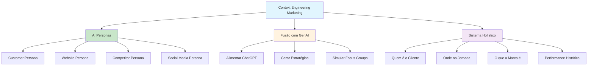

# [Context Engineering in Marketing - Delve AI](/blog/context-engineering-in-marketing---delve-ai)

> [!compass] **[MyMess](/blog/moc---projeto-mymess)** » [Estudos](/blog/dashboard---estudos-mymess) » Engenharia de Contexto

---

> [!info]+ Detalhes do Artigo
> **Ler:** [Does Context Engineering Work in Marketing?](https://www.delve.ai/blog/context-engineering-marketing)
> **Fonte:** [Delve AI](/blog/delve-ai) (Blog)
> **Autores:** Delve AI Team
> **Publicado:** Julho 2025

> [!abstract]+ Materiais Complementares
>
> **Produtos Delve AI**
> - Customer Persona (CRM data)
> - Social Media Persona
> - Website Persona (Google Analytics)
> - Competitor Persona
>
> **Referências**
> - Christina J. Inge (Harvard) - Marketing AI & Analytics News
>
> **Integrações**
> - HubSpot CRM
> - Google Analytics
> - Social Media handles

> [!tip]- Léxico
>
> **Tecnologia e IA**
> - **AI-Generated Persona**: Personas construídas por IA analisando dados públicos e privados
>
> **Técnicas e Estratégias**
> - **Persona-to-AI Fusion**: Alimentar personas em ChatGPT para estratégias de marketing
>
> **Ferramentas e Recursos**
> - **Interconnected System**: Sistema holístico que entende cliente, jornada, marca e histórico
>
> **Outros Conceitos**
> - **40+ Data Sources**: Combinação de first-party, second-party e dados públicos
> [!question]- Pontos para Aprofundar (Sugestão da IA)
>
> - **Como integrar personas geradas com IA em workflows de marketing?**
>     - Explorar integrações com ChatGPT/Claude
> - **Qual a diferença entre personas tradicionais e AI-generated?**
>     - Comparar metodologias e resultados
> - **Como medir eficácia de context engineering em campanhas?**
>     - Desenvolver métricas de conversão

> [!robot]- Sugestões Complementares
>
> - **Leituras Recomendadas:**
>     - Christina J. Inge no LinkedIn
>     - Delve AI blog sobre buyer personas
> - **Ferramentas Úteis:**
>     - **Delve AI** - AI Persona Generator
>     - **ChatGPT/Claude** - Para estratégias derivadas
> - **Exercícios Práticos:**
>     - Criar persona com Delve AI e alimentar no ChatGPT
>     - Gerar calendário de conteúdo baseado em persona

---

## Resumo

Artigo da **Delve AI** explorando se **context engineering funciona em marketing**. O artigo argumenta que a fusão entre **personas geradas por IA** e **modelos generativos** como ChatGPT é a essência de context engineering em marketing. Destaca que marketers precisam construir **sistemas interconectados** que entendem cliente, jornada, marca e performance histórica.

**Pergunta central:** "Context engineering é apenas para coding e customer service, ou pode ser usado em marketing?"

---

## Principais Conceitos

### Context Engineering em Marketing

Diferente de usar ferramentas de IA isoladamente, context engineering em marketing envolve:
- **Sincronia de dados**: Conectar múltiplas fontes
- **Memória contextual**: Manter histórico de interações
- **Ferramentas integradas**: Combinar personas com IA generativa
- **Intenção do usuário**: Entender onde o cliente está na jornada

### AI-Generated Personas

A tabela abaixo resume as informações principais.

| Característica | Descrição |
|:---------------|:----------|
| **Construção** | IA e ML analisando dados públicos e privados |
| **Conteúdo** | Goals, pain points, hobbies, interesses, padrões de compra |
| **Velocidade** | Criação mais rápida que métodos tradicionais |
| **Precisão** | Baseado em dados reais, não suposições |

### Produtos Delve AI

A tabela a seguir detalha os campos e seus valores.

| Produto | Fonte de Dados |
|:--------|:---------------|
| **Customer Persona** | CRM data |
| **Social Media Persona** | Social handles |
| **Website Persona** | Google Analytics |
| **Competitor Persona** | Competitor domains |

---

## Detalhamento

### A Fusão Persona + IA Generativa

Christina J. Inge (Harvard) demonstrou o workflow:

1. **Gerar personas** com Delve AI usando dados do website
2. **Alimentar personas** no ChatGPT como contexto
3. **Criar outputs**:
   - Calendários de conteúdo
   - Estratégias de mensagens
   - Simulações de focus group

> [!success] Insight Central
> "Esta fusão entre personas e IA generativa, onde uma ferramenta alimenta texto rico em dados em outra para criar estratégia de marketing, é o que context engineering em marketing significa."

### O que Context Engineering NÃO é em Marketing

Os dados abaixo mostram a estrutura e configurações.

| Abordagem Errada | Abordagem Correta |
|:-----------------|:------------------|
| Usar ChatGPT isoladamente | Sistema interconectado |
| Prompts genéricos | Contexto rico de persona |
| Dados fragmentados | 40+ fontes integradas |
| Ferramentas isoladas | Workflow conectado |

### Sistema Holístico de Marketing

Para context engineering efetivo, o sistema deve entender:
- **Quem é o cliente** (persona completa)
- **Onde está na jornada** (awareness → consideration → decision)
- **O que a marca representa** (brand guidelines)
- **Performance histórica** (o que funcionou antes)

---

## Mapa de Conceitos

O diagrama abaixo ilustra o fluxo do processo, mostrando as etapas e suas conexões.

---

## Insights & Aprendizados

**O que funcionou bem:**
- Conexão clara entre personas e context engineering
- Exemplo prático de workflow (Delve AI → ChatGPT)
- Validação de Harvard (Christina J. Inge)
- Distinção entre uso isolado vs sistema integrado

**O que posso adaptar para o MyMess:**
- **Persona-to-AI Fusion**: Oferecer como serviço para clientes
- **Sistema holístico**: Desenvolver framework de 4 dimensões
- **40+ data sources**: Integrar múltiplas fontes para clientes

**Ideias para aplicar:**
- Criar workflow de "Persona → Contexto → Estratégia"
- Desenvolver templates de integração Delve AI + Claude
- Implementar tracking de jornada do cliente como contexto

---

## Recursos Adicionais

- [Delve AI - Context Engineering Marketing](https://www.delve.ai/blog/context-engineering-marketing)
- [Delve AI - AI Persona Generator](https://www.delve.ai/ai-persona-generator)
- [Delve AI - How to Create Personas with AI](https://www.delve.ai/blog/ai-generated-persona)
- [Christina J. Inge - LinkedIn](https://www.linkedin.com/in/christinainge/)

---

## Propriedades da nota

> [!note]- Propriedades Gerais do Obsidian
>
>> **Identificação**
>
> | Campo | Valor |
> |:------|:------|
> | **Título** | `INPUT[text:titulo]` |
>
>> **Conexões**
>
> | Campo | Valor |
> |:------|:------|
> | **Pai** | `INPUT[suggester(optionQuery("")):pai]` |
> | **Coleção** | `INPUT[inlineSelect(option(financeiro, Financeiro), option(growth, Growth), option(ia, IA), option(lideranca, Liderança), option(marketing, Marketing), option(negocios, Negócios), option(produtividade, Produtividade), option(pkm, PKM), option(saas, SaaS), option(tecnologia, Tecnologia), option(vendas, Vendas)):colecao]` |
> | **Área** | `INPUT[suggester(optionQuery("Esforços/Áreas")):area]` |
> | **Projeto** | `INPUT[suggester(optionQuery("#projeto")):projeto]` |
> | **Autor** | `INPUT[suggester(optionQuery("Atlas/Pessoas")):pessoa]` |
> | **Relacionado** | `INPUT[inlineListSuggester(optionQuery(""), useLinks(true)):relacionado]` |
>
>> **Classificação**
>
> | Campo | Valor |
> |:------|:------|
> | **Tipo** | `INPUT[inlineSelect(option(atomica, Atômica), option(aula, Aula), option(artigo, Artigo), option(checklist, Checklist), option(curso, Curso), option(dashboard, Dashboard), option(framework, Framework), option(livro, Livro), option(moc, MOC), option(newsletter, Newsletter), option(pessoa, Pessoa), option(prompt, Prompt), option(template, Template Obsidian), option(tutorial, Tutorial), option(video_youtube, Vídeo Youtube)):tipo_nota]` |
> | **Tags** | `INPUT[inlineList:tags]` |
> | **Status** | `INPUT[inlineSelect(option(nao_iniciado, ⬜ Não Iniciado), option(em_andamento, 🔄 Em Andamento), option(concluido, ✅ Concluído), option(pausado, ⏸️ Pausado), option(cancelado, ❌ Cancelado)):status]` |
>
>> **Temporal**
>
> | Campo | Valor |
> |:------|:------|
> | **Criado** | `INPUT[date:data_criado]` |
> | **Atualizado** | `INPUT[date:data_atualizado]` |

> [!note]- Propriedades SaaS
>
> | Campo | Valor |
> |:------|:------|
> | **Mostrar Bloco** | `INPUT[toggle(onValue(true), offValue(false)):mostrar_bloco_saas]` |
> | **Status SaaS** | `INPUT[toggle(onValue(true), offValue(false)):status_saas]` |

> [!note]- Propriedades do Artigo
>
> | Campo | Valor |
> |:------|:------|
> | **URL** | `INPUT[text(placeholder(https://...)):url_artigo]` |
> | **Fonte** | `INPUT[text:fonte]` |
> | **Autor** | `INPUT[text:autor]` |
> | **Data Publicação** | `INPUT[date:data_publicacao]` |
> | **Tipo Conteúdo** | `INPUT[inlineSelect(option(educacional, Educacional), option(curadoria, Curadoria), option(historia, História Pessoal), option(listicle, Lista), option(contrarian, Opinião Contrária), option(tutorial, Tutorial), option(entrevista, Entrevista), option(analise, Análise), option(estudo_de_caso, Estudo de Caso), option(lancamento, Lançamento), option(opiniao, Opinião), option(outro, Outro)):tipo_conteudo]` |

