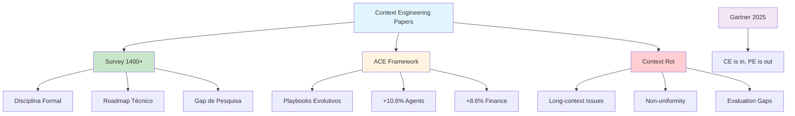

# [Context Engineering Papers - alphaXiv](/blog/context-engineering-papers---alphaxiv)

> [!compass] **[MyMess](/blog/moc---projeto-mymess)** » [Estudos](/blog/dashboard---estudos-mymess) » Engenharia de Contexto

---

> [!info]+ Detalhes do Artigo
> **Ler:** [alphaXiv - Context Engineering Papers](https://www.alphaxiv.org/?organizations=Shenzhen+Key+Laboratory+for+High+Performance+Data+Mining)
> **Fonte:** [alphaXiv](/blog/alphaxiv) / [arXiv](/blog/arxiv) (Listagem de Papers)
> **Autores:** Diversos (Academia Chinesa de Ciências, UC Merced, Peking, Tsinghua, Queensland)
> **Publicado:** 2025

> [!abstract]+ Materiais Complementares
>
> **Papers Principais**
> - A Survey of Context Engineering for Large Language Models (arXiv:2507.13334)
> - Agentic Context Engineering (ACE) (arXiv:2510.04618)
> - Context Rot (Chroma Research)
>
> **Instituições**
> - Institute of Computing Technology, Chinese Academy of Sciences
> - University of California Merced
> - The University of Queensland
> - Peking University
> - Tsinghua University
>
> **Métricas Citadas**
> - 1400+ papers analisados no survey
> - +10.6% em agents com ACE
> - +8.6% em finance com ACE

> [!tip]- Léxico
>
> **Tecnologia e IA**
> - **Context Rot**: Degradação de performance com aumento de input
> - **Brevity Bias**: Tendência de resumos perderem insights de domínio
> - **Context Collapse**: Erosão de detalhes em reescrita iterativa
>
> **Elementos Visuais**
> - **Context Engineering Survey**: Disciplina formal que transcende prompt design
>
> **Conteúdo e Criação**
> - **ACE (Agentic Context Engineering)**: Contextos como playbooks evolutivos
> [!question]- Pontos para Aprofundar (Sugestão da IA)
>
> - **Qual a taxonomia completa do survey de 1400+ papers?**
>     - Ler o survey completo
> - **Como ACE supera brevity bias e context collapse?**
>     - Investigar mecanismo de curadoria
> - **O que causa context rot em long-context?**
>     - Explorar pesquisa Chroma

> [!robot]- Sugestões Complementares
>
> - **Leituras Recomendadas:**
>     - Survey completo arXiv:2507.13334
>     - ACE paper arXiv:2510.04618
>     - Chroma Research sobre Context Rot
> - **Ferramentas Úteis:**
>     - **arXiv** - Acesso aos papers
>     - **alphaXiv** - Agregação de papers
> - **Exercícios Práticos:**
>     - Revisar e resumir um paper do survey
>     - Testar técnicas do ACE em projeto

---

## Resumo

Curadoria de **papers acadêmicos** sobre context engineering, destacando 3 pesquisas principais: o **Survey de 1400+ papers** estabelecendo context engineering como disciplina formal, o **ACE Framework** para contextos auto-evolutivos (+10.6% em agents), e a pesquisa sobre **Context Rot** demonstrando degradação em long-context. O statement de Gartner em Julho 2025 confirmou: "Context engineering is in, and prompt engineering is out."

**Citação Gartner (2025):** "Context engineering is in, and prompt engineering is out. AI leaders must prioritize context over prompts."

---

## Papers Relevantes

### Paper 1: A Survey of Context Engineering for Large Language Models

**Autores:** Pesquisadores de Chinese Academy of Sciences, UC Merced, Queensland, Peking, Tsinghua
**arXiv:** 2507.13334
**Análise:** 1400+ papers

**Principais Contribuições:**
- Estabelece Context Engineering como **disciplina formal** que transcende prompt design
- Cria **roadmap técnico** para o campo
- Identifica **gap de pesquisa**: assimetria entre capacidades do modelo e contexto

> [!quote] Definição Central
> "Context Engineering is a formal discipline that encompasses the systematic optimization of information payloads for LLMs."

### Paper 2: Agentic Context Engineering (ACE)

**Autores:** Pesquisadores acadêmicos
**arXiv:** 2510.04618

**Principais Contribuições:**
- Trata contextos como **playbooks evolutivos** que acumulam e refinam estratégias
- Processo modular: **generation → reflection → curation**
- Resolve **brevity bias** (resumos perdem insights) e **context collapse** (erosão iterativa)

**Resultados:**
| Benchmark | Melhoria |
|:----------|:---------|
| **Agents** | +10.6% |
| **Finance** | +8.6% |
| **Latência** | Significativamente reduzida |

### Paper 3: Context Rot (Chroma Research)

**Autores:** Chroma Research Team

**Principais Contribuições:**
- Demonstra que LLMs **não mantêm performance consistente** com inputs longos
- Mesmo tarefas simples (retrieval, replicação) mostram **não-uniformidade** crescente
- Destaca necessidade de **avaliação rigorosa** de long-context

> [!warning] Insight Crítico
> "Results highlight the need for more rigorous long-context evaluation beyond current benchmarks."

---

## Mapa de Conceitos

O diagrama abaixo ilustra o fluxo do processo, mostrando as etapas e suas conexões.

---

## Insights & Aprendizados

**O que funcionou bem:**
- Survey massivo de 1400+ papers dá legitimidade acadêmica
- ACE Framework com resultados mensuráveis (+10.6%, +8.6%)
- Context Rot explica problemas práticos de long-context
- Validação de Gartner dá peso comercial

**O que posso adaptar para o MyMess:**
- **ACE Framework**: Implementar contextos evolutivos
- **Métricas de papers**: Usar como benchmark para soluções
- **Context Rot awareness**: Testar degradação em nossos sistemas

**Ideias para aplicar:**
- Criar resumo executivo dos 3 papers para time
- Implementar generation → reflection → curation do ACE
- Desenvolver testes de context rot para agentes MyMess

---

## Recursos Adicionais

- [arXiv - Survey of Context Engineering (2507.13334)](https://arxiv.org/abs/2507.13334)
- [arXiv - Agentic Context Engineering (2510.04618)](https://arxiv.org/abs/2510.04618)
- [Chroma Research - Context Rot](https://research.trychroma.com/context-rot)
- [GitHub - Awesome Context Engineering](https://github.com/Meirtz/Awesome-Context-Engineering)

---

## Propriedades da nota

> [!note]- Propriedades Gerais do Obsidian
>
>> **Identificação**
>
> | Campo | Valor |
> |:------|:------|
> | **Título** | `INPUT[text:titulo]` |
>
>> **Conexões**
>
> | Campo | Valor |
> |:------|:------|
> | **Pai** | `INPUT[suggester(optionQuery("")):pai]` |
> | **Coleção** | `INPUT[inlineSelect(option(financeiro, Financeiro), option(growth, Growth), option(ia, IA), option(lideranca, Liderança), option(marketing, Marketing), option(negocios, Negócios), option(produtividade, Produtividade), option(pkm, PKM), option(saas, SaaS), option(tecnologia, Tecnologia), option(vendas, Vendas)):colecao]` |
> | **Área** | `INPUT[suggester(optionQuery("Esforços/Áreas")):area]` |
> | **Projeto** | `INPUT[suggester(optionQuery("#projeto")):projeto]` |
> | **Autor** | `INPUT[suggester(optionQuery("Atlas/Pessoas")):pessoa]` |
> | **Relacionado** | `INPUT[inlineListSuggester(optionQuery(""), useLinks(true)):relacionado]` |
>
>> **Classificação**
>
> | Campo | Valor |
> |:------|:------|
> | **Tipo** | `INPUT[inlineSelect(option(atomica, Atômica), option(aula, Aula), option(artigo, Artigo), option(checklist, Checklist), option(curso, Curso), option(dashboard, Dashboard), option(framework, Framework), option(livro, Livro), option(moc, MOC), option(newsletter, Newsletter), option(pessoa, Pessoa), option(prompt, Prompt), option(template, Template Obsidian), option(tutorial, Tutorial), option(video_youtube, Vídeo Youtube)):tipo_nota]` |
> | **Tags** | `INPUT[inlineList:tags]` |
> | **Status** | `INPUT[inlineSelect(option(nao_iniciado, ⬜ Não Iniciado), option(em_andamento, 🔄 Em Andamento), option(concluido, ✅ Concluído), option(pausado, ⏸️ Pausado), option(cancelado, ❌ Cancelado)):status]` |
>
>> **Temporal**
>
> | Campo | Valor |
> |:------|:------|
> | **Criado** | `INPUT[date:data_criado]` |
> | **Atualizado** | `INPUT[date:data_atualizado]` |

> [!note]- Propriedades SaaS
>
> | Campo | Valor |
> |:------|:------|
> | **Mostrar Bloco** | `INPUT[toggle(onValue(true), offValue(false)):mostrar_bloco_saas]` |
> | **Status SaaS** | `INPUT[toggle(onValue(true), offValue(false)):status_saas]` |

> [!note]- Propriedades do Artigo
>
> | Campo | Valor |
> |:------|:------|
> | **URL** | `INPUT[text(placeholder(https://...)):url_artigo]` |
> | **Fonte** | `INPUT[text:fonte]` |
> | **Autor** | `INPUT[text:autor]` |
> | **Data Publicação** | `INPUT[date:data_publicacao]` |
> | **Tipo Conteúdo** | `INPUT[inlineSelect(option(educacional, Educacional), option(curadoria, Curadoria), option(historia, História Pessoal), option(listicle, Lista), option(contrarian, Opinião Contrária), option(tutorial, Tutorial), option(entrevista, Entrevista), option(analise, Análise), option(estudo_de_caso, Estudo de Caso), option(lancamento, Lançamento), option(opiniao, Opinião), option(outro, Outro)):tipo_conteudo]` |

