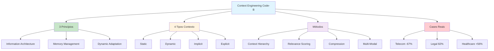

# [Context Engineering Principles Methods Uses - Code-B](/blog/context-engineering-principles-methods-uses---code-b)

> [!compass] **[MyMess](/blog/moc---projeto-mymess)** » [Estudos](/blog/dashboard---estudos-mymess) » Engenharia de Contexto

---

> [!info]+ Detalhes do Artigo
> **Ler:** [Context Engineering in AI: Principles, Methods, and Uses](https://code-b.dev/blog/context-engineering)
> **Fonte:** [Code-B](/blog/code-b) (Blog)
> **Autores:** Shagun Deogharkar (Software Engineer @ Code-B)
> **Publicado:** Agosto 2025

> [!abstract]+ Materiais Complementares
>
> **Estatísticas Citadas**
> - 73% improvement in AI response accuracy
> - 89% of AI failures stem from inadequate context
> - 67% reduction in escalations (telecom chatbot)
> - 82% accuracy in legal document analysis
> - 56% improvement in diagnostic accuracy (healthcare)
>
> **Tipos de Contexto**
> - Static, Dynamic, Implicit, Explicit
>
> **3 Princípios Fundamentais**
> - Information Architecture
> - Memory Management
> - Dynamic Context Adaptation

> [!tip]- Léxico
>
> **Tecnologia e IA**
> - **Information Architecture**: Organizar dados para compreensão ótima da IA
> - **Memory Management**: Gerenciar histórico de conversa e background
> - **Context Hierarchy**: Níveis primário, secundário e terciário de informação
>
> **Conteúdo e Criação**
> - **Dynamic Context Adaptation**: Ajustar contexto conforme necessidades evoluem
> [!question]- Pontos para Aprofundar (Sugestão da IA)
>
> - **Como implementar context hierarchy em produção?**
>     - Explorar arquiteturas reais
> - **Quais métricas usar para medir effectiveness?**
>     - Desenvolver dashboard de métricas
> - **Como combinar extractive e abstractive summarization?**
>     - Testar diferentes abordagens

> [!robot]- Sugestões Complementares
>
> - **Leituras Recomendadas:**
>     - Case studies mencionados no artigo
>     - Papers sobre context compression
> - **Ferramentas Úteis:**
>     - Tools de relevance scoring
>     - Summarization APIs
> - **Exercícios Práticos:**
>     - Implementar context hierarchy para projeto
>     - Medir impact em métricas de accuracy

---

## Resumo

Artigo de **Shagun Deogharkar** (Code-B) apresentando **princípios, métodos e casos de uso** de context engineering. Destaca estatísticas impressionantes: **73% improvement em accuracy** com CE implementado, e **89% de falhas de IA** vêm de contexto inadequado. Inclui casos reais de telecom (67% menos escalações), legal (82% accuracy) e healthcare (56% improvement).

**Estatística central:** "89% of AI failures stem from inadequate context management."

---

## Principais Conceitos

### 3 Princípios Fundamentais

A tabela abaixo resume as informações principais.

| Princípio | Descrição |
|:----------|:----------|
| **Information Architecture** | Organizar dados contextuais para compreensão ótima da IA |
| **Memory Management** | Gerenciar estrategicamente histórico de conversa e background |
| **Dynamic Context Adaptation** | Ajustar elementos contextuais conforme necessidades evoluem |

### 4 Tipos de Contexto

A tabela a seguir detalha os campos e seus valores.

| Tipo | Descrição | Exemplo |
|:-----|:----------|:--------|
| **Static** | Background que não muda | Documentação de produto |
| **Dynamic** | Evolui com a conversa | Histórico de chat |
| **Implicit** | Assunções não declaradas | Domain knowledge |
| **Explicit** | Parâmetros claramente definidos | Instruções do sistema |

---

## Detalhamento

### Métodos de Context Engineering

#### 1. Context Hierarchy Design

Estabelecer níveis de informação:
- **Primário**: Informação crítica para a tarefa
- **Secundário**: Contexto de suporte
- **Terciário**: Background adicional

#### 2. Information Filtering and Relevance Scoring

Avaliar dados por:
- **Temporal relevance**: Quão recente
- **Topical similarity**: Quão relacionado ao tópico
- **Task importance**: Quão crítico para a tarefa

#### 3. Context Compression and Summarization

Usar técnicas:
- **Extractive**: Extrair trechos relevantes
- **Abstractive**: Gerar resumos novos

#### 4. Multi-Modal Context Integration

Incorporar diferentes tipos:
- Visual
- Structured (tabelas, JSON)
- Temporal (sequências)
- Spatial (localizações)

### Casos de Uso Reais

Os dados abaixo mostram a estrutura e configurações.

| Indústria | Case | Resultado |
|:----------|:-----|:----------|
| **Telecom** | Chatbot de suporte | **67% redução** em escalações |
| **Legal** | Análise de documentos | **82% accuracy** em identificar issues |
| **Healthcare** | Diagnóstico assistido | **56% improvement** em accuracy |

### Estatísticas de Impacto

> [!success] Resultados Documentados
> - **73%** improvement em response accuracy com CE comprehensive
> - **89%** de falhas de IA vêm de contexto inadequado

### Best Practices

A tabela abaixo resume as informações principais.

| Prática | Descrição |
|:--------|:----------|
| **Context Validation** | Implementar validação regular |
| **Progressive Building** | Construir contexto progressivamente |
| **Consistency** | Manter consistência entre conversas |
| **Metrics Monitoring** | Monitorar effectiveness via métricas |

---

## Mapa de Conceitos

O diagrama abaixo ilustra o fluxo do processo, mostrando as etapas e suas conexões.

---

## Insights & Aprendizados

**O que funcionou bem:**
- Estatísticas concretas (73%, 89%, 67%, 82%, 56%)
- Framework claro de 3 princípios
- 4 tipos de contexto bem definidos
- Cases reais de 3 indústrias diferentes

**O que posso adaptar para o MyMess:**
- **Context Hierarchy**: Implementar níveis primário/secundário/terciário
- **Relevance Scoring**: Criar scoring para inputs de clientes
- **Best Practices**: Adotar validation, progressive building, metrics

**Ideias para aplicar:**
- Criar dashboard de métricas de context effectiveness
- Implementar relevance scoring automático
- Desenvolver templates de context hierarchy por vertical

---

## Recursos Adicionais

- [Code-B - Context Engineering](https://code-b.dev/blog/context-engineering)
- [Code-B Platform](https://code-b.dev)

---

## Propriedades da nota

> [!note]- Propriedades Gerais do Obsidian
>
>> **Identificação**
>
> | Campo | Valor |
> |:------|:------|
> | **Título** | `INPUT[text:titulo]` |
>
>> **Conexões**
>
> | Campo | Valor |
> |:------|:------|
> | **Pai** | `INPUT[suggester(optionQuery("")):pai]` |
> | **Coleção** | `INPUT[inlineSelect(option(financeiro, Financeiro), option(growth, Growth), option(ia, IA), option(lideranca, Liderança), option(marketing, Marketing), option(negocios, Negócios), option(produtividade, Produtividade), option(pkm, PKM), option(saas, SaaS), option(tecnologia, Tecnologia), option(vendas, Vendas)):colecao]` |
> | **Área** | `INPUT[suggester(optionQuery("Esforços/Áreas")):area]` |
> | **Projeto** | `INPUT[suggester(optionQuery("#projeto")):projeto]` |
> | **Autor** | `INPUT[suggester(optionQuery("Atlas/Pessoas")):pessoa]` |
> | **Relacionado** | `INPUT[inlineListSuggester(optionQuery(""), useLinks(true)):relacionado]` |
>
>> **Classificação**
>
> | Campo | Valor |
> |:------|:------|
> | **Tipo** | `INPUT[inlineSelect(option(atomica, Atômica), option(aula, Aula), option(artigo, Artigo), option(checklist, Checklist), option(curso, Curso), option(dashboard, Dashboard), option(framework, Framework), option(livro, Livro), option(moc, MOC), option(newsletter, Newsletter), option(pessoa, Pessoa), option(prompt, Prompt), option(template, Template Obsidian), option(tutorial, Tutorial), option(video_youtube, Vídeo Youtube)):tipo_nota]` |
> | **Tags** | `INPUT[inlineList:tags]` |
> | **Status** | `INPUT[inlineSelect(option(nao_iniciado, ⬜ Não Iniciado), option(em_andamento, 🔄 Em Andamento), option(concluido, ✅ Concluído), option(pausado, ⏸️ Pausado), option(cancelado, ❌ Cancelado)):status]` |
>
>> **Temporal**
>
> | Campo | Valor |
> |:------|:------|
> | **Criado** | `INPUT[date:data_criado]` |
> | **Atualizado** | `INPUT[date:data_atualizado]` |

> [!note]- Propriedades SaaS
>
> | Campo | Valor |
> |:------|:------|
> | **Mostrar Bloco** | `INPUT[toggle(onValue(true), offValue(false)):mostrar_bloco_saas]` |
> | **Status SaaS** | `INPUT[toggle(onValue(true), offValue(false)):status_saas]` |

> [!note]- Propriedades do Artigo
>
> | Campo | Valor |
> |:------|:------|
> | **URL** | `INPUT[text(placeholder(https://...)):url_artigo]` |
> | **Fonte** | `INPUT[text:fonte]` |
> | **Autor** | `INPUT[text:autor]` |
> | **Data Publicação** | `INPUT[date:data_publicacao]` |
> | **Tipo Conteúdo** | `INPUT[inlineSelect(option(educacional, Educacional), option(curadoria, Curadoria), option(historia, História Pessoal), option(listicle, Lista), option(contrarian, Opinião Contrária), option(tutorial, Tutorial), option(entrevista, Entrevista), option(analise, Análise), option(estudo_de_caso, Estudo de Caso), option(lancamento, Lançamento), option(opiniao, Opinião), option(outro, Outro)):tipo_conteudo]` |

