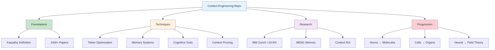

# [Context-Engineering Repository - David Kimai](/blog/context-engineering-repository---david-kimai)

> [!compass] **[MyMess](/blog/moc---projeto-mymess)** » [Estudos](/blog/dashboard---estudos-mymess) » Engenharia de Contexto

---

> [!info]+ Detalhes do Artigo
> **Ler:** [Context-Engineering Repository](https://github.com/davidkimai/Context-Engineering)
> **Fonte:** [GitHub](/blog/github) - David Kimai (Repositório)
> **Autores:** David Kimai
> **Publicado:** 2025

> [!abstract]+ Materiais Complementares
>
> **Estrutura do Repositório**
> - 00_foundations/ – Teoria e conceitos
> - 10_guides_zero_to_hero/ – Tutoriais hands-on
> - 20_templates/ – Snippets copy-paste
> - 30_examples/ – Projetos de complexidade crescente
> - 40_reference/ – Deep dives e metodologia de avaliação
> - 70_agents/ – Agent frameworks
>
> **Pesquisa Referenciada**
> - Survey de 1400+ papers
> - IBM Zurich cognitive tools (+16.6% AIME2024)
> - MEM1 Singapore-MIT
> - Context rot analysis

> [!tip]- Léxico
>
> **Tecnologia e IA**
> - **Context (Karpathy)**: "A arte e ciência de preencher a context window com a informação certa para o próximo passo"
> - **Context vs Prompt**: Context é tudo que o modelo vê ALÉM do prompt
>
> **Outros Conceitos**
> - **Cognitive Tools**: Templates estruturados como operações de raciocínio
>
> **Conteúdo e Criação**
> - **Neural Field Theory**: Modelagem de contexto como campos dinâmicos
> [!question]- Pontos para Aprofundar (Sugestão da IA)
>
> - **Como usar cognitive tools para melhorar raciocínio?**
>     - Investigar pesquisa IBM Zurich
> - **O que é Neural Field Theory aplicada a contexto?**
>     - Explorar teoria e implementações
> - **Como progredir do básico ao avançado no repositório?**
>     - Seguir a metáfora biológica (atoms → systems)

> [!robot]- Sugestões Complementares
>
> - **Leituras Recomendadas:**
>     - 00_foundations/ para teoria
>     - MEM1 paper sobre memory consolidation
> - **Ferramentas Úteis:**
>     - **Claude Code, OpenCode, Amp** - CLIs suportadas
>     - **Kiro, Codex, Gemini CLI** - Integrações
> - **Exercícios Práticos:**
>     - Clonar repo e executar exemplos mínimos
>     - Copiar templates para projetos próprios

---

## Resumo

Repositório **comprehensive handbook** sobre context engineering mantido por **David Kimai**. Define context engineering como "a arte e ciência de preencher a context window com a informação certa" (citando Karpathy). Inclui teoria de 1400+ papers, templates prontos, e uma progressão de aprendizado baseada em metáfora biológica. Destaque para resultado de **IBM Zurich**: GPT-4.1 saltou de **26.7% para 43.3%** em AIME2024 usando cognitive tools.

**Definição (Survey 1400+ papers):** "Context is the complete information payload provided to a LLM at inference time, encompassing all structured informational components that the model needs to plausibly accomplish a given task."

---

## Principais Conceitos

### Context Engineering (Karpathy)

> [!quote] Definição Karpathy
> "Context engineering is the delicate art and science of filling the context window with just the right information for the next step."

### Distinção Fundamental

A tabela abaixo resume as informações principais.

| Aspecto | Prompt Engineering | Context Engineering |
|:--------|:-------------------|:--------------------|
| **Foco** | O que você diz | Tudo mais que o modelo percebe |
| **Escopo** | Instrução individual | Information payload completo |

### Técnicas Cobertas

A tabela a seguir detalha os campos e seus valores.

| Técnica | Descrição |
|:--------|:----------|
| **Token Budget Optimization** | Maximizar eficiência de tokens |
| **Few-shot Learning** | Ensinar através de exemplos |
| **Memory Systems** | Persistência entre turnos |
| **Retrieval Augmentation** | Injeção de documentos para reduzir alucinação |
| **Control Flow** | Dividir tarefas complexas em passos |
| **Context Pruning** | Remover informação irrelevante |
| **Cognitive Tools** | Templates modulares de raciocínio |

---

## Detalhamento

### Estrutura do Repositório

```
00_foundations/      → Teoria e conceitos core
10_guides_zero_to_hero/ → Walkthroughs hands-on
20_templates/        → Snippets copy-paste
30_examples/         → Projetos de complexidade crescente
40_reference/        → Deep dives e avaliação
50_contrib/          → Contribuições da comunidade
60_protocols/        → Sistemas baseados em protocolos
70_agents/           → Agent frameworks
80_field_integration/ → Aplicações de field theory
```

### Metáfora Biológica de Progressão

Os dados abaixo mostram a estrutura e configurações.

| Nível | Elemento | Conceito CE |
|:------|:---------|:------------|
| 1 | Atoms | Single prompts |
| 2 | Molecules | Few-shot |
| 3 | Cells | Memory agents |
| 4 | Organs | Multi-agent |
| 5 | Neural Systems | Reasoning frameworks |
| 6 | Neural Field Theory | Field-based systems |

### Pesquisa Referenciada

A tabela abaixo resume as informações principais.

| Fonte | Contribuição |
|:------|:-------------|
| **IBM Zurich** | Cognitive tools: GPT-4.1 de 26.7% → 43.3% em AIME2024 |
| **MEM1 (Singapore-MIT)** | Memory consolidation para long-horizon agents |
| **ICML Princeton** | Mecanismos simbólicos emergentes em LLMs |
| **Context Rot Analysis** | Padrões de degradação em context windows |

### Getting Started

1. Ler conceitos fundamentais (5 min)
2. Rodar exemplos mínimos funcionais
3. Copiar templates para seus projetos
4. Estudar implementações completas
5. Progredir para field theory e meta-recursion

---

## Mapa de Conceitos

O diagrama abaixo ilustra o fluxo do processo, mostrando as etapas e suas conexões.



---

## Insights & Aprendizados

**O que funcionou bem:**
- Estrutura clara do repositório
- Definição de Karpathy como âncora conceitual
- Metáfora biológica para progressão de aprendizado
- Pesquisa sólida (IBM Zurich, MEM1)
- Templates prontos para uso

**O que posso adaptar para o MyMess:**
- **Estrutura de repo**: Organizar conhecimento similar
- **Cognitive Tools**: Implementar templates de raciocínio
- **Progressão de aprendizado**: Criar jornada para clientes

**Ideias para aplicar:**
- Clonar e estudar templates do repositório
- Implementar cognitive tools em agentes MyMess
- Criar versão interna do handbook adaptada

---

## Recursos Adicionais

- [GitHub - Context-Engineering](https://github.com/davidkimai/Context-Engineering)
- [Andrej Karpathy - Original Definition](https://twitter.com/karpathy)
- [IBM Zurich - Cognitive Tools Research](https://www.ibm.com/research)
- [MEM1 Paper - Memory Consolidation](https://arxiv.org)

---

## Propriedades da nota

> [!note]- Propriedades Gerais do Obsidian
>
>> **Identificação**
>
> | Campo | Valor |
> |:------|:------|
> | **Título** | `INPUT[text:titulo]` |
>
>> **Conexões**
>
> | Campo | Valor |
> |:------|:------|
> | **Pai** | `INPUT[suggester(optionQuery("")):pai]` |
> | **Coleção** | `INPUT[inlineSelect(option(financeiro, Financeiro), option(growth, Growth), option(ia, IA), option(lideranca, Liderança), option(marketing, Marketing), option(negocios, Negócios), option(produtividade, Produtividade), option(pkm, PKM), option(saas, SaaS), option(tecnologia, Tecnologia), option(vendas, Vendas)):colecao]` |
> | **Área** | `INPUT[suggester(optionQuery("Esforços/Áreas")):area]` |
> | **Projeto** | `INPUT[suggester(optionQuery("#projeto")):projeto]` |
> | **Autor** | `INPUT[suggester(optionQuery("Atlas/Pessoas")):pessoa]` |
> | **Relacionado** | `INPUT[inlineListSuggester(optionQuery(""), useLinks(true)):relacionado]` |
>
>> **Classificação**
>
> | Campo | Valor |
> |:------|:------|
> | **Tipo** | `INPUT[inlineSelect(option(atomica, Atômica), option(aula, Aula), option(artigo, Artigo), option(checklist, Checklist), option(curso, Curso), option(dashboard, Dashboard), option(framework, Framework), option(livro, Livro), option(moc, MOC), option(newsletter, Newsletter), option(pessoa, Pessoa), option(prompt, Prompt), option(template, Template Obsidian), option(tutorial, Tutorial), option(video_youtube, Vídeo Youtube)):tipo_nota]` |
> | **Tags** | `INPUT[inlineList:tags]` |
> | **Status** | `INPUT[inlineSelect(option(nao_iniciado, ⬜ Não Iniciado), option(em_andamento, 🔄 Em Andamento), option(concluido, ✅ Concluído), option(pausado, ⏸️ Pausado), option(cancelado, ❌ Cancelado)):status]` |
>
>> **Temporal**
>
> | Campo | Valor |
> |:------|:------|
> | **Criado** | `INPUT[date:data_criado]` |
> | **Atualizado** | `INPUT[date:data_atualizado]` |

> [!note]- Propriedades SaaS
>
> | Campo | Valor |
> |:------|:------|
> | **Mostrar Bloco** | `INPUT[toggle(onValue(true), offValue(false)):mostrar_bloco_saas]` |
> | **Status SaaS** | `INPUT[toggle(onValue(true), offValue(false)):status_saas]` |

> [!note]- Propriedades do Artigo
>
> | Campo | Valor |
> |:------|:------|
> | **URL** | `INPUT[text(placeholder(https://...)):url_artigo]` |
> | **Fonte** | `INPUT[text:fonte]` |
> | **Autor** | `INPUT[text:autor]` |
> | **Data Publicação** | `INPUT[date:data_publicacao]` |
> | **Tipo Conteúdo** | `INPUT[inlineSelect(option(educacional, Educacional), option(curadoria, Curadoria), option(historia, História Pessoal), option(listicle, Lista), option(contrarian, Opinião Contrária), option(tutorial, Tutorial), option(entrevista, Entrevista), option(analise, Análise), option(estudo_de_caso, Estudo de Caso), option(lancamento, Lançamento), option(opiniao, Opinião), option(outro, Outro)):tipo_conteudo]` |

