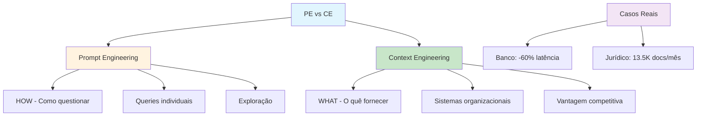

# [Context Engineering vs Prompt Engineering - Bismart](/blog/context-engineering-vs-prompt-engineering---bismart)

> [!compass] **[MyMess](/blog/moc---projeto-mymess)** » [Estudos](/blog/dashboard---estudos-mymess) » Engenharia de Contexto

---

> [!info]+ Detalhes do Artigo
> **Ler:** [Context Engineering: The Real Advantage in Generative AI](https://blog.bismart.com/en/context-engineering-vs-prompt-engineering-generative-ai)
> **Fonte:** [Bismart](/blog/bismart) (Blog)
> **Autores:** Núria Emilio
> **Publicado:** 15 de Outubro de 2025

> [!abstract]+ Materiais Complementares
>
> **Casos Mencionados**
> - Banco europeu: 60% redução em latência de dados
> - Firma jurídica: 13.500 documentos/mês automatizados
>
> **Conceitos-Chave**
> - How vs What: Prompt é o "como", Context é o "quê"
> - Competitive Advantage: CE como diferenciador
> - RAG em fundação de dados estruturados

> [!tip]- Léxico
>
> **Tecnologia e IA**
> - **Prompt Engineering**: Foco em crafting instruções - o "como" de questionar IA
> - **Context Engineering**: Foco em preparar, estruturar e governar dados - o "quê"
> - **Data Governance**: Auditabilidade e compliance através de CE
>
> **Ferramentas e Recursos**
> - **Scalable AI Systems**: Sistemas confiáveis e escaláveis via CE
> [!question]- Pontos para Aprofundar (Sugestão da IA)
>
> - **Qual o ponto de inflexão entre PE e CE?**
>     - Investigar quando migrar de um para outro
> - **Como implementar governança de dados para CE?**
>     - Explorar frameworks de compliance
> - **Qual o ROI de CE vs PE em enterprise?**
>     - Calcular custos de implementação vs benefícios

> [!robot]- Sugestões Complementares
>
> - **Leituras Recomendadas:**
>     - Casos de bancos europeus com CE
>     - RAG em empresas jurídicas
> - **Ferramentas Úteis:**
>     - **RAG frameworks** - Para fundação de dados
>     - **Data governance tools** - Para compliance
> - **Exercícios Práticos:**
>     - Comparar resultado com PE vs CE no mesmo caso
>     - Implementar pipeline de governança de dados

---

## Resumo

Artigo de **Núria Emilio** (Bismart) comparando **Context Engineering vs Prompt Engineering**. A distinção central: Prompt Engineering foca no **"como"** (crafting instruções), enquanto Context Engineering foca no **"quê"** (preparar e governar dados). Inclui casos reais: banco europeu com **60% redução em latência** e firma jurídica processando **13.500 documentos/mês**.

**Distinção fundamental:** "Prompt Engineering is about instruction design; Context Engineering addresses data preparation and governance."

---

## Principais Conceitos

### Comparação Fundamental

A tabela abaixo resume as informações principais.

| Aspecto | Prompt Engineering | Context Engineering |
|:--------|:-------------------|:--------------------|
| **Foco** | Design de instruções | Preparação e governança de dados |
| **Escopo** | Queries individuais | Sistemas de dados organizacionais |
| **Longevidade** | Tornando-se padronizado | Emergindo como vantagem competitiva |
| **Complexidade** | Diminuindo (modelos melhoram) | Aumentando (cada vez mais crítico) |

### "How" vs "What"

> [!tip] Analogia Central
> **Prompt Engineering** = O "como" de questionar uma IA
> **Context Engineering** = O "quê" - a fundação de dados

---

## Detalhamento

### Vantagens de Cada Abordagem

#### Prompt Engineering
- Acessível a audiências mais amplas
- Implementação rápida
- Útil para exploração inicial de IA

#### Context Engineering
- Garante accuracy através de dados de qualidade
- Fornece auditabilidade e compliance
- Habilita sistemas de IA escaláveis e confiáveis
- Reduz custos de infraestrutura
- Suporta decisões explicáveis

### Quando Usar Cada Um

A tabela a seguir detalha os campos e seus valores.

| Situação | Abordagem |
|:---------|:----------|
| Trabalho exploratório | Prompt Engineering |
| Interações básicas | Prompt Engineering |
| Sistemas enterprise | Context Engineering |
| Requisitos de accuracy | Context Engineering |
| Compliance regulatório | Context Engineering |

### Casos Reais

Os dados abaixo mostram a estrutura e configurações.

| Case | Resultado |
|:-----|:----------|
| **Banco Europeu** | **60% redução** em latência de dados através de CE |
| **Firma Jurídica** | **13.500 documentos/mês** automatizados via RAG estruturado |

---

## Mapa de Conceitos

O diagrama abaixo ilustra o fluxo do processo, mostrando as etapas e suas conexões.

---

## Insights & Aprendizados

**O que funcionou bem:**
- Distinção clara "How vs What"
- Tabela comparativa útil para decisão
- Casos reais com métricas concretas
- Posicionamento de CE como vantagem competitiva futura

**O que posso adaptar para o MyMess:**
- **Framework de decisão**: Quando usar PE vs CE para clientes
- **Pitch de valor**: CE como diferenciador competitivo
- **Governança**: Auditabilidade como selling point

**Ideias para aplicar:**
- Criar assessment "PE vs CE" para clientes
- Desenvolver case studies com métricas de ROI
- Implementar compliance como feature de CE

---

## Recursos Adicionais

- [Bismart - Context Engineering vs Prompt Engineering](https://blog.bismart.com/en/context-engineering-vs-prompt-engineering-generative-ai)
- [Bismart](https://www.bismart.com)

---

## Propriedades da nota

> [!note]- Propriedades Gerais do Obsidian
>
>> **Identificação**
>
> | Campo | Valor |
> |:------|:------|
> | **Título** | `INPUT[text:titulo]` |
>
>> **Conexões**
>
> | Campo | Valor |
> |:------|:------|
> | **Pai** | `INPUT[suggester(optionQuery("")):pai]` |
> | **Coleção** | `INPUT[inlineSelect(option(financeiro, Financeiro), option(growth, Growth), option(ia, IA), option(lideranca, Liderança), option(marketing, Marketing), option(negocios, Negócios), option(produtividade, Produtividade), option(pkm, PKM), option(saas, SaaS), option(tecnologia, Tecnologia), option(vendas, Vendas)):colecao]` |
> | **Área** | `INPUT[suggester(optionQuery("Esforços/Áreas")):area]` |
> | **Projeto** | `INPUT[suggester(optionQuery("#projeto")):projeto]` |
> | **Autor** | `INPUT[suggester(optionQuery("Atlas/Pessoas")):pessoa]` |
> | **Relacionado** | `INPUT[inlineListSuggester(optionQuery(""), useLinks(true)):relacionado]` |
>
>> **Classificação**
>
> | Campo | Valor |
> |:------|:------|
> | **Tipo** | `INPUT[inlineSelect(option(atomica, Atômica), option(aula, Aula), option(artigo, Artigo), option(checklist, Checklist), option(curso, Curso), option(dashboard, Dashboard), option(framework, Framework), option(livro, Livro), option(moc, MOC), option(newsletter, Newsletter), option(pessoa, Pessoa), option(prompt, Prompt), option(template, Template Obsidian), option(tutorial, Tutorial), option(video_youtube, Vídeo Youtube)):tipo_nota]` |
> | **Tags** | `INPUT[inlineList:tags]` |
> | **Status** | `INPUT[inlineSelect(option(nao_iniciado, ⬜ Não Iniciado), option(em_andamento, 🔄 Em Andamento), option(concluido, ✅ Concluído), option(pausado, ⏸️ Pausado), option(cancelado, ❌ Cancelado)):status]` |
>
>> **Temporal**
>
> | Campo | Valor |
> |:------|:------|
> | **Criado** | `INPUT[date:data_criado]` |
> | **Atualizado** | `INPUT[date:data_atualizado]` |

> [!note]- Propriedades SaaS
>
> | Campo | Valor |
> |:------|:------|
> | **Mostrar Bloco** | `INPUT[toggle(onValue(true), offValue(false)):mostrar_bloco_saas]` |
> | **Status SaaS** | `INPUT[toggle(onValue(true), offValue(false)):status_saas]` |

> [!note]- Propriedades do Artigo
>
> | Campo | Valor |
> |:------|:------|
> | **URL** | `INPUT[text(placeholder(https://...)):url_artigo]` |
> | **Fonte** | `INPUT[text:fonte]` |
> | **Autor** | `INPUT[text:autor]` |
> | **Data Publicação** | `INPUT[date:data_publicacao]` |
> | **Tipo Conteúdo** | `INPUT[inlineSelect(option(educacional, Educacional), option(curadoria, Curadoria), option(historia, História Pessoal), option(listicle, Lista), option(contrarian, Opinião Contrária), option(tutorial, Tutorial), option(entrevista, Entrevista), option(analise, Análise), option(estudo_de_caso, Estudo de Caso), option(lancamento, Lançamento), option(opiniao, Opinião), option(outro, Outro)):tipo_conteudo]` |

