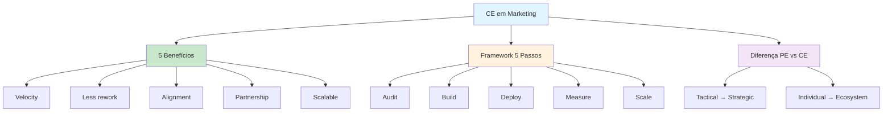

# [Contextual Engineering AI Marketing - Axelerant](/blog/contextual-engineering-ai-marketing---axelerant)

> [!compass] **[MyMess](/blog/moc---projeto-mymess)** » [Estudos](/blog/dashboard---estudos-mymess) » Engenharia de Contexto

---

> [!info]+ Detalhes do Artigo
> **Ler:** [Why Engineering Context Will Define The Future of AI In Marketing](https://www.axelerant.com/blog/contextual-engineering-ai-marketing)
> **Fonte:** [Axelerant](/blog/axelerant) (Blog)
> **Autores:** Brahmpreet Singh (Senior Marketing Manager), Sayan Mallick (Marketing Coordinator)
> **Publicado:** 18 de Agosto de 2025

> [!abstract]+ Materiais Complementares
>
> **Framework de 5 Passos**
> 1. Audit Context Gaps
> 2. Build Context Layer
> 3. Deploy and Train
> 4. Measure Strategic Impact
> 5. Scale to Ecosystem
>
> **Caso Mencionado**
> - "Strategic GPT" para organização mission-driven
> - Campanhas com donor engagement acelerado

> [!tip]- Léxico
>
> **Tecnologia e IA**
> - **Context as Infrastructure**: Tratar CE como infraestrutura, não setup único
> - **Non-negotiables First**: Brand voice e valores core têm prioridade
> - **Scalable Ecosystem**: Uma context layer alimenta múltiplos agentes especializados
>
> **Ferramentas e Recursos**
> - **Informed Collaborator**: IA como colaborador informado, não ferramenta genérica
> [!question]- Pontos para Aprofundar (Sugestão da IA)
>
> - **Como criar context layer machine-readable?**
>     - Investigar formatos e estruturas
> - **Quais métricas de strategic impact usar?**
>     - Ir além de métricas de conteúdo
> - **Como escalar para ecosystem de agentes?**
>     - Explorar arquitetura multi-agente com contexto compartilhado

> [!robot]- Sugestões Complementares
>
> - **Leituras Recomendadas:**
>     - Cases de "Strategic GPT" em organizações
>     - Best practices de brand voice para IA
> - **Ferramentas Úteis:**
>     - **GPT Builder** - Para Strategic GPTs
>     - **Brand guidelines digitais** - Formato machine-readable
> - **Exercícios Práticos:**
>     - Criar audit de context gaps para cliente
>     - Desenvolver context layer mínimo viável

---

## Resumo

Artigo de **Brahmpreet Singh** (Axelerant) argumentando que **context engineering definirá o futuro da IA em marketing**. Contesta a premissa de que prompt engineering resolve desafios de marketing: "You can't prompt your way to strategy." Apresenta framework de **5 passos** para implementação e posiciona CE como **diferenciador competitivo** na adoção de IA.

**Citação central:** "You can't prompt your way to strategy" - Prompts melhoram outputs imediatos, mas carecem de profundidade estratégica.

---

## Principais Conceitos

### Prompt vs Context Engineering em Marketing

A tabela abaixo resume as informações principais.

| Aspecto | Prompt Engineering | Context Engineering |
|:--------|:-------------------|:--------------------|
| **Setup** | Baixo esforço inicial; alto tweaking contínuo | Alto investimento upfront; mínimo retrabalho |
| **Consistência** | Varia por skill do usuário | Consistente em todos outputs |
| **Escalabilidade** | Limitado a prompts individuais | Alimenta múltiplos agentes simultaneamente |
| **Valor Estratégico** | Execução tática | Suporte a decisões estratégicas |

### O que Context Engineering Embeds

CE incorpora conhecimento organizacional diretamente em sistemas de IA:
- **Brand voice** - Tom e estilo da marca
- **Audience personas** - Personas de audiência
- **Business goals** - Objetivos de negócio
- **Operational workflows** - Fluxos operacionais

---

## Detalhamento

### 5 Benefícios de Context Engineering

1. **Velocity without quality loss** - Produção mais rápida mantendo padrões
2. **Reduced rework cycles** - Menos tempo editando outputs
3. **Cross-team alignment** - Mensagens consistentes independente de quem usa
4. **Trusted partnership** - IA como advisor estratégico, não assistente
5. **Scalable ecosystem** - Uma context layer alimenta agentes especializados

### Framework de Implementação (5 Passos)

A tabela a seguir detalha os campos e seus valores.

| Passo | Ação | Output |
|:------|:-----|:-------|
| **1. Audit** | Analisar gaps em interações atuais | Mapa de gaps |
| **2. Build** | Criar documentação machine-readable | Context layer |
| **3. Deploy** | Ativar via testes scenario-based | Sistema treinado |
| **4. Measure** | Rastrear outcomes de negócio | Dashboard estratégico |
| **5. Scale** | Replicar para funções especializadas | Ecosystem de agentes |

### Caso Real: Strategic GPT

Organização mission-driven embeddou valores e audience insights em "Strategic GPT":
- **Resultado**: Campanhas lançadas mais rapidamente
- **Impacto**: Donor engagement mais forte via mensagens purpose-aligned

### Recomendações-Chave

> [!tip] Best Practices
> - Tratar CE como **infraestrutura**, não setup único
> - **Embed non-negotiables first** - Brand voice e valores core
> - **Medir business impact**, não volume de output
> - **Envolver stakeholders** na captura de conhecimento
> - **Planejar evolução** - Atualizar contexto conforme estratégia muda

---

## Mapa de Conceitos

O diagrama abaixo ilustra o fluxo do processo, mostrando as etapas e suas conexões.

---

## Insights & Aprendizados

**O que funcionou bem:**
- Crítica clara de "prompt your way to strategy"
- Framework de 5 passos actionable
- Tabela comparativa PE vs CE útil
- Caso real de Strategic GPT

**O que posso adaptar para o MyMess:**
- **Framework de 5 passos**: Aplicar em onboarding de clientes
- **Context as infrastructure**: Posicionar como investimento, não custo
- **Non-negotiables first**: Priorizar brand voice no setup

**Ideias para aplicar:**
- Criar template de audit de context gaps
- Desenvolver checklist de "non-negotiables" por vertical
- Implementar métricas de strategic impact vs content volume

---

## Recursos Adicionais

- [Axelerant - Context Engineering AI Marketing](https://www.axelerant.com/blog/contextual-engineering-ai-marketing)
- [Axelerant](https://www.axelerant.com)

---

## Propriedades da nota

> [!note]- Propriedades Gerais do Obsidian
>
>> **Identificação**
>
> | Campo | Valor |
> |:------|:------|
> | **Título** | `INPUT[text:titulo]` |
>
>> **Conexões**
>
> | Campo | Valor |
> |:------|:------|
> | **Pai** | `INPUT[suggester(optionQuery("")):pai]` |
> | **Coleção** | `INPUT[inlineSelect(option(financeiro, Financeiro), option(growth, Growth), option(ia, IA), option(lideranca, Liderança), option(marketing, Marketing), option(negocios, Negócios), option(produtividade, Produtividade), option(pkm, PKM), option(saas, SaaS), option(tecnologia, Tecnologia), option(vendas, Vendas)):colecao]` |
> | **Área** | `INPUT[suggester(optionQuery("Esforços/Áreas")):area]` |
> | **Projeto** | `INPUT[suggester(optionQuery("#projeto")):projeto]` |
> | **Autor** | `INPUT[suggester(optionQuery("Atlas/Pessoas")):pessoa]` |
> | **Relacionado** | `INPUT[inlineListSuggester(optionQuery(""), useLinks(true)):relacionado]` |
>
>> **Classificação**
>
> | Campo | Valor |
> |:------|:------|
> | **Tipo** | `INPUT[inlineSelect(option(atomica, Atômica), option(aula, Aula), option(artigo, Artigo), option(checklist, Checklist), option(curso, Curso), option(dashboard, Dashboard), option(framework, Framework), option(livro, Livro), option(moc, MOC), option(newsletter, Newsletter), option(pessoa, Pessoa), option(prompt, Prompt), option(template, Template Obsidian), option(tutorial, Tutorial), option(video_youtube, Vídeo Youtube)):tipo_nota]` |
> | **Tags** | `INPUT[inlineList:tags]` |
> | **Status** | `INPUT[inlineSelect(option(nao_iniciado, ⬜ Não Iniciado), option(em_andamento, 🔄 Em Andamento), option(concluido, ✅ Concluído), option(pausado, ⏸️ Pausado), option(cancelado, ❌ Cancelado)):status]` |
>
>> **Temporal**
>
> | Campo | Valor |
> |:------|:------|
> | **Criado** | `INPUT[date:data_criado]` |
> | **Atualizado** | `INPUT[date:data_atualizado]` |

> [!note]- Propriedades SaaS
>
> | Campo | Valor |
> |:------|:------|
> | **Mostrar Bloco** | `INPUT[toggle(onValue(true), offValue(false)):mostrar_bloco_saas]` |
> | **Status SaaS** | `INPUT[toggle(onValue(true), offValue(false)):status_saas]` |

> [!note]- Propriedades do Artigo
>
> | Campo | Valor |
> |:------|:------|
> | **URL** | `INPUT[text(placeholder(https://...)):url_artigo]` |
> | **Fonte** | `INPUT[text:fonte]` |
> | **Autor** | `INPUT[text:autor]` |
> | **Data Publicação** | `INPUT[date:data_publicacao]` |
> | **Tipo Conteúdo** | `INPUT[inlineSelect(option(educacional, Educacional), option(curadoria, Curadoria), option(historia, História Pessoal), option(listicle, Lista), option(contrarian, Opinião Contrária), option(tutorial, Tutorial), option(entrevista, Entrevista), option(analise, Análise), option(estudo_de_caso, Estudo de Caso), option(lancamento, Lançamento), option(opiniao, Opinião), option(outro, Outro)):tipo_conteudo]` |

