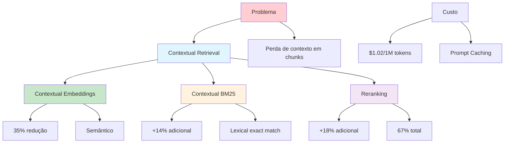

# [Contextual Retrieval Anthropic - Datacamp](/blog/contextual-retrieval-anthropic---datacamp)

> [!compass] **[MyMess](/blog/moc---projeto-mymess)** » [Estudos](/blog/dashboard---estudos-mymess) » Engenharia de Contexto

---

> [!info]+ Detalhes do Artigo
> **Ler:** [Contextual Retrieval Anthropic](https://www.datacamp.com/pt/tutorial/contextual-retrieval-anthropic)
> **Fonte:** [Datacamp](/blog/datacamp) / [Anthropic](/blog/anthropic) (Tutorial)
> **Autores:** Anthropic Team
> **Publicado:** Setembro 2024

> [!abstract]+ Materiais Complementares
>
> **Documentação Oficial**
> - [Anthropic - Introducing Contextual Retrieval](https://www.anthropic.com/news/contextual-retrieval)
> - [Anthropic - Contextual Retrieval Engineering](https://www.anthropic.com/engineering/contextual-retrieval)
>
> **Resultados Chave**
> - 49% redução em falhas de retrieval (com BM25)
> - 67% redução total (com reranking)
> - Taxa de falha: 5.7% → 1.9%
>
> **Custo**
> - $1.02 por milhão de tokens (via prompt caching)

> [!tip]- Léxico
>
> **Conteúdo e Criação**
> - **Contextual Retrieval**: Adicionar contexto relevante a cada chunk antes de embedding/indexação
> - **Contextual Embeddings**: Embeddings com contexto adicional
> - **Contextual BM25**: BM25 com contexto adicional
>
> **Outros Conceitos**
> - **Reranking**: Etapa adicional para ordenar resultados
> [!question]- Pontos para Aprofundar (Sugestão da IA)
>
> - **Como implementar Contextual Retrieval em produção?**
>     - Seguir tutorial Datacamp
> - **Qual o trade-off de reranking (latência vs qualidade)?**
>     - Testar com diferentes números de chunks
> - **Quando usar apenas embeddings vs BM25 combinado?**
>     - Analisar tipos de queries

> [!robot]- Sugestões Complementares
>
> - **Leituras Recomendadas:**
>     - Anthropic blog oficial
>     - Instructor implementation guide
> - **Ferramentas Úteis:**
>     - **Claude API** - Para implementação
>     - **Prompt Caching** - Para reduzir custos
> - **Exercícios Práticos:**
>     - Implementar Contextual Embeddings
>     - Comparar resultados com/sem BM25

---

## Resumo

Tutorial sobre **Contextual Retrieval** da Anthropic, técnica que **reduz falhas de retrieval em 67%** (de 5.7% para 1.9%). A técnica resolve o problema de **perda de contexto** quando documentos são divididos em chunks para RAG. Combina **Contextual Embeddings + Contextual BM25 + Reranking** para resultados superiores a custo baixo ($1.02/milhão de tokens).

**Resultado principal:** Retrieval failure rate reduzido de **5.7% para 1.9%** (67% de redução).

---

## Principais Conceitos

### O Problema que Resolve

RAG tradicional tem um problema fundamental: **perda de contexto** quando documentos são divididos em chunks menores. Um chunk isolado pode perder informações críticas do documento original.

### A Solução: Contextual Retrieval

Adicionar **informação contextual relevante** a cada chunk **antes** de ser embedded ou indexado.

### Resultados Mensuráveis

A tabela abaixo resume as informações principais.

| Técnica | Redução de Falhas |
|:--------|:------------------|
| **Contextual Embeddings** | ~35% |
| **+ Contextual BM25** | ~49% |
| **+ Reranking** | ~67% |

---

## Detalhamento

### Duas Sub-Técnicas

#### 1. Contextual Embeddings
- Adiciona contexto ao chunk antes de gerar embedding
- Preserva detalhes que seriam perdidos
- Melhora captura de relacionamentos semânticos

#### 2. Contextual BM25
- BM25 é ranking function que usa lexical matching
- Encontra matches exatos (ex: "Error code TS-999")
- Complementa embeddings que podem perder matches exatos

> [!example] Exemplo Prático
> Query: "Error code TS-999"
> - **Embedding sozinho**: Pode achar conteúdo sobre error codes em geral
> - **BM25**: Encontra match exato de "TS-999"
> - **Combinado**: Melhor de ambos

### Reranking

Etapa adicional que reordena resultados:
- Acontece em **runtime**
- Processa chunks em **paralelo**
- Adiciona **pequena latência**
- Trade-off: mais chunks = melhor performance vs maior latência/custo

### Considerações Práticas

A tabela a seguir detalha os campos e seus valores.

| Aspecto | Recomendação |
|:--------|:-------------|
| **Knowledge base < 200K tokens** | Incluir tudo no prompt, sem RAG |
| **Custo de contextualização** | $1.02 por milhão de tokens |
| **Reranking** | Trade-off latência vs qualidade |
| **Chunks para reranking** | Mais = melhor, mas mais caro |

### Como Funciona o Custo Baixo

**Prompt Caching** da Anthropic habilita contextualização barata:
- Cache de prompts recorrentes
- Reduz drasticamente custo por token
- Viabiliza técnica em produção

---

## Mapa de Conceitos

O diagrama abaixo ilustra o fluxo do processo, mostrando as etapas e suas conexões.

---

## Insights & Aprendizados

**O que funcionou bem:**
- Métrica clara: 67% de redução em falhas
- Breakdown por técnica (35% + 14% + 18%)
- Custo baixo viabiliza produção
- Solução para problema real (context loss em chunks)

**O que posso adaptar para o MyMess:**
- **Contextual Retrieval**: Implementar em RAG de clientes
- **BM25 híbrido**: Combinar semantic + lexical
- **Prompt Caching**: Reduzir custos de operação

**Ideias para aplicar:**
- Implementar Contextual Retrieval em pipeline RAG
- Testar combinação embeddings + BM25 em knowledge bases
- Desenvolver benchmark para medir improvement

---

## Recursos Adicionais

- [Datacamp - Contextual Retrieval Tutorial](https://www.datacamp.com/pt/tutorial/contextual-retrieval-anthropic)
- [Anthropic - Introducing Contextual Retrieval](https://www.anthropic.com/news/contextual-retrieval)
- [Anthropic - Contextual Retrieval Engineering](https://www.anthropic.com/engineering/contextual-retrieval)
- [Instructor - Implementation Guide](https://python.useinstructor.com/blog/2024/09/26/implementing-anthropics-contextual-retrieval-with-async-processing/)

---

## Propriedades da nota

> [!note]- Propriedades Gerais do Obsidian
>
>> **Identificação**
>
> | Campo | Valor |
> |:------|:------|
> | **Título** | `INPUT[text:titulo]` |
>
>> **Conexões**
>
> | Campo | Valor |
> |:------|:------|
> | **Pai** | `INPUT[suggester(optionQuery("")):pai]` |
> | **Coleção** | `INPUT[inlineSelect(option(financeiro, Financeiro), option(growth, Growth), option(ia, IA), option(lideranca, Liderança), option(marketing, Marketing), option(negocios, Negócios), option(produtividade, Produtividade), option(pkm, PKM), option(saas, SaaS), option(tecnologia, Tecnologia), option(vendas, Vendas)):colecao]` |
> | **Área** | `INPUT[suggester(optionQuery("Esforços/Áreas")):area]` |
> | **Projeto** | `INPUT[suggester(optionQuery("#projeto")):projeto]` |
> | **Autor** | `INPUT[suggester(optionQuery("Atlas/Pessoas")):pessoa]` |
> | **Relacionado** | `INPUT[inlineListSuggester(optionQuery(""), useLinks(true)):relacionado]` |
>
>> **Classificação**
>
> | Campo | Valor |
> |:------|:------|
> | **Tipo** | `INPUT[inlineSelect(option(atomica, Atômica), option(aula, Aula), option(artigo, Artigo), option(checklist, Checklist), option(curso, Curso), option(dashboard, Dashboard), option(framework, Framework), option(livro, Livro), option(moc, MOC), option(newsletter, Newsletter), option(pessoa, Pessoa), option(prompt, Prompt), option(template, Template Obsidian), option(tutorial, Tutorial), option(video_youtube, Vídeo Youtube)):tipo_nota]` |
> | **Tags** | `INPUT[inlineList:tags]` |
> | **Status** | `INPUT[inlineSelect(option(nao_iniciado, ⬜ Não Iniciado), option(em_andamento, 🔄 Em Andamento), option(concluido, ✅ Concluído), option(pausado, ⏸️ Pausado), option(cancelado, ❌ Cancelado)):status]` |
>
>> **Temporal**
>
> | Campo | Valor |
> |:------|:------|
> | **Criado** | `INPUT[date:data_criado]` |
> | **Atualizado** | `INPUT[date:data_atualizado]` |

> [!note]- Propriedades SaaS
>
> | Campo | Valor |
> |:------|:------|
> | **Mostrar Bloco** | `INPUT[toggle(onValue(true), offValue(false)):mostrar_bloco_saas]` |
> | **Status SaaS** | `INPUT[toggle(onValue(true), offValue(false)):status_saas]` |

> [!note]- Propriedades do Artigo
>
> | Campo | Valor |
> |:------|:------|
> | **URL** | `INPUT[text(placeholder(https://...)):url_artigo]` |
> | **Fonte** | `INPUT[text:fonte]` |
> | **Autor** | `INPUT[text:autor]` |
> | **Data Publicação** | `INPUT[date:data_publicacao]` |
> | **Tipo Conteúdo** | `INPUT[inlineSelect(option(educacional, Educacional), option(curadoria, Curadoria), option(historia, História Pessoal), option(listicle, Lista), option(contrarian, Opinião Contrária), option(tutorial, Tutorial), option(entrevista, Entrevista), option(analise, Análise), option(estudo_de_caso, Estudo de Caso), option(lancamento, Lançamento), option(opiniao, Opinião), option(outro, Outro)):tipo_conteudo]` |

