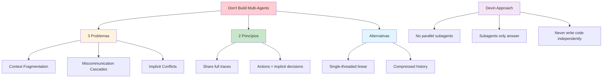

# [Dont Build Multi-Agents - Cognition](/blog/dont-build-multi-agents---cognition)

> [!compass] **[MyMess](/blog/moc---projeto-mymess)** » [Estudos](/blog/dashboard---estudos-mymess) » Engenharia de Contexto

---

> [!info]+ Detalhes do Artigo
> **Ler:** [Don't Build Multi-Agents](https://cognition.ai/blog/dont-build-multi-agents)
> **Fonte:** [Cognition AI](/blog/cognition-ai) - criadores do Devin (Blog)
> **Autores:** Walden Yan
> **Publicado:** 12 de Junho de 2025

> [!abstract]+ Materiais Complementares
>
> **Problemas com Multi-Agent**
> - Context Fragmentation
> - Miscommunication Cascades
> - Implicit Conflicting Decisions
>
> **Alternativas Recomendadas**
> - Single-threaded linear agents
> - Compressed history model
>
> **Abordagem Devin**
> - Evita trabalho paralelo de subagents
> - Subagents apenas respondem perguntas
> - Nunca escrevem código independentemente

> [!tip]- Léxico
>
> **Tecnologia e IA**
> - **Context Fragmentation**: Subagents paralelos sem visibilidade do trabalho dos outros
> - **Compressed History Model**: LLM sumariza decisões e eventos para tarefas longas
>
> **Outros Conceitos**
> - **Miscommunication Cascades**: Erros de interpretação se propagando e compounding
> - **Implicit Conflicting Decisions**: Ações carregam decisões implícitas que conflitam
> [!question]- Pontos para Aprofundar (Sugestão da IA)
>
> - **Quando multi-agent é realmente necessário?**
>     - Identificar casos de uso válidos
> - **Como implementar compressed history model?**
>     - Explorar técnicas de sumarização
> - **Qual o limite de single-threaded agents?**
>     - Testar com tarefas complexas

> [!robot]- Sugestões Complementares
>
> - **Leituras Recomendadas:**
>     - Devin documentation
>     - Papers sobre agent architectures
> - **Ferramentas Úteis:**
>     - **Devin** - Exemplo de single-agent architecture
> - **Exercícios Práticos:**
>     - Converter multi-agent para single-threaded
>     - Implementar compressed history

---

## Resumo

Artigo **contrarian** de **Walden Yan** (Cognition AI, criadores do Devin) argumentando **contra arquiteturas multi-agent**. O argumento central: multi-agents criam "sistemas frágeis" onde "decision-making é disperso demais". LLMs atuais não têm sofisticação para colaboração cross-agent confiável. Recomenda **single-threaded linear agents** ou **compressed history model**.

**Princípio central:** "Share context, and share full agent traces, not just individual messages."

---

## Principais Conceitos

### Por que NÃO Multi-Agents

Multi-agents criam **sistemas frágeis** porque:

| Problema | Descrição |
|:---------|:----------|
| **Context Fragmentation** | Subagents paralelos sem visibilidade do trabalho dos outros |
| **Miscommunication Cascades** | Erros de interpretação compõem quando agente coordenador reconcilia |
| **Implicit Conflicting Decisions** | "Actions carry implicit decisions, and conflicting decisions carry bad results" |

### 2 Princípios Core

1. **Share context, and share full agent traces, not just individual messages**
2. **Actions embed assumptions that require coordination to avoid conflicts**

---

## Detalhamento

### Problema 1: Context Fragmentation

Subagents operando em paralelo não têm visibilidade do trabalho dos outros:
- Resultam em outputs inconsistentes
- Exemplo: estilos visuais diferentes para componentes do mesmo projeto

### Problema 2: Miscommunication Cascades

Quando subagents interpretam mal tarefas:
- Agente coordenador deve reconciliar resultados conflitantes
- Erros se propagam e compõem
- Resultado final é pior que single agent

### Problema 3: Implicit Conflicting Decisions

> [!warning] Princípio Crítico
> "Actions carry implicit decisions, and conflicting decisions carry bad results"

Agentes paralelos fazem assunções que contradizem uns aos outros, levando a resultados incoerentes.

### Alternativas Recomendadas

A tabela abaixo resume as informações principais.

| Alternativa | Uso | Descrição |
|:------------|:----|:----------|
| **Single-threaded linear** | Maioria dos casos | Mais simples, mantém contexto contínuo |
| **Compressed history** | Tarefas muito longas | LLM sumariza decisões e eventos chave |

### A Abordagem Devin

> [!success] Como Devin Resolve
> - **Evita** trabalho paralelo de subagents
> - Quando usa subagents, eles **apenas respondem perguntas**
> - Subagents **nunca escrevem código** independentemente
> - Previne implementações conflitantes

### Best Practice Final

> [!tip] Regra de Ouro
> Garantir que cada ação seja "informed by the context of all relevant decisions made by other parts of the system"

---

## Mapa de Conceitos

O diagrama abaixo ilustra o fluxo do processo, mostrando as etapas e suas conexões.

---

## Insights & Aprendizados

**O que funcionou bem:**
- Argumento contrarian bem fundamentado
- 3 problemas claramente articulados
- Alternativas concretas (single-threaded, compressed history)
- Exemplo real (Devin) validando a abordagem

**O que posso adaptar para o MyMess:**
- **Single-threaded por padrão**: Evitar multi-agent sem necessidade clara
- **Context sharing**: Sempre compartilhar traces completos
- **Subagents limitados**: Se usar, apenas para Q&A, não execução

**Ideias para aplicar:**
- Auditar arquiteturas existentes para fragmentação de contexto
- Implementar compressed history para tarefas longas
- Criar guidelines de "quando usar multi-agent"

---

## Recursos Adicionais

- [Cognition AI - Don't Build Multi-Agents](https://cognition.ai/blog/dont-build-multi-agents)
- [Cognition AI](https://cognition.ai)
- [Devin - AI Software Engineer](https://cognition.ai/devin)

---

## Propriedades da nota

> [!note]- Propriedades Gerais do Obsidian
>
>> **Identificação**
>
> | Campo | Valor |
> |:------|:------|
> | **Título** | `INPUT[text:titulo]` |
>
>> **Conexões**
>
> | Campo | Valor |
> |:------|:------|
> | **Pai** | `INPUT[suggester(optionQuery("")):pai]` |
> | **Coleção** | `INPUT[inlineSelect(option(financeiro, Financeiro), option(growth, Growth), option(ia, IA), option(lideranca, Liderança), option(marketing, Marketing), option(negocios, Negócios), option(produtividade, Produtividade), option(pkm, PKM), option(saas, SaaS), option(tecnologia, Tecnologia), option(vendas, Vendas)):colecao]` |
> | **Área** | `INPUT[suggester(optionQuery("Esforços/Áreas")):area]` |
> | **Projeto** | `INPUT[suggester(optionQuery("#projeto")):projeto]` |
> | **Autor** | `INPUT[suggester(optionQuery("Atlas/Pessoas")):pessoa]` |
> | **Relacionado** | `INPUT[inlineListSuggester(optionQuery(""), useLinks(true)):relacionado]` |
>
>> **Classificação**
>
> | Campo | Valor |
> |:------|:------|
> | **Tipo** | `INPUT[inlineSelect(option(atomica, Atômica), option(aula, Aula), option(artigo, Artigo), option(checklist, Checklist), option(curso, Curso), option(dashboard, Dashboard), option(framework, Framework), option(livro, Livro), option(moc, MOC), option(newsletter, Newsletter), option(pessoa, Pessoa), option(prompt, Prompt), option(template, Template Obsidian), option(tutorial, Tutorial), option(video_youtube, Vídeo Youtube)):tipo_nota]` |
> | **Tags** | `INPUT[inlineList:tags]` |
> | **Status** | `INPUT[inlineSelect(option(nao_iniciado, ⬜ Não Iniciado), option(em_andamento, 🔄 Em Andamento), option(concluido, ✅ Concluído), option(pausado, ⏸️ Pausado), option(cancelado, ❌ Cancelado)):status]` |
>
>> **Temporal**
>
> | Campo | Valor |
> |:------|:------|
> | **Criado** | `INPUT[date:data_criado]` |
> | **Atualizado** | `INPUT[date:data_atualizado]` |

> [!note]- Propriedades SaaS
>
> | Campo | Valor |
> |:------|:------|
> | **Mostrar Bloco** | `INPUT[toggle(onValue(true), offValue(false)):mostrar_bloco_saas]` |
> | **Status SaaS** | `INPUT[toggle(onValue(true), offValue(false)):status_saas]` |

> [!note]- Propriedades do Artigo
>
> | Campo | Valor |
> |:------|:------|
> | **URL** | `INPUT[text(placeholder(https://...)):url_artigo]` |
> | **Fonte** | `INPUT[text:fonte]` |
> | **Autor** | `INPUT[text:autor]` |
> | **Data Publicação** | `INPUT[date:data_publicacao]` |
> | **Tipo Conteúdo** | `INPUT[inlineSelect(option(educacional, Educacional), option(curadoria, Curadoria), option(historia, História Pessoal), option(listicle, Lista), option(contrarian, Opinião Contrária), option(tutorial, Tutorial), option(entrevista, Entrevista), option(analise, Análise), option(estudo_de_caso, Estudo de Caso), option(lancamento, Lançamento), option(opiniao, Opinião), option(outro, Outro)):tipo_conteudo]` |

