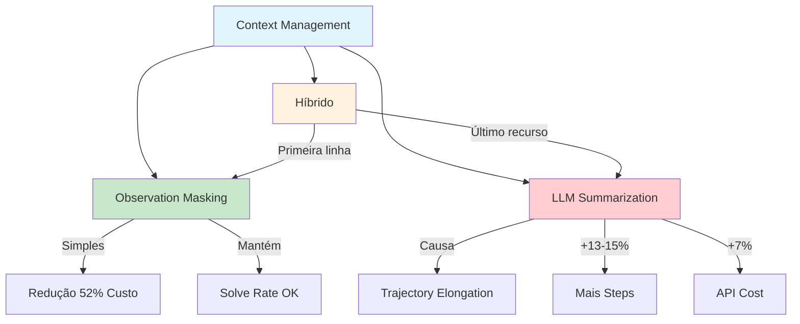

# [Efficient Context Management for LLM-Powered Agents](/blog/efficient-context-management-for-llm-powered-agents)

> [!compass] **[IA](/blog/moc---ia)** » [Context Engineering](/blog/context-engineering) » Pesquisa

---

> [!info]+ Detalhes do Artigo
> **Ler:** [Cutting Through the Noise: Smarter Context Management](https://blog.jetbrains.com/research/2025/12/efficient-context-management/)
> **Fonte:** [JetBrains Research](/blog/jetbrains-research) (Blog Oficial)
> **Autores:** Katie Fraser (baseado em pesquisa de Tobias Lindenbauer - TUM)
> **Publicado:** Dezembro 2025 (NeurIPS 2025)

> [!abstract]+ Materiais Complementares
>
> **Artigos Relacionados**
> - [Context Engineering - LangChain](https://blog.langchain.com/context-engineering-for-agents/) - Visão complementar sobre estratégias
>
> **Ferramentas Mencionadas**
> - [OpenHands](https://github.com/All-Hands-AI/OpenHands) - Agente de coding
> - [Cursor](https://cursor.sh) - IDE com IA
> - [Warp](https://warp.dev) - Terminal com IA

> [!tip]- Léxico
>
> **Estratégias de Context Management**
> - [Observation Masking](/blog/observation-masking): Substituir observações antigas por placeholders mantendo histórico de raciocínio
> - [LLM Summarization](/blog/llm-summarization): Usar modelo separado para comprimir interações em resumos
> - [Trajectory Elongation](/blog/trajectory-elongation): Fenômeno onde agentes executam mais steps que necessário
>
> **Métricas e Conceitos**
> - [Solve Rate](/blog/solve-rate): Taxa de resolução de tarefas pelo agente
> - [Context Window](/blog/context-window): Janela de contexto limitada do LLM
> - [Token Cost](/blog/token-cost): Custo baseado em quantidade de tokens processados
>
> **Ferramentas e Tecnologias**
> - [Qwen3-Coder](/blog/qwen3-coder): Modelo de 480B parâmetros usado nos benchmarks
> - [OpenHands](/blog/openhands): Framework de agentes usado na pesquisa
> - [SWE-bench](/blog/swe-bench): Benchmark para avaliação de agentes de código

> [!question]- Pontos para Aprofundar
>
> - **Por que observation masking supera summarization?**
>     - Investigar impacto de "sinais de parada" perdidos na sumarização
> - **Como implementar estratégia híbrida em produção?**
>     - Definir thresholds para switch entre estratégias
> - **Quais observações são seguras para mascarar?**
>     - Análise de impacto por tipo de observação

> [!robot]- Sugestões Complementares
>
> - **Leituras Recomendadas:**
>     - Paper original do NeurIPS 2025 (Lindenbauer et al.)
>     - Documentação do OpenHands sobre context management
> - **Ferramentas Úteis:**
>     - **OpenHands** - testar estratégias de contexto
>     - **LangSmith** - monitorar custos de tokens

---

## Resumo

Pesquisa da JetBrains/TUM apresentada no NeurIPS 2025 compara estratégias de gerenciamento de contexto para agentes de software engineering. Descoberta principal: observation masking (técnica simples de substituir observações por placeholders) supera LLM summarization em 4 de 5 cenários, com custos 52% menores. A sumarização causa "trajectory elongation" - agentes rodam 13-15% mais steps por perder sinais de quando parar.

**Definição central:**
- **Observation Masking** = substituir observações antigas por placeholders mantendo histórico de ações
- **Problema abordado** = contextos crescem descontroladamente, aumentando custos sem melhorar performance

---

## Principais Conceitos

### Conceito 1: O Paradoxo do Contexto

| Expectativa | Realidade |
|:------------|:----------|
| Mais contexto = melhor performance | Contexto excessivo vira ruído |
| Modelos usam toda informação | "Contextos efetivos são pequenos" |
| Custo proporcional ao valor | Custos exponenciais, valor estagnado |

### Conceito 2: Observation Masking vs LLM Summarization

> "Most agent failures are not model failures anymore, they are context failures."

**Observation Masking:**
- Simples: substitui observações por `[MASKED]`
- Mantém histórico de raciocínio/ações intacto
- **52% mais barato** com Qwen3-Coder 480B

**LLM Summarization:**
- Sofisticado: modelo comprime interações
- Causa trajectory elongation (13-15% mais steps)
- Chamadas de API custam até 7% adicional

### Conceito 3: Por Que Summarization Falha

A sumarização oculta "sinais de parada" - indicadores de que a tarefa foi concluída. Sem esses sinais, agentes continuam executando steps desnecessários.

1. **Perda de sinais:** Resumos omitem detalhes críticos
2. **Custo extra:** API calls para summarization
3. **Elongation:** 13-15% mais steps executados

---

## Detalhamento

### Seção 1: O Problema do Crescimento de Contexto

Contextos de agentes crescem rapidamente durante execução, gerando três problemas principais.

**Problemas documentados:**
- Custos exponenciais (modelos cobram por token)
- Superação da janela de contexto
- Transformação de informação útil em ruído

> [!warning] Insight Crítico
> "Conforme o contexto cresce, modelos de linguagem frequentemente lutam para usar bem toda informação."

### Seção 2: Benchmark de Estratégias

Pesquisa testou estratégias em múltiplos cenários com resultados consistentes:

| Estratégia | Redução de Custo | Solve Rate |
|:-----------|:-----------------|:-----------|
| **Observation Masking** | >50% | Equivalente ou superior |
| **LLM Summarization** | >50% | Equivalente (com mais steps) |
| **Baseline** | - | Referência |

### Seção 3: Solução Híbrida

> [!quote] Recomendação
> "Simplicidade frequentemente vence em eficiência total e confiabilidade."

**Estratégia híbrida proposta:**
- **Primeira linha:** observation masking como defesa padrão
- **Último recurso:** LLM summarization quando contexto atinge limite crítico

---

## Técnicas e Métodos

### Técnica 1: Observation Masking

**Conceito:** Substituir observações antigas mantendo ações e raciocínio

**Implementação:**
- Definir janela de observações recentes a manter (ex: últimas 5)
- Substituir observações antigas por placeholder `[MASKED]`
- Manter histórico completo de ações e raciocínio

> [!tip] Quick Win
> Comece mascarando outputs de ferramentas (file reads, search results) - são os maiores consumidores de tokens.

### Técnica 2: Estratégia Híbrida

**Conceito:** Escalar estratégia conforme pressão de contexto

**Implementação:**
```
if contexto < 70%:
    nenhuma ação
elif contexto < 90%:
    observation_masking()
else:
    llm_summarization()
```

> [!example] Caso Prático
> Sistemas como Cursor e Warp poderiam reduzir custos significativamente adotando observation masking como padrão.

### Quando Usar Cada Técnica

| Técnica | Melhor para |
|:--------|:------------|
| **Observation Masking** | Default para qualquer agente |
| **LLM Summarization** | Emergência quando contexto crítico |
| **Híbrido** | Produção com otimização de custo |

---

## Mapa de Conceitos

Este diagrama ilustra a relação entre estratégias de context management e seus impactos em custo e performance.



---

## Como Aplicar

> **TL;DR:** Use observation masking como default - é mais simples, mais barato e funciona melhor.

### 🎯 Implementação Imediata
**Contexto:** Qualquer agente que executa ferramentas com outputs longos (file reads, searches)
**Faça agora:** Implemente masking de observações antigas mantendo apenas as 5 mais recentes
**Sucesso =** Redução de 50%+ em custo de tokens sem perda de solve rate

### 🔄 Outras Aplicações
- **Coding Agents:** Mascarar outputs de file reads antigos → economia massiva
- **Search Agents:** Mascarar resultados de buscas anteriores → contexto mais limpo

### 🗑️ Ignorei
- Detalhes do benchmark: específicos demais
- Comparações entre modelos: não aplicável diretamente

---

## Insights Pessoais

**O que aprendi:**
- Simplicidade vence sofisticação em context management
- LLM summarization pode piorar performance por perder sinais de parada

**Como aplico no meu contexto:**
- Implementar observation masking nos meus agentes
- Monitorar trajectory length como métrica de saúde

**Perguntas que surgiram:**
- Quais tipos de observação são mais seguros para mascarar?
- Como detectar trajectory elongation em produção?

---

## Ações / Próximos Passos

- [ ] Implementar observation masking em agente de teste
- [ ] Comparar métricas antes/depois (custo, steps, solve rate)
- [ ] Definir thresholds para estratégia híbrida

---

## Recursos Adicionais

**Plataformas e Ferramentas:**
- [OpenHands](https://github.com/All-Hands-AI/OpenHands) - Framework usado na pesquisa
- [SWE-bench](https://www.swebench.com/) - Benchmark de agentes

**Artigos Complementares:**
- [Context Engineering - LangChain](https://blog.langchain.com/context-engineering-for-agents/)

---

## Propriedades da nota

> [!note]- Propriedades Gerais do Obsidian
>
>> **Identificação**
>
> | Campo      | Valor                    |
> |:-----------|:-------------------------|
> | **Título** | `INPUT[text:titulo]`     |
>
>> **Conexões**
>
> | Campo           | Valor                                                                 |
> |:----------------|:----------------------------------------------------------------------|
> | **Pai**         | `INPUT[suggester(optionQuery("")):pai]`                               |
> | **Coleção**     | `INPUT[inlineSelect(option(financeiro, Financeiro), option(growth, Growth), option(ia, IA), option(lideranca, Liderança), option(marketing, Marketing), option(negocios, Negócios), option(produtividade, Produtividade), option(pkm, PKM), option(saas, SaaS), option(tecnologia, Tecnologia), option(vendas, Vendas)):colecao]` |
> | **Área**        | `INPUT[suggester(optionQuery("Esforços/Áreas")):area]`                         |
> | **Projeto**     | `INPUT[suggester(optionQuery("#projeto")):projeto]`                   |
> | **Autor**       | `INPUT[suggester(optionQuery("Atlas/Pessoas")):pessoa]`                      |
> | **Relacionado** | `INPUT[inlineListSuggester(optionQuery(""), useLinks(true)):relacionado]` |
>
>> **Classificação**
>
> | Campo      | Valor                                                                 |
> |:-----------|:----------------------------------------------------------------------|
> | **Tipo**   | `INPUT[inlineSelect(option(atomica, Atômica), option(aula, Aula), option(artigo, Artigo), option(checklist, Checklist), option(curso, Curso), option(dashboard, Dashboard), option(framework, Framework), option(livro, Livro), option(moc, MOC), option(newsletter, Newsletter), option(pessoa, Pessoa), option(prompt, Prompt), option(template, Template Obsidian), option(tutorial, Tutorial), option(video_youtube, Vídeo Youtube)):tipo_nota]` |
> | **Tags**   | `INPUT[inlineList:tags]`                                              |
> | **Status** | `INPUT[inlineSelect(option(nao_iniciado, ⬜ Não Iniciado), option(em_andamento, 🔄 Em Andamento), option(concluido, ✅ Concluído), option(pausado, ⏸️ Pausado), option(cancelado, ❌ Cancelado)):status]` |
>
>> **Temporal**
>
> | Campo          | Valor                      |
> |:---------------|:---------------------------|
> | **Criado**     | `INPUT[date:data_criado]`       |
> | **Atualizado** | `INPUT[date:data_atualizado]`   |

> [!note]- Propriedades do Artigo
>
> | Campo            | Valor                          |
> |:-----------------|:-------------------------------|
> | **URL**          | `INPUT[text(placeholder(https://...)):url_artigo]`  |
> | **Fonte**        | `INPUT[text:fonte]`  |
> | **Autor**        | `INPUT[text:autor]`  |
> | **Data Publicação** | `INPUT[date:data_publicacao]`  |

