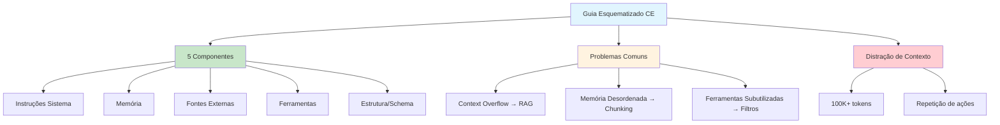

# [Engenharia de Contexto Guia Esquematizado - DIO](/blog/engenharia-de-contexto-guia-esquematizado---dio)

> [!compass] **[MyMess](/blog/moc---projeto-mymess)** » [Estudos](/blog/dashboard---estudos-mymess) » Engenharia de Contexto

---

> [!info]+ Detalhes do Artigo
> **Ler:** [Engenharia de Contexto: Um Guia Esquematizado](https://www.dio.me/articles/engenharia-de-contexto-um-guia-esquematizado-para-obter-os-melhores-resultado-de-qualquer-ia-bc330c01a6c9)
> **Fonte:** [DIO](/blog/dio) - Digital Innovation One (Artigo PT-BR)
> **Autores:** Isaac Santos
> **Publicado:** 09 de Julho de 2025

> [!abstract]+ Materiais Complementares
>
> **5 Componentes Essenciais**
> 1. Instruções do Sistema
> 2. Memória
> 3. Fontes Externas
> 4. Ferramentas Disponíveis
> 5. Estrutura/Schema
>
> **Problemas e Soluções**
> - Context Overflow → RAG
> - Memória Desorganizada → Chunking
> - Ferramentas Subutilizadas → Filtros Semânticos

> [!tip]- Léxico
>
> **Técnicas e Estratégias**
> - **Distração do Contexto**: Fenômeno onde modelos com 100K tokens repetem ações históricas ao invés de gerar estratégias novas
> - **Chunking**: Técnica para organizar memória desorganizada
>
> **Conteúdo e Criação**
> - **Engenharia de Contexto**: Construção de pipelines que selecionam, organizam e filtram informações antes da geração de respostas
>
> **Tecnologia e IA**
> - **RAG (Retrieval-Augmented Generation)**: Solução para context overflow
> [!question]- Pontos para Aprofundar (Sugestão da IA)
>
> - **Como implementar RAG para resolver context overflow?**
>     - Pesquisar implementações práticas com LangChain/LlamaIndex
> - **Qual limite de tokens ideal antes da distração?**
>     - Testar diferentes tamanhos de contexto e medir degradação
> - **Como aplicar filtros semânticos em ferramentas?**
>     - Explorar priorização contextual baseada em relevância

> [!robot]- Sugestões Complementares
>
> - **Leituras Recomendadas:**
>     - Artigos sobre RAG e Retrieval-Augmented Generation
>     - Documentação de chunking e splitting de documentos
> - **Ferramentas Úteis:**
>     - **LangChain** - Framework para RAG
>     - **LlamaIndex** - Indexação e recuperação de contexto
> - **Exercícios Práticos:**
>     - Implementar pipeline com os 5 componentes
>     - Testar compactação de prompts em conversas longas

---

## Resumo

Guia esquematizado de **Isaac Santos** (DIO) que apresenta a engenharia de contexto como **abordagem sistêmica** diferente do prompt engineering. Define **5 componentes essenciais** e aborda problemas comuns como context overflow e distração de contexto. Destaque para o fenômeno de **distração acima de 100K tokens** (citando Gemini jogando Pokémon).

**Distinção ilustrada:**
- **Prompt Engineering:** "Solicitar um cardápio vegano"
- **Context Engineering:** "Definir um chef vegano especializado em fitness com acesso a plataformas nutricionais e histórico de preferências"

---

## Principais Conceitos

### Prompt Engineering vs Context Engineering

A tabela abaixo resume as informações principais.

| Prompt Engineering | Context Engineering |
|:-------------------|:--------------------|
| Orienta uma única tarefa | Constrói **pipelines** de seleção e filtragem |
| Foco na instrução | Foco no **sistema** por trás da instrução |
| Resultado imediato | Arquitetura **robusta** e escalável |

### Os 5 Componentes Essenciais

A tabela a seguir detalha os campos e seus valores.

| # | Componente | Função |
|:--|:-----------|:-------|
| 1 | **Instruções do Sistema** | Estabelecem tom, papel e protocolos |
| 2 | **Memória** | Histórico conversacional e preferências |
| 3 | **Fontes Externas** | APIs, documentos e dados relevantes |
| 4 | **Ferramentas Disponíveis** | Funções que o modelo pode executar |
| 5 | **Estrutura/Schema** | Formatação padronizada para respostas |

---

## Detalhamento

### Aplicações Práticas

Indispensável em:
- Chatbots empresariais
- Assistentes técnicos
- Suporte jurídico e médico

> [!warning] Sistemas simples falham onde arquiteturas robustas prosperam.

### Falhas Comuns e Estratégias Corretivas

Os dados abaixo mostram a estrutura e configurações.

| Problema | Descrição | Solução |
|:---------|:----------|:--------|
| **Context Overflow** | Muitas fontes sobrecarregam | RAG (Retrieval-Augmented Generation) |
| **Memória Desorganizada** | Histórico caótico | Compactação de prompts e chunking |
| **Ferramentas Subutilizadas** | Funções não acionadas | Filtros semânticos e priorização contextual |

### Fenômeno: Distração do Contexto

> [!danger] Limite Crítico
> Quando o contexto excede ~100.000 tokens, modelos começam a **repetir ações históricas** em vez de gerar estratégias novas.

Exemplo citado: Gemini jogando Pokémon com contexto excessivo.

### Impactos Esperados

Sistemas bem arquitetados demonstram:
- Precisão aumentada
- Continuidade em conversas extensas
- Respostas emotivamente relevantes e estilizadas

### 3 Questões Reflexivas para Líderes

Isaac Santos propõe três perguntas cruciais:
1. **Qual narrativa estou alimentando?**
2. **Minha IA reconhece contexto de fala (quem/onde)?**
3. **A arquitetura preserva memória do usuário?**

---

## Mapa de Conceitos

O diagrama abaixo ilustra o fluxo do processo, mostrando as etapas e suas conexões.

---

## Insights & Aprendizados

**O que funcionou bem:**
- Distinção clara entre PE e CE com exemplo prático (chef vegano)
- Framework dos 5 componentes essenciais
- Tabela de problemas e soluções actionable
- Alerta sobre limite de 100K tokens

**O que posso adaptar para o MyMess:**
- **5 Componentes**: Usar como checklist para setup de agentes
- **Perguntas reflexivas**: Aplicar no diagnóstico de clientes
- **RAG para overflow**: Implementar em knowledge bases extensas

**Ideias para aplicar:**
- Criar template de diagnóstico baseado nas 3 perguntas
- Implementar chunking em memórias longas de agentes
- Definir threshold de tokens para compactação automática

---

## Recursos Adicionais

- [DIO - Guia Esquematizado](https://www.dio.me/articles/engenharia-de-contexto-um-guia-esquematizado-para-obter-os-melhores-resultado-de-qualquer-ia-bc330c01a6c9)
- [DIO - Digital Innovation One](https://www.dio.me)

---

## Propriedades da nota

> [!note]- Propriedades Gerais do Obsidian
>
>> **Identificação**
>
> | Campo      | Valor                    |
> |:-----------|:-------------------------|
> | **Título** | `INPUT[text:titulo]`     |
>
>> **Conexões**
>
> | Campo           | Valor                                                                 |
> |:----------------|:----------------------------------------------------------------------|
> | **Pai**         | `INPUT[suggester(optionQuery("")):pai]`                               |
> | **Coleção**     | `INPUT[inlineSelect(option(financeiro, Financeiro), option(growth, Growth), option(ia, IA), option(lideranca, Liderança), option(marketing, Marketing), option(negocios, Negócios), option(produtividade, Produtividade), option(pkm, PKM), option(saas, SaaS), option(tecnologia, Tecnologia), option(vendas, Vendas)):colecao]` |
> | **Área**        | `INPUT[suggester(optionQuery("Esforços/Áreas")):area]`                         |
> | **Projeto**     | `INPUT[suggester(optionQuery("#projeto")):projeto]`                   |
> | **Autor**       | `INPUT[suggester(optionQuery("Atlas/Pessoas")):pessoa]`                      |
> | **Relacionado** | `INPUT[inlineListSuggester(optionQuery(""), useLinks(true)):relacionado]` |
>
>> **Classificação**
>
> | Campo      | Valor                                                                 |
> |:-----------|:----------------------------------------------------------------------|
> | **Tipo**   | `INPUT[inlineSelect(option(atomica, Atômica), option(aula, Aula), option(artigo, Artigo), option(checklist, Checklist), option(curso, Curso), option(dashboard, Dashboard), option(framework, Framework), option(livro, Livro), option(moc, MOC), option(newsletter, Newsletter), option(pessoa, Pessoa), option(prompt, Prompt), option(template, Template Obsidian), option(tutorial, Tutorial), option(video_youtube, Vídeo Youtube)):tipo_nota]` |
> | **Tags**   | `INPUT[inlineList:tags]`                                              |
> | **Status** | `INPUT[inlineSelect(option(nao_iniciado, ⬜ Não Iniciado), option(em_andamento, 🔄 Em Andamento), option(concluido, ✅ Concluído), option(pausado, ⏸️ Pausado), option(cancelado, ❌ Cancelado)):status]` |
>
>> **Temporal**
>
> | Campo          | Valor                      |
> |:---------------|:---------------------------|
> | **Criado**     | `INPUT[date:data_criado]`       |
> | **Atualizado** | `INPUT[date:data_atualizado]`   |

> [!note]- Propriedades SaaS
>
> | Campo             | Valor                                                              |
> |:------------------|:-------------------------------------------------------------------|
> | **Mostrar Bloco** | `INPUT[toggle(onValue(true), offValue(false)):mostrar_bloco_saas]` |
> | **Status SaaS**   | `INPUT[toggle(onValue(true), offValue(false)):status_saas]`        |

> [!note]- Propriedades do Artigo
>
> | Campo            | Valor                          |
> |:-----------------|:-------------------------------|
> | **URL**          | `INPUT[text(placeholder(https://...)):url_artigo]`  |
> | **Fonte**        | `INPUT[text:fonte]`  |
> | **Autor**        | `INPUT[text:autor]`  |
> | **Data Publicação** | `INPUT[date:data_publicacao]`  |
> | **Tipo Conteúdo** | `INPUT[inlineSelect(option(educacional, Educacional), option(curadoria, Curadoria), option(historia, História Pessoal), option(listicle, Lista), option(contrarian, Opinião Contrária), option(tutorial, Tutorial), option(entrevista, Entrevista), option(analise, Análise), option(estudo_de_caso, Estudo de Caso), option(lancamento, Lançamento), option(opiniao, Opinião), option(outro, Outro)):tipo_conteudo]`  |

