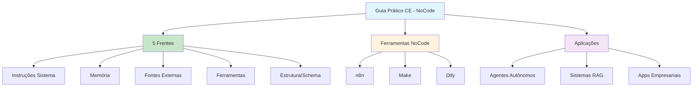

# [Engenharia de Contexto Guia Pratico - NoCode Startup](/blog/engenharia-de-contexto-guia-pratico---nocode-startup)

> [!compass] **[MyMess](/blog/moc---projeto-mymess)** » [Estudos](/blog/dashboard---estudos-mymess) » Engenharia de Contexto

---

> [!info]+ Detalhes do Artigo
> **Ler:** [Engenharia de Contexto: Guia Prático para IA Precisa](https://nocodestartup.io/engenharia-de-contexto/)
> **Fonte:** [NoCode Startup](/blog/nocode-startup) (Guia Prático PT-BR)
> **Autores:** NoCode Startup Team
> **Publicado:** 2025

> [!abstract]+ Materiais Complementares
>
> **5 Frentes da Modelagem de Contexto**
> 1. Instruções do sistema
> 2. Memória
> 3. Fonte externa
> 4. Ferramentas disponíveis
> 5. Estrutura/Schema
>
> **Ferramentas Mencionadas**
> - n8n - Automação com integrações IA
> - Make (Integromat) - Operações ETL visuais
> - Dify - Plataforma de IA generativa

> [!tip]- Léxico
>
> **Tecnologia e IA**
> - **Orquestrador de Dados**: Função da CE de coordenar dados e memória em vez de prompts genéricos
> - **Memória Contextual**: Histórico e preferências que enriquecem interações
>
> **Conteúdo e Criação**
> - **Engenharia de Contexto**: Prática de estruturar, organizar e fornecer informações contextuais para aumentar precisão e eficiência das respostas
>
> **Ferramentas e Recursos**
> - **Agentes Autônomos**: Sistemas que dependem de CE para resolver problemas reais
> [!question]- Pontos para Aprofundar (Sugestão da IA)
>
> - **Como implementar CE com n8n e Make?**
>     - Explorar integrações específicas e workflows
> - **Qual a diferença prática entre PE e CE em NoCode?**
>     - Testar ambas abordagens em projetos reais
> - **Como combinar CE com ETL visual?**
>     - Investigar pipelines de dados + IA

> [!robot]- Sugestões Complementares
>
> - **Leituras Recomendadas:**
>     - Documentação do n8n para integrações IA
>     - Tutoriais do Dify para agentes
> - **Ferramentas Úteis:**
>     - **n8n** - Automação e integrações
>     - **Make** - ETL visual
>     - **Dify** - Plataforma IA generativa
> - **Exercícios Práticos:**
>     - Criar agente de propostas comerciais com contexto rico
>     - Implementar as 5 frentes em workflow n8n

---

## Resumo

Guia prático do **NoCode Startup** posicionando engenharia de contexto como **disciplina central** para agentes autônomos, sistemas RAG e aplicações empresariais. Diferencia CE de prompt engineering: CE se preocupa com **o que está por trás da instrução** - dados, metadados, memória contextual e arquitetura. Destaca integração com ferramentas NoCode como **n8n, Make e Dify**.

**Definição central:** "Engenharia de contexto funciona como um **orquestrador de dados e memória**. Ao invés de alimentar um modelo com prompts genéricos, inserimos instruções enriquecidas."

---

## Principais Conceitos

### Prompt Engineering vs Context Engineering

A tabela abaixo resume as informações principais.

| Prompt Engineering | Context Engineering |
|:-------------------|:--------------------|
| Foca em **como** escrever instruções | Foca no **que** está por trás da instrução |
| Instruções isoladas | Dados + metadados + memória + arquitetura |
| Prompts genéricos | Instruções **enriquecidas** |

### As 5 Frentes da Modelagem de Contexto

A tabela a seguir detalha os campos e seus valores.

| # | Frente | Função |
|:--|:-------|:-------|
| 1 | **Instruções do Sistema** | Definem tom, papel e regras |
| 2 | **Memória** | Histórico de conversas e preferências |
| 3 | **Fonte Externa** | Dados, documentos, APIs relevantes |
| 4 | **Ferramentas Disponíveis** | Definir quais funções o modelo pode usar |
| 5 | **Estrutura/Schema** | Formato definido para resposta organizada |

---

## Detalhamento

### Exemplo Prático: Agente de Propostas Comerciais

> [!example] Antes vs Depois
>
> **Sem CE:** "Crie uma proposta para cliente X"
> → Resultado: Texto genérico
>
> **Com CE:** Fornece dados do cliente, serviços contratados, histórico de negociações, cases de sucesso, metas do trimestre
> → Resultado: Documento **incrivelmente personalizado e eficaz**

### Importância Estratégica

> [!tip] Requisito Fundamental
> "Dominar a engenharia de contexto é mais do que uma vantagem competitiva: é um **requisito fundamental** para construir agentes de IA que resolvem problemas reais."

### Integração com Ferramentas NoCode

Abordagem particularmente poderosa com:

| Ferramenta | Uso |
|:-----------|:----|
| **n8n** | Integrações com IA generativa |
| **Make (Integromat)** | Operações ETL visuais |
| **Dify** | Plataforma de IA generativa |

### Benefícios de CE + ETL

- IA interpreta dados com base em contexto
- Identifica inconsistências automaticamente
- Sugere transformações inteligentes
- Aprende padrões ao longo do tempo
- Elimina etapas manuais (limpeza, reestruturação)
- Execução em escala com precisão

---

## Mapa de Conceitos

O diagrama abaixo ilustra o fluxo do processo, mostrando as etapas e suas conexões.

---

## Insights & Aprendizados

**O que funcionou bem:**
- Exemplo prático de propostas comerciais (antes/depois)
- Framework das 5 frentes alinhado com outros artigos
- Integração com ferramentas NoCode populares
- Posicionamento de CE como requisito, não diferencial

**O que posso adaptar para o MyMess:**
- **Orquestrador de dados**: Usar metáfora no pitch para clientes
- **n8n + CE**: Implementar workflows de contexto automatizados
- **Exemplo de propostas**: Criar demo similar para vendas

**Ideias para aplicar:**
- Desenvolver template n8n para as 5 frentes
- Criar workflow de enriquecimento de propostas
- Implementar CE com Dify para agentes específicos

---

## Recursos Adicionais

- [NoCode Startup - Engenharia de Contexto](https://nocodestartup.io/engenharia-de-contexto/)
- [NoCode Startup](https://nocodestartup.io)
- [n8n](https://n8n.io) - Plataforma de automação
- [Make](https://www.make.com) - Integromat
- [Dify](https://dify.ai) - Plataforma IA Generativa

---

## Propriedades da nota

> [!note]- Propriedades Gerais do Obsidian
>
>> **Identificação**
>
> | Campo      | Valor                    |
> |:-----------|:-------------------------|
> | **Título** | `INPUT[text:titulo]`     |
>
>> **Conexões**
>
> | Campo           | Valor                                                                 |
> |:----------------|:----------------------------------------------------------------------|
> | **Pai**         | `INPUT[suggester(optionQuery("")):pai]`                               |
> | **Coleção**     | `INPUT[inlineSelect(option(financeiro, Financeiro), option(growth, Growth), option(ia, IA), option(lideranca, Liderança), option(marketing, Marketing), option(negocios, Negócios), option(produtividade, Produtividade), option(pkm, PKM), option(saas, SaaS), option(tecnologia, Tecnologia), option(vendas, Vendas)):colecao]` |
> | **Área**        | `INPUT[suggester(optionQuery("Esforços/Áreas")):area]`                         |
> | **Projeto**     | `INPUT[suggester(optionQuery("#projeto")):projeto]`                   |
> | **Autor**       | `INPUT[suggester(optionQuery("Atlas/Pessoas")):pessoa]`                      |
> | **Relacionado** | `INPUT[inlineListSuggester(optionQuery(""), useLinks(true)):relacionado]` |
>
>> **Classificação**
>
> | Campo      | Valor                                                                 |
> |:-----------|:----------------------------------------------------------------------|
> | **Tipo**   | `INPUT[inlineSelect(option(atomica, Atômica), option(aula, Aula), option(artigo, Artigo), option(checklist, Checklist), option(curso, Curso), option(dashboard, Dashboard), option(framework, Framework), option(livro, Livro), option(moc, MOC), option(newsletter, Newsletter), option(pessoa, Pessoa), option(prompt, Prompt), option(template, Template Obsidian), option(tutorial, Tutorial), option(video_youtube, Vídeo Youtube)):tipo_nota]` |
> | **Tags**   | `INPUT[inlineList:tags]`                                              |
> | **Status** | `INPUT[inlineSelect(option(nao_iniciado, ⬜ Não Iniciado), option(em_andamento, 🔄 Em Andamento), option(concluido, ✅ Concluído), option(pausado, ⏸️ Pausado), option(cancelado, ❌ Cancelado)):status]` |
>
>> **Temporal**
>
> | Campo          | Valor                      |
> |:---------------|:---------------------------|
> | **Criado**     | `INPUT[date:data_criado]`       |
> | **Atualizado** | `INPUT[date:data_atualizado]`   |

> [!note]- Propriedades SaaS
>
> | Campo             | Valor                                                              |
> |:------------------|:-------------------------------------------------------------------|
> | **Mostrar Bloco** | `INPUT[toggle(onValue(true), offValue(false)):mostrar_bloco_saas]` |
> | **Status SaaS**   | `INPUT[toggle(onValue(true), offValue(false)):status_saas]`        |

> [!note]- Propriedades do Artigo
>
> | Campo            | Valor                          |
> |:-----------------|:-------------------------------|
> | **URL**          | `INPUT[text(placeholder(https://...)):url_artigo]`  |
> | **Fonte**        | `INPUT[text:fonte]`  |
> | **Autor**        | `INPUT[text:autor]`  |
> | **Data Publicação** | `INPUT[date:data_publicacao]`  |
> | **Tipo Conteúdo** | `INPUT[inlineSelect(option(educacional, Educacional), option(curadoria, Curadoria), option(historia, História Pessoal), option(listicle, Lista), option(contrarian, Opinião Contrária), option(tutorial, Tutorial), option(entrevista, Entrevista), option(analise, Análise), option(estudo_de_caso, Estudo de Caso), option(lancamento, Lançamento), option(opiniao, Opinião), option(outro, Outro)):tipo_conteudo]`  |

