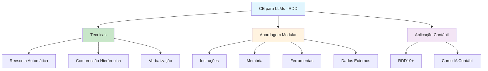

# [Engenharia de Contexto para LLMs - Roberto Dias Duarte](/blog/engenharia-de-contexto-para-llms---roberto-dias-duarte)

> [!compass] **[MyMess](/blog/moc---projeto-mymess)** » [Estudos](/blog/dashboard---estudos-mymess) » Engenharia de Contexto

---

> [!info]+ Detalhes do Artigo
> **Ler:** [Engenharia de Contexto para LLMs](https://www.robertodiasduarte.com.br/engenharia-de-contexto-para-llms-otimize-respostas-com-informacao-estruturada/)
> **Fonte:** [RDD10+](/blog/rdd10) - Primeira Plataforma de IA para Contabilidade no Brasil
> **Autores:** Roberto Dias Duarte
> **Publicado:** 22 de Julho de 2025

> [!abstract]+ Materiais Complementares
>
> **Artigos Relacionados do Autor**
> - [Manual de Boas Práticas em Engenharia de Contexto para LLMs](https://www.robertodiasduarte.com.br/manual-de-boas-praticas-em-engenharia-de-contexto-para-llms/)
> - [Manual Definitivo de Engenharia de Contexto para LLMs](https://www.robertodiasduarte.com.br/manual-definitivo-de-engenharia-de-contexto-para-llms-otimize-resultados/)
> - [Dominando Tokens e Janelas de Contexto](https://www.robertodiasduarte.com.br/dominando-tokens-e-janelas-de-contexto-um-guia-para-profissionais-da-contabilidade/)
>
> **Pesquisa Base**
> - [A Survey of Context Engineering for LLMs](https://arxiv.org/abs/2507.13334) - arXiv 2507.13334v1

> [!tip]- Léxico
>
> **Conteúdo e Criação**
> - **Contexto Modular**: Componentes independentes e combináveis como blocos LEGO
> - **Reescrita Automática**: Transformar textos longos em resumos ou listas de tópicos
>
> **Tecnologia e IA**
> - **Verbalização de Dados Estruturados**: Transformar tabelas e grafos em frases naturais
> - **Compressão Hierárquica**: Organizar dados em diferentes níveis de importância
> [!question]- Pontos para Aprofundar (Sugestão da IA)
>
> - **Como aplicar CE em contexto contábil?**
>     - Explorar casos de uso específicos para contabilidade
> - **Qual a melhor forma de verbalizar dados financeiros?**
>     - Testar transformação de balanços e DREs em linguagem natural
> - **Como implementar compressão hierárquica em documentos fiscais?**
>     - Investigar níveis de importância para dados contábeis

> [!robot]- Sugestões Complementares
>
> - **Leituras Recomendadas:**
>     - Survey arXiv 2507.13334 sobre CE
>     - Manuais complementares do RDD10+
> - **Ferramentas Úteis:**
>     - **RDD10+** - Plataforma de IA para Contabilidade
>     - **LLMs** - GPT, Claude, Gemini
> - **Exercícios Práticos:**
>     - Criar contexto modular para análise contábil
>     - Implementar verbalização de dados financeiros

---

## Resumo

Artigo de **Roberto Dias Duarte** (RDD10+) sobre engenharia de contexto para LLMs, focado em **informação estruturada**. Baseado no survey acadêmico arXiv:2507.13334v1, apresenta técnicas de **modularidade, verbalização e compressão hierárquica**. Voltado para profissionais de contabilidade, destaca que a diferença entre um LLM medíocre e um excepcional está em **como se estrutura o contexto**.

**Citação central:** "A diferença entre um LLM medíocre e um assistente de IA excepcional não está apenas no modelo usado, mas em **como você estrutura e organiza o contexto** que fornece a ele."

---

## Principais Conceitos

### Componentes do Contexto Efetivo

A tabela abaixo resume as informações principais.

| Componente | Função |
|:-----------|:-------|
| **Instruções** | Definem comportamento e regras |
| **Consulta do usuário** | Input específico da tarefa |
| **Conhecimento externo** | Dados e documentos relevantes |
| **Memória** | Histórico e preferências |
| **Estado do mundo** | Contexto situacional atual |
| **Ferramentas disponíveis** | Funções executáveis |

### Abordagem Modular

> [!tip] Princípio LEGO
> "Contextos devem ser compostos por partes **independentes e combináveis**: instruções, memória, ferramentas e dados externos. Pense em blocos de LEGO que podem ser reorganizados conforme a necessidade."

---

## Detalhamento

### Técnicas Avançadas

#### 1. Reescrita Automática
- Transforma textos longos em resumos ou listas de tópicos
- Facilita interpretação e análise das informações

#### 2. Compressão Hierárquica
- Organiza dados em diferentes níveis de importância
- Prioriza informações críticas

#### 3. Verbalização de Dados Estruturados
- Transforma tabelas e grafos em frases naturais
- LLMs processam linguagem natural melhor que estruturas rígidas

> [!example] Exemplo de Verbalização
> **Antes (Tabela):**
> | Conta | Valor |
> |:------|:------|
> | Receita | R$ 100.000 |
> | Custos | R$ 60.000 |
> | Lucro | R$ 40.000 |
>
> **Depois (Verbalizado):**
> "A empresa registrou receita de R$ 100.000, com custos de R$ 60.000, resultando em lucro de R$ 40.000."

### Técnicas de Recuperação e Montagem

O manual detalha técnicas para:
- **Recuperação** de contexto relevante
- **Montagem** de componentes
- **Compressão** de informações
- **Avaliação** da qualidade do contexto

### Aplicação em Contabilidade

Roberto Dias Duarte é pioneiro em IA para contabilidade no Brasil, tendo criado:
- Primeiro curso de IA para profissionais contábeis
- Plataforma RDD10+ de inteligência artificial
- Série de manuais sobre CE para LLMs

---

## Mapa de Conceitos

O diagrama abaixo ilustra o fluxo do processo, mostrando as etapas e suas conexões.

---

## Insights & Aprendizados

**O que funcionou bem:**
- Base acadêmica sólida (survey arXiv)
- Metáfora LEGO para modularidade
- Foco em aplicação prática (contabilidade)
- Técnicas específicas de verbalização

**O que posso adaptar para o MyMess:**
- **Modularidade LEGO**: Aplicar em design de contextos para agentes
- **Verbalização**: Transformar dados estruturados de clientes em linguagem natural
- **Compressão hierárquica**: Priorizar informações em briefings longos

**Ideias para aplicar:**
- Criar pipeline de verbalização para dados de marketing
- Implementar compressão hierárquica em DNAs de marca
- Desenvolver módulos de contexto reutilizáveis

---

## Recursos Adicionais

- [RDD10+ - Artigo Principal](https://www.robertodiasduarte.com.br/engenharia-de-contexto-para-llms-otimize-respostas-com-informacao-estruturada/)
- [Manual de Boas Práticas em CE](https://www.robertodiasduarte.com.br/manual-de-boas-praticas-em-engenharia-de-contexto-para-llms/)
- [Manual Definitivo de CE](https://www.robertodiasduarte.com.br/manual-definitivo-de-engenharia-de-contexto-para-llms-otimize-resultados/)
- [Dominando Tokens e Janelas](https://www.robertodiasduarte.com.br/dominando-tokens-e-janelas-de-contexto-um-guia-para-profissionais-da-contabilidade/)
- [Survey arXiv](https://arxiv.org/abs/2507.13334)
- [RDD10+](https://www.robertodiasduarte.com.br)

---

## Propriedades da nota

> [!note]- Propriedades Gerais do Obsidian
>
>> **Identificação**
>
> | Campo      | Valor                    |
> |:-----------|:-------------------------|
> | **Título** | `INPUT[text:titulo]`     |
>
>> **Conexões**
>
> | Campo           | Valor                                                                 |
> |:----------------|:----------------------------------------------------------------------|
> | **Pai**         | `INPUT[suggester(optionQuery("")):pai]`                               |
> | **Coleção**     | `INPUT[inlineSelect(option(financeiro, Financeiro), option(growth, Growth), option(ia, IA), option(lideranca, Liderança), option(marketing, Marketing), option(negocios, Negócios), option(produtividade, Produtividade), option(pkm, PKM), option(saas, SaaS), option(tecnologia, Tecnologia), option(vendas, Vendas)):colecao]` |
> | **Área**        | `INPUT[suggester(optionQuery("Esforços/Áreas")):area]`                         |
> | **Projeto**     | `INPUT[suggester(optionQuery("#projeto")):projeto]`                   |
> | **Autor**       | `INPUT[suggester(optionQuery("Atlas/Pessoas")):pessoa]`                      |
> | **Relacionado** | `INPUT[inlineListSuggester(optionQuery(""), useLinks(true)):relacionado]` |
>
>> **Classificação**
>
> | Campo      | Valor                                                                 |
> |:-----------|:----------------------------------------------------------------------|
> | **Tipo**   | `INPUT[inlineSelect(option(atomica, Atômica), option(aula, Aula), option(artigo, Artigo), option(checklist, Checklist), option(curso, Curso), option(dashboard, Dashboard), option(framework, Framework), option(livro, Livro), option(moc, MOC), option(newsletter, Newsletter), option(pessoa, Pessoa), option(prompt, Prompt), option(template, Template Obsidian), option(tutorial, Tutorial), option(video_youtube, Vídeo Youtube)):tipo_nota]` |
> | **Tags**   | `INPUT[inlineList:tags]`                                              |
> | **Status** | `INPUT[inlineSelect(option(nao_iniciado, ⬜ Não Iniciado), option(em_andamento, 🔄 Em Andamento), option(concluido, ✅ Concluído), option(pausado, ⏸️ Pausado), option(cancelado, ❌ Cancelado)):status]` |
>
>> **Temporal**
>
> | Campo          | Valor                      |
> |:---------------|:---------------------------|
> | **Criado**     | `INPUT[date:data_criado]`       |
> | **Atualizado** | `INPUT[date:data_atualizado]`   |

> [!note]- Propriedades SaaS
>
> | Campo             | Valor                                                              |
> |:------------------|:-------------------------------------------------------------------|
> | **Mostrar Bloco** | `INPUT[toggle(onValue(true), offValue(false)):mostrar_bloco_saas]` |
> | **Status SaaS**   | `INPUT[toggle(onValue(true), offValue(false)):status_saas]`        |

> [!note]- Propriedades do Artigo
>
> | Campo            | Valor                          |
> |:-----------------|:-------------------------------|
> | **URL**          | `INPUT[text(placeholder(https://...)):url_artigo]`  |
> | **Fonte**        | `INPUT[text:fonte]`  |
> | **Autor**        | `INPUT[text:autor]`  |
> | **Data Publicação** | `INPUT[date:data_publicacao]`  |
> | **Tipo Conteúdo** | `INPUT[inlineSelect(option(educacional, Educacional), option(curadoria, Curadoria), option(historia, História Pessoal), option(listicle, Lista), option(contrarian, Opinião Contrária), option(tutorial, Tutorial), option(entrevista, Entrevista), option(analise, Análise), option(estudo_de_caso, Estudo de Caso), option(lancamento, Lançamento), option(opiniao, Opinião), option(outro, Outro)):tipo_conteudo]`  |

