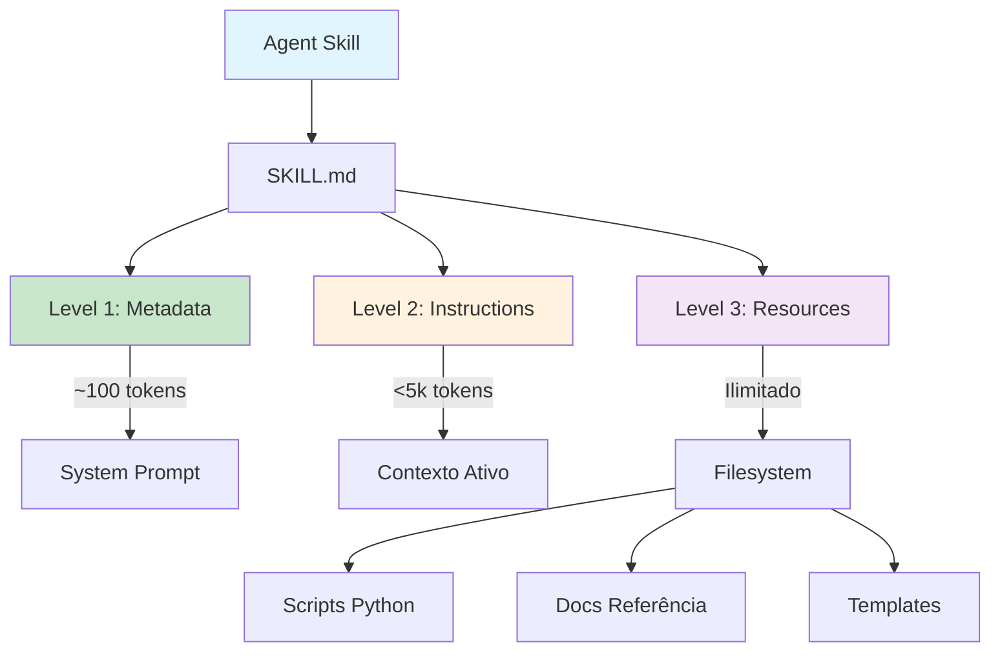

# [Equipping Agents for the Real World with Agent Skills](/blog/equipping-agents-for-the-real-world-with-agent-skills)

> [!compass] **[IA](/blog/moc---inteligncia-artificial)** » [Claude](/blog/claude) » Agent Skills

---

> [!info]+ Detalhes do Artigo
> **Ler:** [Equipping agents for the real world with Agent Skills](https://www.anthropic.com/engineering/equipping-agents-for-the-real-world-with-agent-skills)
> **Fonte:** [Anthropic](/blog/anthropic) (Blog de Engenharia - Oficial)
> **Autores:** Barry Zhang, Keith Lazuka, Mahesh Murag
> **Publicado:** 16 de outubro de 2025 (atualizado em 18 de dezembro de 2025)

> [!abstract]+ Materiais Complementares
>
> **Artigos Relacionados**
> - [Introducing Agent Skills](/blog/introducing-agent-skills) - Anúncio oficial do produto
> - [Agent Skills - Overview](/blog/agent-skills---overview) - Documentação técnica completa
>
> **Repositórios**
> - [Skills Cookbook](https://github.com/anthropics/claude-cookbooks/tree/main/skills) - Exemplos no GitHub

> [!tip]- Léxico
>
> - **Agent Skills**: Pastas organizadas contendo instruções, scripts e recursos que agentes descobrem e carregam dinamicamente
> - **Progressive Disclosure**: Técnica de carregar informações em estágios conforme necessário
> - **SKILL.md**: Arquivo principal de uma skill com metadados YAML e instruções

> [!question]- Pontos para Aprofundar
>
> - **Como estruturar skills para escala?**
>     - Dividir SKILL.md em arquivos quando ficar complexo
> - **Como iterar no desenvolvimento de skills?**
>     - Solicitar que Claude capture abordagens bem-sucedidas

> [!robot]- Sugestões Complementares
>
> - **Exercícios Práticos:**
>     - **Criar PDF Skill:** Implementar skill para extração e preenchimento de formulários
>     - **Avaliar lacunas:** Executar Claude em tarefas representativas e anotar falhas

---

## Resumo

Este artigo técnico da equipe de engenharia da Anthropic apresenta Agent Skills como uma solução para transformar agentes de propósito geral em especialistas de domínio. Skills são pastas organizadas que empacotam instruções, scripts e recursos que o agente descobre e carrega dinamicamente. O conceito central é **progressive disclosure** - carregar informações em 3 níveis para otimizar uso de contexto.

**Definição central:**
- **Agent Skills** = Expertise empacotada em recursos compostos e reutilizáveis
- **Problema abordado** = Especializar agentes sem prompt engineering repetitivo

---

## Principais Conceitos

### Conceito 1: Anatomia de uma Skill

> Uma skill é um diretório contendo um arquivo SKILL.md que começa com metadados YAML.

Estrutura mínima com campos obrigatórios:

```yaml
---
name: pdf-processing
description: Extract text and tables from PDF files, fill forms, merge documents.
---
```

### Conceito 2: Progressive Disclosure (3 Níveis)

Skills carregam informações progressivamente para otimizar contexto:

| Nível | Quando Carrega | Custo | Conteúdo |
|:------|:---------------|:------|:---------|
| Level 1 | Sempre (startup) | ~100 tokens | Metadados YAML |
| Level 2 | Quando acionada | <5k tokens | Corpo do SKILL.md |
| Level 3 | Conforme necessário | Ilimitado | Scripts, docs bundled |

### Conceito 3: Código Determinístico Separado

Scripts Python executados via bash retornam apenas output - o código nunca entra no contexto. Isso permite operações complexas sem consumir tokens.

Exemplo da PDF Skill:
- Scripts extraem campos de formulário
- Claude recebe apenas o resultado estruturado
- PDF inteiro nunca é carregado na janela de contexto

---

## Detalhamento

### Seção 1: Boas Práticas de Desenvolvimento

**Comece com avaliação:**
- Execute agentes em tarefas representativas
- Identifique lacunas e padrões de falha
- Documente abordagens bem-sucedidas

**Estruture para escala:**
- Divida SKILL.md quando ficar complexo
- Mantenha código determinístico em scripts separados
- Use arquivos de referência para documentação extensa

**Pense da perspectiva de Claude:**
- Monitore como o agente usa a skill
- A descrição guia quando a skill é ativada
- Itere baseado no comportamento observado

### Seção 2: Considerações de Segurança

> [!warning] Instale skills apenas de fontes confiáveis

Ao auditar skills não confiáveis, verifique:
- Dependências de código
- Recursos agrupados (imagens, scripts)
- Instruções conectando a fontes externas

---

## Técnicas e Métodos

### Técnica 1: Estrutura de Diretório Completa

**Conceito:** Organizar arquivos para carregamento progressivo eficiente.

**Implementação:**

```
pdf-skill/
├── SKILL.md          # Instruções principais
├── FORMS.md          # Guia de formulários
├── REFERENCE.md      # API detalhada
└── scripts/
    └── fill_form.py  # Utilitário executável
```

### Técnica 2: Iterar com Claude

**Conceito:** Usar o próprio Claude para refinar skills.

**Implementação:**
1. Execute Claude em tarefas do domínio
2. Solicite que capture abordagens bem-sucedidas
3. Transforme em contexto reutilizável na skill

---

## Mapa de Conceitos

O diagrama ilustra a arquitetura de progressive disclosure e como os três níveis de carregamento se relacionam com o consumo de contexto.



---

## Insights & Aprendizados

**O que funcionou bem:**
- **Progressive disclosure**: Permite instalar muitas skills sem penalidade de tokens
- **Scripts separados**: Operações complexas sem consumir contexto

**O que posso adaptar:**
- **Avaliação primeiro**: Identificar lacunas antes de criar skills
- **Iteração com Claude**: Capturar padrões bem-sucedidos automaticamente

---

## Recursos Adicionais

**Documentação:**
- [Agent Skills Overview](https://platform.claude.com/docs/en/agents-and-tools/agent-skills/overview)
- [Skills Cookbook](https://github.com/anthropics/claude-cookbooks/tree/main/skills)

**Disponibilidade:**
- Claude.ai, Claude Code, Claude Agent SDK, Claude Developer Platform

