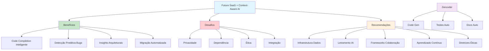

# [Future SaaS Engineering Context-Aware AI Agents - Zencoder](/blog/future-saas-engineering-context-aware-ai-agents---zencoder)

> [!compass] **[MyMess](/blog/moc---projeto-mymess)** » [Estudos](/blog/dashboard---estudos-mymess) » Engenharia de Contexto

---

> [!info]+ Detalhes do Artigo
> **Ler:** [The Future of SaaS Engineering Teams with Context-Aware AI Agents](https://zencoder.ai/blog/the-future-of-engineering-teams-in-saas-with-context-aware-ai-agents)
> **Fonte:** [Zencoder](/blog/zencoder) (Blog)
> **Autores:** Tanvi Shah
> **Publicado:** 08 de Setembro de 2025
> **Atualizado:** 05 de Novembro de 2025

> [!abstract]+ Materiais Complementares
>
> **Componentes Técnicos de Context-Aware Agents**
> - Modelos de aprendizado profundo
> - Processamento de linguagem natural
> - Representação de conhecimento baseada em gráficos
> - Aprendizado contínuo adaptativo
>
> **Recursos do Zencoder**
> - Geração inteligente de código
> - Testes automatizados
> - Documentação automática
> - Integração IDE multi-linguagem

> [!tip]- Léxico
>
> **Tecnologia e IA**
> - **Context-Aware AI Agents**: Agentes que compreendem não apenas código, mas decisões, históricos e objetivos do projeto
> - **Insights Arquiteturais**: Sugestões de refatoração baseadas em padrões de chamadas
> - **Colaboração Humano-IA**: Foco em tarefas criativas enquanto IA gerencia rotinas
>
> **Outros Conceitos**
> - **Detecção Preditiva de Bugs**: Identificação de problemas analisando interações entre componentes
> [!question]- Pontos para Aprofundar (Sugestão da IA)
>
> - **Como implementar context-aware agents em times existentes?**
>     - Pesquisar processo de adoção e treinamento
> - **Qual o ROI de agentes contextuais em SaaS?**
>     - Buscar métricas de produtividade e qualidade
> - **Como balancear dependência de IA vs autonomia do dev?**
>     - Explorar frameworks de colaboração

> [!robot]- Sugestões Complementares
>
> - **Leituras Recomendadas:**
>     - Documentação do Zencoder
>     - Cases de adoção de AI coding assistants
> - **Ferramentas Úteis:**
>     - **Zencoder** - Plataforma de context-aware AI
>     - **GitHub Copilot** - Comparativo
>     - **Cursor** - IDE com IA integrada
> - **Exercícios Práticos:**
>     - Testar Zencoder em projeto piloto
>     - Medir impacto em velocity do time

---

## Resumo

Artigo de **Tanvi Shah** (Zencoder) sobre o futuro dos times de engenharia SaaS com agentes de IA contextual. Posiciona context-aware agents como **"arquitetos experientes desde o primeiro dia"** que compreendem código, decisões e histórico. Aborda benefícios (code completion, detecção de bugs, insights arquiteturais), desafios (privacidade, dependência) e recomendações para o futuro.

**Analogia central:** Context-aware agents funcionam como **"arquitetos experientes que estão com seu projeto desde o primeiro dia"**, compreendendo não apenas o código, mas as decisões, históricos e objetivos que moldam um projeto.

---

## Principais Conceitos

### O que são Agentes Context-Aware?

A tabela abaixo resume as informações principais.

| Componente | Função |
|:-----------|:-------|
| **Modelos de aprendizado profundo** | Base de inteligência |
| **NLP (Processamento de linguagem)** | Compreensão de intenções |
| **Conhecimento baseado em gráficos** | Representação de relações |
| **Aprendizado contínuo** | Adaptação ao longo do tempo |

### 4 Benefícios Principais

A tabela a seguir detalha os campos e seus valores.

| Benefício | Descrição |
|:----------|:----------|
| **Conclusão Inteligente de Código** | Vai além do autocomplete, sugere funções e classes contextualizadas |
| **Detecção Preditiva de Bugs** | Identifica problemas analisando interações entre componentes |
| **Insights Arquiteturais** | Sugere refatorações baseadas em padrões de chamadas e acesso a dados |
| **Migração Automatizada** | Facilita modernização de sistemas legados para frameworks atuais |

---

## Detalhamento

### Colaboração Humano-IA

> [!tip] Foco Humano-IA
> A verdadeira força está na **colaboração**, permitindo que desenvolvedores se concentrem em **"resolução criativa de problemas"** enquanto a IA gerencia tarefas rotineiras.

### Desafios Identificados

Os dados abaixo mostram a estrutura e configurações.

| Desafio | Descrição |
|:--------|:----------|
| **Privacidade e Segurança** | Proteção de dados de código |
| **Dependência Excessiva** | Risco de confiar demais em sugestões de IA |
| **Questões Éticas** | Responsabilidade e viés em código gerado |
| **Integração** | Adaptação em fluxos existentes e treinamento |

### 5 Recomendações para o Futuro

1. **Investir em infraestrutura de dados robusta**
2. **Desenvolver letramento em IA entre colaboradores**
3. **Estabelecer frameworks de colaboração humano-IA**
4. **Promover aprendizado contínuo**
5. **Criar diretrizes éticas para uso de IA**

### Caso Zencoder

Plataforma oferece:
- Geração inteligente de código
- Testes automatizados
- Documentação automática
- Integração IDE
- Suporte multi-linguagem

---

## Mapa de Conceitos

O diagrama abaixo ilustra o fluxo do processo, mostrando as etapas e suas conexões.

---

## Insights & Aprendizados

**O que funcionou bem:**
- Analogia poderosa (arquiteto desde o primeiro dia)
- 4 benefícios concretos bem articulados
- Balanço entre entusiasmo e cautela (desafios)
- 5 recomendações actionable

**O que posso adaptar para o MyMess:**
- **Analogia do arquiteto**: Usar no pitch de agentes para clientes
- **Colaboração humano-IA**: Enfatizar que agentes complementam, não substituem
- **Framework ético**: Desenvolver guidelines para uso responsável

**Ideias para aplicar:**
- Criar assessment de maturidade para adoção de AI agents
- Desenvolver treinamento de "letramento em IA" para clientes
- Implementar métricas de produtividade pré/pós agentes

---

## Recursos Adicionais

- [Zencoder - Future of SaaS Engineering](https://zencoder.ai/blog/the-future-of-engineering-teams-in-saas-with-context-aware-ai-agents)
- [Zencoder](https://zencoder.ai)

---

## Propriedades da nota

> [!note]- Propriedades Gerais do Obsidian
>
>> **Identificação**
>
> | Campo      | Valor                    |
> |:-----------|:-------------------------|
> | **Título** | `INPUT[text:titulo]`     |
>
>> **Conexões**
>
> | Campo           | Valor                                                                 |
> |:----------------|:----------------------------------------------------------------------|
> | **Pai**         | `INPUT[suggester(optionQuery("")):pai]`                               |
> | **Coleção**     | `INPUT[inlineSelect(option(financeiro, Financeiro), option(growth, Growth), option(ia, IA), option(lideranca, Liderança), option(marketing, Marketing), option(negocios, Negócios), option(produtividade, Produtividade), option(pkm, PKM), option(saas, SaaS), option(tecnologia, Tecnologia), option(vendas, Vendas)):colecao]` |
> | **Área**        | `INPUT[suggester(optionQuery("Esforços/Áreas")):area]`                         |
> | **Projeto**     | `INPUT[suggester(optionQuery("#projeto")):projeto]`                   |
> | **Autor**       | `INPUT[suggester(optionQuery("Atlas/Pessoas")):pessoa]`                      |
> | **Relacionado** | `INPUT[inlineListSuggester(optionQuery(""), useLinks(true)):relacionado]` |
>
>> **Classificação**
>
> | Campo      | Valor                                                                 |
> |:-----------|:----------------------------------------------------------------------|
> | **Tipo**   | `INPUT[inlineSelect(option(atomica, Atômica), option(aula, Aula), option(artigo, Artigo), option(checklist, Checklist), option(curso, Curso), option(dashboard, Dashboard), option(framework, Framework), option(livro, Livro), option(moc, MOC), option(newsletter, Newsletter), option(pessoa, Pessoa), option(prompt, Prompt), option(template, Template Obsidian), option(tutorial, Tutorial), option(video_youtube, Vídeo Youtube)):tipo_nota]` |
> | **Tags**   | `INPUT[inlineList:tags]`                                              |
> | **Status** | `INPUT[inlineSelect(option(nao_iniciado, ⬜ Não Iniciado), option(em_andamento, 🔄 Em Andamento), option(concluido, ✅ Concluído), option(pausado, ⏸️ Pausado), option(cancelado, ❌ Cancelado)):status]` |
>
>> **Temporal**
>
> | Campo          | Valor                      |
> |:---------------|:---------------------------|
> | **Criado**     | `INPUT[date:data_criado]`       |
> | **Atualizado** | `INPUT[date:data_atualizado]`   |

> [!note]- Propriedades SaaS
>
> | Campo             | Valor                                                              |
> |:------------------|:-------------------------------------------------------------------|
> | **Mostrar Bloco** | `INPUT[toggle(onValue(true), offValue(false)):mostrar_bloco_saas]` |
> | **Status SaaS**   | `INPUT[toggle(onValue(true), offValue(false)):status_saas]`        |

> [!note]- Propriedades do Artigo
>
> | Campo            | Valor                          |
> |:-----------------|:-------------------------------|
> | **URL**          | `INPUT[text(placeholder(https://...)):url_artigo]`  |
> | **Fonte**        | `INPUT[text:fonte]`  |
> | **Autor**        | `INPUT[text:autor]`  |
> | **Data Publicação** | `INPUT[date:data_publicacao]`  |
> | **Tipo Conteúdo** | `INPUT[inlineSelect(option(educacional, Educacional), option(curadoria, Curadoria), option(historia, História Pessoal), option(listicle, Lista), option(contrarian, Opinião Contrária), option(tutorial, Tutorial), option(entrevista, Entrevista), option(analise, Análise), option(estudo_de_caso, Estudo de Caso), option(lancamento, Lançamento), option(opiniao, Opinião), option(outro, Outro)):tipo_conteudo]`  |

