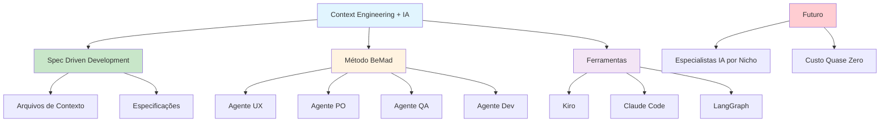

# [Futuro do Vibe Coding - CrazyStack](/blog/futuro-do-vibe-coding---crazystack)

> [!compass] **[MyMess](/blog/moc---projeto-mymess)** » [Estudos](/blog/dashboard---estudos-mymess) » Engenharia de Contexto

---

> [!info]+ Detalhes do Artigo
> **Ler:** [Como criar aplicativos com Context Engineering e IA](https://www.crazystack.com.br/2025/esse-e-o-possivel-futuro-do-vi)
> **Fonte:** [CrazyStack](/blog/crazystack) (Blog)
> **Autores:** Gustavo Miranda (Dev Doido)
> **Publicado:** 20 de Junho de 2025
> **Tempo de Leitura:** 18 minutos

> [!abstract]+ Materiais Complementares
>
> **Ferramentas Mencionadas**
> - Kiro (Amazon)
> - Claude Code
> - Replit Ghostwriter
> - LangGraph
> - Claude Sonnet 4 e Opus 4
>
> **Framework Método BeMad**
> - Simula equipes completas (UX, PO, QA, Dev)
> - Usa agentes de IA especializados
> - Desenvolvimento ágil com IA

> [!tip]- Léxico
>
> **Tecnologia e IA**
> - **Context Engineering**: Prática de criar múltiplos arquivos e especificações que guiam a IA no desenvolvimento
>
> **Outros Conceitos**
> - **Spec Driven Development**: Desenvolvimento orientado por especificações estruturadas
>
> **Conceitos Fundamentais**
> - **Método BeMad**: Framework de desenvolvimento ágil com IA que simula equipes completas
>
> **Conteúdo e Criação**
> - **Vibe Coding**: Programação orientada por contexto e IA
> [!question]- Pontos para Aprofundar (Sugestão da IA)
>
> - **Como implementar o Método BeMad em projetos reais?**
>     - Testar com equipe simulada de agentes IA
> - **Qual a diferença entre Kiro, Claude Code e Replit?**
>     - Comparar funcionalidades e casos de uso
> - **Como criar especialistas em IA por nicho?**
>     - Explorar a previsão de monetização

> [!robot]- Sugestões Complementares
>
> - **Leituras Recomendadas:**
>     - Documentação do Kiro (Amazon)
>     - Tutoriais de Claude Code
> - **Ferramentas Úteis:**
>     - **Kiro** - IDE com context engineering nativo
>     - **Claude Code** - Assistente de código Anthropic
>     - **LangGraph** - Orquestração de agentes
> - **Exercícios Práticos:**
>     - Implementar fluxo BeMad simples
>     - Criar especificações para projeto piloto

---

## Resumo

Artigo de **Gustavo Miranda** (Dev Doido/CrazyStack) sobre como criar aplicativos usando **Context Engineering e IA**. Define CE como "a prática de criar múltiplos arquivos e especificações que guiarão a IA no desenvolvimento" através de **Spec Driven Development**. Apresenta o **Método BeMad** que simula equipes completas (UX, PO, QA, Dev) usando agentes IA. Prevê que negócios criarão "especialistas em IA por nicho" como modelo de monetização.

**Definição central:** "Context Engineering é a prática de criar múltiplos arquivos e especificações que guiarão a IA no desenvolvimento de um app."

---

## Principais Conceitos

### Context Engineering para Desenvolvimento

A tabela abaixo resume as informações principais.

| Aspecto | Descrição |
|:--------|:----------|
| **Foco** | Criar arquivos e especificações estruturadas |
| **Método** | Spec Driven Development |
| **Objetivo** | Guiar IA no desenvolvimento de apps |

### Ferramentas do Ecossistema

A tabela a seguir detalha os campos e seus valores.

| Ferramenta | Uso |
|:-----------|:----|
| **Kiro** | IDE Amazon com context engineering nativo |
| **Claude Code** | Assistente de código Anthropic |
| **Replit Ghostwriter** | Programação colaborativa com IA |
| **LangGraph** | Orquestração de agentes |
| **Claude Sonnet/Opus 4** | Modelos de linguagem |

---

## Detalhamento

### Método BeMad

Framework de desenvolvimento ágil com IA que simula equipes completas:

| Agente | Função |
|:-------|:-------|
| **UX** | Design de experiência do usuário |
| **PO** | Product Owner - priorização |
| **QA** | Testes e qualidade |
| **Dev** | Desenvolvimento de código |

> [!tip] Simulação de Equipe
> O Método BeMad permite que um desenvolvedor solo simule uma equipe completa usando agentes IA especializados.

### Previsão Futura

> [!quote] Monetização com IA
> "Negócios criarão **especialistas em IA por nicho** como abordagem de monetização e inovação, oferecendo soluções sob demanda altamente personalizadas a **custo quase zero**."

### Spec Driven Development

Abordagem onde especificações estruturadas guiam todo o processo:
- Arquivos de contexto definem comportamento
- IA segue especificações para gerar código
- Múltiplos agentes trabalham coordenados

---

## Mapa de Conceitos

O diagrama abaixo ilustra o fluxo do processo, mostrando as etapas e suas conexões.

---

## Insights & Aprendizados

**O que funcionou bem:**
- Método BeMad para simular equipes
- Spec Driven Development como abordagem estruturada
- Visão de futuro sobre monetização via especialistas IA

**O que posso adaptar para o MyMess:**
- **Método BeMad**: Adaptar para equipes de marketing (Copywriter, Designer, Strategist)
- **Spec Driven**: Criar especificações para briefings de clientes
- **Especialistas por nicho**: Posicionar agentes como especialistas setoriais

**Ideias para aplicar:**
- Criar versão "Marketing BeMad" com agentes especializados
- Desenvolver templates de especificação para campanhas
- Implementar simulação de equipe criativa com IA

---

## Recursos Adicionais

- [CrazyStack - Artigo Original](https://www.crazystack.com.br/2025/esse-e-o-possivel-futuro-do-vi)
- [CrazyStack](https://www.crazystack.com.br)
- [Kiro (Amazon)](https://kiro.ai)
- [Claude Code](https://www.anthropic.com/claude-code)
- [LangGraph](https://www.langchain.com/langgraph)

---

## Propriedades da nota

> [!note]- Propriedades Gerais do Obsidian
>
>> **Identificação**
>
> | Campo      | Valor                    |
> |:-----------|:-------------------------|
> | **Título** | `INPUT[text:titulo]`     |
>
>> **Conexões**
>
> | Campo           | Valor                                                                 |
> |:----------------|:----------------------------------------------------------------------|
> | **Pai**         | `INPUT[suggester(optionQuery("")):pai]`                               |
> | **Coleção**     | `INPUT[inlineSelect(option(financeiro, Financeiro), option(growth, Growth), option(ia, IA), option(lideranca, Liderança), option(marketing, Marketing), option(negocios, Negócios), option(produtividade, Produtividade), option(pkm, PKM), option(saas, SaaS), option(tecnologia, Tecnologia), option(vendas, Vendas)):colecao]` |
> | **Área**        | `INPUT[suggester(optionQuery("Esforços/Áreas")):area]`                         |
> | **Projeto**     | `INPUT[suggester(optionQuery("#projeto")):projeto]`                   |
> | **Autor**       | `INPUT[suggester(optionQuery("Atlas/Pessoas")):pessoa]`                      |
> | **Relacionado** | `INPUT[inlineListSuggester(optionQuery(""), useLinks(true)):relacionado]` |
>
>> **Classificação**
>
> | Campo      | Valor                                                                 |
> |:-----------|:----------------------------------------------------------------------|
> | **Tipo**   | `INPUT[inlineSelect(option(atomica, Atômica), option(aula, Aula), option(artigo, Artigo), option(checklist, Checklist), option(curso, Curso), option(dashboard, Dashboard), option(framework, Framework), option(livro, Livro), option(moc, MOC), option(newsletter, Newsletter), option(pessoa, Pessoa), option(prompt, Prompt), option(template, Template Obsidian), option(tutorial, Tutorial), option(video_youtube, Vídeo Youtube)):tipo_nota]` |
> | **Tags**   | `INPUT[inlineList:tags]`                                              |
> | **Status** | `INPUT[inlineSelect(option(nao_iniciado, ⬜ Não Iniciado), option(em_andamento, 🔄 Em Andamento), option(concluido, ✅ Concluído), option(pausado, ⏸️ Pausado), option(cancelado, ❌ Cancelado)):status]` |
>
>> **Temporal**
>
> | Campo          | Valor                      |
> |:---------------|:---------------------------|
> | **Criado**     | `INPUT[date:data_criado]`       |
> | **Atualizado** | `INPUT[date:data_atualizado]`   |

> [!note]- Propriedades SaaS
>
> | Campo             | Valor                                                              |
> |:------------------|:-------------------------------------------------------------------|
> | **Mostrar Bloco** | `INPUT[toggle(onValue(true), offValue(false)):mostrar_bloco_saas]` |
> | **Status SaaS**   | `INPUT[toggle(onValue(true), offValue(false)):status_saas]`        |

> [!note]- Propriedades do Artigo
>
> | Campo            | Valor                          |
> |:-----------------|:-------------------------------|
> | **URL**          | `INPUT[text(placeholder(https://...)):url_artigo]`  |
> | **Fonte**        | `INPUT[text:fonte]`  |
> | **Autor**        | `INPUT[text:autor]`  |
> | **Data Publicação** | `INPUT[date:data_publicacao]`  |
> | **Tipo Conteúdo** | `INPUT[inlineSelect(option(educacional, Educacional), option(curadoria, Curadoria), option(historia, História Pessoal), option(listicle, Lista), option(contrarian, Opinião Contrária), option(tutorial, Tutorial), option(entrevista, Entrevista), option(analise, Análise), option(estudo_de_caso, Estudo de Caso), option(lancamento, Lançamento), option(opiniao, Opinião), option(outro, Outro)):tipo_conteudo]`  |
> | **Categoria** | `INPUT[text:categoria]`  |

