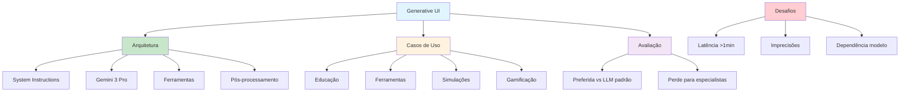

# [Generative UI Google Research](/blog/generative-ui-google-research)

> [!compass] **[MyMess](/blog/moc---projeto-mymess)** » [Estudos](/blog/dashboard---estudos-mymess) » Engenharia de Contexto

---

> [!info]+ Detalhes do Artigo
> **Ler:** [Generative UI: A rich, custom, visual interactive user experience for any prompt](https://research.google/blog/generative-ui-a-rich-custom-visual-interactive-user-experience-for-any-prompt/)
> **Fonte:** [Google Research](/blog/google-research) (Oficial)
> **Autores:** Yaniv Leviathan (Google Fellow), Dani Valevski (Sr. Staff Engineer), Yossi Matias (VP & Head of Google Research)
> **Publicado:** 18 de Novembro de 2025

> [!abstract]+ Materiais Complementares
>
> **Arquitetura Técnica**
> - Gemini 3 Pro como modelo base
> - System instructions detalhadas
> - Acesso a ferramentas (imagens, busca)
> - Output HTML/CSS/JS
>
> **Casos de Uso**
> - Educação personalizada
> - Ferramentas práticas (eventos, moda)
> - Simulações interativas
> - Conteúdo gamificado

> [!tip]- Léxico
>
> **Outros Conceitos**
> - **Interfaces Dinâmicas**: UIs personalizadas geradas sob demanda vs catálogos pré-existentes
> - **Pós-processamento**: Validação dos resultados para corrigir erros comuns
>
> **Conteúdo e Criação**
> - **Generative UI**: Paradigma onde IA cria não apenas conteúdo, mas experiência de usuário completa
>
> **Técnicas e Estratégias**
> - **System Instructions**: Diretrizes detalhadas incluindo objetivo, exemplos e especificações técnicas
> [!question]- Pontos para Aprofundar (Sugestão da IA)
>
> - **Como implementar Generative UI em produtos existentes?**
>     - Explorar integração com Gemini API
> - **Qual o trade-off tempo vs qualidade?**
>     - Testar latência em diferentes casos de uso
> - **Como garantir acessibilidade em UIs geradas?**
>     - Investigar conformidade WCAG

> [!robot]- Sugestões Complementares
>
> - **Leituras Recomendadas:**
>     - Documentação Gemini API
>     - Papers sobre UI generation
> - **Ferramentas Úteis:**
>     - **Gemini 3 Pro** - Modelo base
>     - **Google AI Studio** - Experimentação
> - **Exercícios Práticos:**
>     - Criar protótipo de UI generativa simples
>     - Comparar UI gerada vs estática

---

## Resumo

Artigo oficial do **Google Research** apresentando **Generative UI** - paradigma onde modelos de IA criam "uma experiência de usuário completa", gerando **interfaces visuais imersivas e interativas** (páginas web, jogos, ferramentas) automaticamente personalizadas. Usa **Gemini 3 Pro** com system instructions e acesso a ferramentas. Avaliações mostram interfaces geradas "fortemente preferidas" comparadas a outputs padrão de LLM.

**Definição central:** "Interfaces visuais imersivas e interativas — como páginas web, jogos, ferramentas e aplicações — automaticamente projetadas e totalmente personalizadas em resposta a qualquer pergunta ou instrução."

---

## Principais Conceitos

### O que é Generative UI?

A tabela abaixo resume as informações principais.

| Aspecto | UI Tradicional | Generative UI |
|:--------|:---------------|:--------------|
| **Criação** | Designers humanos | IA gera automaticamente |
| **Personalização** | Seleção de catálogos | Sob demanda, totalmente customizada |
| **Formato** | Templates predefinidos | HTML/CSS/JS dinâmico |
| **Experiência** | Estática | Imersiva e interativa |

### Arquitetura Técnica

A tabela a seguir detalha os campos e seus valores.

| Componente | Função |
|:-----------|:-------|
| **System Instructions** | Diretrizes detalhadas com objetivo, exemplos e specs |
| **Acesso a Ferramentas** | Integração com geração de imagens, busca web |
| **Gemini 3 Pro** | Modelo de linguagem base |
| **Pós-processamento** | Validação e correção de erros |

---

## Detalhamento

### Fluxo de Geração

```
Prompt do usuário → Gemini 3 Pro (+ system instructions)
→ Acesso a ferramentas → Output HTML/CSS/JS → Navegador
```

### Casos de Uso

Os dados abaixo mostram a estrutura e configurações.

| Categoria | Exemplo |
|:----------|:--------|
| **Educação** | Explicar conceitos em diferentes níveis |
| **Ferramentas Práticas** | Planejamento de eventos, consultoria de moda |
| **Simulações** | Biologia molecular, fractais |
| **Gamificação** | Conteúdo lúdico interativo |

### Avaliação de Qualidade

> [!success] Resultado da Pesquisa
> Interfaces geradas são **"fortemente preferidas por avaliadores humanos"** comparadas a outputs padrão de LLM, perdendo apenas para designs criados por **especialistas humanos**.

### Desafios Identificados

A tabela abaixo resume as informações principais.

| Desafio | Descrição |
|:--------|:----------|
| **Latência** | Tempo de geração frequentemente acima de 1 minuto |
| **Imprecisões** | Ocasionais erros nos outputs |
| **Dependência** | Qualidade depende do modelo subjacente |

### Implicações para Design

> [!tip] Mudança de Paradigma
> Transição de **interfaces estáticas predefinidas** para **experiências dinâmicas personalizadas**, onde usuários recebem interfaces customizadas sob demanda.

---

## Mapa de Conceitos

O diagrama abaixo ilustra o fluxo do processo, mostrando as etapas e suas conexões.



---

## Insights & Aprendizados

**O que funcionou bem:**
- Abordagem oficial do Google Research
- Arquitetura clara com 4 componentes
- Avaliação com humanos validando qualidade
- Casos de uso concretos e diversos

**O que posso adaptar para o MyMess:**
- **Generative UI para marketing**: Criar landing pages personalizadas automaticamente
- **System instructions robustas**: Adaptar padrão para agentes de design
- **Pós-processamento**: Implementar validação em outputs de agentes

**Ideias para aplicar:**
- Prototipar geração de layouts de campanha
- Criar agente de design que gera mockups
- Implementar personalização dinâmica de materiais

---

## Recursos Adicionais

- [Google Research - Generative UI](https://research.google/blog/generative-ui-a-rich-custom-visual-interactive-user-experience-for-any-prompt/)
- [Google Research](https://research.google/)
- [Google AI Blog](https://ai.googleblog.com/)
- [Gemini API](https://ai.google.dev/)

---

## Propriedades da nota

> [!note]- Propriedades Gerais do Obsidian
>
>> **Identificação**
>
> | Campo      | Valor                    |
> |:-----------|:-------------------------|
> | **Título** | `INPUT[text:titulo]`     |
>
>> **Conexões**
>
> | Campo           | Valor                                                                 |
> |:----------------|:----------------------------------------------------------------------|
> | **Pai**         | `INPUT[suggester(optionQuery("")):pai]`                               |
> | **Coleção**     | `INPUT[inlineSelect(option(financeiro, Financeiro), option(growth, Growth), option(ia, IA), option(lideranca, Liderança), option(marketing, Marketing), option(negocios, Negócios), option(produtividade, Produtividade), option(pkm, PKM), option(saas, SaaS), option(tecnologia, Tecnologia), option(vendas, Vendas)):colecao]` |
> | **Área**        | `INPUT[suggester(optionQuery("Esforços/Áreas")):area]`                         |
> | **Projeto**     | `INPUT[suggester(optionQuery("#projeto")):projeto]`                   |
> | **Autor**       | `INPUT[suggester(optionQuery("Atlas/Pessoas")):pessoa]`                      |
> | **Relacionado** | `INPUT[inlineListSuggester(optionQuery(""), useLinks(true)):relacionado]` |
>
>> **Classificação**
>
> | Campo      | Valor                                                                 |
> |:-----------|:----------------------------------------------------------------------|
> | **Tipo**   | `INPUT[inlineSelect(option(atomica, Atômica), option(aula, Aula), option(artigo, Artigo), option(checklist, Checklist), option(curso, Curso), option(dashboard, Dashboard), option(framework, Framework), option(livro, Livro), option(moc, MOC), option(newsletter, Newsletter), option(pessoa, Pessoa), option(prompt, Prompt), option(template, Template Obsidian), option(tutorial, Tutorial), option(video_youtube, Vídeo Youtube)):tipo_nota]` |
> | **Tags**   | `INPUT[inlineList:tags]`                                              |
> | **Status** | `INPUT[inlineSelect(option(nao_iniciado, ⬜ Não Iniciado), option(em_andamento, 🔄 Em Andamento), option(concluido, ✅ Concluído), option(pausado, ⏸️ Pausado), option(cancelado, ❌ Cancelado)):status]` |
>
>> **Temporal**
>
> | Campo          | Valor                      |
> |:---------------|:---------------------------|
> | **Criado**     | `INPUT[date:data_criado]`       |
> | **Atualizado** | `INPUT[date:data_atualizado]`   |

> [!note]- Propriedades SaaS
>
> | Campo             | Valor                                                              |
> |:------------------|:-------------------------------------------------------------------|
> | **Mostrar Bloco** | `INPUT[toggle(onValue(true), offValue(false)):mostrar_bloco_saas]` |
> | **Status SaaS**   | `INPUT[toggle(onValue(true), offValue(false)):status_saas]`        |

> [!note]- Propriedades do Artigo
>
> | Campo            | Valor                          |
> |:-----------------|:-------------------------------|
> | **URL**          | `INPUT[text(placeholder(https://...)):url_artigo]`  |
> | **Fonte**        | `INPUT[text:fonte]`  |
> | **Autor**        | `INPUT[text:autor]`  |
> | **Data Publicação** | `INPUT[date:data_publicacao]`  |
> | **Tipo Conteúdo** | `INPUT[inlineSelect(option(educacional, Educacional), option(curadoria, Curadoria), option(historia, História Pessoal), option(listicle, Lista), option(contrarian, Opinião Contrária), option(tutorial, Tutorial), option(entrevista, Entrevista), option(analise, Análise), option(estudo_de_caso, Estudo de Caso), option(lancamento, Lançamento), option(opiniao, Opinião), option(outro, Outro)):tipo_conteudo]`  |

