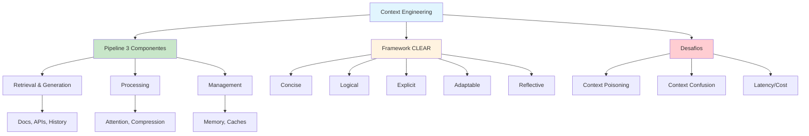

# [Gentle Introduction Context Engineering - KDnuggets](/blog/gentle-introduction-context-engineering---kdnuggets)

> [!compass] **[MyMess](/blog/moc---projeto-mymess)** » [Estudos](/blog/dashboard---estudos-mymess) » Engenharia de Contexto

---

> [!info]+ Detalhes do Artigo
> **Ler:** [A Gentle Introduction to Context Engineering in LLMs](https://www.kdnuggets.com/a-gentle-introduction-to-context-engineering-in-llms)
> **Fonte:** [KDnuggets](/blog/kdnuggets) (Tutorial/Introdução)
> **Autores:** Kanwal Mehreen (ML Engineer & Technical Writer)
> **Publicado:** 07 de Agosto de 2025

> [!abstract]+ Materiais Complementares
>
> **Pipeline de 3 Componentes**
> 1. Context Retrieval and Generation
> 2. Context Processing
> 3. Context Management
>
> **Framework CLEAR**
> - Concise
> - Logical
> - Explicit
> - Adaptable
> - Reflective
>
> **Recursos Referenciados**
> - Survey arXiv:2507.13334
> - davidkimai/Context-Engineering (DeepWiki)
> - Drew Breunig - Context failures

> [!tip]- Léxico
>
> **Conteúdo e Criação**
> - **Context Poisoning**: Vulnerabilidade onde contexto malicioso compromete outputs
> - **Context Confusion**: Conflitos entre múltiplas fontes de contexto
>
> **Tecnologia e IA**
> - **Context Engineering**: Montagem estratégica de toda informação relevante para que LLMs entendam e completem tarefas
>
> **Conceitos Fundamentais**
> - **CLEAR Framework**: Concise, Logical, Explicit, Adaptable, Reflective - guia para construção de prompts
> [!question]- Pontos para Aprofundar (Sugestão da IA)
>
> - **Como implementar o pipeline de 3 componentes?**
>     - Estudar cada etapa em detalhe
> - **Quais técnicas de memory compression funcionam melhor?**
>     - Testar rolling buffer vs KV-cache
> - **Como detectar e prevenir context poisoning?**
>     - Explorar técnicas de segurança

> [!robot]- Sugestões Complementares
>
> - **Leituras Recomendadas:**
>     - Survey arXiv:2507.13334
>     - Drew Breunig sobre context failures
> - **Ferramentas Úteis:**
>     - **Mamba models** - Atenção eficiente
>     - **Vector databases** - Retrieval
> - **Exercícios Práticos:**
>     - Implementar pipeline simples com 3 componentes
>     - Aplicar framework CLEAR em prompts

---

## Resumo

Introdução gentil de **Kanwal Mehreen** (KDnuggets) sobre Context Engineering em LLMs. Define CE como "montar estrategicamente toda informação relevante para que modelos entendam e completem tarefas". Apresenta **pipeline de 3 componentes** (Retrieval, Processing, Management) e o **framework CLEAR** para construção de prompts. Referencia Karpathy: CE é "a arte e ciência delicada de preencher a context window com a informação certa".

**Citação Karpathy:** "Context engineering—rather than simple prompt engineering—constitutes 'the delicate art and science of filling the context window with just the right information.'"

---

## Principais Conceitos

### Prompt Engineering vs Context Engineering

A tabela abaixo resume as informações principais.

| Prompt Engineering | Context Engineering |
|:-------------------|:--------------------|
| Craftar uma pergunta auto-contida | Endereçar todo o **ambiente de input** |
| Foco na instrução | Foco em **o que é mostrado e como organizado** |
| Pergunta única | Sistema completo para **completar tarefas otimamente** |

### Componentes da Context Window

A tabela a seguir detalha os campos e seus valores.

| Componente | Descrição |
|:-----------|:----------|
| **System instructions** | Regras e comportamento |
| **User profiles** | Preferências e histórico |
| **Conversation history** | Memória da sessão |
| **Retrieved documents** | Conhecimento externo |
| **Tool outputs** | Resultados de funções |
| **External data sources** | APIs e dados em tempo real |

---

## Detalhamento

### Pipeline de 3 Componentes

#### 1. Context Retrieval and Generation

Puxar informação relevante:
- Mensagens passadas
- Instruções do usuário
- Documentos externos
- Resultados de APIs
- Dados estruturados

> [!tip] Framework CLEAR para Prompts
> - **C**oncise - Conciso
> - **L**ogical - Lógico
> - **E**xplicit - Explícito
> - **A**daptable - Adaptável
> - **R**eflective - Reflexivo

#### 2. Context Processing

Técnicas de otimização:
- Position interpolation
- Grouped-query attention (atenção eficiente)
- Mamba models
- Self-refinement iterativo
- Autonomous feedback generation

#### 3. Context Management

Manter informação entre interações:
- Long-term memory modules
- Memory compression techniques
- Rolling buffer caches
- Modular retrieval systems

### Desafios e Soluções

Os dados abaixo mostram a estrutura e configurações.

| Desafio | Estratégia de Mitigação |
|:--------|:------------------------|
| **Dados irrelevantes/ruidosos** | Montagem baseada em prioridade, scoring de relevância |
| **Latência/custos** | Truncamento de histórico, módulos leves |
| **Conflitos tool/knowledge** | Instruções de schema, meta-tags de atribuição |
| **Coerência multi-turn** | Reintrodução seletiva de fatos, tracking |

### Vulnerabilidades de Segurança

> [!warning] Riscos Emergentes
> - **Context Poisoning**: Contexto malicioso compromete outputs
> - **Context Confusion**: Conflitos entre múltiplas fontes
>
> Detalhes em Drew Breunig's work.

---

## Mapa de Conceitos

O diagrama abaixo ilustra o fluxo do processo, mostrando as etapas e suas conexões.

---

## Insights & Aprendizados

**O que funcionou bem:**
- Pipeline de 3 componentes bem estruturado
- Framework CLEAR memorável e aplicável
- Tabela de desafios vs soluções actionable
- Referência a vulnerabilidades de segurança

**O que posso adaptar para o MyMess:**
- **Pipeline 3 componentes**: Aplicar em design de agentes
- **Framework CLEAR**: Usar como checklist para prompts
- **Security awareness**: Considerar context poisoning em produção

**Ideias para aplicar:**
- Implementar pipeline de retrieval para briefings
- Criar checklist CLEAR para system prompts
- Desenvolver técnicas de validação de contexto

---

## Recursos Adicionais

- [KDnuggets - Gentle Introduction](https://www.kdnuggets.com/a-gentle-introduction-to-context-engineering-in-llms)
- [KDnuggets](https://www.kdnuggets.com)
- [Survey arXiv:2507.13334](https://arxiv.org/abs/2507.13334)
- [davidkimai/Context-Engineering](https://github.com/davidkimai/Context-Engineering)

---

## Propriedades da nota

> [!note]- Propriedades Gerais do Obsidian
>
>> **Identificação**
>
> | Campo      | Valor                    |
> |:-----------|:-------------------------|
> | **Título** | `INPUT[text:titulo]`     |
>
>> **Conexões**
>
> | Campo           | Valor                                                                 |
> |:----------------|:----------------------------------------------------------------------|
> | **Pai**         | `INPUT[suggester(optionQuery("")):pai]`                               |
> | **Coleção**     | `INPUT[inlineSelect(option(financeiro, Financeiro), option(growth, Growth), option(ia, IA), option(lideranca, Liderança), option(marketing, Marketing), option(negocios, Negócios), option(produtividade, Produtividade), option(pkm, PKM), option(saas, SaaS), option(tecnologia, Tecnologia), option(vendas, Vendas)):colecao]` |
> | **Área**        | `INPUT[suggester(optionQuery("Esforços/Áreas")):area]`                         |
> | **Projeto**     | `INPUT[suggester(optionQuery("#projeto")):projeto]`                   |
> | **Autor**       | `INPUT[suggester(optionQuery("Atlas/Pessoas")):pessoa]`                      |
> | **Relacionado** | `INPUT[inlineListSuggester(optionQuery(""), useLinks(true)):relacionado]` |
>
>> **Classificação**
>
> | Campo      | Valor                                                                 |
> |:-----------|:----------------------------------------------------------------------|
> | **Tipo**   | `INPUT[inlineSelect(option(atomica, Atômica), option(aula, Aula), option(artigo, Artigo), option(checklist, Checklist), option(curso, Curso), option(dashboard, Dashboard), option(framework, Framework), option(livro, Livro), option(moc, MOC), option(newsletter, Newsletter), option(pessoa, Pessoa), option(prompt, Prompt), option(template, Template Obsidian), option(tutorial, Tutorial), option(video_youtube, Vídeo Youtube)):tipo_nota]` |
> | **Tags**   | `INPUT[inlineList:tags]`                                              |
> | **Status** | `INPUT[inlineSelect(option(nao_iniciado, ⬜ Não Iniciado), option(em_andamento, 🔄 Em Andamento), option(concluido, ✅ Concluído), option(pausado, ⏸️ Pausado), option(cancelado, ❌ Cancelado)):status]` |
>
>> **Temporal**
>
> | Campo          | Valor                      |
> |:---------------|:---------------------------|
> | **Criado**     | `INPUT[date:data_criado]`       |
> | **Atualizado** | `INPUT[date:data_atualizado]`   |

> [!note]- Propriedades SaaS
>
> | Campo             | Valor                                                              |
> |:------------------|:-------------------------------------------------------------------|
> | **Mostrar Bloco** | `INPUT[toggle(onValue(true), offValue(false)):mostrar_bloco_saas]` |
> | **Status SaaS**   | `INPUT[toggle(onValue(true), offValue(false)):status_saas]`        |

> [!note]- Propriedades do Artigo
>
> | Campo            | Valor                          |
> |:-----------------|:-------------------------------|
> | **URL**          | `INPUT[text(placeholder(https://...)):url_artigo]`  |
> | **Fonte**        | `INPUT[text:fonte]`  |
> | **Autor**        | `INPUT[text:autor]`  |
> | **Data Publicação** | `INPUT[date:data_publicacao]`  |
> | **Tipo Conteúdo** | `INPUT[inlineSelect(option(educacional, Educacional), option(curadoria, Curadoria), option(historia, História Pessoal), option(listicle, Lista), option(contrarian, Opinião Contrária), option(tutorial, Tutorial), option(entrevista, Entrevista), option(analise, Análise), option(estudo_de_caso, Estudo de Caso), option(lancamento, Lançamento), option(opiniao, Opinião), option(outro, Outro)):tipo_conteudo]`  |

