# [Guia Definitivo Context Engineering - DSAcademy](/blog/guia-definitivo-context-engineering---dsacademy)

> [!compass] **[MyMess](/blog/moc---projeto-mymess)** » [Estudos](/blog/dashboard---estudos-mymess) » Engenharia de Contexto

---

> [!info]+ Detalhes do Artigo
> **Ler:** [Além do Prompt: Guia Definitivo sobre Context Engineering](https://blog.dsacademy.com.br/alem-do-prompt-um-guia-definitivo-sobre-context-engineering-engenharia-de-contexto/)
> **Fonte:** [DSAcademy](/blog/dsacademy) (Blog)
> **Autores:** Tiago Pereira
> **Publicado:** 01 de Agosto de 2025

> [!abstract]+ Materiais Complementares
>
> **7 Componentes de Contexto**
> 1. System Instructions
> 2. User Prompt
> 3. Conversation History
> 4. Retrieved Information (RAG)
> 5. Long-term Memory
> 6. Available Tools & API Responses
> 7. Output Schema
>
> **Técnicas de Implementação**
> - RAG (Retrieval-Augmented Generation)
> - Memory Systems (short/long-term)
> - Agentic Workflows
> - Context Optimization

> [!tip]- Léxico
>
> **Ferramentas e Recursos**
> - **Context Engineering**: Disciplina de projetar sistemas dinâmicos que fornecem informação e ferramentas certas, no formato certo, no momento certo
> - **Agentic Workflows**: Modelos selecionam ferramentas, executam e reinjetam resultados
>
> **Tecnologia e IA**
> - **CE como Superset**: Prompt engineering é um subconjunto de context engineering
>
> **Conteúdo e Criação**
> - **Generation Gap**: Modelos entendem contextos complexos mas lutam para gerar outputs equivalentes
> [!question]- Pontos para Aprofundar (Sugestão da IA)
>
> - **Como implementar os 7 componentes em produção?**
>     - Criar arquitetura modular
> - **Qual o trade-off custo-latência ideal?**
>     - Testar diferentes configurações
> - **Como mitigar o Generation Gap?**
>     - Explorar técnicas de output enhancement

> [!robot]- Sugestões Complementares
>
> - **Leituras Recomendadas:**
>     - Documentação de RAG frameworks
>     - Papers sobre memory systems
> - **Ferramentas Úteis:**
>     - **LangChain** - RAG e memory
>     - **Vector databases** - Retrieval
> - **Exercícios Práticos:**
>     - Implementar sistema com 7 componentes
>     - Testar agentic workflows

---

## Resumo

Guia definitivo de **Tiago Pereira** (DSAcademy) posicionando Context Engineering como **superset do Prompt Engineering**. Define CE como "disciplina de projetar sistemas dinâmicos que fornecem a informação e ferramentas certas, no formato certo, no momento certo". Apresenta **7 componentes de contexto** e técnicas como RAG, Memory Systems e Agentic Workflows. Destaca o **Generation Gap**: modelos entendem contextos complexos mas lutam para gerar outputs equivalentes.

**Definição concisa:** "Preencher a context window com a informação exata necessária para o próximo passo."

---

## Principais Conceitos

### Prompt Engineering vs Context Engineering

A tabela abaixo resume as informações principais.

| Aspecto | Prompt Engineering | Context Engineering |
|:--------|:-------------------|:--------------------|
| **Foco** | O que dizer ao modelo agora | O que o modelo **sabe** quando você fala |
| **Escopo** | Artefato único (o prompt) | **Ciclo de vida completo** do sistema |
| **Objetivo** | Uma boa resposta | **Mil respostas consistentes** |
| **Relacionamento** | Disciplina standalone | **Superset** - PE é subconjunto |

### Os 7 Componentes de Contexto

A tabela a seguir detalha os campos e seus valores.

| # | Componente | Função |
|:--|:-----------|:-------|
| 1 | **System Instructions** | Regras e definição de persona |
| 2 | **User Prompt** | Tarefa imediata e específica |
| 3 | **Conversation History** | Memória de curto prazo da interação |
| 4 | **Retrieved Information (RAG)** | Conhecimento externo buscado dinamicamente |
| 5 | **Long-term Memory** | Conhecimento persistente entre sessões |
| 6 | **Available Tools & API Responses** | Funções chamáveis e seus outputs |
| 7 | **Output Schema** | Formato desejado (JSON, XML, etc.) |

---

## Detalhamento

### Técnicas de Implementação

#### RAG (Retrieval-Augmented Generation)
- Injeta conhecimento externo atual
- Buscas em vector databases
- Chunk retrieval

#### Memory Systems
- **Short-term**: Gerencia conversa imediata
- **Long-term**: Armazena fatos persistentes em databases

#### Agentic Workflows
```
Modelo seleciona ferramenta → Executa →
Recebe observação → Reinjeta resultado → Próximo passo
```

#### Context Optimization
- Chunking e sumarização
- Priorização de informação
- Leveraging KV-cache

### Vantagens Principais

Os dados abaixo mostram a estrutura e configurações.

| Vantagem | Descrição |
|:---------|:----------|
| **Factual Accuracy** | Reduz alucinações via dados externos verificados |
| **Consistency** | Sistemas enterprise-scale confiáveis |
| **Personalization** | Memória habilita interações stateful |
| **Cost Efficiency** | Mais flexível que fine-tuning constante |

### Desafios Críticos

A tabela abaixo resume as informações principais.

| Desafio | Descrição |
|:--------|:----------|
| **Cost-Latency Trade-off** | Contexto rico melhora respostas mas aumenta tokens e custo |
| **Quality Dependency** | "Garbage in, garbage out" - qualidade do contexto determina output |
| **Security Expansion** | Novas vulnerabilidades de múltiplos pontos de injeção |
| **Generation Gap** | Modelos entendem contextos complexos mas geram outputs menos sofisticados |

### Direções Futuras

- Montagem automatizada de contexto
- Suporte a raciocínio multi-step avançado
- Integração de contexto multimodal
- Arquiteturas next-gen otimizadas para context awareness

---

## Mapa de Conceitos

O diagrama abaixo ilustra o fluxo do processo, mostrando as etapas e suas conexões.

```mermaid
flowchart TD
    A[Context Engineering] --> B[7 Componentes]
    A --> C[Técnicas]
    A --> D[Vantagens]
    A --> E[Desafios]

    B --> B1[System Instructions]
    B --> B2[User Prompt]
    B --> B3[History]
    B --> B4[RAG]
    B --> B5[Long-term Memory]
    B --> B6[Tools/APIs]
    B --> B7[Output Schema]

    C --> C1[RAG]
    C --> C2[Memory Systems]
    C --> C3[Agentic Workflows]
    C --> C4[Optimization]

    D --> D1[Accuracy]
    D --> D2[Consistency]
    D --> D3[Personalization]
    D --> D4[Cost Efficiency]

    E --> E1[Cost-Latency]
    E --> E2[Quality]
    E --> E3[Security]
    E --> E4[Generation Gap]

    style A fill:#e1f5fe
    style B fill:#c8e6c9
    style C fill:#fff3e0
    style D fill:#f3e5f5
    style E fill:#ffcdd2
```



---

## Insights & Aprendizados

**O que funcionou bem:**
- Posicionamento claro de CE como superset
- Framework dos 7 componentes completo
- Tabela PE vs CE muito didática
- Identificação do Generation Gap como desafio real

**O que posso adaptar para o MyMess:**
- **7 Componentes**: Checklist para design de agentes
- **CE como superset**: Usar no pitch educacional para clientes
- **Agentic Workflows**: Implementar ciclo ferramenta → resultado → próximo passo

**Ideias para aplicar:**
- Criar template com os 7 componentes para cada agente
- Implementar sistema de memória persistente
- Desenvolver otimização de contexto para briefings longos

---

## Recursos Adicionais

- [DSAcademy - Guia Definitivo](https://blog.dsacademy.com.br/alem-do-prompt-um-guia-definitivo-sobre-context-engineering-engenharia-de-contexto/)
- [DSAcademy](https://blog.dsacademy.com.br)

---

## Propriedades da nota

> [!note]- Propriedades Gerais do Obsidian
>
>> **Identificação**
>
> | Campo      | Valor                    |
> |:-----------|:-------------------------|
> | **Título** | `INPUT[text:titulo]`     |
>
>> **Conexões**
>
> | Campo           | Valor                                                                 |
> |:----------------|:----------------------------------------------------------------------|
> | **Pai**         | `INPUT[suggester(optionQuery("")):pai]`                               |
> | **Coleção**     | `INPUT[inlineSelect(option(financeiro, Financeiro), option(growth, Growth), option(ia, IA), option(lideranca, Liderança), option(marketing, Marketing), option(negocios, Negócios), option(produtividade, Produtividade), option(pkm, PKM), option(saas, SaaS), option(tecnologia, Tecnologia), option(vendas, Vendas)):colecao]` |
> | **Área**        | `INPUT[suggester(optionQuery("Esforços/Áreas")):area]`                         |
> | **Projeto**     | `INPUT[suggester(optionQuery("#projeto")):projeto]`                   |
> | **Autor**       | `INPUT[suggester(optionQuery("Atlas/Pessoas")):pessoa]`                      |
> | **Relacionado** | `INPUT[inlineListSuggester(optionQuery(""), useLinks(true)):relacionado]` |
>
>> **Classificação**
>
> | Campo      | Valor                                                                 |
> |:-----------|:----------------------------------------------------------------------|
> | **Tipo**   | `INPUT[inlineSelect(option(atomica, Atômica), option(aula, Aula), option(artigo, Artigo), option(checklist, Checklist), option(curso, Curso), option(dashboard, Dashboard), option(framework, Framework), option(livro, Livro), option(moc, MOC), option(newsletter, Newsletter), option(pessoa, Pessoa), option(prompt, Prompt), option(template, Template Obsidian), option(tutorial, Tutorial), option(video_youtube, Vídeo Youtube)):tipo_nota]` |
> | **Tags**   | `INPUT[inlineList:tags]`                                              |
> | **Status** | `INPUT[inlineSelect(option(nao_iniciado, ⬜ Não Iniciado), option(em_andamento, 🔄 Em Andamento), option(concluido, ✅ Concluído), option(pausado, ⏸️ Pausado), option(cancelado, ❌ Cancelado)):status]` |
>
>> **Temporal**
>
> | Campo          | Valor                      |
> |:---------------|:---------------------------|
> | **Criado**     | `INPUT[date:data_criado]`       |
> | **Atualizado** | `INPUT[date:data_atualizado]`   |

> [!note]- Propriedades SaaS
>
> | Campo             | Valor                                                              |
> |:------------------|:-------------------------------------------------------------------|
> | **Mostrar Bloco** | `INPUT[toggle(onValue(true), offValue(false)):mostrar_bloco_saas]` |
> | **Status SaaS**   | `INPUT[toggle(onValue(true), offValue(false)):status_saas]`        |

> [!note]- Propriedades do Artigo
>
> | Campo            | Valor                          |
> |:-----------------|:-------------------------------|
> | **URL**          | `INPUT[text(placeholder(https://...)):url_artigo]`  |
> | **Fonte**        | `INPUT[text:fonte]`  |
> | **Autor**        | `INPUT[text:autor]`  |
> | **Data Publicação** | `INPUT[date:data_publicacao]`  |
> | **Tipo Conteúdo** | `INPUT[inlineSelect(option(educacional, Educacional), option(curadoria, Curadoria), option(historia, História Pessoal), option(listicle, Lista), option(contrarian, Opinião Contrária), option(tutorial, Tutorial), option(entrevista, Entrevista), option(analise, Análise), option(estudo_de_caso, Estudo de Caso), option(lancamento, Lançamento), option(opiniao, Opinião), option(outro, Outro)):tipo_conteudo]`  |

