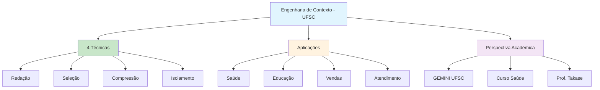

# [Guia Engenharia de Contexto - GEMINI UFSC](/blog/guia-engenharia-de-contexto---gemini-ufsc)

> [!compass] **[MyMess](/blog/moc---projeto-mymess)** » [Estudos](/blog/dashboard---estudos-mymess) » Engenharia de Contexto

---

> [!info]+ Detalhes do Artigo
> **Ler:** [Guia de Engenharia de Contexto](https://gemini.ufsc.br/engenharia-de-contexto/)
> **Fonte:** [GEMINI UFSC](/blog/gemini-ufsc) (Guia Acadêmico - PT-BR)
> **Autores:** Tina Huang, Julian Horsey (Geeky Gadgets), Prof. Emílio Takase (UFSC)
> **Publicado:** 08 de Agosto de 2025

> [!abstract]+ Materiais Complementares
>
> **4 Técnicas Principais**
> 1. Redação de contexto
> 2. Seleção de contexto
> 3. Compressão de contexto
> 4. Isolamento de contexto
>
> **Aplicações em Saúde**
> - Curso "Engenharia de Prompts para Saúde"
> - Programas acadêmicos UFSC
> - Assistência médica e diagnóstica

> [!tip]- Léxico
>
> **Conteúdo e Criação**
> - **Engenharia de Contexto**: Otimização da "janela de contexto" dos LLMs para acesso aos dados mais relevantes
> - **Redação de Contexto**: Criar informações específicas reutilizáveis
> - **Seleção de Contexto**: Recuperar dados relevantes
> - **Compressão de Contexto**: Condensar mantendo detalhes críticos
> - **Isolamento de Contexto**: Separar informações para evitar confusão
> - **Como aplicar CE em contextos de saúde?**
>
> **Outros Conceitos**
> - Explorar curso UFSC e casos médicos
> - **Qual a perspectiva acadêmica brasileira?**
> - Investigar pesquisas em português
> - Testar em ambientes de aprendizado
>
> **Técnicas e Estratégias**
> - **Como adaptar técnicas para educação?**
> [!robot]- Sugestões Complementares
>
> - **Leituras Recomendadas:**
>     - Cursos GEMINI UFSC
>     - Artigos de Tina Huang
> - **Ferramentas Úteis:**
>     - **GEMINI UFSC** - Recursos acadêmicos
>     - **LLMs** - Aplicação prática
> - **Exercícios Práticos:**
>     - Aplicar 4 técnicas em caso de estudo
>     - Testar em contexto de saúde ou educação

---

## Resumo

Guia acadêmico do **GEMINI UFSC** apresentando perspectiva brasileira sobre Engenharia de Contexto. Define CE como "otimização da janela de contexto dos LLMs" para acesso eficiente aos dados relevantes. Apresenta **4 técnicas principais** (Redação, Seleção, Compressão, Isolamento) e aplicações práticas em saúde, vendas, codificação e educação. Destaca curso "Engenharia de Prompts para Saúde" oferecido pela UFSC.

**Definição acadêmica:** "Otimização da 'janela de contexto' dos LLMs para garantir que sistemas de IA tenham acesso aos dados mais relevantes em formato eficiente."

---

## Principais Conceitos

### Distinção Fundamental

A tabela abaixo resume as informações principais.

| Prompt Engineering | Context Engineering |
|:-------------------|:--------------------|
| Foco em instruções | Aborda **desafios mais amplos** |
| Componente único | Integra **múltiplos componentes, ferramentas e fontes** |
| Supervisão constante | Permite **operação autônoma** |

### As 4 Técnicas Principais

A tabela a seguir detalha os campos e seus valores.

| Técnica | Descrição |
|:--------|:----------|
| **Redação de Contexto** | Criar informações específicas reutilizáveis |
| **Seleção de Contexto** | Recuperar dados relevantes |
| **Compressão de Contexto** | Condensar grandes volumes mantendo detalhes críticos |
| **Isolamento de Contexto** | Separar informações para evitar confusão |

---

## Detalhamento

### Aplicações Práticas

Os dados abaixo mostram a estrutura e configurações.

| Área | Aplicação |
|:-----|:----------|
| **Atendimento ao Cliente** | Personalização baseada em histórico |
| **Vendas** | Análise comportamental para assistência |
| **Codificação** | Assistência de código com contexto de projeto |
| **Saúde** | Assistência médica e diagnóstica |
| **Educação** | Aprendizado adaptativo personalizado |

### Perspectiva Brasileira - UFSC

> [!info] Programa Acadêmico
> A UFSC oferece cursos especializados, incluindo **"Engenharia de Prompts para Saúde"**, integrando contexto em programas acadêmicos voltados à comunidade institucional.

**Coordenação:** Prof. Emílio Takase (Dept. Psicologia, UFSC)

### Contribuintes do Conteúdo

A tabela abaixo resume as informações principais.

| Contribuinte | Fonte |
|:-------------|:------|
| **Tina Huang** | Princípios fundamentais de CE |
| **Julian Horsey** | Geeky Gadgets (artigo fonte) |
| **Prof. Emílio Takase** | Coordenação UFSC |

---

## Mapa de Conceitos

O diagrama abaixo ilustra o fluxo do processo, mostrando as etapas e suas conexões.

---

## Insights & Aprendizados

**O que funcionou bem:**
- Perspectiva acadêmica brasileira única
- 4 técnicas claras e memoráveis
- Aplicações práticas em múltiplos setores
- Integração com programa universitário

**O que posso adaptar para o MyMess:**
- **4 Técnicas**: Framework simples para explicar CE a clientes
- **Saúde/Educação**: Adaptar para verticais de marketing
- **Isolamento de contexto**: Aplicar para evitar conflitos em agentes

**Ideias para aplicar:**
- Criar versão "4 Técnicas" adaptada para marketing
- Desenvolver casos de estudo em português
- Implementar isolamento de contexto em agentes multi-tarefa

---

## Recursos Adicionais

- [GEMINI UFSC - Engenharia de Contexto](https://gemini.ufsc.br/engenharia-de-contexto/)
- [GEMINI UFSC](https://gemini.ufsc.br/)
- [UFSC](https://ufsc.br/)
- [Geeky Gadgets - Julian Horsey](https://www.geeky-gadgets.com/)

---

## Propriedades da nota

> [!note]- Propriedades Gerais do Obsidian
>
>> **Identificação**
>
> | Campo      | Valor                    |
> |:-----------|:-------------------------|
> | **Título** | `INPUT[text:titulo]`     |
>
>> **Conexões**
>
> | Campo           | Valor                                                                 |
> |:----------------|:----------------------------------------------------------------------|
> | **Pai**         | `INPUT[suggester(optionQuery("")):pai]`                               |
> | **Coleção**     | `INPUT[inlineSelect(option(financeiro, Financeiro), option(growth, Growth), option(ia, IA), option(lideranca, Liderança), option(marketing, Marketing), option(negocios, Negócios), option(produtividade, Produtividade), option(pkm, PKM), option(saas, SaaS), option(tecnologia, Tecnologia), option(vendas, Vendas)):colecao]` |
> | **Área**        | `INPUT[suggester(optionQuery("Esforços/Áreas")):area]`                         |
> | **Projeto**     | `INPUT[suggester(optionQuery("#projeto")):projeto]`                   |
> | **Autor**       | `INPUT[suggester(optionQuery("Atlas/Pessoas")):pessoa]`                      |
> | **Relacionado** | `INPUT[inlineListSuggester(optionQuery(""), useLinks(true)):relacionado]` |
>
>> **Classificação**
>
> | Campo      | Valor                                                                 |
> |:-----------|:----------------------------------------------------------------------|
> | **Tipo**   | `INPUT[inlineSelect(option(atomica, Atômica), option(aula, Aula), option(artigo, Artigo), option(checklist, Checklist), option(curso, Curso), option(dashboard, Dashboard), option(framework, Framework), option(livro, Livro), option(moc, MOC), option(newsletter, Newsletter), option(pessoa, Pessoa), option(prompt, Prompt), option(template, Template Obsidian), option(tutorial, Tutorial), option(video_youtube, Vídeo Youtube)):tipo_nota]` |
> | **Tags**   | `INPUT[inlineList:tags]`                                              |
> | **Status** | `INPUT[inlineSelect(option(nao_iniciado, ⬜ Não Iniciado), option(em_andamento, 🔄 Em Andamento), option(concluido, ✅ Concluído), option(pausado, ⏸️ Pausado), option(cancelado, ❌ Cancelado)):status]` |
>
>> **Temporal**
>
> | Campo          | Valor                      |
> |:---------------|:---------------------------|
> | **Criado**     | `INPUT[date:data_criado]`       |
> | **Atualizado** | `INPUT[date:data_atualizado]`   |

> [!note]- Propriedades SaaS
>
> | Campo             | Valor                                                              |
> |:------------------|:-------------------------------------------------------------------|
> | **Mostrar Bloco** | `INPUT[toggle(onValue(true), offValue(false)):mostrar_bloco_saas]` |
> | **Status SaaS**   | `INPUT[toggle(onValue(true), offValue(false)):status_saas]`        |

> [!note]- Propriedades do Artigo
>
> | Campo            | Valor                          |
> |:-----------------|:-------------------------------|
> | **URL**          | `INPUT[text(placeholder(https://...)):url_artigo]`  |
> | **Fonte**        | `INPUT[text:fonte]`  |
> | **Autor**        | `INPUT[text:autor]`  |
> | **Data Publicação** | `INPUT[date:data_publicacao]`  |
> | **Tipo Conteúdo** | `INPUT[inlineSelect(option(educacional, Educacional), option(curadoria, Curadoria), option(historia, História Pessoal), option(listicle, Lista), option(contrarian, Opinião Contrária), option(tutorial, Tutorial), option(entrevista, Entrevista), option(analise, Análise), option(estudo_de_caso, Estudo de Caso), option(lancamento, Lançamento), option(opiniao, Opinião), option(outro, Outro)):tipo_conteudo]`  |

