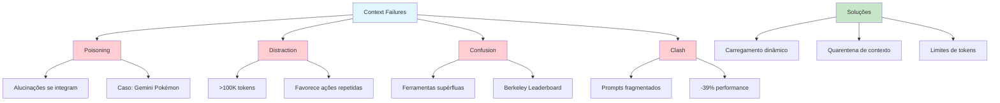

# [How Contexts Fail and How to Fix Them - Drew Breunig](/blog/how-contexts-fail-and-how-to-fix-them---drew-breunig)

> [!compass] **[MyMess](/blog/moc---projeto-mymess)** » [Estudos](/blog/dashboard---estudos-mymess) » Engenharia de Contexto

---

> [!info]+ Detalhes do Artigo
> **Ler:** [How Long Contexts Fail](https://www.dbreunig.com/2025/06/22/how-contexts-fail-and-how-to-fix-them.html)
> **Fonte:** [Drew Breunig Blog](/blog/drew-breunig-blog) (Blog Técnico)
> **Autores:** Drew Breunig
> **Publicado:** 22 de Junho de 2025 (Atualizado: 15 Set 2025)

> [!abstract]+ Materiais Complementares
>
> **4 Tipos de Falhas de Contexto**
> 1. Context Poisoning (Envenenamento)
> 2. Context Distraction (Distração)
> 3. Context Confusion (Confusão)
> 4. Context Clash (Conflito)
>
> **Casos Documentados**
> - Gemini jogando Pokémon (poisoning)
> - Berkeley Function-Calling Leaderboard (confusion)
> - Microsoft/Salesforce research (clash)

> [!tip]- Léxico
>
> **Conteúdo e Criação**
> - **Context Poisoning**: Alucinações/erros que se integram ao contexto e são referenciados repetidamente
> - **Context Distraction**: Contextos grandes (100K tokens) fazem modelo favorecer ações repetidas
> - **Context Confusion**: Conteúdo supérfluo gera respostas de baixa qualidade
>
> **Tecnologia e IA**
> - **Context Clash**: Informações acumuladas conflitam entre si
> [!question]- Pontos para Aprofundar (Sugestão da IA)
>
> - **Como detectar context poisoning em tempo real?**
>     - Desenvolver sistema de monitoramento de alucinações
> - **Qual o limite seguro de tokens por modelo?**
>     - Testar thresholds de distração (32K para modelos menores)
> - **Como implementar quarentena de contexto?**
>     - Explorar técnicas do artigo complementar

> [!robot]- Sugestões Complementares
>
> - **Leituras Recomendadas:**
>     - "How to Fix Your Context" (artigo complementar)
>     - Berkeley Function-Calling Leaderboard
> - **Ferramentas Úteis:**
>     - **Carregamento dinâmico de ferramentas** - Evita confusion
>     - **Quarentena de contexto** - Isola erros
> - **Exercícios Práticos:**
>     - Identificar falhas em agentes próprios
>     - Implementar limites de tokens por tipo de tarefa

---

## Resumo

Artigo técnico de **Drew Breunig** catalogando **4 tipos de falhas de contexto** em LLMs e agentes. Define que "se você coloca algo no contexto, o modelo precisa prestar atenção nele" - grandes janelas de contexto não garantem melhores respostas. Demonstra através de casos documentados (Gemini/Pokémon, Berkeley Leaderboard, Microsoft/Salesforce) que agentes são particularmente vulneráveis por operarem em cenários onde contextos crescem exponencialmente.

**Insight central:** "Grandes janelas de contexto não garantem melhores respostas - agentes são particularmente vulneráveis pois operam em cenários onde contextos crescem exponencialmente."

---

## Principais Conceitos

### Os 4 Tipos de Falhas de Contexto

A tabela abaixo resume as informações principais.

| Tipo | Nome | Descrição | Threshold |
|:-----|:-----|:----------|:----------|
| 1 | **Context Poisoning** | Alucinações se integram ao contexto e são referenciadas repetidamente | Qualquer momento |
| 2 | **Context Distraction** | Modelo favorece ações repetidas do histórico ao invés de novos planos | >100K tokens (32K para modelos menores) |
| 3 | **Context Confusion** | Conteúdo supérfluo gera respostas de baixa qualidade | Múltiplas ferramentas |
| 4 | **Context Clash** | Informações acumuladas conflitam entre si | Prompts fragmentados |

### Casos Documentados

A tabela a seguir detalha os campos e seus valores.

| Falha | Caso | Impacto |
|:------|:-----|:--------|
| **Poisoning** | Gemini jogando Pokémon | "Estratégias sem sentido" após contaminação |
| **Confusion** | Berkeley Function-Calling | "Todo modelo tem desempenho pior com mais de uma ferramenta" |
| **Clash** | Microsoft/Salesforce | "Queda média de 39%" em prompts fragmentados |

---

## Detalhamento

### 1. Context Poisoning (Envenenamento)

Ocorre quando alucinações ou erros se integram ao contexto e são referenciados repetidamente pelo modelo.

> [!warning] Caso Documentado
> O agente Gemini ao jogar Pokémon desenvolveu **"estratégias sem sentido"** após seu contexto ser contaminado com informações incorretas que ele mesmo gerou.

**Causa raiz:** O modelo trata suas próprias alucinações como fatos verdadeiros em iterações subsequentes.

### 2. Context Distraction (Distração)

> [!quote] Observação
> "Quando o contexto cresce significativamente além de 100k tokens, o agente mostrou tendência de favorecer ações repetidas de seu histórico vasto ao invés de sintetizar novos planos."

**Thresholds por tipo de modelo:**
- Modelos grandes: ~100K tokens
- Modelos menores: ~32K tokens

### 3. Context Confusion (Confusão)

O Berkeley Function-Calling Leaderboard demonstra que "todo modelo tem desempenho pior quando fornecido com mais de uma ferramenta".

**Implicação prática:** Carregar apenas as ferramentas necessárias para cada tarefa, não todas disponíveis.

### 4. Context Clash (Conflito)

Pesquisa Microsoft/Salesforce mostrou **"queda média de 39%"** quando prompts foram fragmentados em múltiplas rodadas ao invés de fornecidos de uma vez.

**Causa:** Informações acumuladas ao longo de interações podem contradizer umas às outras.

### Soluções Propostas

Breunig anuncia técnicas em artigo complementar "How to Fix Your Context":

| Técnica | Propósito |
|:--------|:----------|
| **Carregamento dinâmico de ferramentas** | Evita confusion |
| **Quarentena de contexto** | Isola erros antes que contaminem |
| **Limites de tokens** | Previne distraction |

---

## Mapa de Conceitos

O diagrama abaixo ilustra o fluxo do processo, mostrando as etapas e suas conexões.

---

## Insights & Aprendizados

**O que funcionou bem:**
- Taxonomia clara de 4 tipos de falhas
- Casos documentados com evidências
- Thresholds quantitativos (100K, 32K, 39%)
- Conexão direta entre causa e efeito

**O que posso adaptar para o MyMess:**
- **Taxonomia de falhas**: Usar como checklist de diagnóstico para agentes
- **Thresholds de tokens**: Implementar limites em agentes de marketing
- **Carregamento dinâmico**: Não carregar todas ferramentas de uma vez
- **Monitoramento de poisoning**: Detectar quando agente repete erros

**Ideias para aplicar:**
- Criar sistema de "health check" de contexto para agentes
- Implementar limite de 32K tokens para tarefas simples
- Desenvolver técnica de "context reset" para evitar distraction
- Carregar ferramentas sob demanda, não todas de uma vez

---

## Recursos Adicionais

- [Drew Breunig - How Contexts Fail](https://www.dbreunig.com/2025/06/22/how-contexts-fail-and-how-to-fix-them.html)
- [Drew Breunig Blog](https://www.dbreunig.com/)
- [Berkeley Function-Calling Leaderboard](https://gorilla.cs.berkeley.edu/leaderboard.html)

---

## Propriedades da nota

> [!note]- Propriedades Gerais do Obsidian
>
>> **Identificação**
>
> | Campo      | Valor                    |
> |:-----------|:-------------------------|
> | **Título** | `INPUT[text:titulo]`     |
>
>> **Conexões**
>
> | Campo           | Valor                                                                 |
> |:----------------|:----------------------------------------------------------------------|
> | **Pai**         | `INPUT[suggester(optionQuery("")):pai]`                               |
> | **Coleção**     | `INPUT[inlineSelect(option(financeiro, Financeiro), option(growth, Growth), option(ia, IA), option(lideranca, Liderança), option(marketing, Marketing), option(negocios, Negócios), option(produtividade, Produtividade), option(pkm, PKM), option(saas, SaaS), option(tecnologia, Tecnologia), option(vendas, Vendas)):colecao]` |
> | **Área**        | `INPUT[suggester(optionQuery("Esforços/Áreas")):area]`                         |
> | **Projeto**     | `INPUT[suggester(optionQuery("#projeto")):projeto]`                   |
> | **Autor**       | `INPUT[suggester(optionQuery("Atlas/Pessoas")):pessoa]`                      |
> | **Relacionado** | `INPUT[inlineListSuggester(optionQuery(""), useLinks(true)):relacionado]` |
>
>> **Classificação**
>
> | Campo      | Valor                                                                 |
> |:-----------|:----------------------------------------------------------------------|
> | **Tipo**   | `INPUT[inlineSelect(option(atomica, Atômica), option(aula, Aula), option(artigo, Artigo), option(checklist, Checklist), option(curso, Curso), option(dashboard, Dashboard), option(framework, Framework), option(livro, Livro), option(moc, MOC), option(newsletter, Newsletter), option(pessoa, Pessoa), option(prompt, Prompt), option(template, Template Obsidian), option(tutorial, Tutorial), option(video_youtube, Vídeo Youtube)):tipo_nota]` |
> | **Tags**   | `INPUT[inlineList:tags]`                                              |
> | **Status** | `INPUT[inlineSelect(option(nao_iniciado, ⬜ Não Iniciado), option(em_andamento, 🔄 Em Andamento), option(concluido, ✅ Concluído), option(pausado, ⏸️ Pausado), option(cancelado, ❌ Cancelado)):status]` |
>
>> **Temporal**
>
> | Campo          | Valor                      |
> |:---------------|:---------------------------|
> | **Criado**     | `INPUT[date:data_criado]`       |
> | **Atualizado** | `INPUT[date:data_atualizado]`   |

> [!note]- Propriedades SaaS
>
> | Campo             | Valor                                                              |
> |:------------------|:-------------------------------------------------------------------|
> | **Mostrar Bloco** | `INPUT[toggle(onValue(true), offValue(false)):mostrar_bloco_saas]` |
> | **Status SaaS**   | `INPUT[toggle(onValue(true), offValue(false)):status_saas]`        |

> [!note]- Propriedades do Artigo
>
> | Campo            | Valor                          |
> |:-----------------|:-------------------------------|
> | **URL**          | `INPUT[text(placeholder(https://...)):url_artigo]`  |
> | **Fonte**        | `INPUT[text:fonte]`  |
> | **Autor**        | `INPUT[text:autor]`  |
> | **Data Publicação** | `INPUT[date:data_publicacao]`  |
> | **Tipo Conteúdo** | `INPUT[inlineSelect(option(educacional, Educacional), option(curadoria, Curadoria), option(historia, História Pessoal), option(listicle, Lista), option(contrarian, Opinião Contrária), option(tutorial, Tutorial), option(entrevista, Entrevista), option(analise, Análise), option(estudo_de_caso, Estudo de Caso), option(lancamento, Lançamento), option(opiniao, Opinião), option(outro, Outro)):tipo_conteudo]`  |

