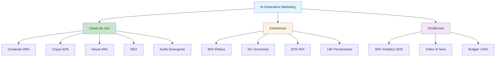

# [IA Generativa em Marketing Casos de Uso - Delve AI](/blog/ia-generativa-em-marketing-casos-de-uso---delve-ai)

> [!compass] **[MyMess](/blog/moc---projeto-mymess)** » [Estudos](/blog/dashboard---estudos-mymess) » Marketing

---

> [!info]+ Detalhes do Artigo
> **Ler:** [9+ Casos de Uso da IA Generativa em Marketing](https://www.delve.ai/pt/blog/marketing-ia-generativa)
> **Fonte:** [Delve AI](/blog/delve-ai) (Blog - PT-BR)
> **Autores:** Delve AI
> **Publicado:** 2025

> [!abstract]+ Materiais Complementares
>
> **Principais Casos de Uso (por adoção)**
> 1. Ideação de conteúdo (69%)
> 2. Produção de copys (62%)
> 3. Otimização de conteúdo (49%)
> 4. Imagem/Vídeo ideação (44%)
> 5. Imagem/Vídeo produção (36%)
> 6. Audio/Podcasts (emergente)
>
> **Estatísticas Chave**
> - 90% de marketers consideram IA efetiva
> - 5+ horas economizadas por semana
> - 82% obtiveram ROI positivo

> [!tip]- Léxico
>
> **Conteúdo e Criação**
> - **IA Generativa em Marketing**: Uso de modelos generativos para criar e otimizar conteúdo de marketing
>
> **Ferramentas e Recursos**
> - **Martech**: Tecnologia de marketing (14.108 ferramentas em 2024)
>
> **Tecnologia e IA**
> - **Personas sintéticas**: Gemelos digitais e usuarios sintéticos gerados por IA
>
> **Métricas e Indicadores**
> - **ROI de IA**: 82% dos early adopters obtiveram retorno financeiro
> [!question]- Pontos para Aprofundar (Sugestão da IA)
>
> - **Como medir ROI de IA em marketing?**
>     - Implementar tracking de horas economizadas e conversões
> - **Quais casos de uso têm maior impacto?**
>     - Priorizar ideação e produção de conteúdo (69%, 62%)
> - **Como implementar vídeo generativo em 2025?**
>     - Explorar Sora (OpenAI) e ferramentas emergentes

> [!robot]- Sugestões Complementares
>
> - **Leituras Recomendadas:**
>     - Martech for 2025 (Scott Brinker)
>     - State of Martech 2024
> - **Ferramentas Úteis:**
>     - **Delve AI** - Personas e gemelos digitais
>     - **Sora** - Vídeo generativo (OpenAI)
> - **Exercícios Práticos:**
>     - Implementar ideação de conteúdo com IA
>     - Medir economia de tempo em produção de copys

---

## Resumo

Artigo da **Delve AI** catalogando **9+ casos de uso de IA Generativa em Marketing** com estatísticas do relatório Martech for 2025. Destaca que **ideação de conteúdo (69%)** e **produção de copys (62%)** são os usos mais comuns. O mercado de Martech cresceu 27.8% (2023-2024) chegando a 14.108 ferramentas. **90% dos marketers** consideram IA efetiva, economizando **5+ horas semanais**, com **82% obtendo ROI positivo**.

**Insight central:** "O marketing já está sentindo os impactos da IA generativa - Gartner prevê que até 2025, 30% das mensagens de marketing de grandes organizações serão geradas sinteticamente."

---

## Principais Conceitos

### Casos de Uso por Taxa de Adoção

A tabela abaixo resume as informações principais.

| Caso de Uso | Adoção | Status |
|:------------|:-------|:-------|
| **Ideação de conteúdo** | 69% | Mainstream |
| **Produção de copys** | 62% | Mainstream |
| **Otimização de conteúdo** | 49% | Crescendo |
| **Testes A/B** | ~49% | Crescendo |
| **Ideação imagem/vídeo** | 44% | Em expansão |
| **Produção imagem/vídeo** | 36% | Em expansão |
| **SEO e keywords** | Alto | Estabelecido |
| **Audio/Podcasts** | Baixo | "Por testar" |

### Estatísticas do Mercado

A tabela a seguir detalha os campos e seus valores.

| Métrica | Valor | Fonte |
|:--------|:------|:------|
| **Crescimento Martech** | 27.8% (2023-2024) | State of Martech 2024 |
| **Total de ferramentas** | 14.108 | State of Martech 2024 |
| **Efetividade percebida** | 90% | Pesquisa de mercado |
| **Economia de tempo** | 5+ horas/semana | Criadores de conteúdo |
| **Personalização com IA** | 85% | Usuários de IA em marketing |
| **ROI positivo** | 82% | Deloitte (early adopters) |

---

## Detalhamento

### Casos de Uso Detalhados

#### 1. Ideação e Produção de Conteúdo (69%, 62%)

Os casos de uso mais adotados segundo o relatório Martech for 2025:
- Geração de ideias para campanhas
- Produção de copys para ads, emails, posts
- Variações de texto para testes A/B

#### 2. Otimização de Conteúdo (49%)

- Refinamento de mensagens
- Melhoria de taxas de engagement
- Testes A/B automatizados

#### 3. Conteúdo Visual (44%, 36%)

Imagem e vídeo generativos são o segundo maior caso de uso:
- Vídeo gerado por IA ainda em estágio inicial
- **Sora (OpenAI)** esperado para impulsionar adoção em 2025

#### 4. SEO e Análise de Keywords

Ferramentas de IA simplificam:
- Ordenação de dados de keywords
- Identificação de palavras de alto desempenho
- Análise de tendências de busca
- Identificação de gaps de conteúdo

#### 5. Audio e Podcasts (Emergente)

> [!info] Próxima Fronteira
> Produção de audio e podcasts foi classificada como o **principal caso de uso "ainda por testar"** no relatório Martech for 2025.

### Previsões e Tendências

Os dados abaixo mostram a estrutura e configurações.

| Previsão | Fonte |
|:---------|:------|
| **30% das mensagens de marketing** serão geradas sinteticamente até 2025 | Gartner |
| **94% alocaram budget** para IA em 2024 | Canva Report 2025 |
| **75% esperam aumentar** investimento em IA | Canva Report 2025 |
| **62% preveem crescimento** de 25%+ no budget de IA | Canva Report 2025 |

### Sobre Delve AI

Plataforma que permite:
- Gerar personas e gemelos digitais
- Criar usuarios sintéticos
- Chat com personas geradas
- Realizar pesquisa sintética
- Gerar recomendações de marketing acionáveis

---

## Mapa de Conceitos

O diagrama abaixo ilustra o fluxo do processo, mostrando as etapas e suas conexões.

---

## Insights & Aprendizados

**O que funcionou bem:**
- Estatísticas quantitativas de adoção
- Hierarquia clara de casos de uso por maturidade
- Previsões de fontes confiáveis (Gartner, Deloitte)
- Identificação de áreas emergentes (audio/podcasts)

**O que posso adaptar para o MyMess:**
- **Priorização de casos de uso**: Focar em ideação (69%) e copys (62%) primeiro
- **Métricas de ROI**: Implementar tracking de horas economizadas
- **Próxima fronteira**: Explorar audio/podcast como diferencial
- **Personas sintéticas**: Usar Delve AI para pesquisa de público

**Ideias para aplicar:**
- Implementar workflow de ideação de conteúdo com IA (69% de adoção)
- Criar dashboard de economia de tempo (meta: 5h/semana)
- Testar Sora para vídeo generativo quando disponível
- Explorar audio/podcasts como diferencial competitivo

---

## Recursos Adicionais

- [Delve AI - IA Generativa Marketing](https://www.delve.ai/pt/blog/marketing-ia-generativa)
- [Delve AI](https://www.delve.ai/)
- [Martech for 2025 Report](https://chiefmartec.com/)
- [State of Martech 2024](https://chiefmartec.com/)

---

## Propriedades da nota

> [!note]- Propriedades Gerais do Obsidian
>
>> **Identificação**
>
> | Campo      | Valor                    |
> |:-----------|:-------------------------|
> | **Título** | `INPUT[text:titulo]`     |
>
>> **Conexões**
>
> | Campo           | Valor                                                                 |
> |:----------------|:----------------------------------------------------------------------|
> | **Pai**         | `INPUT[suggester(optionQuery("")):pai]`                               |
> | **Coleção**     | `INPUT[inlineSelect(option(financeiro, Financeiro), option(growth, Growth), option(ia, IA), option(lideranca, Liderança), option(marketing, Marketing), option(negocios, Negócios), option(produtividade, Produtividade), option(pkm, PKM), option(saas, SaaS), option(tecnologia, Tecnologia), option(vendas, Vendas)):colecao]` |
> | **Área**        | `INPUT[suggester(optionQuery("Esforços/Áreas")):area]`                         |
> | **Projeto**     | `INPUT[suggester(optionQuery("#projeto")):projeto]`                   |
> | **Autor**       | `INPUT[suggester(optionQuery("Atlas/Pessoas")):pessoa]`                      |
> | **Relacionado** | `INPUT[inlineListSuggester(optionQuery(""), useLinks(true)):relacionado]` |
>
>> **Classificação**
>
> | Campo      | Valor                                                                 |
> |:-----------|:----------------------------------------------------------------------|
> | **Tipo**   | `INPUT[inlineSelect(option(atomica, Atômica), option(aula, Aula), option(artigo, Artigo), option(checklist, Checklist), option(curso, Curso), option(dashboard, Dashboard), option(framework, Framework), option(livro, Livro), option(moc, MOC), option(newsletter, Newsletter), option(pessoa, Pessoa), option(prompt, Prompt), option(template, Template Obsidian), option(tutorial, Tutorial), option(video_youtube, Vídeo Youtube)):tipo_nota]` |
> | **Tags**   | `INPUT[inlineList:tags]`                                              |
> | **Status** | `INPUT[inlineSelect(option(nao_iniciado, ⬜ Não Iniciado), option(em_andamento, 🔄 Em Andamento), option(concluido, ✅ Concluído), option(pausado, ⏸️ Pausado), option(cancelado, ❌ Cancelado)):status]` |
>
>> **Temporal**
>
> | Campo          | Valor                      |
> |:---------------|:---------------------------|
> | **Criado**     | `INPUT[date:data_criado]`       |
> | **Atualizado** | `INPUT[date:data_atualizado]`   |

> [!note]- Propriedades SaaS
>
> | Campo             | Valor                                                              |
> |:------------------|:-------------------------------------------------------------------|
> | **Mostrar Bloco** | `INPUT[toggle(onValue(true), offValue(false)):mostrar_bloco_saas]` |
> | **Status SaaS**   | `INPUT[toggle(onValue(true), offValue(false)):status_saas]`        |

> [!note]- Propriedades do Artigo
>
> | Campo            | Valor                          |
> |:-----------------|:-------------------------------|
> | **URL**          | `INPUT[text(placeholder(https://...)):url_artigo]`  |
> | **Fonte**        | `INPUT[text:fonte]`  |
> | **Autor**        | `INPUT[text:autor]`  |
> | **Data Publicação** | `INPUT[date:data_publicacao]`  |
> | **Tipo Conteúdo** | `INPUT[inlineSelect(option(educacional, Educacional), option(curadoria, Curadoria), option(historia, História Pessoal), option(listicle, Lista), option(contrarian, Opinião Contrária), option(tutorial, Tutorial), option(entrevista, Entrevista), option(analise, Análise), option(estudo_de_caso, Estudo de Caso), option(lancamento, Lançamento), option(opiniao, Opinião), option(outro, Outro)):tipo_conteudo]`  |

