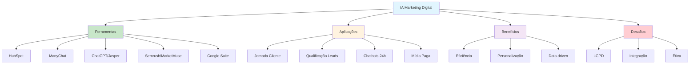

# [IA no Marketing Digital - Alura](/blog/ia-no-marketing-digital---alura)

> [!compass] **[MyMess](/blog/moc---projeto-mymess)** » [Estudos](/blog/dashboard---estudos-mymess) » Marketing

---

> [!info]+ Detalhes do Artigo
> **Ler:** [Ferramentas de IA para marketing digital](https://www.alura.com.br/artigos/inteligencia-artificial-no-marketing-digital)
> **Fonte:** [Alura](/blog/alura) (Artigo Educacional - PT-BR)
> **Autores:** Aline Roque Klein
> **Publicado:** 04 de Setembro de 2024

> [!abstract]+ Materiais Complementares
>
> **10 Ferramentas de IA**
> 1. HubSpot (automação)
> 2. ManyChat (chatbots)
> 3. ChatGPT (conteúdo)
> 4. Jasper (copys)
> 5. Semrush (SEO)
> 6. Grammarly (correção)
> 7. MarketMuse (SEO content)
> 8. Google Suite (Gemini, Ads, Analytics)
> 9. Phrasee (copy persuasivo)
> 10. Unbounce (landing pages)
>
> **7 Aplicações Estratégicas**
> - Jornada do cliente
> - Gestão data-driven
> - Automação de tarefas
> - Qualificação de leads
> - Mídia paga
> - Social media
> - Chatbots 24h

> [!tip]- Léxico
>
> **Marketing e Vendas**
> - **Assistente 24h**: Chatbots que qualificam leads automaticamente
> - **Data-driven marketing**: Decisões baseadas em análise de dados em tempo real
>
> **Técnicas e Estratégias**
> - **IA no Marketing Digital**: Aplicação de inteligência artificial para otimizar estratégias e resultados
>
> **Tecnologia e IA**
> - **LGPD**: Conformidade de privacidade necessária para IA em marketing
> [!question]- Pontos para Aprofundar (Sugestão da IA)
>
> - **Qual ferramenta priorizar para cada caso de uso?**
>     - Mapear ferramentas por objetivo de marketing
> - **Como integrar múltiplas ferramentas de IA?**
>     - Estudar workflows de automação
> - **Como garantir conformidade LGPD?**
>     - Explorar políticas de privacidade em IA

> [!robot]- Sugestões Complementares
>
> - **Leituras Recomendadas:**
>     - Documentação HubSpot
>     - Guia de conformidade LGPD
> - **Ferramentas Úteis:**
>     - **HubSpot** - Automação completa
>     - **ManyChat** - Chatbots multicanal
>     - **Semrush** - SEO avançado
> - **Exercícios Práticos:**
>     - Configurar chatbot com ManyChat
>     - Criar workflow de automação com HubSpot

---

## Resumo

Artigo educacional de **Aline Roque Klein** (Alura) listando **10 ferramentas de IA para marketing digital** e **7 aplicações estratégicas**. Destaca que IA pode ser usada como **"assistente 24h para qualificação de leads"** baseada em interações. Apresenta exemplo prático de e-commerce de moda usando IA para: analisar comportamento, identificar padrões de abandono, criar campanhas hiperpersonalizadas, ajustar conteúdo em tempo real. Alerta para desafios de **integração, LGPD, e equilíbrio automação/toque humano**.

**Insight central:** "IA no marketing digital funciona como um assistente 24 horas que qualifica leads automaticamente baseado em interações, opera em todos os canais e personaliza experiências em escala."

---

## Principais Conceitos

### 10 Ferramentas de IA para Marketing

A tabela abaixo resume as informações principais.

| # | Ferramenta | Função Principal |
|:--|:-----------|:-----------------|
| 1 | **HubSpot** | Automação de campanhas, segmentação, emails personalizados |
| 2 | **ManyChat** | Chatbots via Messenger, Instagram, WhatsApp |
| 3 | **ChatGPT** | Criação de conteúdo, personalização, conversação |
| 4 | **Jasper** | Posts de blog, ads, descrições de produto |
| 5 | **Semrush** | Análise SEO, keywords, monitoramento de concorrentes |
| 6 | **Grammarly** | Clareza, tom e correção de textos |
| 7 | **MarketMuse** | Conteúdo otimizado para SEO com insights de IA |
| 8 | **Google Suite** | Gemini (IA), Ads (ML), Analytics (insights preditivos) |
| 9 | **Phrasee** | Copy persuasivo para emails e ads |
| 10 | **Unbounce** | Otimização de landing pages via testes em tempo real |

### 7 Aplicações Estratégicas

A tabela a seguir detalha os campos e seus valores.

| Aplicação | Descrição |
|:----------|:----------|
| **Jornada do cliente** | IA personaliza touchpoints em todos os canais |
| **Gestão data-driven** | Análise de padrões em tempo real e previsões comportamentais |
| **Automação de tarefas** | Email campaigns, segmentação, agendamento social |
| **Qualificação de leads** | "Assistente 24h" para scoring automatizado |
| **Mídia paga** | Otimização de lances e targeting em tempo real |
| **Social media** | Análise comportamental e respostas automatizadas |
| **Chatbots** | Suporte 24h com personalização generativa |

---

## Detalhamento

### Exemplo Prático: E-commerce de Moda

O artigo descreve caso de uso completo:

1. **Análise de comportamento** no site
2. **Identificação de padrões** de abandono de carrinho (roupas de inverno)
3. **Campanhas hiperpersonalizadas** baseadas em insights
4. **Ajuste de conteúdo em tempo real** conforme interações
5. **Predição de perfis similares** para expandir targeting

### Benefícios da IA em Marketing

Os dados abaixo mostram a estrutura e configurações.

| # | Benefício |
|:--|:----------|
| 1 | Eficiência operacional via automação |
| 2 | Decisões baseadas em dados |
| 3 | Novas oportunidades via identificação de tendências |
| 4 | Competências técnicas aprimoradas na equipe |
| 5 | Personalização de conteúdo em escala |
| 6 | Redução de churn via analytics preditivo |
| 7 | Experiência do usuário melhorada em todos os canais |

### Desafios de Implementação

A tabela abaixo resume as informações principais.

| Desafio | Descrição |
|:--------|:----------|
| **Integração de sistemas** | Complexidade de conectar múltiplas ferramentas |
| **Conformidade LGPD** | Requisitos de privacidade para dados de clientes |
| **Equilíbrio automação/humano** | Manter toque pessoal em interações automatizadas |
| **Adaptação cultural** | Mudança de mentalidade nas equipes |
| **Considerações éticas** | Evitar manipulação de consumidores |

---

## Mapa de Conceitos

O diagrama abaixo ilustra o fluxo do processo, mostrando as etapas e suas conexões.

---

## Insights & Aprendizados

**O que funcionou bem:**
- Lista organizada de ferramentas com funções claras
- Exemplo prático de e-commerce detalhado
- Balanceamento entre benefícios e desafios
- Alertas sobre LGPD e ética

**O que posso adaptar para o MyMess:**
- **Ferramentas por caso de uso**: Criar guia de seleção para clientes
- **Assistente 24h**: Posicionar chatbots como "qualificadores de leads"
- **Exemplo e-commerce**: Adaptar para outros setores
- **Checklist LGPD**: Garantir conformidade em projetos

**Ideias para aplicar:**
- Criar comparativo de ferramentas para diferentes budgets
- Implementar ManyChat para clientes de e-commerce
- Desenvolver workflow HubSpot + ChatGPT para automação
- Documentar considerações éticas para clientes

---

## Recursos Adicionais

- [Alura - IA no Marketing Digital](https://www.alura.com.br/artigos/inteligencia-artificial-no-marketing-digital)
- [Alura](https://www.alura.com.br/)
- [HubSpot](https://www.hubspot.com/)
- [ManyChat](https://manychat.com/)
- [Semrush](https://www.semrush.com/)

---

## Propriedades da nota

> [!note]- Propriedades Gerais do Obsidian
>
>> **Identificação**
>
> | Campo      | Valor                    |
> |:-----------|:-------------------------|
> | **Título** | `INPUT[text:titulo]`     |
>
>> **Conexões**
>
> | Campo           | Valor                                                                 |
> |:----------------|:----------------------------------------------------------------------|
> | **Pai**         | `INPUT[suggester(optionQuery("")):pai]`                               |
> | **Coleção**     | `INPUT[inlineSelect(option(financeiro, Financeiro), option(growth, Growth), option(ia, IA), option(lideranca, Liderança), option(marketing, Marketing), option(negocios, Negócios), option(produtividade, Produtividade), option(pkm, PKM), option(saas, SaaS), option(tecnologia, Tecnologia), option(vendas, Vendas)):colecao]` |
> | **Área**        | `INPUT[suggester(optionQuery("Esforços/Áreas")):area]`                         |
> | **Projeto**     | `INPUT[suggester(optionQuery("#projeto")):projeto]`                   |
> | **Autor**       | `INPUT[suggester(optionQuery("Atlas/Pessoas")):pessoa]`                      |
> | **Relacionado** | `INPUT[inlineListSuggester(optionQuery(""), useLinks(true)):relacionado]` |
>
>> **Classificação**
>
> | Campo      | Valor                                                                 |
> |:-----------|:----------------------------------------------------------------------|
> | **Tipo**   | `INPUT[inlineSelect(option(atomica, Atômica), option(aula, Aula), option(artigo, Artigo), option(checklist, Checklist), option(curso, Curso), option(dashboard, Dashboard), option(framework, Framework), option(livro, Livro), option(moc, MOC), option(newsletter, Newsletter), option(pessoa, Pessoa), option(prompt, Prompt), option(template, Template Obsidian), option(tutorial, Tutorial), option(video_youtube, Vídeo Youtube)):tipo_nota]` |
> | **Tags**   | `INPUT[inlineList:tags]`                                              |
> | **Status** | `INPUT[inlineSelect(option(nao_iniciado, ⬜ Não Iniciado), option(em_andamento, 🔄 Em Andamento), option(concluido, ✅ Concluído), option(pausado, ⏸️ Pausado), option(cancelado, ❌ Cancelado)):status]` |
>
>> **Temporal**
>
> | Campo          | Valor                      |
> |:---------------|:---------------------------|
> | **Criado**     | `INPUT[date:data_criado]`       |
> | **Atualizado** | `INPUT[date:data_atualizado]`   |

> [!note]- Propriedades SaaS
>
> | Campo             | Valor                                                              |
> |:------------------|:-------------------------------------------------------------------|
> | **Mostrar Bloco** | `INPUT[toggle(onValue(true), offValue(false)):mostrar_bloco_saas]` |
> | **Status SaaS**   | `INPUT[toggle(onValue(true), offValue(false)):status_saas]`        |

> [!note]- Propriedades do Artigo
>
> | Campo            | Valor                          |
> |:-----------------|:-------------------------------|
> | **URL**          | `INPUT[text(placeholder(https://...)):url_artigo]`  |
> | **Fonte**        | `INPUT[text:fonte]`  |
> | **Autor**        | `INPUT[text:autor]`  |
> | **Data Publicação** | `INPUT[date:data_publicacao]`  |
> | **Tipo Conteúdo** | `INPUT[inlineSelect(option(educacional, Educacional), option(curadoria, Curadoria), option(historia, História Pessoal), option(listicle, Lista), option(contrarian, Opinião Contrária), option(tutorial, Tutorial), option(entrevista, Entrevista), option(analise, Análise), option(estudo_de_caso, Estudo de Caso), option(lancamento, Lançamento), option(opiniao, Opinião), option(outro, Outro)):tipo_conteudo]`  |

